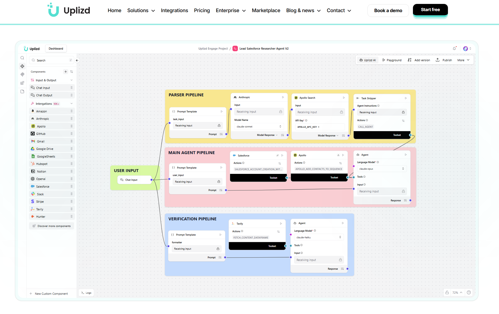

# Uplizd
 
**Build, Connect, Deploy, and Scale True Multiple AI Agents on One Unified Infrastructure. Get Long-term Value.**
 
Uplizd is an enterprise-grade AI agent platform that replaces fragmented AI stacks with a unified orchestration layer — so teams can build, deploy, and iterate without becoming their own integration vendor.
 
[](https://uplizd.ai)
[](https://uplizd.ai/solutions)
[](https://uplizd.ai/licensing/)
 
--- 



---
 
## Why Uplizd?
 
Stop wrestling with fragile stacks. Uplizd gives you:
 
- **Visual & Code** — Prototype on a visual canvas, or drop into code for full customization.
- **True Agents, Not Triggers** — Autonomous multi-step reasoning, not if/then automations.
- **Universal Connectivity** — Integrate your entire stack via MCP and APIs. 10,000+ components ready.
- **Deploy with Confidence** — Built-in governance, security, and scalability from day one.
---
 
## Platform Capabilities
 
### Orchestration
Unified runtime for multi-step and multi-agent workflows with any LLM. Swap providers without rewriting logic. No model lock-in.
 
### Integrations
Connect your entire stack into a single agentic layer — 10,000+ tools, APIs, and MCP servers across 58 industries. Built-in support for Claude, OpenAI, GPT-4o, Mistral, and custom local models.
 
### Governance
Enterprise-ready with SSO, human-in-the-loop approvals, RBAC, and audit logs. Built-in compliance and security guardrails for every agent. SOC 2 Type II.
 
### LLM Routing & Caching
Semantic caching to reduce repeated model calls. Per-team usage budgets for predictable AI spend. Intelligent routing across providers based on cost, latency, and availability.
 
### Observability & Debugging
Full production traces, p95 latency tracking, error rates, and retry logic — all visible in one place.
 
---
 
## Use Cases
 
| Domain | What Uplizd Does |
|---|---|
| **IT Ops** | Enrich tickets, triage alerts by SLA, automate provisioning with full audit context |
| **Security & Compliance** | Classify findings, generate evidence, handle review gates, maintain immutable audit trails |
| **RevOps & Sales** | Score and enrich leads, route to reps, generate follow-up drafts, sync to CRM |
| **Customer Support** | RAG-enabled answers, sentiment-based routing, escalation when AI confidence is low |
 
---
 
## Deployment Options
 
Uplizd runs where your data needs to live:
 
- **Managed Cloud** — Fastest time to value, fully managed by Uplizd.
- **Private VPC** — Data stays in your own cloud account.
- **On-Premises** — Ships to your Kubernetes cluster via Helm charts.
Same product. Same governance. You choose where it runs.
 
---
 
## Integrations
 
10,000+ integrations across 58 industries, including:
 
`OpenAI` `Anthropic` `Cohere` `Mistral` `Salesforce` `HubSpot` `GitHub` `Slack` `Stripe` `AWS` `Jira` `Notion` `PostgreSQL` `MongoDB` `Kafka` `Kubernetes`
 
→ [Browse all integrations](https://uplizd.ai/solutions)
 
Need something custom? [Talk to us](https://uplizd.ai) — we build additional components for your needs.
 
---

## 📂 Quick Access Solutions Catalog

Access our most popular solution templates by category:

<details>
<summary><b>Data</b></summary>

- [Invoice Processing Agent](./solutions/invoice-processing-agent)
- [Compliance Document Processor](./solutions/compliance-document-processor)
- [Business Proposal Generator](./solutions/business-proposal-generator)
- [Research Insight Synthesizer](./solutions/research-insight-synthesizer)
- [Market Research Assistant](./solutions/market-research-assistant)
- [Content Research Assistant](./solutions/content-research-assistant)
- [Abuse Report Manager](./solutions/abuse-report-manager-by-abuselpdb)
- [Account Health & Usage Monitor](./solutions/account-health-usage-monitor-by-jotform)
- [Account Health Compliance Monitor](./solutions/account-health-compliance-monitor-by-brevo)
- [Account Relationship Builder](./solutions/account-relationship-builder-by-dynamics365)
- [Address Verification Agent](./solutions/address-verification-agent-by-addresszen)
- [AI Model Research Assistant](./solutions/ai-model-research-assistant-by-replicate)
- [AI Research Analysis Engine](./solutions/ai-research-analysis-engine-by-gemini)
- [AI Usage Analytics Reporter](./solutions/ai-usage-analytics-reporter-by-apipie-ai)
- [Airtable Data Explorer](./solutions/airtable-data-explorer-by-api-labz)
- [Amplitude Cohort Manager](./solutions/amplitude-cohort-manager-by-amplitude)
- [Analytics Data Quality Monitor](./solutions/analytics-data-quality-monitor-by-amplitude)
- [App Data Backup Manager](./solutions/app-data-backup-manager-by-backendless)
- [Archive Digitization Assistant](./solutions/archive-digitization-assistant-by-convertapi)
- [Archive Migration Assistant](./solutions/archive-migration-assistant-by-cloudconvert)
- [Asset Privacy Guardian](./solutions/asset-privacy-guardian-by-borneo)
- [Astronomy Event Tracker](./solutions/astronomy-event-tracker-by-nasa)
- [Automated Image Processing Pipeline](./solutions/automated-image-processing-pipeline-by-replicate)
- [Automated Insights Report Generator](./solutions/automated-insights-report-generator-by-posthog)
- [Automated Report Generator](./solutions/automated-report-generator-by-api2pdf)
- [Automated Report Generator](./solutions/automated-report-generator-by-cloudlayer)
- [Automated Search Index Manager](./solutions/automated-search-index-manager-by-algolia)
- [Backup Compliance Manager](./solutions/backup-compliance-manager-by-prisma)
- [Backup Validation Monitor](./solutions/backup-validation-monitor-by-dropbox)
- [Booking Data Cleaner](./solutions/booking-data-cleaner-by-bookingmood)
- [Booking Insights Reporter](./solutions/booking-insights-reporter-by-bookingmood)
- [Box Storage Optimizer](./solutions/box-storage-optimizer-by-box)
- [Bulk Import Orchestrator](./solutions/bulk-import-orchestrator-by-dromo)
- [Bulk Verification Orchestrator](./solutions/bulk-verification-orchestrator-by-neverbounce)
- [Business Intelligence Analyst](./solutions/business-intelligence-analyst-by-entelligence)
- [Business Intelligence Mapper](./solutions/business-intelligence-mapper-by-yandex)
- [Calendar Analytics Reporter](./solutions/calendar-analytics-reporter-by-calendarhero)
- [CallPage Analytics Reporter](./solutions/call-page-analytics-reporter-by-callpage)
- [CDN Health Monitor](./solutions/cdn-health-monitor-by-bunnycdn)
- [CDN Image Pipeline](./solutions/cdn-image-pipeline-by-tinypng)
- [CDN Migration Assistant](./solutions/cdn-migration-assistant-by-bunnycdn)
- [Certificate Reporting Optimizer](./solutions/certificate-reporting-optimizer-by-digicert)
- [Charity Impact Reporter](./solutions/charity-impact-reporter-by-humanitix)
- [Chat Insight Extractor](./solutions/chat-insight-extractor-by-recallai)
- [Chat with PostgreSQL Database](./solutions/chatwith-postgresql-database-by)
- [Client Data Synchronizer](./solutions/client-data-synchronizer-by-bidsketch)
- [Client Interaction Tracker](./solutions/client-interaction-tracker-by-mem0)
- [Client Project Reporter](./solutions/client-project-reporter-by-breeze)
- [Client Relationship Manager](./solutions/client-relationship-manager-by-moneybird)
- [Client Relationship Monitor](./solutions/client-relationship-monitor-by-moco)
- [Clinical Suggestion and JSON Export](./solutions/clinicalsuggestionandsaveto-json-by)
- [Cohort Performance Tracker](./solutions/cohort-performance-tracker-by-mixpanel)
- [Company Data Enricher](./solutions/company-data-enricher-by-pipeline-crm)
- [Competitive Intelligence Monitor](./solutions/competitive-intelligence-monitor-by-crustdata)
- [Competitor Price Monitor](./solutions/competitor-price-monitor-by-apify)
- [Competitor Price Monitor](./solutions/competitor-price-monitor-by-asin-data-api)
- [Competitor Price Monitor](./solutions/competitor-price-monitor-by-brightdata)

</details>

<details>
<summary><b>Engineering</b></summary>

- [A/B Test Visual Documenter](./solutions/ab-test-visual-documenter-by-apiflash)
- [AI Model Performance Tracker](./solutions/ai-model-performance-tracker-by-apipie-ai)
- [API Key Lifecycle Manager](./solutions/api-key-lifecycle-manager-by-ngrok)
- [API Testing Validator](./solutions/api-testing-validator-by-twocaptcha)
- [API Token Manager](./solutions/api-token-manager-by-codacy)
- [AppVeyor Deployment Orchestrator](./solutions/app-veyor-deployment-orchestrator-by-appveyor)
- [AppVeyor Project Health Analyzer](./solutions/app-veyor-project-health-analyzer-by-appveyor)
- [Automated Aquarium Life Support](./solutions/automated-aquarium-life-support-by-bolt-iot)
- [Basic Prompting](./solutions/basic-prompting-by)
- [Bonsai Cluster Health Monitor](./solutions/bonsai-cluster-health-monitor-by-bonsai)
- [Bot Security Auditor](./solutions/bot-security-auditor-by-chatbotkit)
- [Brand Protection Sentinel](./solutions/brand-protection-sentinel-by-sslmate-cert-spotter-api)
- [BTCPay Security & Access Monitor](./solutions/btc-pay-security-access-monitor-by-btcpay-server)
- [Build Agent Security Scanner](./solutions/build-agent-security-scanner-by-buildkite)
- [Build Failure Detective](./solutions/build-failure-detective-by-circleci)
- [Certificate Incident Responder](./solutions/certificate-incident-responder-by-sslmate-cert-spotter-api)
- [CI Pipeline Monitor](./solutions/ci-pipeline-monitor-by-buildkite)
- [CI/CD Compliance Audit Reporter](./solutions/cicd-compliance-audit-reporter-by-buildkite)
- [CI/CD Health Monitor](./solutions/cicd-health-monitor-by-circleci)
- [Client Deliverable Formatter](./solutions/client-deliverable-formatter-by-convertapi)
- [Commit Impact Analyzer](./solutions/commit-impact-analyzer-by-sourcegraph)
- [Communication Security Guardian](./solutions/communication-security-guardian-by-dialpad)

</details>

<details>
<summary><b>Finance</b></summary>

- [Deal Pipeline Manager](./solutions/deal-pipeline-manager)
- [Deal Opportunity Tracker](./solutions/deal-oppotunity-tracker)
- [CRM Data Sync Agent](./solutions/crm-data-sync-agent)
- [CRM Data Hygiene Manager](./solutions/crm-data-hygiene-manager)
- [Team Workload Balancer](./solutions/team-workload-balancer)
- [CRM Permissions Analyzer](./solutions/crm-permissions-analyzer)
- [CRM System Health Monitor](./solutions/crm-system-health-monitor)
- [CRM Data Cleaner](./solutions/crm-data-cleaner)
- [CRM Address Data Cleanup Agent](./solutions/crm-address-data-cleanup-agent)
- [Contact Data Cleanup Agent](./solutions/contact-data-cleanup-agent)
- [CRM Email Data Quality Monitor](./solutions/crm-email-data-quality-monitor)
- [CRM Data Hygienist](./solutions/crm-data-hygienist)
- [CRM Data Sync Manager](./solutions/crm-data-sync-manager)
- [CRM Data Quality Agent](./solutions/crm-data-quality-agent)
- [Smart Task Management Agent](./solutions/smart-task-management-agent)
- [Affiliate Payment Automation Agent](./solutions/affiliate-payment-automation-agent-by-tapfiliate)
- [Automated Client Billing Agent](./solutions/automated-client-billing-agent-by-timely)
- [Automated Expense Tracker](./solutions/automated-expense-tracker-by-googlesheets)
- [Automated Invoice Currency Converter](./solutions/automated-invoice-currency-converter-by-fixer)
- [Automated Invoice Generator](./solutions/automated-invoice-generator-by-moneybird)
- [Automated Invoice Generator](./solutions/automated-invoice-generator-by-apitemplate-io)
- [Automated Invoice Generator](./solutions/automated-invoice-generator-by-carbone)
- [Automated Invoice Processor](./solutions/automated-invoice-processor-by-elorus)
- [Automated Tax Calculator](./solutions/automated-tax-calculator-by-taxjar)
- [Bitcoin Payment Compliance Reporter](./solutions/bitcoin-payment-compliance-reporter-by-btcpay-server)
- [Bitcoin Payment Request Manager](./solutions/bitcoin-payment-request-manager-by-btcpay-server)
- [Cash Flow Forecaster](./solutions/cash-flow-forecaster-by-zoho-invoice)
- [Client Billing Automator](./solutions/client-billing-automator-by-timecamp)
- [Client Billing Optimizer](./solutions/client-billing-optimizer-by-desktime)
- [Client Billing Performance Analyzer](./solutions/client-billing-performance-analyzer-by-zoho-invoice)
</details>

<details>
<summary><b>Legal</b></summary>

- [Accessibility Compliance Generator](./solutions/accessibility-compliance-generator-by-aivoov)
- [Accessibility Compliance Monitor](./solutions/accessibility-compliance-monitor-by-alttext-ai)
- [AI Compliance Audit Assistant](./solutions/ai-compliance-audit-assistant-by-humanloop)
- [Announcement Compliance Checker](./solutions/announcement-compliance-checker-by-beamer)
- [AppVeyor Team Access Auditor](./solutions/app-veyor-team-access-auditor-by-appveyor)
- [Blockchain Compliance Event Tracker](./solutions/blockchain-compliance-event-tracker-by-starton)
- [CMS Compliance Monitor](./solutions/cms-compliance-monitor-by-agility-cms)
- [Communication Compliance Monitor](./solutions/communication-compliance-monitor-by-connecteam)
- [Communication Compliance Monitor](./solutions/communication-compliance-monitor-by-teltel)
- [Compliance Action Monitor](./solutions/compliance-action-monitor-by-rootly)
- [Compliance Audit Assistant](./solutions/compliance-audit-assistant-by-ragic)
- [Compliance Audit Data Agent](./solutions/compliance-audit-data-agent-by-elasticsearch)
- [Compliance Audit Tracker](./solutions/compliance-audit-tracker-by-process-street)
- [Compliance Audit Tracker](./solutions/compliance-audit-tracker-by-raisely)
- [Compliance Call Auditor](./solutions/compliance-call-auditor-by-retellai)
- [Compliance Call Monitor](./solutions/compliance-call-monitor-by-rev-ai)
- [Compliance Dashboard Generator](./solutions/compliance-dashboard-generator-by-faceup)

</details>

<details>
<summary><b>Marketing</b></summary>

- [A/B Test Optimizer](./solutions/ab-test-optimizer-by-mixpanel)
- [A/B Test Performance Analyzer](./solutions/ab-test-performance-analyzer-by-microsoft-clarity)
- [Abandoned Cart Recovery Agent](./solutions/abandoned-cart-recovery-agent-by-klaviyo)
- [Ad Trend Tracking Agent](./solutions/ad-trend-tracking-agent-by-adyntel)
- [Affiliate Link Performance Tracker](./solutions/affiliate-link-performance-tracker-by-cutt-ly)
- [Affiliate Performance Monitor](./solutions/affiliate-performance-monitor-by-tapfiliate)
- [Affiliate Program Analytics Agent](./solutions/affiliate-program-analytics-agent-by-tapfiliate)
- [Affiliate Program Cleanup Agent](./solutions/affiliate-program-cleanup-agent-by-tapfiliate)
- [Affiliate Program Optimizer](./solutions/affiliate-program-optimizer-by-lemon-squeezy)
- [AI Behavioral Segmentation Engine](./solutions/ai-behavioral-segmentation-engine-by-klaviyo)
- [AI Content Creator Assistant](./solutions/ai-content-creator-assistant-by-gemini)
- [AI Content Generator](./solutions/ai-content-generator-by-replicate)
- [AI Fashion Assistant](./solutions/ai-fashion-assistant-by)
- [AI Testimonial Curator](./solutions/ai-testimonial-curator-by-endorsal)
- [AI Thought Leadership Assistant](./solutions/ai-thought-leadership-assistant-by-linkedin)
- [Amazon Product Opportunity Scout](./solutions/amazon-product-opportunity-scout-by-junglescout)
- [Analyze Landing Page and Get Optimization Tips](./solutions/analyze-landingpageandget-optimization-tips-by)
- [Asset Cleanup Manager](./solutions/asset-cleanup-manager-by-cloudinary)
- [Attendee Engagement Optimizer](./solutions/attendee-engagement-optimizer-by-eventzilla)
- [Audiobook Producer](./solutions/audiobook-producer-by-lmnt)
- [Automated Contact List Hygiene Manager](./solutions/automated-contact-list-hygiene-manager-by-benchmark-email)
- [Automated Creative Testing Manager](./solutions/automated-creative-testing-manager-by-metaads)
- [Automated List Hygiene Manager](./solutions/automated-list-hygiene-manager-by-moosend)
- [Automated Presentation Builder](./solutions/automated-presentation-builder-by-canva)
- [Automated Report Graphics Generator](./solutions/automated-report-graphics-generator-by-bannerbear)
- [Automated Survey Curator](./solutions/automated-survey-curator-by-survey-monkey)
- [Automated Survey Research Agent](./solutions/automated-survey-research-agent-by-synthflow-ai)
- [Automated Video Production Studio](./solutions/automated-video-production-studio-by-gemini)
- [Automated Welcome Email Sequence](./solutions/automated-welcome-email-sequence-by-resend)
- [Automated Welcome Series Manager](./solutions/automated-welcome-series-manager-by-enginemailer)
- [Backlink Health Auditor](./solutions/backlink-health-auditor-by-ahrefs)
- [Backlink Outreach Intelligence Agent](./solutions/backlink-outreach-intelligence-agent-by-semrush)
- [Behavioral Email Campaign Trigger](./solutions/behavioral-email-campaign-trigger-by-resend)
- [Blog Visual Assistant](./solutions/blog-visual-assistant-by-pexels)
- [Blog Writer](./solutions/blog-writer-by)
- [Booking Widget Optimizer](./solutions/booking-widget-optimizer-by-bookingmood)
- [Bot Performance Optimizer](./solutions/bot-performance-optimizer-by-landbot)
- [Brand Asset Collector](./solutions/brand-asset-collector-by-brandfetch)
- [Brand Asset Manager](./solutions/brand-asset-manager-by-abyssale)
- [Brand Asset Production Suite](./solutions/brand-asset-production-suite-by-gemini)
- [Brand Audit Reporter](./solutions/brand-audit-reporter-by-bigmailer)
- [Brand Compliance Checker](./solutions/brand-compliance-checker-by-adrapid)
- [Brand Compliance Guardian](./solutions/brand-compliance-guardian-by-better-proposals)
- [Brand Compliance Guardian](./solutions/brand-compliance-guardian-by-canva)
- [Brand Compliance Monitor](./solutions/brand-compliance-monitor-by-brandfetch)
- [Brand Compliance Monitor](./solutions/brand-compliance-monitor-by-documint)
- [Brand Consistency Guardian](./solutions/brand-consistency-guardian-by-alttext-ai)
- [Brand Consistency Manager](./solutions/brand-consistency-manager-by-dreamstudio)
- [Brand Content Monitor](./solutions/brand-content-monitor-by-browserless)
- [Brand Crisis Monitor](./solutions/brand-crisis-monitor-by-tavily)
- [Brand Health Monitor](./solutions/brand-health-monitor-by-bigmailer)
- [Brand Media Monitor](./solutions/brand-media-monitor-by-diffbot)
- [Brand Mention & Content Monitor](./solutions/brand-mention-content-monitor-by-firecrawl)
- [Brand Mention Ad Monitor](./solutions/brand-mention-ad-monitor-by-adyntel)
- [Brand Mention and Sentiment Monitor](./solutions/brand-mention-sentiment-monitor-by-agenty)
- [Brand News Sentiment Tracker](./solutions/brand-news-sentiment-tracker-by-scrapegraph-ai)
- [Brand-Safe Content Creator](./solutions/brand-safe-content-creator-by-ai-ml-api)
- [Bulk Email List Cleaner](./solutions/bulk-email-list-cleaner-by-emailable)
- [Bulk Email Validation Assistant](./solutions/bulk-email-validation-assistant-by-findymail)
- [Bulk Image Generator Agent](./solutions/bulk-image-generator-agent-by-all-images-ai)
- [Bulk Media Processor](./solutions/bulk-media-processor-by-tinypng)
- [Bulk QR Cleanup Manager](./solutions/bulk-qr-cleanup-manager-by-beaconstac)
- [CallPage Performance Monitor](./solutions/call-page-performance-monitor-by-callpage)
- [Campaign Audit Reporter](./solutions/campaign-audit-reporter-by-campaign-cleaner)
- [Campaign Banner Generator](./solutions/campaign-banner-generator-by-adrapid)
- [Campaign Cleanup Assistant](./solutions/campaign-cleanup-assistant-by-campaign-cleaner)
- [Campaign Creative Optimizer](./solutions/campaign-creative-optimizer-by-abyssale)
- [Campaign Email List Cleaner](./solutions/campaign-email-list-cleaner-by-emaillistverify)
- [Campaign Health Auditor](./solutions/campaign-health-auditor-by-googleads)
- [Campaign Health Checker](./solutions/campaign-health-checker-by-campaign-cleaner)
- [Campaign Health Monitor](./solutions/campaign-health-monitor-by-lemlist)
- [Campaign Health Monitor](./solutions/campaign-health-monitor-by-neverbounce)
- [Campaign Health Monitor](./solutions/campaign-health-monitor-by-proofly)
- [Campaign Inspiration Generator](./solutions/campaign-inspiration-generator-by-adyntel)
- [Campaign Launch Assistant](./solutions/campaign-launch-assistant-by-raisely)
- [Campaign Performance Analyst](./solutions/campaign-performance-analyst-by-active-campaign)
- [Campaign Performance Analyzer](./solutions/campaign-performance-analyzer-by-doppler-marketing-automation)
- [Campaign Performance Analyzer](./solutions/campaign-performance-analyzer-by-sendfox)
- [Campaign Performance Monitor](./solutions/campaign-performance-monitor-by-campaign-cleaner)
- [Campaign Performance Monitor](./solutions/campaign-performance-monitor-by-googleads)
- [Campaign Performance Monitor](./solutions/campaign-performance-monitor-by-heyreach)
- [Campaign Performance Monitor](./solutions/campaign-performance-monitor-by-raisely)
- [Campaign Performance Optimizer](./solutions/campaign-performance-optimizer-by-emailoctopus)
- [Campaign Performance Optimizer](./solutions/campaign-performance-optimizer-by-klaviyo)
- [Campaign Performance Optimizer](./solutions/campaign-performance-optimizer-by-lemlist)
- [Campaign Performance Optimizer](./solutions/campaign-performance-optimizer-by-mailchimp)
- [Campaign Performance Optimizer](./solutions/campaign-performance-optimizer-by-moosend)
- [Campaign Performance Optimizer](./solutions/campaign-performance-optimizer-by-reply)
- [Campaign Performance Reporter](./solutions/campaign-performance-reporter-by-campayn)
- [Campaign Performance Tracker](./solutions/campaign-performance-tracker-by-short-io)
- [Campaign Template Deployer](./solutions/campaign-template-deployer-by-bigmailer)
- [Canvas Content Organizer](./solutions/canvas-content-organizer-by-canvas)
- [Cat Content Curator](./solutions/cat-content-curator-by-cats)
- [Cat Wellness Content Generator](./solutions/cat-wellness-content-generator-by-cats)
- [Changelog Publisher](./solutions/changelog-publisher-by-canny)
- [Channel Performance Optimizer](./solutions/channel-performance-optimizer-by-respond-io)
- [Character Research Assistant](./solutions/character-research-assistant-by-chatfai)
- [Charity Impact Researcher](./solutions/charity-impact-researcher-by-daffy)
- [Client Onboarding Campaign Automator](./solutions/client-onboarding-campaign-automator-by-bigmailer)
- [CMS Content Auditor](./solutions/cms-content-auditor-by-agility-cms)
- [CMS Migration Assistant](./solutions/cms-migration-assistant-by-agility-cms)
- [Competitive Ad Intelligence Agent](./solutions/competitive-ad-intelligence-agent-by-adyntel)
- [Competitive Event Analyzer](./solutions/competitive-event-analyzer-by-eventbrite)
- [Competitive Intelligence Monitor](./solutions/competitive-intelligence-monitor-by-anchor-browser)
- [Competitor Brand Analyzer](./solutions/competitor-brand-analyzer-by-brandfetch)
- [Competitor Intelligence Agent](./solutions/competitor-intelligence-agent-by-semrush)
- [Competitor Keyword Performance Tracker](./solutions/competitor-keyword-performance-tracker-by-junglescout)
- [Competitor Link Intelligence](./solutions/competitor-link-intelligence-by-short-io)
- [Competitor SEO Monitor](./solutions/competitor-seo-monitor-by-ahrefs)
- [Competitor SERP Monitor](./solutions/competitor-serp-monitor-by-autom)
- [Competitor Website Monitor](./solutions/competitor-website-monitor-by-screenshotone)

</details>

<details>
<summary><b>Operations</b></summary>

- [Workforce Onboarding Automator](./solutions/workforce-onboarding-automator)
- [Team Productivity Monitor](./solutions/team-productivity-monitor)
- [Meeting Room Coordinator](./solutions/meeting-room-coordinator)
- [Academic Impact Tracker](./solutions/academic-impact-tracker-by-semanticscholar)
- [Accessibility Audit Assistant](./solutions/accessibility-audit-assistant-by-figma)
- [Account Audit Agent](./solutions/account-audit-agent-by-cloudflare)
- [Account Reconciliation Helper](./solutions/account-reconciliation-helper-by-quickbooks)
- [Account Verification Assistant](./solutions/account-verification-assistant-by-twocaptcha)
- [Action Item Cleanup Agent](./solutions/action-item-cleanup-agent-by-rootly)
- [Action Item Prioritizer](./solutions/action-item-prioritizer-by-rootly)
- [Admin User Access Auditor](./solutions/admin-user-access-auditor-by-storeganise)
- [Admin User Onboarding Assistant](./solutions/admin-user-onboarding-assistant-by-storeganise)
- [Agile Retrospective Analyzer](./solutions/agile-retrospective-analyzer-by-miro)
- [AI Assistant Manager](./solutions/ai-assistant-manager-by-openai)
- [AI Compliance Monitor](./solutions/ai-compliance-monitor-by-apipie-ai)
- [AI Meeting Follow-up Generator](./solutions/ai-meeting-followup-generator-by-googlemeet)
- [AI Model Benchmarker](./solutions/ai-model-benchmarker-by-openrouter)
- [AI Model Cost Monitor](./solutions/ai-model-cost-monitor-by-openrouter)
- [AI Model Experiment Manager](./solutions/ai-model-experiment-manager-by-humanloop)
- [AI Prototype Validator](./solutions/ai-prototype-validator-by-replicate)
- [AI Talent Matching Engine](./solutions/ai-talent-matching-engine-by-workday)
- [AI Workflow Debugger](./solutions/ai-workflow-debugger-by-openai)
- [Alerting Rule Curator](./solutions/alerting-rule-curator-by-kibana)
- [Analyst Rating Monitor](./solutions/analyst-rating-monitor-by-benzinga)
- [Anonymous Feedback Insights Engine](./solutions/anonymous-feedback-insights-engine-by-faceup)
- [Anthropic Model Optimizer](./solutions/anthropic-model-optimizer-by-anthropic-administrator)
- [Anthropic Usage Intelligence Monitor](./solutions/anthropic-usage-intelligence-monitor-by-anthropic-administrator)
- [API Key Provisioner](./solutions/api-key-provisioner-by-digicert)
- [API Usage Optimizer](./solutions/api-usage-optimizer-by-mx-toolbox)
- [API Usage Optimizer](./solutions/api-usage-optimizer-by-retailed)
- [App Performance Monitor](./solutions/app-performance-monitor-by-backendless)
- [Application Policy Advisor](./solutions/application-policy-advisor-by-dnsfilter)
- [Appointment Booking Assistant](./solutions/appointment-booking-assistant-by-botstar)
- [Appointment Booking Assistant](./solutions/appointment-booking-assistant-by-retellai)
- [Appointment Booking Bot](./solutions/appointment-booking-bot-by-insighto-ai)
- [Appointment Reminder Agent](./solutions/appointment-reminder-agent-by-dialmycalls)
- [Appointment Reminder Mailer](./solutions/appointment-reminder-mailer-by-docupost)
- [AppVeyor Build Monitor](./solutions/app-veyor-build-monitor-by-appveyor)
- [Asset Compliance Monitor](./solutions/asset-compliance-monitor-by-servicenow)
- [Asset Location Auditor](./solutions/asset-location-auditor-by-placekey)
- [Asset Maintenance Reporter](./solutions/asset-maintenance-reporter-by-maintainx)
- [Asset Maintenance Tracker](./solutions/asset-maintenance-tracker-by-repairshopr)
- [Audio Accessibility Agent](./solutions/audio-accessibility-agent-by-deepgram)
- [Audit Document Comparator](./solutions/audit-document-comparator-by-draftable)
- [Audit Preparation Agent](./solutions/audit-preparation-agent-by21risk)
- [Auto Ticket Triage Agent](./solutions/auto-ticket-triage-agent-by-zendesk)
- [Auto-Scaling Infrastructure Manager](./solutions/auto-scaling-infrastructure-manager-by-digital-ocean)
- [Automated Bill Processing Agent](./solutions/automated-bill-processing-agent-by-bill)
- [Automated Bug Triager](./solutions/automated-bug-triager-by-jira)
- [Automated Carbon Credit Buyer](./solutions/automated-carbon-credit-buyer-by-cdr-platform)
- [Automated Certificate Award Creator](./solutions/automated-certificate-award-creator-by-bannerbear)
- [Automated Claude Model Testing Suite](./solutions/automated-claude-model-testing-suite-by-anthropic-administrator)
- [Automated Client Onboarding](./solutions/automated-client-onboarding-by-pandadoc)
- [Automated Correspondence Manager](./solutions/automated-correspondence-manager-by-spondyr)
- [Automated Course Completion Certifier](./solutions/automated-course-completion-certifier-by-certifier)
- [Automated Course Creator](./solutions/automated-course-creator-by-d2lbrightspace)
- [Automated Course Setup Assistant](./solutions/automated-course-setup-assistant-by-google-classroom)
- [Automated Delivery Completion Tracker](./solutions/automated-delivery-completion-tracker-by-route4me)
- [Automated Employee Onboarding Agent](./solutions/automated-employee-onboarding-agent-by-google-admin)
- [Automated Invoice Generator](./solutions/automated-invoice-generator-by-pdf-api-io)
- [Automated Invoice Mailer](./solutions/automated-invoice-mailer-by-docupost)
- [Automated Loan Underwriter](./solutions/automated-loan-underwriter-by-docsumo)
- [Automated Performance Monitor](./solutions/automated-performance-monitor-by-blazemeter)
- [Automated PR Review Assistant](./solutions/automated-pr-review-assistant-by-bitbucket)
- [Automated Regression Tester](./solutions/automated-regression-tester-by-bugbug)
- [Automation Team Orchestrator](./solutions/automation-team-orchestrator-by-pagerduty)
- [BART Accessibility Navigator](./solutions/bart-accessibility-navigator-by-bart)
- [BART Schedule Optimizer](./solutions/bart-schedule-optimizer-by-bart)
- [BART Service Status Monitor](./solutions/bart-service-status-monitor-by-bart)
- [BART Travel Assistant](./solutions/bart-travel-assistant-by-bart)
- [Basic Prompt Chaining](./solutions/basic-prompt-chaining-by)
- [Benefits Enrollment Advisor](./solutions/benefits-enrollment-advisor-by-bamboohr)
- [Blackboard Course Manager](./solutions/blackboard-course-manager-by-blackboard)
- [Blackboard Grade Analytics Agent](./solutions/blackboard-grade-analytics-agent-by-blackboard)
- [Blackboard Group Formation Agent](./solutions/blackboard-group-formation-agent-by-blackboard)
- [Blockchain Audit Assistant](./solutions/blockchain-audit-assistant-by-alchemy)
- [Board Health Monitor](./solutions/board-health-monitor-by-monday)
- [Bonsai Capacity Planning Assistant](./solutions/bonsai-capacity-planning-assistant-by-bonsai)
- [Bonsai Incident Response Assistant](./solutions/bonsai-incident-response-assistant-by-bonsai)
- [Bonsai Space Compliance Auditor](./solutions/bonsai-space-compliance-auditor-by-bonsai)
- [Bookmark Cleanup Assistant](./solutions/bookmark-cleanup-assistant-by-linkhut)
- [Bot File Organizer](./solutions/bot-file-organizer-by-botpress)
- [Bot Health Monitor](./solutions/bot-health-monitor-by-botsonic)
- [Bot Maintenance Assistant](./solutions/bot-maintenance-assistant-by-landbot)
- [Box AI Document Assistant](./solutions/box-ai-document-assistant-by-box)
- [Box Compliance Manager](./solutions/box-compliance-manager-by-box)
- [Box Secure Sharing Assistant](./solutions/box-secure-sharing-assistant-by-box)
- [Box User Onboarding Manager](./solutions/box-user-onboarding-manager-by-box)
- [Brainstorm Synthesis Agent](./solutions/brainstorm-synthesis-agent-by-mural)
- [Brand Link Security Monitor](./solutions/brand-link-security-monitor-by-cutt-ly)
- [Brand Program Auditor](./solutions/brand-program-auditor-by-fidel-api)
- [Brand Protection Scanner](./solutions/brand-protection-scanner-by-mx-toolbox)
- [Branded Caller ID Trust Agent](./solutions/branded-caller-id-trust-agent-by-callerapi)
- [Bug Report Enrichment Agent](./solutions/bug-report-enrichment-agent-by-bugherd)
- [Bug Triage Assistant](./solutions/bug-triage-assistant-by-asana)
- [Bug Triage Assistant](./solutions/bug-triage-assistant-by-trello)
- [Bug Triager](./solutions/bug-triager-by-linear)
- [Build Capacity Optimizer](./solutions/build-capacity-optimizer-by-buildkite)
- [Build Your First AI Agent with ChatGPT-5](./solutions/build-your-first-ai-agentwith-chat-gpt5-by)
- [Bulk Certification Issuer](./solutions/bulk-certification-issuer-by-accredible-certificates)
- [Bulk Certification Manager](./solutions/bulk-certification-manager-by-certifier)
- [Bulk User Operations Manager](./solutions/bulk-user-operations-manager-by-memberspot)
- [Business Health Dashboard](./solutions/business-health-dashboard-by-xero)
- [Business Location Scout](./solutions/business-location-scout-by-census-bureau)
- [Business Portfolio Analyzer](./solutions/business-portfolio-analyzer-by-freshbooks)
- [Calendar Health Monitor](./solutions/calendar-health-monitor-by-googlecalendar)
- [Call Center Analytics Agent](./solutions/call-center-analytics-agent-by-teltel)
- [Call Center Optimization Agent](./solutions/call-center-optimization-agent-by-tpscheck)
- [Call Center Performance Optimizer](./solutions/call-center-performance-optimizer-by-dialpad)
- [Candidate Application Processor](./solutions/candidate-application-processor-by-bamboohr)
- [Candidate Background Check Tracker](./solutions/candidate-background-check-tracker-by-workable)
- [Canvas Course Setup Automation](./solutions/canvas-course-setup-automation-by-canvas)
- [Canvas Discussion Facilitator](./solutions/canvas-discussion-facilitator-by-canvas)
- [Canvas Enrollment Manager](./solutions/canvas-enrollment-manager-by-canvas)
- [Canvas Student Communication Manager](./solutions/canvas-student-communication-manager-by-canvas)
- [Carbon Budget Optimization Agent](./solutions/carbon-budget-optimization-agent-by-cdr-platform)
- [Carbon Footprint Tracker](./solutions/carbon-footprint-tracker-by-corrently)
- [Carbon Market Intelligence Agent](./solutions/carbon-market-intelligence-agent-by-cdr-platform)
- [Carbon Neutrality Goal Optimizer](./solutions/carbon-neutrality-goal-optimizer-by-more-trees)
- [Carbon Offset Advisory Agent](./solutions/carbon-offset-advisory-agent-by-cdr-platform)
- [Carbon Offset Progress Tracker](./solutions/carbon-offset-progress-tracker-by-more-trees)
- [Carbon Removal Reporting Agent](./solutions/carbon-removal-reporting-agent-by-cdr-platform)
- [Cash Flow Forecaster](./solutions/cash-flow-forecaster-by-brex)
- [Cat Breed Advisory Agent](./solutions/cat-breed-advisory-agent-by-cats)
- [CDN Infrastructure Manager](./solutions/cdn-infrastructure-manager-by-bunnycdn)
- [Certificate Distribution Automator](./solutions/certificate-distribution-automator-by-accredible-certificates)
- [Certificate Issuer Agent](./solutions/certificate-issuer-agent-by-pdfless)
- [Certificate Lifecycle Manager](./solutions/certificate-lifecycle-manager-by-digicert)
- [Certification Program Manager](./solutions/certification-program-manager-by-accredible-certificates)
- [Change Request Auto-Processor](./solutions/change-request-auto-processor-by-servicenow)
- [Channel Lifecycle Manager](./solutions/channel-lifecycle-manager-by-sendbird)
- [Channel Performance Monitor](./solutions/channel-performance-monitor-by-lodgify)
- [Chart of Accounts Organizer](./solutions/chartof-accounts-organizer-by-bill)
- [Churn Prediction Monitor](./solutions/churn-prediction-monitor-by-refiner)
- [Classroom Announcement Manager](./solutions/classroom-announcement-manager-by-google-classroom)
- [Classroom Content Curator](./solutions/classroom-content-curator-by-google-classroom)
- [Claude Model Advisory System](./solutions/claude-model-advisory-system-by-anthropic-administrator)
- [Client Access Manager](./solutions/client-access-manager-by-wrike)
- [Client Board Provisioner](./solutions/client-board-provisioner-by-monday)
- [Client Brand Onboarder](./solutions/client-brand-onboarder-by-brandfetch)
- [Client Cleanup Manager](./solutions/client-cleanup-manager-by-everhour)
- [Client Consultation Manager](./solutions/client-consultation-manager-by-cal)
- [Client Deliverable Manager](./solutions/client-deliverable-manager-by-googletasks)
- [Client Deliverable Packager](./solutions/client-deliverable-packager-by-googledrive)
- [Client File Collection Assistant](./solutions/client-file-collection-assistant-by-dropbox)
- [Client Financial Dashboard](./solutions/client-financial-dashboard-by-elorus)
- [Client Gallery Curator](./solutions/client-gallery-curator-by-smugmug)
- [Client Intake Document Agent](./solutions/client-intake-document-agent-by-flexisign)
- [Client Meeting Orchestrator](./solutions/client-meeting-orchestrator-by-clickmeeting)
- [Client Milestone Notifier](./solutions/client-milestone-notifier-by-pushbullet)
- [Client Onboarding Assistant](./solutions/client-onboarding-assistant-by-webex)
- [Client Onboarding Automator](./solutions/client-onboarding-automator-by-callingly)
- [Client Onboarding Automator](./solutions/client-onboarding-automator-by-notion)
- [Client Onboarding Optimizer](./solutions/client-onboarding-optimizer-by-boloforms)
- [Client Onboarding Tracker](./solutions/client-onboarding-tracker-by-asana)
- [Client Onboarding Workflow](./solutions/client-onboarding-workflow-by-trello)
- [Client Portal Generator](./solutions/client-portal-generator-by-coda)
- [Client Portal Generator](./solutions/client-portal-generator-by-v0)
- [Client Project Onboarding Agent](./solutions/client-project-onboarding-agent-by-bugherd)
- [Client Project Organizer](./solutions/client-project-organizer-by-everhour)
- [Client Sustainability Impact Reporter](./solutions/client-sustainability-impact-reporter-by-more-trees)
- [Client Training Coordinator](./solutions/client-training-coordinator-by-coassemble)
- [Client Website Approval Assistant](./solutions/client-website-approval-assistant-by-screenshotone)
- [Client Work Transparency Agent](./solutions/client-work-transparency-agent-by-timely)
- [Clockify Webhook Automation Hub](./solutions/clockify-webhook-automation-hub-by-clockify)
- [Coastal Property Risk Monitor](./solutions/coastal-property-risk-monitor-by-stormglass-io)
- [Code Migration Planner](./solutions/code-migration-planner-by-sourcegraph)
- [Code Quality Monitor](./solutions/code-quality-monitor-by-codacy)
- [Code Quality Reviewer](./solutions/code-quality-reviewer-by-codeinterpreter)
- [Code Reference Tracker](./solutions/code-reference-tracker-by-launch-darkly)
- [Code Review Validator](./solutions/code-review-validator-by-stack-exchange)
- [Code Security Auditor](./solutions/code-security-auditor-by-sourcegraph)
- [Collaborative Workspace Optimizer](./solutions/collaborative-workspace-optimizer-by-ably)
- [Commission Reconciliation Agent](./solutions/commission-reconciliation-agent-by-tapfiliate)
- [Commodity Price Monitor](./solutions/commodity-price-monitor-by-alpha-vantage)
- [Community Development Advisor](./solutions/community-development-advisor-by-census-bureau)
- [Community Moderation Assistant](./solutions/community-moderation-assistant-by-discordbot)
- [Community Moderation Assistant](./solutions/community-moderation-assistant-by-sendbird)
- [Company Policy Document Creator](./solutions/company-policy-document-creator-by-googledocs)
- [Competitive Intelligence Monitor](./solutions/competitive-intelligence-monitor-by-tavily)
- [Competitive Price Monitoring Agent](./solutions/competitive-price-monitoring-agent-by-agenty)
- [Competitor Location Tracker](./solutions/competitor-location-tracker-by-placekey)
- [Competitor Price Monitor](./solutions/competitor-price-monitor-by-browseai)
- [Competitor Price Monitor](./solutions/competitor-price-monitor-by-browser-tool)
- [Competitor Price Monitor](./solutions/competitor-price-monitor-by-wachete)
- [Competitor Price Monitor](./solutions/competitor-price-monitor-by-zenrows)
- [Competitor Technology Intelligence Agent](./solutions/competitor-technology-intelligence-agent-by-builtwith)
- [Compliance Audit Reporter](./solutions/compliance-audit-reporter-by-eversign)
- [Compliance Dashboard Agent](./solutions/compliance-dashboard-agent-by21risk)

</details>

<details>
<summary><b>Sales</b></summary>

- [Account Expansion Identifier](./solutions/account-expansion-identifier-by-crustdata)
- [Account Intelligence Gatherer](./solutions/account-intelligence-gatherer-by-dropcontact)
- [Account Intelligence Reporter](./solutions/account-intelligence-reporter-by-leadfeeder)
- [Account Mapping Agent](./solutions/account-mapping-agent-by-bigpicture-io)
- [Account Research Agent](./solutions/account-research-agent-by-onepage)
- [Account Setup Agent](./solutions/account-setup-agent-by-salesforce)
- [AI Lead Enrichment Engine](./solutions/ai-lead-enrichment-engine-by-scrapegraph-ai)
- [AI Prospect Research Assistant](./solutions/ai-prospect-research-assistant-by-peopledatalabs)
- [AI Scheduling Chatbot with GPT-4, Calendly, and Gmail](./solutions/builda-ai-chatbotwith-gpt4-calendly-gmail-by)
- [Apollo Email Sequence Intelligence](./solutions/apollo-email-sequence-intelligence-by-apollo)
- [Apollo Lead Qualification Engine](./solutions/apollo-lead-qualification-engine-by-apollo)
- [Apollo Pipeline Stage Automation](./solutions/apollo-pipeline-stage-automation-by-apollo)
- [Apollo Smart Task Creator](./solutions/apollo-smart-task-creator-by-apollo)
- [Automated Call Recording Ingestion](./solutions/automated-call-recording-ingestion-by-gong)
- [Automated Follow-up Coordinator](./solutions/automated-followup-coordinator-by-refiner)
- [Automated Lead Qualifier](./solutions/automated-lead-qualifier-by-retellai)
- [Automated Product Demo Creator](./solutions/automated-product-demo-creator-by-heygen)
- [Automated Prospect Pipeline Builder](./solutions/automated-prospect-pipeline-builder-by-emelia)
- [Automated Sales Dashboard with Google Sheets](./solutions/automated-sales-dashboardwith-google-sheets-by)
- [Automated Sales Follow-up Agent](./solutions/automated-sales-followup-agent-by-synthflow-ai)
- [Automated Sales Performance Reporter](./solutions/automated-sales-performance-reporter-by-googlebigquery)
- [Automated Sales Qualification Caller](./solutions/automated-sales-qualification-caller-by-bolna)
- [B2B Contact Data Enrichment Agent](./solutions/b2-b-contact-data-enrichment-agent-by-scrape-do)
- [B2B Lead Generation Agent](./solutions/b2-b-lead-generation-agent-by-agenty)
- [B2B Lead Generation Prospector](./solutions/b2-b-lead-generation-prospector-by-brightdata)
- [Blacklist Management Guardian](./solutions/blacklist-management-guardian-by-reply)
- [Bulk LinkedIn Profile Processor](./solutions/bulk-linked-in-profile-processor-by-aeroleads)
- [Bulk Signature Orchestrator](./solutions/bulk-signature-orchestrator-by-eversign)
- [Business Intelligence Lead Qualifier](./solutions/business-intelligence-lead-qualifier-by-enigma)
- [Business Proposal Generator](./solutions/business-proposal-generator-by-googledocs)
- [Call Analytics Reporting Agent](./solutions/call-analytics-reporting-agent-by-callingly)
- [Call Log Analyzer](./solutions/call-log-analyzer-by-pipedrive)
- [Campaign Enrollment Agent](./solutions/campaign-enrollment-agent-by-salesforce)
- [Cart Recovery Agent](./solutions/cart-recovery-agent-by-cloudcart)
- [Churn Prevention Specialist](./solutions/churn-prevention-specialist-by-payhip)
- [Churn Risk Contact Updater](./solutions/churn-risk-contact-updater-by-segmetrics)
- [Client Demo Application Builder](./solutions/client-demo-application-builder-by-v0)
- [Client Pitch Research Agent](./solutions/client-pitch-research-agent-by-adyntel)
- [Client Proposal & Agreement Agent](./solutions/client-proposal-agreement-agent-by-signwell)
- [Competitive Intelligence Agent](./solutions/competitive-intelligence-agent-by-onepage)
- [Competitive Intelligence Monitor](./solutions/competitive-intelligence-monitor-by-linkup)
- [Competitive Intelligence Tracker](./solutions/competitive-intelligence-tracker-by-zoominfo)
- [Competitive Price Intelligence Agent](./solutions/competitive-price-intelligence-agent-by-scrape-do)
- [Competitive Price Monitoring Agent](./solutions/competitive-price-monitoring-agent-by-scrapegraph-ai)
- [Competitive Pricing Optimizer](./solutions/competitive-pricing-optimizer-by-retailed)
- [Competitor Analysis Monitor](./solutions/competitor-analysis-monitor-by-leadfeeder)
- [Competitor Price Monitor](./solutions/competitor-price-monitor-by-scrapingant)

</details>

<details>
<summary><b>Support</b></summary>

- [Event Registration Email Checker](./solutions/event-registration-email-checker)
- [Event Attendee Manager](./solutions/event-attendee-manager)
- [Professional Email Clarity Assistant](./solutions/professional-email-clarity-assistant)
- [Contact Sync Manager](./solutions/contact-sync-manager)
- [Daily Standup Bot](./solutions/daily-standup-bot)
- [Roleplay Scenario Generator](./solutions/roleplay-scenario-generator)
- [24/7 Customer Support Assistant](./solutions/247-customer-support-assistant-by-ai-ml-api)
- [24/7 Customer Support Voice Agent](./solutions/247-customer-support-voice-agent-by-bolna)
- [24/7 Customer Support Voice Assistant](./solutions/247-customer-support-voice-assistant-by-synthflow-ai)
- [AI-Powered SMS Response Handler](./solutions/ai-powered-sms-response-handler-by-dripcel)
- [Automated Bug Triage Agent](./solutions/automated-bug-triage-agent-by-bugherd)
- [Automated Customer Feedback Collector](./solutions/automated-customer-feedback-collector-by-bolna)
- [Automated Onboarding Assistant](./solutions/automated-onboarding-assistant-by-intercom)
- [Bot Conversation Analyzer](./solutions/bot-conversation-analyzer-by-chatbotkit)
- [Churn Risk Detection Agent](./solutions/churn-risk-detection-agent-by-retently)
- [Client Escalation Monitor](./solutions/client-escalation-monitor-by-chatwork)
- [Client Milestone Celebration Agent](./solutions/client-milestone-celebration-agent-by-amcards)

</details>

 
## Security & Privacy
 
- HIPAA posture documented in Uplizd's privacy policy
- ISO 27001-aligned security management
- RBAC with scoped access and isolated environments per team
- Full audit log with immutable trace for every workflow action
- SOC 2 Type II certified
Security documentation and architecture guidance are available during evaluation.
 
---
 
## Getting Started
 
1. **[Start Building](https://uplizd.ai)** — Sign up and launch your first agent on the managed platform.
2. **[View Integrations](https://uplizd.ai/solutions)** — Browse 10,000+ pre-built components.
3. **[Talk to Experts](https://uplizd.ai)** — Need an end-to-end application? Our team builds it for you.
---

## 📂 Repository Structure

```
solutions-introduction/
├── README.md              # You are here       
└── solutions/
├── 247-customer-support-assistant-by-ai-ml-api/
│   └── README.md
├── ab-test-optimizer-by-mixpanel/
│   └── README.md
├── ai-content-generator-by-replicate/
│   └── README.md
└── ... (2,500+ more solution directories)
```

---
 
## ⚡ Quick Start

### Browse Solutions
Simply explore the [`solutions/`](./solutions/) directory. Each subdirectory contains a `README.md` with a direct link to the solution on the Uplizd Portal.

## 🔗 Useful Links

- **Uplizd Solutions**: [https://uplizd.ai/solutions](https://uplizd.ai/solutions)
---

## 🤝 Contributing

We welcome contributions! If you have a solution that could be improved or want to suggest a new template, please follow these steps:

1. **Fork the repository** to your own account.
2. **Create a new branch** using a descriptive prefix:
   - For suggesting a **new template**:
     ```bash
     git checkout -b suggest/your-template-name
     ```
   - For a **bug fix** or improvement:
     ```bash
     git checkout -b fix/your-fix-name
     ```
3. **Make your changes** and ensure they follow the existing structure under the `solutions/` directory.
   > **💡 Tip for New Templates:** If you are suggesting a **new template**, please ensure its `README.md` describes the solution **as clearly and detailed as possible**. Outline what the solution does, the specific problem it solves, and the value it provides. The clearer the description, the better!
4. **Commit your changes** with a descriptive message:
   ```bash
   git commit -m "Add: [Solution Name] template"
   ```
5. **Push to your branch**:
   ```bash
   git push origin <your-branch-name>
   ```
6. **Open a Pull Request** against the main repository.

Contributions of all types are welcome, from minor typo fixes to entirely new solution templates!

---
 
## License
 
Uplizd is a proprietary platform maintained by [Uplizd](https://uplizd.ai).  
Please refer to the [licensing terms](https://uplizd.ai/licensing/) for usage rights and deployment options.

