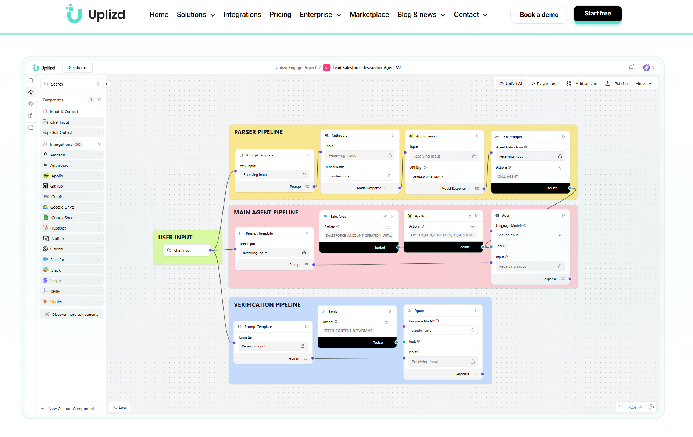

# Uplizd
 
**Build, Connect, Deploy, and Scale True Multiple AI Agents on One Unified Infrastructure. Get Long-term Value.**
 
Uplizd is an enterprise-grade AI agent platform that replaces fragmented AI stacks with a unified orchestration layer — so teams can build, deploy, and iterate without becoming their own integration vendor.
 
[](https://uplizd.ai)
[](https://uplizd.ai/solutions)
[](https://uplizd.ai/licensing/)
 
--- 



---
 
## Why Uplizd?
 
Stop wrestling with fragile stacks. Uplizd gives you:
 
- **Visual & Code** — Prototype on a visual canvas, or drop into code for full customization.
- **True Agents, Not Triggers** — Autonomous multi-step reasoning, not if/then automations.
- **Universal Connectivity** — Integrate your entire stack via MCP and APIs. 10,000+ components ready.
- **Deploy with Confidence** — Built-in governance, security, and scalability from day one.
---
 
## Platform Capabilities
 
### Orchestration
Unified runtime for multi-step and multi-agent workflows with any LLM. Swap providers without rewriting logic. No model lock-in.
 
### Integrations
Connect your entire stack into a single agentic layer — 10,000+ tools, APIs, and MCP servers across 58 industries. Built-in support for Claude, OpenAI, GPT-4o, Mistral, and custom local models.
 
### Governance
Enterprise-ready with SSO, human-in-the-loop approvals, RBAC, and audit logs. Built-in compliance and security guardrails for every agent. SOC 2 Type II.
 
### LLM Routing & Caching
Semantic caching to reduce repeated model calls. Per-team usage budgets for predictable AI spend. Intelligent routing across providers based on cost, latency, and availability.
 
### Observability & Debugging
Full production traces, p95 latency tracking, error rates, and retry logic — all visible in one place.
 
---
 
## Use Cases
 
| Domain | What Uplizd Does |
|---|---|
| **IT Ops** | Enrich tickets, triage alerts by SLA, automate provisioning with full audit context |
| **Security & Compliance** | Classify findings, generate evidence, handle review gates, maintain immutable audit trails |
| **RevOps & Sales** | Score and enrich leads, route to reps, generate follow-up drafts, sync to CRM |
| **Customer Support** | RAG-enabled answers, sentiment-based routing, escalation when AI confidence is low |
 
---
 
## Deployment Options
 
Uplizd runs where your data needs to live:
 
- **Managed Cloud** — Fastest time to value, fully managed by Uplizd.
- **Private VPC** — Data stays in your own cloud account.
- **On-Premises** — Ships to your Kubernetes cluster via Helm charts.
Same product. Same governance. You choose where it runs.
 
---
 
## Integrations
 
10,000+ integrations across 58 industries, including:
 
`OpenAI` `Anthropic` `Cohere` `Mistral` `Salesforce` `HubSpot` `GitHub` `Slack` `Stripe` `AWS` `Jira` `Notion` `PostgreSQL` `MongoDB` `Kafka` `Kubernetes`
 
→ [Browse all integrations](https://uplizd.ai/solutions)
 
Need something custom? [Talk to us](https://uplizd.ai) — we build additional components for your needs.
 

---

## Security & Privacy
 
- HIPAA posture documented in Uplizd's privacy policy
- ISO 27001-aligned security management
- RBAC with scoped access and isolated environments per team
- Full audit log with immutable trace for every workflow action
- SOC 2 Type II certified
Security documentation and architecture guidance are available during evaluation.
 
---
 
## Getting Started
 
1. **[Start Building](https://uplizd.ai)** — Sign up and launch your first agent on the managed platform.
2. **[View Integrations](https://uplizd.ai/solutions)** — Browse 10,000+ pre-built components.
3. **[Talk to Experts](https://uplizd.ai)** — Need an end-to-end application? Our team builds it for you.
---

## 📂 Repository Structure

```
solutions-introduction/
├── README.md              # You are here       
└── solutions/
├── 247-customer-support-assistant-by-ai-ml-api/
│   └── README.md
├── ab-test-optimizer-by-mixpanel/
│   └── README.md
├── ai-content-generator-by-replicate/
│   └── README.md
└── ... (2,500+ more solution directories)
```

---
 
## ⚡ Quick Start

### Browse Solutions
Simply explore the [`solutions/`](#browse-by-category) directory. Each subdirectory contains a `README.md` with a direct link to the solution on the Uplizd Portal.

## 🔗 Useful Links

- **Uplizd Solutions**: [https://uplizd.ai/solutions](https://uplizd.ai/solutions)
---

## 🤝 Contributing

We welcome contributions! If you have a solution that could be improved or want to suggest a new template, please follow these steps:

1. **Fork the repository** to your own account.
2. **Create a new branch** using a descriptive prefix:
   - For suggesting a **new template**:
     ```bash
     git checkout -b suggest/your-template-name
     ```
   - For a **bug fix** or improvement:
     ```bash
     git checkout -b fix/your-fix-name
     ```
3. **Make your changes** and ensure they follow the existing structure under the `solutions/` directory.
   > **💡 Tip for New Templates:** If you are suggesting a **new template**, please ensure its `README.md` describes the solution **as clearly and detailed as possible**. Outline what the solution does, the specific problem it solves, and the value it provides. The clearer the description, the better!
4. **Commit your changes** with a descriptive message:
   ```bash
   git commit -m "Add: [Solution Name] template"
   ```
5. **Push to your branch**:
   ```bash
   git push origin <your-branch-name>
   ```
6. **Open a Pull Request** against the main repository.

Contributions of all types are welcome, from minor typo fixes to entirely new solution templates!

---
 
## License
 
Uplizd is a proprietary platform maintained by [Uplizd](https://uplizd.ai).  
Please refer to the [licensing terms](https://uplizd.ai/licensing/) for usage rights and deployment options.

---

## Categories

Each template lists exactly **one** primary category in its README (`Primary category:`). Solutions appear once under that category.

| Category | Templates |
| --- | ---: |
| [Academic Operations](#academic-operations) | 4 |
| [Agriculture Operations](#agriculture-operations) | 1 |
| [AI Automation](#ai-automation) | 1 |
| [AI Development](#ai-development) | 1 |
| [AI Workflow Automation](#ai-workflow-automation) | 2 |
| [AI Workflow Orchestration](#ai-workflow-orchestration) | 1 |
| [Blockchain Operations](#blockchain-operations) | 1 |
| [Building automation](#building-automation) | 1 |
| [Career & Talent Acquisition](#career-talent-acquisition) | 1 |
| [Career Development](#career-development) | 1 |
| [Chatbot Automation](#chatbot-automation) | 1 |
| [Cloud Infrastructure Operations](#cloud-infrastructure-operations) | 1 |
| [Cloud Operations](#cloud-operations) | 1 |
| [Collaboration automation](#collaboration-automation) | 1 |
| [Communication](#communication) | 2 |
| [Communication automation](#communication-automation) | 1 |
| [Communication Operations](#communication-operations) | 3 |
| [Community Management](#community-management) | 1 |
| [Community Operations](#community-operations) | 9 |
| [Competitive Intelligence](#competitive-intelligence) | 1 |
| [Compliance & Risk Management](#compliance-risk-management) | 1 |
| [Compliance and Security](#compliance-and-security) | 1 |
| [Compliance Operations](#compliance-operations) | 5 |
| [Content automation](#content-automation) | 3 |
| [Content Intelligence](#content-intelligence) | 1 |
| [Content moderation](#content-moderation) | 1 |
| [Content Operations](#content-operations) | 15 |
| [Content Research](#content-research) | 1 |
| [Creative Automation](#creative-automation) | 1 |
| [Creative Operations](#creative-operations) | 2 |
| [CRM data](#crm-data) | 21 |
| [CRM data enrichment](#crm-data-enrichment) | 2 |
| [CRM data hygiene](#crm-data-hygiene) | 15 |
| [CRM data integration](#crm-data-integration) | 3 |
| [CRM data management](#crm-data-management) | 1 |
| [CRM data sync](#crm-data-sync) | 1 |
| [CRM Operations](#crm-operations) | 1 |
| [Customer Analytics](#customer-analytics) | 1 |
| [Customer communication](#customer-communication) | 1 |
| [Customer Experience](#customer-experience) | 5 |
| [Customer Experience (CX) Analytics](#customer-experience-cx-analytics) | 1 |
| [Customer Experience (CX) Automation](#customer-experience-cx-automation) | 2 |
| [Customer Experience (CX) Operations](#customer-experience-cx-operations) | 1 |
| [Customer Experience Operations](#customer-experience-operations) | 2 |
| [Customer Intelligence](#customer-intelligence) | 1 |
| [Customer Onboarding](#customer-onboarding) | 1 |
| [Customer Operations](#customer-operations) | 3 |
| [Customer Success](#customer-success) | 13 |
| [Customer Success Automation](#customer-success-automation) | 3 |
| [Customer Success Operations](#customer-success-operations) | 7 |
| [Customer Support](#customer-support) | 56 |
| [Customer Support Automation](#customer-support-automation) | 12 |
| [Customer Support Operations](#customer-support-operations) | 3 |
| [Cybersecurity](#cybersecurity) | 1 |
| [Data Analysis](#data-analysis) | 2 |
| [Data analytics](#data-analytics) | 2 |
| [Data Compliance](#data-compliance) | 2 |
| [Data compliance and regulatory operations](#data-compliance-and-regulatory-operations) | 1 |
| [Data Governance](#data-governance) | 4 |
| [Data hygiene](#data-hygiene) | 26 |
| [Data infrastructure automation](#data-infrastructure-automation) | 1 |
| [Data integration](#data-integration) | 240 |
| [Data intelligence](#data-intelligence) | 2 |
| [Data Operations](#data-operations) | 3 |
| [Data Privacy & Compliance](#data-privacy-compliance) | 3 |
| [Data Privacy & Security](#data-privacy-security) | 1 |
| [Data Science & Operations](#data-science-operations) | 1 |
| [Data Security](#data-security) | 1 |
| [DeFi Operations](#defi-operations) | 1 |
| [Design Operations](#design-operations) | 5 |
| [Developer Operations](#developer-operations) | 2 |
| [Developer Productivity](#developer-productivity) | 1 |
| [Development Operations](#development-operations) | 1 |
| [DevOps & Infrastructure](#devops-infrastructure) | 1 |
| [DevOps and Infrastructure Monitoring](#devops-and-infrastructure-monitoring) | 1 |
| [DevOps automation](#devops-automation) | 23 |
| [Document Automation](#document-automation) | 2 |
| [E-commerce automation](#e-commerce-automation) | 1 |
| [E-commerce Intelligence](#e-commerce-intelligence) | 1 |
| [E-commerce Operations](#e-commerce-operations) | 7 |
| [Education & Content Creation](#education-content-creation) | 1 |
| [Education Operations](#education-operations) | 12 |
| [Education technology](#education-technology) | 5 |
| [Educational Operations](#educational-operations) | 2 |
| [Educational Technology](#educational-technology) | 1 |
| [Engineering](#engineering) | 35 |
| [Engineering Operations](#engineering-operations) | 16 |
| [Environmental Monitoring](#environmental-monitoring) | 1 |
| [Event management](#event-management) | 1 |
| [Event management and non-profit operations.](#event-management-and-non-profit-operations) | 1 |
| [Event operations](#event-operations) | 2 |
| [Field Operations](#field-operations) | 1 |
| [Field operations automation](#field-operations-automation) | 1 |
| [Field service operations](#field-service-operations) | 2 |
| [Finance](#finance) | 37 |
| [Finance automation](#finance-automation) | 17 |
| [Finance operations](#finance-operations) | 33 |
| [Financial Compliance](#financial-compliance) | 1 |
| [Financial Data Integration](#financial-data-integration) | 1 |
| [Financial Data Intelligence](#financial-data-intelligence) | 2 |
| [Financial Operations](#financial-operations) | 40 |
| [Financial Research](#financial-research) | 1 |
| [Gaming Operations](#gaming-operations) | 2 |
| [Governance and Compliance](#governance-and-compliance) | 1 |
| [Graphics Engineering](#graphics-engineering) | 1 |
| [Growth Operations](#growth-operations) | 1 |
| [Health & Wellness](#health-wellness) | 1 |
| [Healthcare operations](#healthcare-operations) | 3 |
| [Healthcare Research](#healthcare-research) | 1 |
| [HR Operations](#hr-operations) | 13 |
| [Incident Management](#incident-management) | 2 |
| [Infrastructure monitoring](#infrastructure-monitoring) | 3 |
| [Internal Operations](#internal-operations) | 1 |
| [IoT Automation](#iot-automation) | 1 |
| [IT Operations](#it-operations) | 4 |
| [IT Operations & Compliance](#it-operations-compliance) | 1 |
| [Knowledge Management](#knowledge-management) | 4 |
| [Legal & Compliance](#legal-compliance) | 37 |
| [Legal & Compliance Operations](#legal-compliance-operations) | 2 |
| [Legal and Compliance](#legal-and-compliance) | 3 |
| [Legal Operations](#legal-operations) | 42 |
| [Lifestyle automation](#lifestyle-automation) | 1 |
| [Logistics automation](#logistics-automation) | 1 |
| [Logistics operations](#logistics-operations) | 2 |
| [Market Intelligence](#market-intelligence) | 33 |
| [Marketing operations](#marketing-operations) | 419 |
| [Media & Content Operations](#media-content-operations) | 1 |
| [Media & Entertainment](#media-entertainment) | 1 |
| [Media operations](#media-operations) | 2 |
| [Medical](#medical) | 1 |
| [Membership operations](#membership-operations) | 1 |
| [Network Security & Compliance](#network-security-compliance) | 1 |
| [Non-profit operations](#non-profit-operations) | 3 |
| [Operations](#operations) | 548 |
| [Operations automation](#operations-automation) | 23 |
| [Operations management](#operations-management) | 3 |
| [Operations Monitoring](#operations-monitoring) | 1 |
| [Pastoral Support](#pastoral-support) | 1 |
| [Payment Operations](#payment-operations) | 1 |
| [Performance management](#performance-management) | 1 |
| [Personal Development](#personal-development) | 1 |
| [Personal Productivity](#personal-productivity) | 5 |
| [Pet Care Operations](#pet-care-operations) | 1 |
| [Product Analytics](#product-analytics) | 3 |
| [Product Management](#product-management) | 2 |
| [Product operations](#product-operations) | 12 |
| [Productivity](#productivity) | 1 |
| [Productivity & Operations](#productivity-operations) | 1 |
| [Productivity and Knowledge Management](#productivity-and-knowledge-management) | 1 |
| [Productivity and Operations](#productivity-and-operations) | 1 |
| [Productivity automation](#productivity-automation) | 7 |
| [Productivity operations](#productivity-operations) | 4 |
| [Project Management](#project-management) | 20 |
| [Project management automation](#project-management-automation) | 1 |
| [Project Management Operations](#project-management-operations) | 1 |
| [Project Operations](#project-operations) | 1 |
| [Quality Assurance & Testing](#quality-assurance-testing) | 1 |
| [Real Estate Operations](#real-estate-operations) | 2 |
| [Recruiting](#recruiting) | 1 |
| [Recruiting operations](#recruiting-operations) | 8 |
| [Recruitment automation](#recruitment-automation) | 1 |
| [Recruitment operations](#recruitment-operations) | 2 |
| [Research & Intelligence](#research-intelligence) | 1 |
| [Research & Writing](#research-writing) | 1 |
| [Research automation](#research-automation) | 4 |
| [Research Operations](#research-operations) | 3 |
| [Revenue Operations](#revenue-operations) | 3 |
| [Revenue Operations (RevOps)](#revenue-operations-revops) | 1 |
| [RevOps](#revops) | 12 |
| [Risk Management](#risk-management) | 2 |
| [Sales automation](#sales-automation) | 270 |
| [Sales operations](#sales-operations) | 5 |
| [Search Operations](#search-operations) | 1 |
| [Security & Communication](#security-communication) | 1 |
| [Security & Compliance](#security-compliance) | 3 |
| [Security & Identity](#security-identity) | 1 |
| [Security Operations](#security-operations) | 10 |
| [SEO & Marketing Operations](#seo-marketing-operations) | 1 |
| [Social Impact & Philanthropy](#social-impact-philanthropy) | 1 |
| [Software Development](#software-development) | 1 |
| [Sports Analytics](#sports-analytics) | 1 |
| [Support automation](#support-automation) | 16 |
| [Support operations](#support-operations) | 16 |
| [Sustainability Operations](#sustainability-operations) | 6 |
| [Team Collaboration](#team-collaboration) | 3 |
| [Team Operations](#team-operations) | 9 |
| [Team Productivity](#team-productivity) | 1 |
| [Travel & Hospitality](#travel-hospitality) | 1 |
| [Travel & Lifestyle](#travel-lifestyle) | 1 |
| [Travel operations](#travel-operations) | 1 |
| [Uncategorized](#uncategorized) | 154 |
| [Web Development Automation](#web-development-automation) | 1 |
| [Web Operations](#web-operations) | 1 |
| [Web3 Development](#web3-development) | 1 |
| [Web3 Operations](#web3-operations) | 2 |
| [Website Operations](#website-operations) | 1 |
| [Workflow automation](#workflow-automation) | 4 |
| [Workforce management](#workforce-management) | 1 |
| [Workforce Operations](#workforce-operations) | 2 |
| [Workplace Operations](#workplace-operations) | 2 |

**Total:** 2560 templates in **200** categories.

## Browse by category

<h3 id="academic-operations">Academic Operations</h3>

<details>
<summary><strong>Expand list</strong></summary>

- [Blackboard Grade Analytics Agent (Uplizd) - Automated student performance monitoring and intervention insights](blackboard-grade-analytics-agent-by-blackboard/)
- [Blackboard Group Formation Agent (Uplizd) - Automated Student Grouping and Management](blackboard-group-formation-agent-by-blackboard/)
- [IELTS Writing Task 2 Evaluation (Uplizd) - Automated AI-powered essay scoring and feedback](ielts-writing-task2-evaluationwith-gemini-by/)
- [Research Collaboration Finder (Uplizd) - Identify academic partners through semantic publication analysis](research-collaboration-finder-by-semanticscholar/)

</details>

<h3 id="agriculture-operations">Agriculture Operations</h3>

<details>
<summary><strong>Expand list</strong></summary>

- [Smart Agriculture Environmental Advisor (Uplizd) - Hyperlocal crop management and environmental intelligence](smart-agriculture-environmental-advisor-by-ambee/)

</details>

<h3 id="ai-automation">AI Automation</h3>

<details>
<summary><strong>Expand list</strong></summary>

- [Basic Prompting (Uplizd) - Streamlined AI interaction and task execution](basic-prompting-by/)

</details>

<h3 id="ai-development">AI Development</h3>

<details>
<summary><strong>Expand list</strong></summary>

- [AI Agent Starter Kit: Weather & Web Scraping (Uplizd) - Build your first autonomous agent workflow](create-your-first-ai-agentwith-weather-web-scraping-starter-kit-by/)

</details>

<h3 id="ai-workflow-automation">AI Workflow Automation</h3>

<details>
<summary><strong>Expand list</strong></summary>

- [Build Your First AI Agent with ChatGPT-5 (Uplizd) - Rapid AI workflow development and agent orchestration](build-your-first-ai-agentwith-chat-gpt5-by/)
- [Memory Chatbot (Uplizd) - Intelligent context-aware conversational AI](memory-chatbot-by/)

</details>

<h3 id="ai-workflow-orchestration">AI Workflow Orchestration</h3>

<details>
<summary><strong>Expand list</strong></summary>

- [Hierarchical Multi-Agent Systems (Uplizd) - Orchestrate complex workflows with specialized AI agents](hierarchical-multi-agent-systems-by/)

</details>

<h3 id="blockchain-operations">Blockchain Operations</h3>

<details>
<summary><strong>Expand list</strong></summary>

- [MEV Protection Monitor (Uplizd) - Real-time mempool analysis and transaction security](mev-protection-monitor-by-blocknative/)

</details>

<h3 id="building-automation">Building automation</h3>

<details>
<summary><strong>Expand list</strong></summary>

- [HVAC Efficiency Controller (Uplizd) - Automated climate optimization using real-time weather data](hvac-efficiency-controller-by-ambient-weather/)

</details>

<h3 id="career-talent-acquisition">Career &amp; Talent Acquisition</h3>

<details>
<summary><strong>Expand list</strong></summary>

- [LinkedIn Job Finder Automation (Uplizd) - Streamline your career search with AI-driven lead discovery](linked-in-job-finder-automation-by/)

</details>

<h3 id="career-development">Career Development</h3>

<details>
<summary><strong>Expand list</strong></summary>

- [ATS Resume Creator (Uplizd) - Optimize resumes for ATS compatibility and job alignment](ats-resume-creator-ats-aware-by/)

</details>

<h3 id="chatbot-automation">Chatbot Automation</h3>

<details>
<summary><strong>Expand list</strong></summary>

- [Multi-Channel Bot Deployer (Uplizd) - Unified chatbot deployment and management across communication channels](multi-channel-bot-deployer-by-chatbotkit/)

</details>

<h3 id="cloud-infrastructure-operations">Cloud Infrastructure Operations</h3>

<details>
<summary><strong>Expand list</strong></summary>

- [Storage Zone Optimizer (Uplizd) - Automated CDN file distribution and storage efficiency](storage-zone-optimizer-by-bunnycdn/)

</details>

<h3 id="cloud-operations">Cloud Operations</h3>

<details>
<summary><strong>Expand list</strong></summary>

- [DNS Billing Optimizer (Uplizd) - Automated cost analysis and cloud infrastructure spend management](dns-billing-optimizer-by-dnsfilter/)

</details>

<h3 id="collaboration-automation">Collaboration automation</h3>

<details>
<summary><strong>Expand list</strong></summary>

- [Project Workspace Manager (Uplizd) - Automate Webex team and room creation for streamlined project collaboration](project-workspace-manager-by-webex/)

</details>

<h3 id="communication">Communication</h3>

<details>
<summary><strong>Expand list</strong></summary>

- [Multi-Agency WhatsApp Coordinator (Uplizd) - Centralized cross-agency communication management](multi-agency-whats-app-coordinator-by-spoki/)
- [WhatsApp Appointment Scheduler (Uplizd) - Automate meeting bookings via WhatsApp](whats-app-appointment-scheduler-by-wati/)

</details>

<h3 id="communication-automation">Communication automation</h3>

<details>
<summary><strong>Expand list</strong></summary>

- [WhatsApp Appointment Scheduler (Uplizd) - Automated booking and consultation management](whats-app-appointment-scheduler-by2chat/)

</details>

<h3 id="communication-operations">Communication Operations</h3>

<details>
<summary><strong>Expand list</strong></summary>

- [Professional Email Clarity Assistant (Uplizd) - Optimize business communication precision](professional-email-clarity-assistant-by-dictionary-api/)
- [Teams Chat Insights Analyzer (Uplizd) - Extract actionable intelligence and follow-ups from Microsoft Teams](teams-chat-insights-analyzer-by-microsoft-teams/)
- [WhatsApp Webhook Integration Manager (Uplizd) - Streamline real-time messaging data synchronization](whats-app-webhook-integration-manager-by-timelinesai/)

</details>

<h3 id="community-management">Community Management</h3>

<details>
<summary><strong>Expand list</strong></summary>

- [Fan Engagement Curator (Uplizd) - Automated character-based content curation for fan communities](fan-engagement-curator-by-chatfai/)

</details>

<h3 id="community-operations">Community Operations</h3>

<details>
<summary><strong>Expand list</strong></summary>

- [Community Moderation Assistant (Uplizd) - Automated community safety and user management](community-moderation-assistant-by-sendbird/)
- [Community Moderation Assistant (Uplizd) - Automated Discord server moderation and rule enforcement](community-moderation-assistant-by-discordbot/)
- [Discord Community Manager (Uplizd) - Automate member engagement and community insights](discord-community-manager-by-discord/)
- [Discord Invite Analytics Agent (Uplizd) - Optimize server growth and track invite performance](discord-invite-analytics-agent-by-discord/)
- [Discord Network Relationship Mapper (Uplizd) - Visualize and analyze community connection dynamics](discord-network-relationship-mapper-by-discord/)
- [Gaming Community Moderator (Uplizd) - Real-time automated chat moderation and community safety](gaming-community-moderator-by-ably/)
- [Guild Growth Optimizer (Uplizd) - Automated Discord community expansion and member engagement](guild-growth-optimizer-by-discordbot/)
- [Member Engagement Optimization Agent (Uplizd) - Drive community activity through personalized member outreach](member-engagement-optimization-agent-by-brilliant-directories/)
- [Reddit Community Manager (Uplizd) - Automate engagement and content moderation for Reddit communities](reddit-community-manager-by-reddit/)

</details>

<h3 id="competitive-intelligence">Competitive Intelligence</h3>

<details>
<summary><strong>Expand list</strong></summary>

- [Competitor Visual Tracker (Uplizd) - Automated website change monitoring and design intelligence](competitor-visual-tracker-by-apiflash/)

</details>

<h3 id="compliance-risk-management">Compliance &amp; Risk Management</h3>

<details>
<summary><strong>Expand list</strong></summary>

- [Validator Compliance & Risk Auditor (Uplizd) - Automated Staking Compliance and Slashing Risk Mitigation](validator-compliance-risk-auditor-by-beaconchain/)

</details>

<h3 id="compliance-and-security">Compliance and Security</h3>

<details>
<summary><strong>Expand list</strong></summary>

- [Test App Compliance Validator (Uplizd) - Automated regulatory and security standard enforcement](test-app-compliance-validator-by-test-app/)

</details>

<h3 id="compliance-operations">Compliance Operations</h3>

<details>
<summary><strong>Expand list</strong></summary>

- [Compliance Certification Tracker (Uplizd) - Automated regulatory and training compliance management](compliance-certification-tracker-by-certifier/)
- [Compliance Dashboard Agent (Uplizd) - Automated Regulatory Monitoring and Risk Reporting](compliance-dashboard-agent-by21risk/)
- [Emissions Compliance Monitor (Uplizd) - Automated regulatory tracking and reporting](emissions-compliance-monitor-by-corrently/)
- [Safety Compliance Monitor (Uplizd) - Automated safety inspection tracking and reporting](safety-compliance-monitor-by-safetyculture/)
- [Training Compliance Monitor (Uplizd) - Automated employee training tracking and reporting](training-compliance-monitor-by-coassemble/)

</details>

<h3 id="content-automation">Content automation</h3>

<details>
<summary><strong>Expand list</strong></summary>

- [Generate Data with Qwen and Wikipedia (Uplizd) - Automated research and content synthesis](generate-datawith-qwenand-wikipedia-by/)
- [Popular Science Article Author (Uplizd) - Transform complex research into engaging, accessible content](popularsciencearticleauthor-by/)
- [Video Generator with Veo & Google Drive (Uplizd) - Automated AI video production and cloud storage](video-generatorwith-veo-google-drive-by/)

</details>

<h3 id="content-intelligence">Content Intelligence</h3>

<details>
<summary><strong>Expand list</strong></summary>

- [TED Talk Summarization (Uplizd) - Automated AI-powered insights from video transcripts](ted-talk-summarization-by/)

</details>

<h3 id="content-moderation">Content moderation</h3>

<details>
<summary><strong>Expand list</strong></summary>

- [Content Safety Moderator (Uplizd) - Automated real-time content screening and policy enforcement](content-safety-moderator-by-ai-ml-api/)

</details>

<h3 id="content-operations">Content Operations</h3>

<details>
<summary><strong>Expand list</strong></summary>

- [Audiobook Producer (Uplizd) - Automated text-to-speech narration and audio production](audiobook-producer-by-lmnt/)
- [Cat Wellness Content Generator (Uplizd) - Automated feline health and wellness educational content](cat-wellness-content-generator-by-cats/)
- [CMS Migration Assistant (Uplizd) - Automate content transfer and synchronization across CMS platforms](cms-migration-assistant-by-agility-cms/)
- [En-to-Zh Text Polishing (Uplizd) - AI-driven multi-round translation and refinement workflow](ento-zh-text-polishing-by/)
- [Feed Integration Manager (Uplizd) - Automate cross-platform feed embedding and content synchronization](feed-integration-manager-by-beamer/)
- [File Translation (Uplizd) - Automated multilingual document processing and localization](file-translation-by/)
- [News Story Visualizer (Uplizd) - Transform written news articles into compelling video stories](news-story-visualizer-by-veo/)
- [Podcast Automation Assistant (Uplizd) - Streamline content production with AI-powered audio workflows](podcast-automation-assistant-by-aivoov/)
- [Podcast Guest Research Assistant (Uplizd) - Streamline guest vetting and background intelligence](podcast-guest-research-assistant-by-listennotes/)
- [Podcast Production Assistant (Uplizd) - Automate high-quality audio content creation from text](podcast-production-assistant-by-elevenlabs/)
- [Podcast Voice Cloner (Uplizd) - AI-powered professional voice synthesis for creators](podcast-voice-cloner-by-lmnt/)
- [Subtitle Quality Auditor (Uplizd) - Automated precision for video accessibility and compliance](subtitle-quality-auditor-by-amara/)
- [Training Video Creator (Uplizd) - Automated instructional content generation](training-video-creator-by-veo/)
- [Training Video Narrator (Uplizd) - Automated professional narration for training content](training-video-narrator-by-aivoov/)
- [Video Dubbing and Localization Agent (Uplizd) - Automated cross-language video content scaling](video-dubbing-localization-agent-by-elevenlabs/)

</details>

<h3 id="content-research">Content Research</h3>

<details>
<summary><strong>Expand list</strong></summary>

- [Sermon Research Assistant (Uplizd) - Accelerate sermon preparation with AI-powered scripture research](sermon-research-assistant-by-api-bible/)

</details>

<h3 id="creative-automation">Creative Automation</h3>

<details>
<summary><strong>Expand list</strong></summary>

- [Roleplay Scenario Generator (Uplizd) - Create immersive, dynamic character-driven narratives](roleplay-scenario-generator-by-chatfai/)

</details>

<h3 id="creative-operations">Creative Operations</h3>

<details>
<summary><strong>Expand list</strong></summary>

- [Character Research Assistant (Uplizd) - Automated narrative depth and character profiling](character-research-assistant-by-chatfai/)
- [Portfolio Organization Assistant (Uplizd) - Automate and structure your photography portfolio](portfolio-organization-assistant-by-smugmug/)

</details>

<h3 id="crm-data">CRM data</h3>

<details>
<summary><strong>Expand list</strong></summary>

- [Account Health & Usage Monitor (Uplizd) - Proactive tracking of Jotform account limits and performance](account-health-usage-monitor-by-jotform/)
- [Account Relationship Builder (Uplizd) - Automate CRM account mapping and profile enrichment](account-relationship-builder-by-dynamics365/)
- [Client Interaction Tracker (Uplizd) - Build deeper client relationships with perfect memory](client-interaction-tracker-by-mem0/)
- [Client Relationship Manager (Uplizd) - Automate client interactions and centralize contact data](client-relationship-manager-by-moneybird/)
- [Client Relationship Monitor (Uplizd) - Proactive engagement tracking and risk mitigation](client-relationship-monitor-by-moco/)
- [Company Data Enricher (Uplizd) - Automated CRM record enrichment and data hygiene](company-data-enricher-by-pipeline-crm/)
- [Contact Data Enricher by Zoho Bigin (Uplizd) - Automated CRM record enrichment and data hygiene](contact-data-enricher-by-zoho-bigin/)
- [Contact Data Enrichment Agent (Uplizd) - Automate CRM record enrichment with Kommo](contact-data-enrichment-agent-by-kommo/)
- [Contact Enrichment Engine (Uplizd) - Automated CRM data enrichment and behavioral profiling](contact-enrichment-engine-by-refiner/)
- [Contact Profile Enricher (Uplizd) - Automated CRM data enrichment from messaging conversations](contact-profile-enricher-by-respond-io/)
- [Contact Sync Manager (Uplizd) - Automated cross-platform contact synchronization](contact-sync-manager-by-chatwork/)
- [Contact Sync Manager (Uplizd) - Automated meeting contact synchronization](contact-sync-manager-by-calendarhero/)
- [CRM Contact Synchronizer (Uplizd) - Automated PandaDoc to CRM data synchronization](crm-contact-synchronizer-by-pandadoc/)
- [CRM Data Quality Guardian (Uplizd) - Automated CRM data hygiene and standardization](crm-data-quality-guardian-by-peopledatalabs/)
- [Customer Account Health Monitor (Uplizd) - Proactive business intelligence and risk management](customer-account-health-monitor-by-enigma/)
- [Customer Data Organization Agent (Uplizd) - Automate Sendlane CRM data hygiene and segmentation](customer-data-organization-agent-by-sendlane/)
- [Customer Insights Generator (Uplizd) - Automated customer intelligence and behavioral analysis](customer-insights-generator-by-entelligence/)
- [Customer Lifecycle Manager (Uplizd) - Automate and optimize the end-to-end customer journey](customer-lifecycle-manager-by-zoho/)
- [Customer Relationship Historian (Uplizd) - Automated interaction tracking and CRM intelligence](customer-relationship-historian-by-centralstationcrm/)
- [Customer Tier Migration Agent (Uplizd) - Automated subscription and account lifecycle management](customer-tier-migration-agent-by-plain/)
- [Relationship Insights Agent (Uplizd) - Uncover hidden CRM interaction patterns and relationship health](relationship-insights-agent-by-capsule-crm/)

</details>

<h3 id="crm-data-enrichment">CRM data enrichment</h3>

<details>
<summary><strong>Expand list</strong></summary>

- [Contact Profile Enricher (Uplizd) - Automated CRM data enrichment and intelligence](contact-profile-enricher-by-centralstationcrm/)
- [CRM Contact Enrichment Agent (Uplizd) - Automated lead data verification and enrichment](crm-contact-enrichment-agent-by-findymail/)

</details>

<h3 id="crm-data-hygiene">CRM data hygiene</h3>

<details>
<summary><strong>Expand list</strong></summary>

- [Account Health Compliance Monitor (Uplizd) - Automated Brevo reputation and email compliance management](account-health-compliance-monitor-by-brevo/)
- [Contact Data Cleanup Agent (Uplizd) - Human-Centric Contact Data Optimization](contact-data-cleanup-agent/)
- [Contact Database Optimizer (Uplizd) - Automated CRM hygiene and enrichment for Brevo](contact-database-optimizer-by-brevo/)
- [CRM Data Auditor (Uplizd) - Automated integrity and validation for EspoCRM](crm-data-auditor-by-espocrm/)
- [CRM Data Cleanup Agent (Uplizd) - Automated Folk CRM hygiene and duplicate resolution](crm-data-cleanup-agent-by-folk/)
- [CRM Data Cleanup Specialist (Uplizd) - Automated Zoho Bigin data hygiene and deduplication](crm-data-cleanup-specialist-by-zoho-bigin/)
- [CRM Data Hygienist (Uplizd) - Expert Contact & Company Data Enrichment](crm-data-hygienist/)
- [CRM Data Quality Agent (Uplizd) - Automate CRM Data Validation, Enrichment, and Hygiene](crm-data-quality-agent/)
- [CRM Data Quality Guardian (Uplizd) - Automated CRM data hygiene and record validation](crm-data-quality-guardian-by-salesmate/)
- [CRM System Health Monitor (Uplizd) - Proactive Performance & Integrity Oversight](crm-system-health-monitor/)
- [Deal Document Organizer (Uplizd) - Automated CRM Attachment Management](deal-document-organizer-by-zoho-bigin/)
- [Mailbox Health Monitor (Uplizd) - Proactive email performance and deliverability optimization](mailbox-health-monitor-by-outlook/)
- [Multi-Account Health Monitor (Uplizd) - Real-time cross-platform account performance and status tracking](multi-account-health-monitor-by-dotsimple/)
- [Smart Contact Lifecycle Manager (Uplizd) - Automate CRM contact engagement and data hygiene](smart-contact-lifecycle-manager-by-dripcel/)
- [Smart Contact List Manager (Uplizd) - Automated CRM list hygiene and engagement segmentation](smart-contact-list-manager-by-reply/)

</details>

<h3 id="crm-data-integration">CRM data integration</h3>

<details>
<summary><strong>Expand list</strong></summary>

- [Customer 360 Aggregator (Uplizd) - Unified customer intelligence across fragmented business systems](customer360-aggregator-by-nango/)
- [Meeting Notes Processor (Uplizd) - Automate CRM updates from meeting transcripts](meeting-notes-processor-by-attio/)
- [Project Sync Agent (Uplizd) - Automated CRM project alignment and status synchronization](project-sync-agent-by-capsule-crm/)

</details>

<h3 id="crm-data-management">CRM data management</h3>

<details>
<summary><strong>Expand list</strong></summary>

- [Customer Lifecycle Manager (Uplizd) - Proactive customer relationship and history tracking](customer-lifecycle-manager-by-repairshopr/)

</details>

<h3 id="crm-data-sync">CRM data sync</h3>

<details>
<summary><strong>Expand list</strong></summary>

- [Connection CRM Sync Agent (Uplizd) - Automated Prospect Enrichment and CRM Synchronization](connection-crm-sync-agent-by-leadoku/)

</details>

<h3 id="crm-operations">CRM Operations</h3>

<details>
<summary><strong>Expand list</strong></summary>

- [CRM User Onboarding Assistant (Uplizd) - Automate and accelerate new user setup in EspoCRM](crm-user-onboarding-assistant-by-espocrm/)

</details>

<h3 id="customer-analytics">Customer Analytics</h3>

<details>
<summary><strong>Expand list</strong></summary>

- [Customer Behavior Analyzer (Uplizd) - Transform Loyverse transaction data into actionable customer insights](customer-behavior-analyzer-by-loyverse/)

</details>

<h3 id="customer-communication">Customer communication</h3>

<details>
<summary><strong>Expand list</strong></summary>

- [WhatsApp Appointment Booking Agent (Uplizd) - Automate scheduling and reminders via WhatsApp](whats-app-appointment-booking-agent-by-whatsapp/)

</details>

<h3 id="customer-experience">Customer Experience</h3>

<details>
<summary><strong>Expand list</strong></summary>

- [Directory Review Intelligence Agent (Uplizd) - Automated sentiment analysis and trend extraction for user feedback](directory-review-intelligence-agent-by-brilliant-directories/)
- [Global Customer Localizer (Uplizd) - Automate personalized customer experiences via real-time geolocation](global-customer-localizer-by-big-data-cloud/)
- [Sentiment Analysis (Uplizd) - Automated text classification and emotional intelligence for customer feedback](sentiment-analysis-by/)
- [Smart Feedback Follow-up Agent (Uplizd) - Automate personalized responses to customer feedback](smart-feedback-followup-agent-by-retently/)
- [WhatsApp Feedback Collection Agent (Uplizd) - Automated conversational customer insights](whats-app-feedback-collection-agent-by-whatsapp/)

</details>

<h3 id="customer-experience-cx-analytics">Customer Experience (CX) Analytics</h3>

<details>
<summary><strong>Expand list</strong></summary>

- [Conversation Analytics Reporter (Uplizd) - Automated insights from customer conversations](conversation-analytics-reporter-by-superchat/)

</details>

<h3 id="customer-experience-cx-automation">Customer Experience (CX) Automation</h3>

<details>
<summary><strong>Expand list</strong></summary>

- [Feedback Response Automator (Uplizd) - Streamline customer feedback loops and performance tracking](feedback-response-automator-by-simplesat/)
- [WhatsApp Feedback Collector (Uplizd) - Automated Customer Sentiment and Feedback Pipeline](whats-app-feedback-collector-by-wati/)

</details>

<h3 id="customer-experience-cx-operations">Customer Experience (CX) Operations</h3>

<details>
<summary><strong>Expand list</strong></summary>

- [NPS Feedback Intelligence Agent (Uplizd) - Automate customer sentiment analysis and feedback categorization](nps-feedback-intelligence-agent-by-retently/)

</details>

<h3 id="customer-experience-operations">Customer Experience Operations</h3>

<details>
<summary><strong>Expand list</strong></summary>

- [Customer Review Analysis Workflow (Uplizd) - Automated sentiment classification and feedback routing](customer-review-analysis-workflow-by/)
- [Survey Response Orchestrator (Uplizd) - Automated multi-channel customer feedback follow-up](survey-response-orchestrator-by-simplesat/)

</details>

<h3 id="customer-intelligence">Customer Intelligence</h3>

<details>
<summary><strong>Expand list</strong></summary>

- [Customer Insight Generator (Uplizd) - Transform customer inquiries into actionable business intelligence](customer-insight-generator-by-perplexityai/)

</details>

<h3 id="customer-onboarding">Customer Onboarding</h3>

<details>
<summary><strong>Expand list</strong></summary>

- [Customer Onboarding SMS Orchestrator (Uplizd) - Automated SMS journeys for seamless user activation](customer-onboarding-sms-orchestrator-by-brevo/)

</details>

<h3 id="customer-operations">Customer Operations</h3>

<details>
<summary><strong>Expand list</strong></summary>

- [Customer Lifecycle Manager (Uplizd) - Automate end-to-end customer onboarding and offboarding workflows](customer-lifecycle-manager-by-ascora/)
- [Customer Onboarding Assistant (Uplizd) - Streamline client data ingestion and setup workflows](customer-onboarding-assistant-by-dromo/)
- [Feedback Response Analyzer (Uplizd) - Automate customer feedback categorization and insight extraction](feedback-response-analyzer-by-refiner/)

</details>

<h3 id="customer-success">Customer Success</h3>

<details>
<summary><strong>Expand list</strong></summary>

- [Automated Onboarding Assistant (Uplizd) - Streamline customer activation and reduce time-to-value](automated-onboarding-assistant-by-intercom/)
- [Customer Advocate Identifier (Uplizd) - Automate the discovery and engagement of your top brand advocates](customer-advocate-identifier-by-endorsal/)
- [Customer Appreciation Agent (Uplizd) - Automate personalized client relationship building](customer-appreciation-agent-by-thanks-io/)
- [Customer Churn Risk Analyzer (Uplizd) - Proactive retention through behavioral data intelligence](customer-churn-risk-analyzer-by-googlebigquery/)
- [Customer Health Dashboard Agent (Uplizd) - Automated NPS and feedback insights for proactive retention](customer-health-dashboard-agent-by-retently/)
- [Customer Health Monitor (Uplizd) - Proactive churn prevention and engagement tracking](customer-health-monitor-by-fireberry/)
- [Customer Health Monitoring Agent (Uplizd) - Proactive churn prevention through real-time engagement analytics](customer-health-monitoring-agent-by-intercom/)
- [Customer Milestone Card Agent (Uplizd) - Automate personalized physical card delivery for customer milestones](customer-milestone-card-agent-by-cardly/)
- [Customer Retention Agent (Uplizd) - Proactive churn reduction and automated win-back workflows](customer-retention-agent-by-ascora/)
- [Customer Success Playbook Executor (Uplizd) - Automate account health and success workflows](customer-success-playbook-executor-by-process-street/)
- [Customer Success Tracker (Uplizd) - Automate health monitoring and success milestones](customer-success-tracker-by-attio/)
- [Customer Thank You Card Agent (Uplizd) - Automate personalized physical appreciation at scale](customer-thank-you-card-agent-by-stannp/)
- [New Customer Welcome Journey (Uplizd) - Automated personalized onboarding sequences](new-customer-welcome-journey-by-amcards/)

</details>

<h3 id="customer-success-automation">Customer Success Automation</h3>

<details>
<summary><strong>Expand list</strong></summary>

- [Churn Risk Detection Agent (Uplizd) - Proactive customer retention and churn mitigation](churn-risk-detection-agent-by-retently/)
- [Client Milestone Celebration Agent (Uplizd) - Automated personalized client recognition](client-milestone-celebration-agent-by-amcards/)
- [Customer Onboarding Agent (Uplizd) - Automate personalized client activation workflows](customer-onboarding-agent-by-active-campaign/)

</details>

<h3 id="customer-success-operations">Customer Success Operations</h3>

<details>
<summary><strong>Expand list</strong></summary>

- [Churn Prediction Monitor (Uplizd) - Proactive customer retention and risk identification](churn-prediction-monitor-by-refiner/)
- [Customer Health Dashboard (Uplizd) - Real-time churn prediction and account health monitoring](customer-health-dashboard-by-klipfolio/)
- [Customer Onboarding Assistant (Uplizd) - Automate and streamline new customer account setup](customer-onboarding-assistant-by-chaser/)
- [Customer Onboarding Orchestrator (Uplizd) - Automated client setup and task management](customer-onboarding-orchestrator-by-workiom/)
- [Customer Onboarding Orchestrator (Uplizd) - Streamline client setup and task management](customer-onboarding-orchestrator-by-kommo/)
- [Customer Renewal Documentation Agent (Uplizd) - Automate contract renewals and upsell documentation](customer-renewal-documentation-agent-by-docusign/)
- [New Customer Onboarding Assistant (Uplizd) - Streamline client activation and lifecycle workflows](new-customer-onboarding-assistant-by-sendlane/)

</details>

<h3 id="customer-support">Customer Support</h3>

<details>
<summary><strong>Expand list</strong></summary>

- [24/7 Customer Support Assistant (Uplizd) - Automated AI-driven resolution for round-the-clock service](247-customer-support-assistant-by-ai-ml-api/)
- [24/7 Customer Support Voice Assistant (Uplizd) - Automated AI-driven voice interactions for round-the-clock service](247-customer-support-voice-assistant-by-synthflow-ai/)
- [Automated Customer Feedback Collector (Uplizd) - Streamline voice-based customer insights](automated-customer-feedback-collector-by-bolna/)
- [Bot Conversation Analyzer (Uplizd) - Optimize chatbot performance through automated conversation insights](bot-conversation-analyzer-by-chatbotkit/)
- [Client Escalation Monitor (Uplizd) - Automated real-time detection and routing of urgent client issues](client-escalation-monitor-by-chatwork/)
- [Contextual Help Assistant (Uplizd) - Proactive documentation and support delivery](contextual-help-assistant-by-productlane/)
- [Customer Call Analyzer (Uplizd) - Automate insights from sales and support conversations](customer-call-analyzer-by-deepgram/)
- [Customer Call Analyzer (Uplizd) - Automated transcription and insight extraction for sales and support calls](customer-call-analyzer-by-castingwords/)
- [Customer Communication Hub (Uplizd) - Unified Customer Interaction and Note Management](customer-communication-hub-by-agencyzoom/)
- [Customer Communication Voice Bot (Uplizd) - Automated AI-driven voice engagement for customer support](customer-communication-voice-bot-by-aivoov/)
- [Customer Feedback Aggregator (Uplizd) - Centralized sentiment analysis and actionable insights](customer-feedback-aggregator-by-exa/)
- [Customer Feedback Analyzer (Uplizd) - Automated sentiment analysis and actionable insights](customer-feedback-analyzer-by-yousearch/)
- [Customer Feedback Analyzer (Uplizd) - Automated sentiment analysis and product insight extraction](customer-feedback-analyzer-by-airtable/)
- [Customer Feedback Analyzer (Uplizd) - Automated sentiment and category insights for Byteforms](customer-feedback-analyzer-by-byteforms/)
- [Customer Feedback Analyzer (Uplizd) - Automated sentiment and insight extraction for customer feedback](customer-feedback-analyzer-by-tisane/)
- [Customer Feedback Analyzer (Uplizd) - Automated Survey Insight Extraction](customer-feedback-analyzer-by-survey-monkey/)
- [Customer Feedback Collector (Uplizd) - Automate feedback ingestion and sentiment analysis](customer-feedback-collector-by-cabinpanda/)
- [Customer Feedback Form Analyzer (Uplizd) - Automated Tally form insights and sentiment analysis](customer-feedback-form-analyzer-by-tally/)
- [Customer Feedback Intelligence Agent (Uplizd) - Automated sentiment analysis and actionable insights](customer-feedback-intelligence-agent-by-fireflies/)
- [Customer Feedback Intelligence Agent (Uplizd) - Automated sentiment and insight extraction for customer communications](customer-feedback-intelligence-agent-by-textrazor/)
- [Customer Feedback Organizer (Uplizd) - Automate feedback categorization and insight extraction](customer-feedback-organizer-by-dovetail/)
- [Customer Feedback Processing Agent (Uplizd) - Automated sentiment analysis and HubSpot routing](customer-feedback-processing-agent-by-hubspot/)
- [Customer Journey Enricher (Uplizd) - Unified feedback and satisfaction data enrichment](customer-journey-enricher-by-simplesat/)
- [Customer Onboarding Agent (Uplizd) - Streamline new client setup and support workflows](customer-onboarding-agent-by-plain/)
- [Customer Service Voice Bot (Uplizd) - Automated AI-driven voice support for real-time customer resolution](customer-service-voice-bot-by-lmnt/)
- [Customer Support Bot (Uplizd) - Automated Telegram support with smart routing and escalation](customer-support-bot-by-telegram/)
- [Customer Support Bot Manager (Uplizd) - Automate AI-driven support with DocsBot AI](customer-support-bot-manager-by-docsbot-ai/)
- [Customer Support Bot Manager (Uplizd) - Streamline and optimize multi-channel chatbot performance](customer-support-bot-manager-by-chatbotkit/)
- [Customer Support Chat Manager (Uplizd) - Streamline support channel orchestration and user management](customer-support-chat-manager-by-sendbird/)
- [Customer Support Chatbot Manager (Uplizd) - Intelligent automation for bot performance and ticket resolution](customer-support-chatbot-manager-by-botpress/)
- [Customer Support Optimizer (Uplizd) - AI-driven conversation analysis and performance tuning](customer-support-optimizer-by-botsonic/)
- [Customer Support Quality Monitor (Uplizd) - Automated call analysis for consistent service excellence](customer-support-quality-monitor-by-retellai/)
- [Customer Support Triage Agent (Uplizd) - Intelligent inquiry routing and automated ticket categorization](customer-support-triage-agent-by-superchat/)
- [Customer Support Triage Agent (Uplizd) - Intelligent ticket routing and automated inquiry categorization](customer-support-triage-agent-by-missive/)
- [DPD2 Customer Support Agent (Uplizd) - Intelligent customer query resolution using purchase and storefront data](dpd2-customer-support-agent-by-dpd2/)
- [Facebook Messenger Support Agent (Uplizd) - Automated customer service and inquiry resolution](facebook-messenger-support-agent-by-facebook/)
- [First Response Assistant (Uplizd) - Automated customer ticket resolution](first-response-assistant-by-zendesk/)
- [Intelligent Response Assistant (Uplizd) - Automate contextual support replies via Freshdesk](intelligent-response-assistant-by-freshdesk/)
- [Intelligent Support Escalation Agent (Uplizd) - Automate complex ticket routing and resolution](intelligent-support-escalation-agent-by-intercom/)
- [Real-Time Chat Safety Guardian (Uplizd) - Automated moderation for secure community interactions](real-time-chat-safety-guardian-by-ai-ml-api/)
- [Real-Time Customer Support Monitor (Uplizd) - Live interaction analysis and automated triage](real-time-customer-support-monitor-by-ably/)
- [Reddit Customer Support Agent (Uplizd) - Automated community engagement and inquiry resolution](reddit-customer-support-agent-by-reddit/)
- [Support Ticket Classifier (Uplizd) - Automated triage and prioritization for customer support](support-ticket-classifier-by-byteforms/)
- [Support Ticket Intelligence Agent (Uplizd) - Automate ticket categorization and resolution](support-ticket-intelligence-agent-by-docsbot-ai/)
- [Support Ticket Router (Uplizd) - Intelligent AI-driven customer inquiry classification and routing](support-ticket-router-by-agiled/)
- [Support Ticket Router (Uplizd) - Intelligent automated triage and routing for customer support](support-ticket-router-by-formcarry/)
- [Support Triage Agent (Uplizd) - Intelligent customer lookup and automated ticket routing](support-triage-agent-by-plain/)
- [Technical Support Assistant (Uplizd) - Instant technical troubleshooting via Stack Exchange](technical-support-assistant-by-stack-exchange/)
- [Twitter Customer Support Agent (Uplizd) - Automated social media inquiry routing and resolution](twitter-customer-support-agent-by-twitter/)
- [VIP Customer Escalator (Uplizd) - Automated high-value support prioritization](vip-customer-escalator-by-gorgias/)
- [WhatsApp Customer Support Bot (Uplizd) - Automated AI-driven inquiry resolution](whats-app-customer-support-bot-by-whatsapp/)
- [WhatsApp Feedback Collection Agent (Uplizd) - Automated customer sentiment and feedback gathering](whats-app-feedback-collection-agent-by2chat/)
- [WhatsApp Order Status Tracker (Uplizd) - Automated real-time delivery updates and inquiry management](whats-app-order-status-tracker-by-timelinesai/)
- [WhatsApp Support Automator (Uplizd) - Streamline customer service and ticket resolution](whats-app-support-automator-by-timelinesai/)
- [WhatsApp Support Ticket Manager (Uplizd) - Automated customer service ticketing and response orchestration](whats-app-support-ticket-manager-by-spoki/)
- [WhatsApp Support Triage Agent (Uplizd) - Automated customer request routing and categorization](whats-app-support-triage-agent-by-wati/)

</details>

<h3 id="customer-support-automation">Customer Support Automation</h3>

<details>
<summary><strong>Expand list</strong></summary>

- [24/7 Customer Support Voice Agent (Uplizd) - Automated real-time voice interactions for scalable support](247-customer-support-voice-agent-by-bolna/)
- [AI-Powered SMS Response Handler (Uplizd) - Automated, context-aware customer communication](ai-powered-sms-response-handler-by-dripcel/)
- [Auto Ticket Triage Agent (Uplizd) - Intelligent support ticket categorization and priority routing](auto-ticket-triage-agent-by-freshdesk/)
- [Conversation Escalation Handler (Uplizd) - Automate human hand-off for complex support inquiries](conversation-escalation-handler-by-chatbotkit/)
- [Customer Support Chatbot Deployer (Uplizd) - Automated 24/7 inquiry resolution](customer-support-chatbot-deployer-by-insighto-ai/)
- [Question Classifier and Knowledge Chatbot (Uplizd) - Intelligent intent routing and automated query resolution](questionclassifier-knowledge-chatbot-by/)
- [Smart Escalation Manager (Uplizd) - Automated ticket prioritization and stakeholder notification](smart-escalation-manager-by-freshdesk/)
- [Template Response Optimizer (Uplizd) - Intelligent message selection and customization](template-response-optimizer-by-superchat/)
- [User Onboarding Chat Flow (Uplizd) - Automated registration and channel assignment](user-onboarding-chat-flow-by-sendbird/)
- [WhatsApp Order Status Agent (Uplizd) - Automated real-time order tracking and customer updates](whats-app-order-status-agent-by-wati/)
- [WhatsApp Order Status Agent (Uplizd) - Automated real-time order tracking and customer updates](whats-app-order-status-agent-by2chat/)
- [WhatsApp Order Status Agent (Uplizd) - Proactive delivery updates and automated order tracking](whats-app-order-status-agent-by-whatsapp/)

</details>

<h3 id="customer-support-operations">Customer Support Operations</h3>

<details>
<summary><strong>Expand list</strong></summary>

- [Customer Health Monitor (Uplizd) - Proactive account retention and satisfaction tracking](customer-health-monitor-by-gorgias/)
- [Knowledge Gap Identifier (Uplizd) - Automate support article creation by detecting recurring knowledge gaps](knowledge-gap-identifier-by-freshdesk/)
- [Smart FAQ Curator (Uplizd) - Automate knowledge base updates from customer conversations](smart-faq-curator-by-botsonic/)

</details>

<h3 id="cybersecurity">Cybersecurity</h3>

<details>
<summary><strong>Expand list</strong></summary>

- [Brand Protection Sentinel (Uplizd) - Automated SSL Certificate Monitoring and Fraud Detection](brand-protection-sentinel-by-sslmate-cert-spotter-api/)

</details>

<h3 id="data-analysis">Data Analysis</h3>

<details>
<summary><strong>Expand list</strong></summary>

- [Research Document Synthesizer (Uplizd) - Transform complex research papers into actionable insights](research-document-synthesizer-by-aryn/)
- [Text Sentiment Analysis (Uplizd) - AI-powered customer feedback and sentiment classification](text-sentiment-analysis-by/)

</details>

<h3 id="data-analytics">Data analytics</h3>

<details>
<summary><strong>Expand list</strong></summary>

- [Conversation Analytics Reporter (Uplizd) - Automated insights from chatbot interactions](conversation-analytics-reporter-by-botpress/)
- [Custom Analytics Builder (Uplizd) - Tailored error tracking and stakeholder reporting](custom-analytics-builder-by-bugsnag/)

</details>

<h3 id="data-compliance">Data Compliance</h3>

<details>
<summary><strong>Expand list</strong></summary>

- [Data Compliance Monitor (Uplizd) - Automated regulatory data validation and quality assurance](data-compliance-monitor-by-abstract/)
- [GDPR Meeting Data Manager (Uplizd) - Automated Compliance for Calendly Invitee Records](gdpr-meeting-data-manager-by-calendly/)

</details>

<h3 id="data-compliance-and-regulatory-operations">Data compliance and regulatory operations</h3>

<details>
<summary><strong>Expand list</strong></summary>

- [GDPR Compliance Monitor (Uplizd) - Automated data privacy and regulatory auditing](gdpr-compliance-monitor-by-borneo/)

</details>

<h3 id="data-governance">Data Governance</h3>

<details>
<summary><strong>Expand list</strong></summary>

- [Backup Compliance Manager (Uplizd) - Automated data integrity and regulatory reporting](backup-compliance-manager-by-prisma/)
- [Data Compliance Auditor (Uplizd) - Automated data retention and regulatory compliance monitoring](data-compliance-auditor-by-ninox/)
- [Document Compliance Monitor (Uplizd) - Automated permission auditing and document security](document-compliance-monitor-by-googledrive/)
- [Form Audit and Compliance Agent (Uplizd) - Automated form data validation and regulatory monitoring](form-audit-compliance-agent-by-jotform/)

</details>

<h3 id="data-hygiene">Data hygiene</h3>

<details>
<summary><strong>Expand list</strong></summary>

- [Address Verification Agent (Uplizd) - Automated real-time address validation and data hygiene](address-verification-agent-by-addresszen/)
- [Booking Data Cleaner (Uplizd) - Automated CRM and Booking Database Hygiene](booking-data-cleaner-by-bookingmood/)
- [Bulk Verification Orchestrator (Uplizd) - Automated email list validation and hygiene](bulk-verification-orchestrator-by-neverbounce/)
- [Contact Database Cleaner (Uplizd) - Automated CRM data hygiene and enrichment](contact-database-cleaner-by-segmetrics/)
- [Contact Database Cleaner (Uplizd) - Automated CRM hygiene and contact list optimization](contact-database-cleaner-by-moneybird/)
- [Contact Database Cleaner (Uplizd) - Automated phone validation and data hygiene](contact-database-cleaner-by-realphonevalidation/)
- [CRM Address Data Cleanup Agent (Uplizd) - Precise Geolocation & Address Validation](crm-address-data-cleanup-agent/)
- [CRM Data Cleaner (Uplizd) - Precision Data scrubbing & Sanitization](crm-data-cleaner/)
- [CRM Email Data Quality Monitor (Uplizd) - Safeguard Your Email Deliverability](crm-email-data-quality-monitor/)
- [Customer Data Cleanup Agent (Uplizd) - Automated CRM and User Account Maintenance](customer-data-cleanup-agent-by-plain/)
- [Customer Data Quality Validator (Uplizd) - Automated CRM contact enrichment and hygiene](customer-data-quality-validator-by-big-data-cloud/)
- [Customer Onboarding Email Validator (Uplizd) - Automated email verification for seamless user onboarding](customer-onboarding-email-validator-by-emaillistverify/)
- [Data Cleanup Specialist (Uplizd) - Automated Kit account data hygiene and organization](data-cleanup-specialist-by-kit/)
- [Data Quality Guardian (Uplizd) - Automated CRM Data Standardization and Hygiene](data-quality-guardian-by-fireberry/)
- [Document Cleanup Assistant (Uplizd) - Automate file organization and storage hygiene](document-cleanup-assistant-by-dropbox/)
- [Domain Health Monitor (Uplizd) - Proactive email reputation and configuration management](domain-health-monitor-by-bouncer/)
- [Email List Cleaner (Uplizd) - Automated email validation and deliverability optimization](email-list-cleaner-by-mails-so/)
- [Enterprise Email Validator (Uplizd) - Automated list hygiene and deliverability optimization](enterprise-email-validator-by-zerobounce/)
- [Form Submission Validator (Uplizd) - Real-time email verification and lead data hygiene](form-submission-validator-by-neverbounce/)
- [Portfolio Backup Verifier (Uplizd) - Automated integrity checks for photography assets](portfolio-backup-verifier-by-smugmug/)
- [Project Cleanup Manager (Uplizd) - Automate error tracking hygiene and obsolete data management](project-cleanup-manager-by-bugsnag/)
- [Project Database Archiver (Uplizd) - Automated lifecycle management for Ninox project data](project-database-archiver-by-ninox/)
- [Real-Time Email Validator (Uplizd) - Instant email verification and bounce prevention](real-time-email-validator-by-bouncer/)
- [Signup Email Guardian (Uplizd) - Real-time email validation for secure user registration](signup-email-guardian-by-emailable/)
- [Toxic Email Detector (Uplizd) - Protect sender reputation by identifying and filtering toxic email addresses](toxic-email-detector-by-bouncer/)
- [User Data Cleanup Agent (Uplizd) - Automated Canny user data hygiene and compliance](user-data-cleanup-agent-by-canny/)

</details>

<h3 id="data-infrastructure-automation">Data infrastructure automation</h3>

<details>
<summary><strong>Expand list</strong></summary>

- [Neon Project Provisioner (Uplizd) - Automated Postgres infrastructure and branch management](neon-project-provisioner-by-neon/)

</details>

<h3 id="data-integration">Data integration</h3>

<details>
<summary><strong>Expand list</strong></summary>

- [Abuse Report Manager (Uplizd) - Streamlined incident triage and automated abuse reporting](abuse-report-manager-by-abuselpdb/)
- [AI Model Research Assistant (Uplizd) - Streamline model selection and technical evaluation](ai-model-research-assistant-by-replicate/)
- [AI Research Analysis Engine (Uplizd) - Automated deep-dive insights and knowledge synthesis](ai-research-analysis-engine-by-gemini/)
- [AI Usage Analytics Reporter (Uplizd) - Automated AI consumption insights and reporting](ai-usage-analytics-reporter-by-apipie-ai/)
- [Airtable Data Explorer (Uplizd) - Intelligent database exploration and automated reporting](airtable-data-explorer-by-api-labz/)
- [Amplitude Cohort Manager (Uplizd) - Automated user cohort creation and behavioral analysis](amplitude-cohort-manager-by-amplitude/)
- [Analytics Data Quality Monitor (Uplizd) - Proactive tracking event validation and data integrity](analytics-data-quality-monitor-by-amplitude/)
- [App Data Backup Manager (Uplizd) - Automated application data protection and recovery](app-data-backup-manager-by-backendless/)
- [Application Performance Insights Agent (Uplizd) - Automated observability and performance optimization](application-performance-insights-agent-by-elasticsearch/)
- [Archive Digitization Assistant (Uplizd) - Automated legacy document conversion and archival](archive-digitization-assistant-by-convertapi/)
- [Archive Migration Assistant (Uplizd) - Automate legacy file transfers and cloud storage modernization](archive-migration-assistant-by-cloudconvert/)
- [Astronomy Event Tracker (Uplizd) - Real-time space event monitoring and notification system](astronomy-event-tracker-by-nasa/)
- [Automated Insights Report Generator (Uplizd) - Automate product analytics and stakeholder reporting](automated-insights-report-generator-by-posthog/)
- [Automated Report Generator (Uplizd) - Streamline data-to-PDF document workflows](automated-report-generator-by-cloudlayer/)
- [Automated Report Generator (Uplizd) - Streamline PDF document creation from data sources](automated-report-generator-by-api2pdf/)
- [Automated Search Index Manager (Uplizd) - Optimize search performance and data freshness](automated-search-index-manager-by-algolia/)
- [Backup Validation Monitor (Uplizd) - Automated file integrity and cloud storage verification](backup-validation-monitor-by-dropbox/)
- [Booking Insights Reporter (Uplizd) - Automated booking performance analytics and reporting](booking-insights-reporter-by-bookingmood/)
- [Box Storage Optimizer (Uplizd) - Intelligent file lifecycle and storage management](box-storage-optimizer-by-box/)
- [Bulk Import Orchestrator (Uplizd) - Intelligent batch data processing and pipeline synchronization](bulk-import-orchestrator-by-dromo/)
- [Business Intelligence Analyst (Uplizd) - Automated Data Insights and Reporting](business-intelligence-analyst-by-entelligence/)
- [Business Intelligence Mapper (Uplizd) - Automated market analysis and competitor location mapping](business-intelligence-mapper-by-yandex/)
- [Calendar Analytics Reporter (Uplizd) - Optimize meeting efficiency and time management](calendar-analytics-reporter-by-calendarhero/)
- [CallPage Analytics Reporter (Uplizd) - Automated lead conversion and call performance insights](call-page-analytics-reporter-by-callpage/)
- [CDN Health Monitor (Uplizd) - Proactive infrastructure performance and availability management](cdn-health-monitor-by-bunnycdn/)
- [CDN Image Pipeline (Uplizd) - Automated image optimization and delivery workflow](cdn-image-pipeline-by-tinypng/)
- [CDN Migration Assistant (Uplizd) - Automate content and configuration transfers between CDN providers](cdn-migration-assistant-by-bunnycdn/)
- [Certificate Reporting Optimizer (Uplizd) - Streamline security compliance and certificate lifecycle management](certificate-reporting-optimizer-by-digicert/)
- [Charity Impact Reporter (Uplizd) - Automated donation and event impact reporting](charity-impact-reporter-by-humanitix/)
- [Chat Insight Extractor (Uplizd) - Automated meeting intelligence and action item generation](chat-insight-extractor-by-recallai/)
- [Chat with PostgreSQL Database (Uplizd) - Natural language SQL querying and data insights](chatwith-postgresql-database-by/)
- [Client Data Synchronizer (Uplizd) - Automated cross-platform client information management](client-data-synchronizer-by-bidsketch/)
- [Client Project Reporter (Uplizd) - Automated professional status updates for client transparency](client-project-reporter-by-breeze/)
- [Clinical Suggestion and JSON Export (Uplizd) - Automated medical property analysis and data structuring](clinicalsuggestionandsaveto-json-by/)
- [Cohort Performance Tracker (Uplizd) - Automated retention insights and user behavior analytics](cohort-performance-tracker-by-mixpanel/)
- [Competitive Intelligence Monitor (Uplizd) - Real-time market positioning and competitor tracking](competitive-intelligence-monitor-by-crustdata/)
- [Competitor Price Monitor (Uplizd) - Automated market intelligence and dynamic pricing strategy](competitor-price-monitor-by-brightdata/)
- [Competitor Price Monitor (Uplizd) - Automated market intelligence and dynamic pricing tracking](competitor-price-monitor-by-apify/)
- [Competitor Price Monitor (Uplizd) - Automated real-time e-commerce pricing intelligence](competitor-price-monitor-by-asin-data-api/)
- [Compliance Documentation Agent (Uplizd) - Automated audit trail and regulatory document management](compliance-documentation-agent-by-docusign/)
- [Contact Data Enrichment Agent (Uplizd) - Automated customer profile enhancement](contact-data-enrichment-agent-by-superchat/)
- [Contact Data Enrichment Engine (Uplizd) - Automated phone and email validation for high-quality CRM data](contact-data-enrichment-engine-by-realphonevalidation/)
- [Contact Data Enrichment Engine (Uplizd) - Automated Prospect Intelligence and Verification](contact-data-enrichment-engine-by-emelia/)
- [Contact Database Cleaner (Uplizd) - Automated donor data hygiene and contact management](contact-database-cleaner-by-givebutter/)
- [Contact Sync Manager (Uplizd) - Automated cross-platform contact synchronization](contact-sync-manager-by-acculynx/)
- [Contextual Chunking (Uplizd) - Enhance RAG retrieval accuracy with context-aware data segmentation](contextual-chunking-by/)
- [Conversation Insights Reporter (Uplizd) - Transform chatbot logs into actionable business intelligence](conversation-insights-reporter-by-botsonic/)
- [Credential Analytics Reporter (Uplizd) - Automated certification data insights and program optimization](credential-analytics-reporter-by-certifier/)
- [CRM Data Sync Manager (Uplizd) - Orchestrate Your Enterprise Data Ecosystem](crm-data-sync-manager/)
- [Cross-Business Project Finder (Uplizd) - Centralized project discovery across FreshBooks accounts](cross-business-project-finder-by-freshbooks/)
- [Cross-Chain Bridge Activity Monitor (Uplizd) - Real-time blockchain asset flow tracking and anomaly detection](cross-chain-bridge-activity-monitor-by-bitquery/)
- [Cross-Platform Data Synchronization Agent (Uplizd) - Intelligent multi-service data orchestration](cross-platform-data-synchronization-agent-by-googlesuper/)
- [Cross-Platform Project Status Reporter (Uplizd) - Unified project visibility across your tech stack](cross-platform-project-status-reporter-by-composio/)
- [Crypto Arbitrage Scanner (Uplizd) - Real-time cross-exchange price discrepancy detection](crypto-arbitrage-scanner-by-coinranking/)
- [Crypto Market Reporter (Uplizd) - Automated cryptocurrency market intelligence and trend analysis](crypto-market-reporter-by-coinranking/)
- [Crypto Portfolio Tracker (Uplizd) - Automated cryptocurrency asset monitoring and performance reporting](crypto-portfolio-tracker-by-coinbase/)
- [Crypto Technical Analyst (Uplizd) - Automated market insights and trading signals](crypto-technical-analyst-by-polygon/)
- [Currency Trend Analysis Agent (Uplizd) - Real-time global market insights and strategic financial forecasting](currency-trend-analysis-agent-by-fixer/)
- [Customer Data Cleaner (Uplizd) - Automated contact information standardization and hygiene](customer-data-cleaner-by-dadata-ru/)
- [Customer Data Insights Generator (Uplizd) - Transform raw customer data into actionable business intelligence](customer-data-insights-generator-by-ragic/)
- [Customer Data Synchronizer (Uplizd) - Automated Xero-to-CRM data synchronization](customer-data-synchronizer-by-xero/)
- [Customer Onboarding Address Assistant (Uplizd) - Streamline registration with real-time address validation](customer-onboarding-address-assistant-by-addresszen/)
- [Customer Product Synchronizer (Uplizd) - Automated cross-platform data alignment](customer-product-synchronizer-by-altoviz/)
- [Cybersecurity Threat Monitor (Uplizd) - Real-time network security and IP threat intelligence](cybersecurity-threat-monitor-by-big-data-cloud/)
- [Data Archive Manager (Uplizd) - Intelligent data lifecycle and archival automation](data-archive-manager-by-backendless/)
- [Data Cleaner and Formatter (Uplizd) - Automated Excel data normalization and structural cleanup](data-cleaner-formatter-by-excel/)
- [Data Connector Validator (Uplizd) - Automated pipeline health and integration monitoring](data-connector-validator-by-bigml/)
- [Data Enrichment Engine by Zoho (Uplizd) - Automated CRM data standardization and enrichment](data-enrichment-engine-by-zoho/)
- [Data Quality Auditor (Uplizd) - Automated spreadsheet validation and data hygiene](data-quality-auditor-by-dromo/)
- [Data Quality Monitor (Uplizd) - Automated dashboard integrity and data hygiene for Klipfolio](data-quality-monitor-by-klipfolio/)
- [Data View Optimizer (Uplizd) - Streamline and optimize your Kibana data visualizations](data-view-optimizer-by-kibana/)
- [Database Cleanup Optimizer (Uplizd) - Intelligent database maintenance and resource optimization](database-cleanup-optimizer-by-prisma/)
- [Database Cleanup Specialist (Uplizd) - Automated Ninox data hygiene and record deduplication](database-cleanup-specialist-by-ninox/)
- [Database Inventory Tracker (Uplizd) - Automated real-time synchronization and cataloging of database assets](database-inventory-tracker-by-baserow/)
- [Database Naming Auditor (Uplizd) - Enforce schema consistency and naming standards across Baserow databases](database-naming-auditor-by-baserow/)
- [DeFi Protocol Health Dashboard (Uplizd) - Real-time blockchain risk and performance monitoring](de-fi-protocol-health-dashboard-by-bitquery/)
- [DeFi Whale Activity Monitor (Uplizd) - Real-time tracking of large wallet movements and DeFi protocol interactions](de-fi-whale-activity-monitor-by-bitquery/)
- [Delivery Data Cleanup Assistant (Uplizd) - Automate delivery record hygiene and logistics data accuracy](delivery-data-cleanup-assistant-by-detrack/)
- [Demographic Trend Monitor (Uplizd) - Automated population and demographic data tracking](demographic-trend-monitor-by-census-bureau/)
- [DFO Server Activity Monitor (Uplizd) - Real-time monitoring and trend analysis for game server performance](dfo-server-activity-monitor-by-dungeon-fighter-online/)
- [DNS Compliance Auditor (Uplizd) - Automated network policy enforcement and security reporting](dns-compliance-auditor-by-nextdns/)
- [Document Compliance Converter (Uplizd) - Automated regulatory document format standardization](document-compliance-converter-by-cloudconvert/)
- [Document Digitizer Agent (Uplizd) - Automate physical document conversion and data extraction](document-digitizer-agent-by-astica-ai/)
- [Document Lifecycle Reporter (Uplizd) - Automate document tracking and signing insights](document-lifecycle-reporter-by-boloforms/)
- [Document Processing Agent (Uplizd) - Automated document conversion and data extraction](document-processing-agent-by-conversion-tools/)
- [Document Q&A (Uplizd) - Intelligent document retrieval and automated query resolution](document-qa-by/)
- [Document Reranking with Jina Reranker (Uplizd) - Precision semantic search optimization](document-rerakingwith-jina-reranker-by/)
- [Document Workflow Processor (Uplizd) - Automated document conversion and pipeline management](document-workflow-processor-by-convertapi/)
- [DPD2 Webhook Event Processor (Uplizd) - Automated event routing and notification management](dpd2-webhook-event-processor-by-dpd2/)
- [E-commerce Customer Sync Agent (Uplizd) - Streamline cross-platform customer data synchronization](ecommerce-customer-sync-agent-by-mailerlite/)
- [Employee Data Lifecycle Manager (Uplizd) - Automated HR data compliance and lifecycle orchestration](employee-data-lifecycle-manager-by-borneo/)
- [Engagement Analytics Tracker (Uplizd) - Real-time user interaction insights and chat performance monitoring](engagement-analytics-tracker-by-sendbird/)
- [Ethereum Network Health Reporter (Uplizd) - Real-time blockchain status and node performance analytics](ethereum-network-health-reporter-by-beaconchain/)
- [Event Contact Synchronization Agent (Uplizd) - Automate event attendee data sync across your CRM](event-contact-synchronization-agent-by-evenium/)
- [Executive Analytics Reporter (Uplizd) - Automated business insights and executive dashboarding](executive-analytics-reporter-by-mixpanel/)
- [Executive Dashboard Manager (Uplizd) - Real-time automated business intelligence synchronization](executive-dashboard-manager-by-klipfolio/)
- [Export Status Monitor (Uplizd) - Real-time content export tracking and automated alerting](export-status-monitor-by-cloudpress/)
- [Fantasy Sports Betting Advisor (Uplizd) - Real-time market intelligence for optimized fantasy lineups](fantasy-sports-betting-advisor-by-the-odds-api/)
- [FHIR Resource Crawler (Uplizd) - Automated Healthcare Data Extraction and Synchronization](fhir-resource-crawler-by/)
- [Financial Anomaly Detection System (Uplizd) - Automated fraud and irregularity monitoring](financial-anomaly-detection-system-by-googlebigquery/)
- [Financial Compliance Validator (Uplizd) - Automated IBAN and Transaction Integrity](financial-compliance-validator-by-api-labz/)
- [Financial Data Consolidator (Uplizd) - Automated cross-platform accounting synchronization](financial-data-consolidator-by-nango/)
- [Financial Data Consolidator (Uplizd) - Automated cross-platform financial reporting and reconciliation](financial-data-consolidator-by-composio/)
- [Financial Institution Validator (Uplizd) - Automated banking data verification and payment error prevention](financial-institution-validator-by-dadata-ru/)
- [Financial Market Analyst Agent (Uplizd) - Real-time market intelligence and financial data analysis](financial-market-analyst-agent-by-api-ninjas/)
- [Form Integration Optimizer (Uplizd) - Streamline data sync and performance for web forms](form-integration-optimizer-by-cabinpanda/)
- [Fraud Prevention Validator (Uplizd) - Automated risk assessment and data integrity](fraud-prevention-validator-by-api-ninjas/)
- [Fund Reporting Automator (Uplizd) - Streamline LP reporting with automated data compilation](fund-reporting-automator-by-affinity/)
- [GA Account Manager (Uplizd) - Streamlined Google Analytics administration and performance monitoring](ga-account-manager-by-google-analytics/)
- [GA Data Consolidation Agent (Uplizd) - Unified analytics reporting across multiple properties](ga-data-consolidation-agent-by-google-analytics/)
- [Google Drive Chatbot (Uplizd) - Intelligent document analysis and conversational retrieval](google-drive-chatbot-by/)
- [Grant Application Data Compiler (Uplizd) - Automate Census Data Aggregation for Grant Proposals](grant-application-data-compiler-by-census-bureau/)
- [Hacker News Data Processor (Uplizd) - Automate content extraction and documentation](extract-transform-hacker-news-datato-google-docs-by/)
- [Hybrid Search RAG (Uplizd) - Intelligent Information Retrieval with Vector and Keyword Synergy](hybrid-search-rag-by/)
- [Image Sentiment Analysis (Uplizd) - Automated visual emotion and brand sentiment detection](image-sentiment-analysis-by/)
- [Integration Health Monitor (Uplizd) - Proactive API connectivity and sync reliability management](integration-health-monitor-by-nango/)
- [Integration Health Monitor (Uplizd) - Proactive observability for your critical software integrations](integration-health-monitor-by-bugsnag/)
- [Intelligent Spreadsheet Management Agent (Uplizd) - Automate data entry and analysis in Google Sheets](intelligent-spreadsheet-management-agent-by-googlesuper/)
- [International Survey Analyzer (Uplizd) - Multilingual feedback processing and data standardization](international-survey-analyzer-by-rosette-text-analytics/)
- [Inventory Demand Predictor (Uplizd) - AI-driven inventory planning using ASIN market data](inventory-demand-predictor-by-asin-data-api/)
- [Job Market Analyzer (Uplizd) - Real-time labor trend tracking and salary benchmarking](job-market-analyzer-by-apify/)
- [Knowledge Ingestion (Uplizd) - Automate web data collection and knowledge base synchronization](knowledge-ingestion-by/)
- [Knowledge Retrieval Agent (Uplizd) - Intelligent vector search for automated document insights](knowledge-retrieval-by/)
- [KYC Document Validator (Uplizd) - Automated identity verification and compliance workflow](kyc-document-validator-by-dadata-ru/)
- [Learning Analytics Dashboard Generator (Uplizd) - Automate training insights and performance metrics](learning-analytics-dashboard-generator-by-coassemble/)
- [Live Betting Alert System (Uplizd) - Real-time odds monitoring and automated betting opportunity alerts](live-betting-alert-system-by-the-odds-api/)
- [LLM Complex Structured Output Agent (Uplizd) - Enforce precise data schemas for AI workflows](ll-mwith-complex-structured-output-by/)
- [Location Data Enricher (Uplizd) - Automate geographic data enrichment and business intelligence](location-data-enricher-by-yandex/)
- [Location Data Standardizer (Uplizd) - Automated address normalization and deduplication](location-data-standardizer-by-placekey/)
- [Location-Based Fraud Detector (Uplizd) - Real-time identity and geolocation risk mitigation](location-based-fraud-detector-by-big-data-cloud/)
- [Logistics Address Optimizer (Uplizd) - Automated address standardization and route efficiency](logistics-address-optimizer-by-dadata-ru/)
- [Macroeconomic Indicator Analyzer (Uplizd) - Real-time market data insights and economic trend reporting](macroeconomic-indicator-analyzer-by-eodhd-apis/)
- [Market Data Validator (Uplizd) - Automated financial data quality and anomaly detection](market-data-validator-by-nasdaq/)
- [Market Intelligence Analyst (Uplizd) - Real-time financial data insights and competitive research](market-intelligence-analyst-by-polygon-io/)
- [Market Opportunity Scout (Uplizd) - AI-powered ASIN data analysis for product discovery](market-opportunity-scout-by-asin-data-api/)
- [Market Research Analyst (Uplizd) - Automated demographic and business intelligence reporting](market-research-analyst-by-census-bureau/)
- [Market Research Intelligence Agent (Uplizd) - Automated competitive analysis and market data synthesis](market-research-intelligence-agent-by-brightdata/)
- [Market Status Command Center (Uplizd) - Real-time market monitoring and financial data intelligence](market-status-command-center-by-finage/)
- [Match Outcome Prediction Agent (Uplizd) - AI-powered sports analytics and predictive forecasting](match-outcome-prediction-agent-by-api-sports/)
- [Membership Analytics Agent (Uplizd) - Automated member insights and growth reporting](membership-analytics-agent-by-memberstack/)
- [Metadata Field Manager (Uplizd) - Automate and standardize asset metadata tagging](metadata-field-manager-by-cloudinary/)
- [ML Project Manager (Uplizd) - Intelligent machine learning project orchestration and resource tracking](ml-project-manager-by-bigml/)
- [Multi-Calendar Sync Manager (Uplizd) - Automated cross-platform scheduling and calendar synchronization](multi-calendar-sync-manager-by-googlecalendar/)
- [Multi-Chain Activity Tracker (Uplizd) - Real-time cross-chain transaction monitoring and analysis](multi-chain-activity-tracker-by-blocknative/)
- [Multi-Format Report Generator (Uplizd) - Automated data transformation and document conversion](multi-format-report-generator-by-conversion-tools/)
- [Multi-Format Report Generator (Uplizd) - Automated document transformation and data reporting](multi-format-report-generator-by-pdf-co/)
- [Multi-Platform Workflow Orchestrator (Uplizd) - Unified cross-app automation for complex business pipelines](multi-platform-workflow-orchestrator-by-api-labz/)
- [Multi-Survey Reporter (Uplizd) - Automate cross-platform survey data consolidation and reporting](multi-survey-reporter-by-survey-monkey/)
- [Multiple Queries Input with Qdrant (Uplizd) - Parallel vector search and retrieval optimization](multiplequeriesinputwith-qdrant-by/)
- [Neon Environment Synchronizer (Uplizd) - Automated database branch and environment parity](neon-environment-synchronizer-by-neon/)
- [Network Analytics Reporter (Uplizd) - Automated DNS traffic insights and performance reporting](network-analytics-reporter-by-nextdns/)
- [Network Intelligence Analyst (Uplizd) - Automated BGP and ASN infrastructure monitoring](network-intelligence-analyst-by-big-data-cloud/)
- [News Aggregator (Uplizd) - Real-time automated content curation and intelligence](news-aggregator-by/)
- [NFT Collection Analytics Reporter (Uplizd) - Real-time market intelligence and performance tracking for NFT assets](nft-collection-analytics-reporter-by-open-sea/)
- [NFT Collection Monitor (Uplizd) - Real-time market tracking and asset intelligence](nft-collection-monitor-by-open-sea/)
- [NFT Collection Performance Tracker (Uplizd) - Real-time blockchain analytics and trading insights](nft-collection-performance-tracker-by-bitquery/)
- [NFT Portfolio Tracker (Uplizd) - Automated asset monitoring and valuation](nft-portfolio-tracker-by-alchemy/)
- [OneDrive Backup Manager (Uplizd) - Automated cloud file synchronization and data protection](one-drive-backup-manager-by-one-drive/)
- [OneDrive Share Coordinator (Uplizd) - Automated file sharing and permission management](one-drive-share-coordinator-by-one-drive/)
- [OneDrive SharePoint Bridge (Uplizd) - Seamless document synchronization and file management](one-drive-share-point-bridge-by-one-drive/)
- [OneDrive Storage Optimizer (Uplizd) - Automated cloud storage cleanup and file lifecycle management](one-drive-storage-optimizer-by-one-drive/)
- [Order Analytics Reporter (Uplizd) - Automated e-commerce performance insights and trend analysis](order-analytics-reporter-by-baselinker/)
- [Organization Sync Manager (Uplizd) - Automated cross-platform account data synchronization](organization-sync-manager-by-zendesk/)
- [Performance Dashboard Generator (Uplizd) - Automated observability and metric visualization](performance-dashboard-generator-by-datadog/)
- [Performance Insight Reporter (Uplizd) - Automated website performance monitoring and reporting](performance-insight-reporter-by-statuscake/)
- [Performance Insights Reporter (Uplizd) - Automated Website Performance Analysis and Optimization](performance-insights-reporter-by-pingdom/)
- [Performance Insights Reporter (Uplizd) - Automated workforce analytics for deskless teams](performance-insights-reporter-by-connecteam/)
- [Pipeline Maintenance Assistant (Uplizd) - Automate PostHog data pipeline hygiene and monitoring](pipeline-maintenance-assistant-by-posthog/)
- [Pokédex Agent (Uplizd) - Real-time Pokémon data retrieval and research automation](pokdex-agent-by/)
- [Policy Data Enricher (Uplizd) - Automated insurance policy and driver intelligence](policy-data-enricher-by-agencyzoom/)
- [Portfolio Health Monitor (Uplizd) - Automated photography portfolio performance and asset analytics](portfolio-health-monitor-by-smugmug/)
- [Product Catalog Manager (Uplizd) - Automated inventory organization and product lifecycle management](product-catalog-manager-by-cloudcart/)
- [Product Catalog Sync (Uplizd) - Automated cross-channel media synchronization](product-catalog-sync-by-cincopa/)
- [Product Catalog Synchronizer (Uplizd) - Automate inventory and product data synchronization](product-catalog-synchronizer-by-omnisend/)
- [Product Catalog Synchronizer (Uplizd) - Automate multi-platform inventory and product data updates](product-catalog-synchronizer-by-zenrows/)
- [Product Research Analyzer (Uplizd) - Automated ASIN data insights for e-commerce growth](product-research-analyzer-by-asin-data-api/)
- [Project Budget Monitor (Uplizd) - Automated real-time expense tracking and budget overrun prevention](project-budget-monitor-by-googlesheets/)
- [Project Dashboard Creator (Uplizd) - Automated real-time project tracking and visualization](project-dashboard-creator-by-excel/)
- [Project Database Organizer (Uplizd) - Automated project data structuring and database hygiene](project-database-organizer-by-baserow/)
- [Project Document Manager (Uplizd) - Automated organization and sharing for project assets](project-document-manager-by-googledrive/)
- [Project Status Reporter (Uplizd) - Automated client reporting and project tracking](project-status-reporter-by-jobnimbus/)
- [Project Status Reporter (Uplizd) - Automated project progress tracking and stakeholder updates](project-status-reporter-by-ragic/)
- [Project Workspace Setup Agent (Uplizd) - Automate SharePoint project workspace provisioning](project-workspace-setup-agent-by-share-point/)
- [Query Expansion (Uplizd) - Enhance search precision and retrieval performance](queryexpansion-by/)
- [RAG Search Image and Text (Uplizd) - Intelligent Multimodal Retrieval and Analysis](ra-gsearchimageandtext-by/)
- [RAG Search Image and Text (Uplizd) - Multimodal AI-powered visual and textual data retrieval](ra-gsearchimageandtextv2-by/)
- [Real-time Image Processing Agent (Uplizd) - Automated computer vision and media transformation workflows](realtime-image-processing-agent-by-all-images-ai/)
- [Report Automation Engine (Uplizd) - Automated data-to-document workflows](report-automation-engine-by-apitemplate-io/)
- [Report Automation Engine (Uplizd) - Transform data dashboards into executive-ready PDF reports](report-automation-engine-by-pdf-api-io/)
- [Report Publisher Agent (Uplizd) - Automate PDF report generation from live data](report-publisher-agent-by-pdfless/)
- [Report Publishing Agent (Uplizd) - Automate data-to-PDF report generation](report-publishing-agent-by-text-to-pdf/)
- [Research Agent (Uplizd) - Automated web research and intelligent report synthesis](research-agent-by/)
- [Research Data Aggregator (Uplizd) - Automated NASA scientific data collection and analysis](research-data-aggregator-by-nasa/)
- [Research Data Anonymization Agent (Uplizd) - Automated PII masking for secure research workflows](research-data-anonymization-agent-by-anonyflow/)
- [Research Data Processor (Uplizd) - Automate research data collection, cleaning, and analysis](research-data-processor-by-codeinterpreter/)
- [Research Document Intelligence Agent (Uplizd) - Extract structured insights from unstructured research documents](research-document-intelligence-agent-by-textrazor/)
- [Research Insight Synthesizer (Uplizd) - Accelerate UX & Product Discovery](research-insight-synthesizer/)
- [Resume Extraction Agent (Uplizd) - Automated resume parsing and database synchronization](resum-extractionwith-llama-extractand-mongo-db-by/)
- [Review Sentiment Tracker (Uplizd) - Automated ASIN-based customer feedback analysis](review-sentiment-tracker-by-asin-data-api/)
- [Schema Migration Assistant (Uplizd) - Automated database schema validation and deployment](schema-migration-assistant-by-prisma/)
- [Search Agent (Uplizd) - Intelligent web research and information retrieval](searchagent-by/)
- [Search Data Migration Assistant (Uplizd) - Automated search index synchronization and migration](search-data-migration-assistant-by-algolia/)
- [Session Analytics Reporter (Uplizd) - Automated AI application session insights and performance reporting](session-analytics-reporter-by-humanloop/)
- [SLO Compliance Manager (Uplizd) - Automated Service Reliability and Performance Monitoring](slo-compliance-manager-by-datadog/)
- [Smart Document Archival System (Uplizd) - Automated PDF organization and intelligent retrieval](smart-document-archival-system-by-pdf-co/)
- [Smart Metadata Compressor (Uplizd) - Automated image optimization with metadata preservation](smart-metadata-compressor-by-tinypng/)
- [Snowflake Data Discovery Assistant (Uplizd) - Accelerate data cataloging and asset discovery](snowflake-data-discovery-assistant-by-snowflake/)
- [Snowflake Health Dashboard Agent (Uplizd) - Real-time data warehouse monitoring and performance insights](snowflake-health-dashboard-agent-by-snowflake/)
- [Snowflake Performance Monitor (Uplizd) - Automated query optimization and resource management](snowflake-performance-monitor-by-snowflake/)
- [Snowflake SQL Code Assistant (Uplizd) - Optimize and automate your Snowflake data warehouse queries](snowflake-sql-code-assistant-by-snowflake/)
- [Sports Betting Arbitrage Finder (Uplizd) - Real-time odds analysis for guaranteed profit opportunities](sports-betting-arbitrage-finder-by-the-odds-api/)
- [Sports Betting Intelligence Agent (Uplizd) - Real-time odds analysis and match intelligence](sports-betting-intelligence-agent-by-api-sports/)
- [SQL Agent (Uplizd) - Intelligent database querying and data analysis workflow](sq-lagent-by/)
- [Supabase Auth Integration Manager (Uplizd) - Streamline third-party authentication and user management](supabase-auth-integration-manager-by-supabase/)
- [Supabase Project Optimizer (Uplizd) - Automated performance and cost efficiency for your database](supabase-project-optimizer-by-supabase/)
- [Supabase Webhook Real-time Orchestrator (Uplizd) - Automated database event management and real-time synchronization](supabase-webhook-realtime-orchestrator-by-supabase/)
- [Synthetic Test Optimizer (Uplizd) - Automate and refine critical user journey monitoring](synthetic-test-optimizer-by-datadog/)
- [System Health Checker (Uplizd) - Automated infrastructure monitoring and diagnostic reporting](system-health-checker-by-bench/)
- [Test App Integration Coordinator (Uplizd) - Streamline cross-platform workflows and automate system synchronization](test-app-integration-coordinator-by-test-app/)
- [Text2Cypher Agent (Uplizd) - Natural language graph database querying and analysis](text2-cypher-agent-by/)
- [Token Balance Monitor (Uplizd) - Real-time ERC20 asset tracking and automated alerts](token-balance-monitor-by-alchemy/)
- [Transaction Merchant Identifier (Uplizd) - Enrich payment data with brand intelligence](transaction-merchant-identifier-by-brandfetch/)
- [Usage Analytics Reporter (Uplizd) - Optimize Alt Text Generation and Account Performance](usage-analytics-reporter-by-alttext-ai/)
- [Vector Database Cleaner (Uplizd) - Automated vector index optimization and data hygiene](vector-database-cleaner-by-apipie-ai/)
- [Vehicle Registration Processor (Uplizd) - Automate vehicle data verification and fleet management](vehicle-registration-processor-by-dadata-ru/)
- [Vendor Data Processing Agent (Uplizd) - Secure third-party data synchronization and privacy compliance](vendor-data-processing-agent-by-anonyflow/)
- [Wallet Activity Tracker (Uplizd) - Real-time blockchain transaction monitoring and analysis](wallet-activity-tracker-by-alchemy/)
- [Web Content Archiver (Uplizd) - Automated web-to-PDF and image capture for compliance and records](web-content-archiver-by-conversion-tools/)
- [Web Content Search and Summarization (Uplizd) - Intelligent web research and automated insight extraction](web-content-searchand-summarization-by/)
- [Web Crawling and Data Sync (Uplizd) - Automate research and spreadsheet population](web-crawlingusing-tavily-searchand-google-sheet-by/)
- [Web Crawling and SQL Data Integration (Uplizd) - Automate web data extraction and database storage](web-crawlingand-saveto-sq-ldatabase-by/)
- [Web Data Extraction Agent (Uplizd) - Automated web scraping and intelligent data parsing](web-data-extraction-agent-by-anchor-browser/)
- [Web Data Monitor (Uplizd) - Automated real-time website intelligence and extraction](web-data-monitor-by-browserbase-tool/)
- [Webhook Automation Hub (Uplizd) - Streamline third-party event synchronization](webhook-automation-hub-by-kit/)
- [Webhook Automation Manager (Uplizd) - Intelligent webhook orchestration and event-driven workflow optimization](webhook-automation-manager-by-superchat/)
- [Webhook Health Checker (Uplizd) - Automated monitoring and recovery for mission-critical webhooks](webhook-health-checker-by-cloudpress/)
- [Webhook Integration Manager (Uplizd) - Streamline cross-platform event synchronization](webhook-integration-manager-by-missive/)
- [Website Asset Migrator (Uplizd) - Automate multimedia content transfer between web platforms](website-asset-migrator-by-cincopa/)
- [WhatsApp Contact Data Enricher (Uplizd) - Automated CRM Synchronization and Profile Enrichment](whats-app-contact-data-enricher-by-spoki/)
- [Zoom Usage Intelligence Agent (Uplizd) - Optimize meeting efficiency and platform utilization](zoom-usage-intelligence-agent-by-zoom/)

</details>

<h3 id="data-intelligence">Data intelligence</h3>

<details>
<summary><strong>Expand list</strong></summary>

- [Deep Research Agent (Uplizd) - Automated multi-source intelligence gathering](deep-research-by/)
- [NFT Market Intelligence Agent (Uplizd) - Real-time blockchain trend analysis and asset tracking](nft-market-intelligence-agent-by-alchemy/)

</details>

<h3 id="data-operations">Data Operations</h3>

<details>
<summary><strong>Expand list</strong></summary>

- [File Organization Assistant (Uplizd) - Automated backend storage management and file hygiene](file-organization-assistant-by-backendless/)
- [Insight Quality Auditor (Uplizd) - Automate research insight validation and data completeness](insight-quality-auditor-by-dovetail/)
- [Snowflake Cost Optimization Agent (Uplizd) - Automated cloud spend reduction and resource management](snowflake-cost-optimization-agent-by-snowflake/)

</details>

<h3 id="data-privacy-compliance">Data Privacy &amp; Compliance</h3>

<details>
<summary><strong>Expand list</strong></summary>

- [Detecting PII in Medical Records (Uplizd) - Automated Health Data Privacy and Compliance](detecting-pi-iin-medical-records-by/)
- [GDPR Compliance Auditor (Uplizd) - Automated PII Anonymization and Data Privacy Auditing](gdpr-compliance-auditor-by-anonyflow/)
- [Secure Customer Data Sharing Agent (Uplizd) - Automated anonymization for compliant cross-team collaboration](secure-customer-data-sharing-agent-by-anonyflow/)

</details>

<h3 id="data-privacy-security">Data Privacy &amp; Security</h3>

<details>
<summary><strong>Expand list</strong></summary>

- [Asset Privacy Guardian (Uplizd) - Automated Data Discovery and Privacy Risk Assessment](asset-privacy-guardian-by-borneo/)

</details>

<h3 id="data-science-operations">Data Science &amp; Operations</h3>

<details>
<summary><strong>Expand list</strong></summary>

- [ML Model Prototyper (Uplizd) - Rapid machine learning model experimentation and code generation](ml-model-prototyper-by-codeinterpreter/)

</details>

<h3 id="data-security">Data Security</h3>

<details>
<summary><strong>Expand list</strong></summary>

- [Data Breach Response Agent (Uplizd) - Automated incident detection and security remediation](data-breach-response-agent-by-borneo/)

</details>

<h3 id="defi-operations">DeFi Operations</h3>

<details>
<summary><strong>Expand list</strong></summary>

- [MEV Arbitrage Opportunity Scanner (Uplizd) - Real-time mempool analysis for decentralized finance](mev-arbitrage-opportunity-scanner-by-bitquery/)

</details>

<h3 id="design-operations">Design Operations</h3>

<details>
<summary><strong>Expand list</strong></summary>

- [Accessibility Audit Assistant (Uplizd) - Automated design accessibility compliance and remediation](accessibility-audit-assistant-by-figma/)
- [Design Feedback Orchestrator (Uplizd) - Streamline design review cycles and consolidate stakeholder feedback](design-feedback-orchestrator-by-figma/)
- [Design System Guardian (Uplizd) - Automated Figma consistency and compliance monitoring](design-system-guardian-by-figma/)
- [Dev Handoff Automator (Uplizd) - Streamline design-to-development workflows with automated code generation](dev-handoff-automator-by-figma/)
- [Prototype Flow Analyzer (Uplizd) - Automate Figma design documentation and user flow analysis](prototype-flow-analyzer-by-figma/)

</details>

<h3 id="developer-operations">Developer Operations</h3>

<details>
<summary><strong>Expand list</strong></summary>

- [Developer Onboarding Assistant (Bitbucket) - Automate Repos & Task Setup](developer-onboarding-assistant-bitbucket/)
- [Developer Onboarding Assistant (Uplizd) - Automate team setup and project access](developer-onboarding-assistant-by-sentry/)

</details>

<h3 id="developer-productivity">Developer Productivity</h3>

<details>
<summary><strong>Expand list</strong></summary>

- [Stack Overflow Research Assistant (Uplizd) - Accelerate technical problem solving with automated research](stack-overflow-research-assistant-by-stack-exchange/)

</details>

<h3 id="development-operations">Development Operations</h3>

<details>
<summary><strong>Expand list</strong></summary>

- [Webhook Development Assistant (Uplizd) - Accelerate local webhook testing and tunnel management](webhook-development-assistant-by-ngrok/)

</details>

<h3 id="devops-infrastructure">DevOps &amp; Infrastructure</h3>

<details>
<summary><strong>Expand list</strong></summary>

- [Bonsai Cluster Health Monitor (Uplizd) - Automated Elasticsearch infrastructure observability](bonsai-cluster-health-monitor-by-bonsai/)

</details>

<h3 id="devops-and-infrastructure-monitoring">DevOps and Infrastructure Monitoring</h3>

<details>
<summary><strong>Expand list</strong></summary>

- [Real-Time System Health Alerter (Uplizd) - Automated infrastructure monitoring and incident response](real-time-system-health-alerter-by-ably/)

</details>

<h3 id="devops-automation">DevOps automation</h3>

<details>
<summary><strong>Expand list</strong></summary>

- [AppVeyor Deployment Orchestrator (Uplizd) - Automated CI/CD Pipeline Management](app-veyor-deployment-orchestrator-by-appveyor/)
- [AppVeyor Project Health Analyzer (Uplizd) - Automated CI/CD Pipeline Monitoring and Optimization](app-veyor-project-health-analyzer-by-appveyor/)
- [Build Failure Detective (Uplizd) - Automated CI/CD error diagnosis and resolution](build-failure-detective-by-circleci/)
- [CI Pipeline Monitor (Uplizd) - Proactive CI/CD health tracking and automated alerting](ci-pipeline-monitor-by-buildkite/)
- [CI/CD Compliance Audit Reporter (Uplizd) - Automated infrastructure and access control monitoring](cicd-compliance-audit-reporter-by-buildkite/)
- [CI/CD Health Monitor (Uplizd) - Automated pipeline performance tracking and incident response](cicd-health-monitor-by-circleci/)
- [Commit Impact Analyzer (Uplizd) - Automated code change risk assessment and impact reporting](commit-impact-analyzer-by-sourcegraph/)
- [Deployment Health Tracker (Uplizd) - Automated release monitoring and rollback orchestration](deployment-health-tracker-by-datadog/)
- [GitHub PR Review Assistant (Uplizd) - Automate code quality and streamline pull request feedback](git-hub-pr-review-assistant-by/)
- [GitLab CI/CD Job Monitor (Uplizd) - Automated pipeline oversight and maintenance](git-lab-cicd-job-monitor-by-gitlab/)
- [GitLab Code Review Assistant (Uplizd) - Automated code analysis and pull request optimization](git-lab-code-review-assistant-by-gitlab/)
- [GitLab Project Lifecycle Manager (Uplizd) - Automate project creation, setup, and archival workflows](git-lab-project-lifecycle-manager-by-gitlab/)
- [Pipeline Health Dashboard Generator (Uplizd) - Automated CI/CD performance and reliability insights](pipeline-health-dashboard-generator-by-buildkite/)
- [Pipeline Performance Optimizer (Uplizd) - Automate CI/CD bottleneck detection and workflow efficiency](pipeline-performance-optimizer-by-circleci/)
- [Project Environment Auditor (Uplizd) - Automated LaunchDarkly configuration and compliance monitoring](project-environment-auditor-by-launch-darkly/)
- [Release Branch Automation (Uplizd) - Streamline CI/CD pipeline management](release-branch-automation-by-bitbucket/)
- [Release Branch Orchestrator (Uplizd) - Automated software release and branch lifecycle management](release-branch-orchestrator-by-crowdin/)
- [Release Coordinator (Uplizd) - Streamline software delivery and version management](release-coordinator-by-jira/)
- [Repository Health Dashboard (Uplizd) - Automated code quality and repository maintenance](repository-health-dashboard-by-bitbucket/)
- [Smart Deployment Validator (Uplizd) - Automated CI/CD pipeline integrity and deployment verification](smart-deployment-validator-by-circleci/)
- [Smart Monitoring Configurator (Uplizd) - Intelligent automated infrastructure observability setup](smart-monitoring-configurator-by-sentry/)
- [Team Access Manager (Uplizd) - Automated role provisioning and workspace security](team-access-manager-by-launch-darkly/)
- [Vercel Deployment Automator (Uplizd) - Streamline frontend deployments and environment management](vercel-deployment-automator-by-vercel/)

</details>

<h3 id="document-automation">Document Automation</h3>

<details>
<summary><strong>Expand list</strong></summary>

- [Certificate Issuer (Uplizd) - Automated Document Generation and Distribution](certificate-issuer-by-apitemplate-io/)
- [Certificate Issuer (Uplizd) - Automated PDF generation and distribution workflow](certificate-issuer-by-pdf-api-io/)

</details>

<h3 id="e-commerce-automation">E-commerce automation</h3>

<details>
<summary><strong>Expand list</strong></summary>

- [AI Fashion Assistant (Uplizd) - Intelligent style matching and automated apparel discovery](ai-fashion-assistant-by/)

</details>

<h3 id="e-commerce-intelligence">E-commerce Intelligence</h3>

<details>
<summary><strong>Expand list</strong></summary>

- [Amazon Product Opportunity Scout (Uplizd) - Automated niche discovery and market intelligence](amazon-product-opportunity-scout-by-junglescout/)

</details>

<h3 id="e-commerce-operations">E-commerce Operations</h3>

<details>
<summary><strong>Expand list</strong></summary>

- [E-commerce Search Performance Optimizer (Uplizd) - AI-driven search relevance and conversion tuning](ecommerce-search-performance-optimizer-by-algolia/)
- [Product Catalog Management Agent (Uplizd) - Automated inventory synchronization and archival](product-catalog-management-agent-by-hubspot/)
- [Shopify Collection Optimizer (Uplizd) - Automate product organization for higher conversion](shopify-collection-optimizer-by-shopify/)
- [Shopify Customer Onboarding Agent (Uplizd) - Automate registration and first-order workflows](shopify-customer-onboarding-agent-by-shopify/)
- [Shopify Inventory Manager (Uplizd) - Automated Product Catalog and Stock Synchronization](shopify-inventory-manager-by-shopify/)
- [Shopify Product Cleanup Agent (Uplizd) - Automated catalog hygiene and inventory optimization](shopify-product-cleanup-agent-by-shopify/)
- [Smart Product Catalog Manager (Uplizd) - Intelligent automated product data organization](smart-product-catalog-manager-by-altoviz/)

</details>

<h3 id="education-content-creation">Education &amp; Content Creation</h3>

<details>
<summary><strong>Expand list</strong></summary>

- [Topical Bible Study Creator (Uplizd) - Automated theological research and curriculum generation](topical-bible-study-creator-by-api-bible/)

</details>

<h3 id="education-operations">Education Operations</h3>

<details>
<summary><strong>Expand list</strong></summary>

- [Automated Course Creator (Uplizd) - Streamline educational content production with intelligent template-based workflows](automated-course-creator-by-d2lbrightspace/)
- [Automated Course Setup Assistant (Uplizd) - Streamline classroom creation and curriculum deployment](automated-course-setup-assistant-by-google-classroom/)
- [Blackboard Course Manager (Uplizd) - Automated LMS administration and content orchestration](blackboard-course-manager-by-blackboard/)
- [Canvas Course Setup Automation (Uplizd) - Streamline LMS course creation and module management](canvas-course-setup-automation-by-canvas/)
- [Canvas Discussion Facilitator (Uplizd) - Automate classroom engagement and topic generation](canvas-discussion-facilitator-by-canvas/)
- [Canvas Enrollment Manager (Uplizd) - Automate student enrollment and course access workflows](canvas-enrollment-manager-by-canvas/)
- [Canvas Student Communication Manager (Uplizd) - Streamline personalized student outreach and engagement](canvas-student-communication-manager-by-canvas/)
- [Classroom Announcement Manager (Uplizd) - Streamline educational updates and course communications](classroom-announcement-manager-by-google-classroom/)
- [Classroom Content Curator (Uplizd) - Automate course material organization and distribution](classroom-content-curator-by-google-classroom/)
- [Course Completion Optimizer (Uplizd) - Boost student engagement and course completion rates](course-completion-optimizer-by-membervault/)
- [Quiz Assessment Manager (Uplizd) - Streamline educational content and assessment workflows](quiz-assessment-manager-by-d2lbrightspace/)
- [Student Roster Analytics Agent (Uplizd) - Automated enrollment insights and reporting](student-roster-analytics-agent-by-google-classroom/)

</details>

<h3 id="education-technology">Education technology</h3>

<details>
<summary><strong>Expand list</strong></summary>

- [Adaptive Learning Curriculum Builder (Uplizd) - Personalized AI-Driven Education Paths](adaptive-learning-curriculum-builder-by-perplexityai/)
- [Educational App Generator (Uplizd) - Build interactive learning experiences without coding](educational-app-generator-by-v0/)
- [Educational Character Analyzer (Uplizd) - Deep literary insights and character archetype mapping](educational-character-analyzer-by-chatfai/)
- [Interactive Language Learning Tutor (Uplizd) - Personalized vocabulary building and real-time linguistic feedback](interactive-language-learning-tutor-by-dictionary-api/)
- [Space Education Curator (Uplizd) - Automated STEM content discovery and curriculum alignment](space-education-curator-by-nasa/)

</details>

<h3 id="educational-operations">Educational Operations</h3>

<details>
<summary><strong>Expand list</strong></summary>

- [Learning Path Generator (Uplizd) - Personalized educational roadmaps from Stack Exchange data](learning-path-generator-by-stack-exchange/)
- [Learning Progress Tracker (Uplizd) - Intelligent memory reinforcement for accelerated skill acquisition](learning-progress-tracker-by-mem0/)

</details>

<h3 id="educational-technology">Educational Technology</h3>

<details>
<summary><strong>Expand list</strong></summary>

- [Educational Content Validator (Uplizd) - Ensure age-appropriate and pedagogically sound learning materials](educational-content-validator-by-ai-ml-api/)

</details>

<h3 id="engineering">Engineering</h3>

<details>
<summary><strong>Expand list</strong></summary>

- [A/B Test Visual Documenter (Uplizd) - Automated capture and documentation of A/B test variations](ab-test-visual-documenter-by-apiflash/)
- [AI Model Performance Tracker (Uplizd) - Monitor and optimize AI model latency and accuracy](ai-model-performance-tracker-by-apipie-ai/)
- [API Key Lifecycle Manager (Uplizd) - Automated ngrok security and rotation](api-key-lifecycle-manager-by-ngrok/)
- [API Testing Validator (Uplizd) - Automate CAPTCHA-protected API testing and validation](api-testing-validator-by-twocaptcha/)
- [API Token Manager (Uplizd) - Automated lifecycle security for development workflows](api-token-manager-by-codacy/)
- [Bot Security Auditor (Uplizd) - Automated chatbot access control and vulnerability monitoring](bot-security-auditor-by-chatbotkit/)
- [BTCPay Security & Access Monitor (Uplizd) - Automated API key management and security auditing](btc-pay-security-access-monitor-by-btcpay-server/)
- [Build Agent Security Scanner (Uplizd) - Automated CI/CD vulnerability and compliance monitoring](build-agent-security-scanner-by-buildkite/)
- [Certificate Incident Responder (Uplizd) - Automated SSL security event analysis and remediation](certificate-incident-responder-by-sslmate-cert-spotter-api/)
- [Client Deliverable Formatter (Uplizd) - Automated document standardization and professional formatting](client-deliverable-formatter-by-convertapi/)
- [Communication Security Guardian (Uplizd) - Automated call filtering and security policy enforcement](communication-security-guardian-by-dialpad/)
- [DNS Security Monitor (Uplizd) - Automated threat detection and network infrastructure protection](dns-security-monitor-by-nextdns/)
- [Domain Security Monitor (Uplizd) - Automated DNS health and security surveillance](domain-security-monitor-by-mx-toolbox/)
- [Email Security Access Guardian (Uplizd) - Automated IP Allowlisting and Access Control](email-security-access-guardian-by-sendgrid/)
- [Energy Optimization Advisor (Uplizd) - Intelligent smart home energy consumption analysis](energy-optimization-advisor-by-apilio/)
- [Firewall Intelligence Updater (Uplizd) - Automated threat defense and real-time firewall rule management](firewall-intelligence-updater-by-abuselpdb/)
- [Mobile App Intelligence Agent (Uplizd) - Automated competitive market research and app performance analysis](mobile-app-intelligence-agent-by-apiverve/)
- [Neon VPC Security Monitor (Uplizd) - Automated cloud infrastructure and VPC endpoint security auditing](neon-vpc-security-monitor-by-neon/)
- [Network Security Auditor (Uplizd) - Automated CIDR block vulnerability assessment and reporting](network-security-auditor-by-abuselpdb/)
- [Network Security Monitor (Uplizd) - Automated threat detection and network security oversight](network-security-monitor-by-dnsfilter/)
- [Rapid Prototype Generator (Uplizd) - Transform ideas into functional UI prototypes instantly](rapid-prototype-generator-by-v0/)
- [Seasonal Automation Optimizer (Uplizd) - Dynamic smart home workflow adjustments](seasonal-automation-optimizer-by-apilio/)
- [Security Audit Assistant (Uplizd) - Automated infrastructure and permission compliance reporting](security-audit-assistant-by-digicert/)
- [Security Automation Monitor (Uplizd) - Real-time security rule validation and automated threat response](security-automation-monitor-by-apilio/)
- [Security Breach Responder (Uplizd) - Automated incident notification and rapid response orchestration](security-breach-responder-by-pushbullet/)
- [Security Firewall Agent (Uplizd) - Automated threat mitigation and rule orchestration](security-firewall-agent-by-cloudflare/)
- [Security Perimeter Monitor (Uplizd) - Automated geofence and facility security oversight](security-perimeter-monitor-by-radar/)
- [Security Vulnerability Tracker (Uplizd) - Automated security issue management and remediation](security-vulnerability-tracker-by-bitbucket/)
- [Smart Home Diagnostics Agent (Uplizd) - Automated IoT troubleshooting and device health monitoring](smart-home-diagnostics-agent-by-apilio/)
- [Smart Home Documentation Generator (Uplizd) - Automated technical documentation for Apilio home automation](smart-home-documentation-generator-by-apilio/)
- [Supabase Security Monitor (Uplizd) - Automated security auditing and API key management](supabase-security-monitor-by-supabase/)
- [Vercel Security Auditor (Uplizd) - Automated infrastructure monitoring and vulnerability detection](vercel-security-auditor-by-vercel/)
- [Web Scraping Automation Agent (Uplizd) - Automated data extraction from CAPTCHA-protected websites](web-scraping-automation-agent-by-twocaptcha/)
- [Webhook Configuration Manager (Uplizd) - Automated SSL Certificate Alerting and Webhook Orchestration](webhook-configuration-manager-by-sslmate-cert-spotter-api/)
- [Website Visual Monitor (Uplizd) - Automated visual change detection and site integrity alerting](website-visual-monitor-by-apiflash/)

</details>

<h3 id="engineering-operations">Engineering Operations</h3>

<details>
<summary><strong>Expand list</strong></summary>

- [API Key Provisioner (Uplizd) - Secure automated credential lifecycle management](api-key-provisioner-by-digicert/)
- [API Usage Optimizer (Uplizd) - Intelligent monitoring and cost-effective management of MxToolbox API consumption](api-usage-optimizer-by-mx-toolbox/)
- [API Usage Optimizer (Uplizd) - Streamline Retailed API consumption and reduce operational costs](api-usage-optimizer-by-retailed/)
- [Automated PR Review Assistant (Uplizd) - Accelerate code quality and pipeline velocity](automated-pr-review-assistant-by-bitbucket/)
- [Bug Report Enrichment Agent (Uplizd) - Automate technical context and reproduction steps for faster debugging](bug-report-enrichment-agent-by-bugherd/)
- [Code Quality Reviewer (Uplizd) - Automated code analysis and technical debt reduction](code-quality-reviewer-by-codeinterpreter/)
- [Code Review Validator (Uplizd) - Automated quality assurance for code review feedback](code-review-validator-by-stack-exchange/)
- [Code Security Auditor (Uplizd) - Automated vulnerability detection and remediation for secure codebases](code-security-auditor-by-sourcegraph/)
- [GitHub PR Review Assistant (Uplizd) - Automate code reviews and ensure engineering quality](git-hub-pr-review-assistant-by-github/)
- [Presentation Package Optimizer (Uplizd) - Automated document conversion and professional distribution](presentation-package-optimizer-by-api2pdf/)
- [Project Discovery Agent (Uplizd) - Intelligent repository and project insights](project-discovery-agent-by-codacy/)
- [Sprint Health Monitor (Uplizd) - Automated Jira sprint risk detection and velocity tracking](sprint-health-monitor-by-jira/)
- [Team Performance Analytics Agent (Uplizd) - Automated insights for high-velocity engineering teams](team-performance-analytics-agent-by-api-sports/)
- [Technical Documentation Validator (Uplizd) - Automated terminology and accuracy assurance](technical-documentation-validator-by-dictionary-api/)
- [Technical Infrastructure Monitor (Uplizd) - Automated DNS and Domain Health Tracking](technical-infrastructure-monitor-by-api-ninjas/)
- [Webhook Security Manager (Uplizd) - Automated credential rotation and security monitoring](webhook-security-manager-by-safetyculture/)

</details>

<h3 id="environmental-monitoring">Environmental Monitoring</h3>

<details>
<summary><strong>Expand list</strong></summary>

- [Environmental Health Monitor (Uplizd) - Real-time air quality and weather tracking for health-conscious decisions](environmental-health-monitor-by-apiverve/)

</details>

<h3 id="event-management">Event management</h3>

<details>
<summary><strong>Expand list</strong></summary>

- [Event Taxonomy Navigator (Uplizd) - Streamline event categorization and discovery](event-taxonomy-navigator-by-eventbrite/)

</details>

<h3 id="event-management-and-non-profit-operations">Event management and non-profit operations.</h3>

<details>
<summary><strong>Expand list</strong></summary>

- [Event Portfolio Optimizer (Uplizd) - Maximize event impact and charity donation ROI](event-portfolio-optimizer-by-humanitix/)

</details>

<h3 id="event-operations">Event operations</h3>

<details>
<summary><strong>Expand list</strong></summary>

- [Event Health Monitor (Uplizd) - Proactive event performance tracking and automated alerting](event-health-monitor-by-eventzilla/)
- [Expo Category Manager (Uplizd) - Automate event floor plan organization and category mapping](expo-category-manager-by-expofp/)

</details>

<h3 id="field-operations">Field Operations</h3>

<details>
<summary><strong>Expand list</strong></summary>

- [Smart Field Service Dispatcher (Uplizd) - Optimize technician routing and automate service area management](smart-field-service-dispatcher-by-radar/)

</details>

<h3 id="field-operations-automation">Field operations automation</h3>

<details>
<summary><strong>Expand list</strong></summary>

- [Field Service Coordinator (Uplizd) - Optimize technician routing and service efficiency](field-service-coordinator-by-yandex/)

</details>

<h3 id="field-service-operations">Field service operations</h3>

<details>
<summary><strong>Expand list</strong></summary>

- [ServiceM8 Inventory Tracker (Uplizd) - Automated real-time stock management and material usage tracking](service-m8-inventory-tracker-by-servicem8/)
- [ServiceM8 Task Optimizer (Uplizd) - Intelligent field service scheduling and resource allocation](service-m8-task-optimizer-by-servicem8/)

</details>

<h3 id="finance">Finance</h3>

<details>
<summary><strong>Expand list</strong></summary>

- [Affiliate Payment Automation Agent (Uplizd) - Streamline affiliate payouts and commission tracking](affiliate-payment-automation-agent-by-tapfiliate/)
- [Automated Invoice Generator (Uplizd) - Streamline billing and financial documentation workflows](automated-invoice-generator-by-moneybird/)
- [Automated Tax Calculator (Uplizd) - Real-time sales tax compliance and calculation](automated-tax-calculator-by-taxjar/)
- [Bitcoin Payment Request Manager (Uplizd) - Automated Crypto Invoice Generation and Tracking](bitcoin-payment-request-manager-by-btcpay-server/)
- [Cash Flow Forecaster (Uplizd) - AI-powered financial projection and invoice analysis](cash-flow-forecaster-by-zoho-invoice/)
- [Client Billing Automator (Uplizd) - Streamline client invoicing and time tracking](client-billing-automator-by-timecamp/)
- [Client Billing Optimizer (Uplizd) - Automate accurate invoice generation from tracked project time](client-billing-optimizer-by-desktime/)
- [Client Billing Performance Analyzer (Uplizd) - Optimize revenue cycles and client profitability](client-billing-performance-analyzer-by-zoho-invoice/)
- [Crypto Tax Preparation Assistant (Uplizd) - Automated cryptocurrency transaction data collection and reporting](crypto-tax-preparation-assistant-by-coinbase/)
- [Estimate to Invoice Converter (Uplizd) - Automate billing workflows from approved estimates](estimateto-invoice-converter-by-elorus/)
- [Expense to Invoice Reconciler (Uplizd) - Automated financial matching and billing accuracy](expenseto-invoice-reconciler-by-zoho-invoice/)
- [Friendly Payment Reminder Agent (Uplizd) - Automate overdue payment collections and improve cash flow](friendly-payment-reminder-agent-by-bolna/)
- [Intelligent Invoice Generator (Uplizd) - Automate billing workflows from time entries](intelligent-invoice-generator-by-harvest/)
- [Invoice Follow-up Agent (Uplizd) - Automate overdue invoice tracking and client communications](invoice-followup-agent-by-jobnimbus/)
- [Invoice Readiness Checker (Uplizd) - Automate project billing validation and compliance](invoice-readiness-checker-by-everhour/)
- [Multi-Currency Expense Tracker (Uplizd) - Automated real-time currency conversion and expense logging](multi-currency-expense-tracker-by-fixer/)
- [Nexus Monitoring Assistant (Uplizd) - Automated Sales Tax Compliance Tracking](nexus-monitoring-assistant-by-taxjar/)
- [Overdue Payment Chaser (Uplizd) - Automated AR recovery and personalized payment follow-ups](overdue-payment-chaser-by-chaser/)
- [Payment Analytics Reporter (Uplizd) - Automated cash flow insights and payment pattern analysis](payment-analytics-reporter-by-chaser/)
- [Payment Follow-up Assistant (Uplizd) - Automated invoice tracking and professional payment reminders](payment-followup-assistant-by-elorus/)
- [Payment Form Performance Analyzer (Uplizd) - Optimize checkout conversion and payment UX](payment-form-performance-analyzer-by-moonclerk/)
- [Payment Link Generator (Uplizd) - Automated transaction and payment link creation](payment-link-generator-by-flutterwave/)
- [Payment Method Optimizer (Uplizd) - Streamline transaction processing and reduce payment costs](payment-method-optimizer-by-loyverse/)
- [Product Tax Configuration Manager (Uplizd) - Automated global tax compliance for product catalogs](product-tax-configuration-manager-by-quaderno/)
- [Project Expense Auditor (Uplizd) - Automated financial anomaly detection and project cost oversight](project-expense-auditor-by-everhour/)
- [Refund Tax Reconciliation Agent (Uplizd) - Automated tax handling for returns and refunds](refund-tax-reconciliation-agent-by-taxjar/)
- [Roommate Expense Tracker (Uplizd) - Automate shared household expense management](roommate-expense-tracker-by-splitwise/)
- [ServiceM8 Payment Processor (Uplizd) - Automate job payment collection and financial reconciliation](service-m8-payment-processor-by-servicem8/)
- [Small Business Expense Splitter (Uplizd) - Automate team expense tracking and cost distribution](small-business-expense-splitter-by-splitwise/)
- [Smart Expense Tracker (Uplizd) - Automated business expense categorization and logging](smart-expense-tracker-by-moco/)
- [Smart Expense Tracker (Uplizd) - Automated business expense categorization and tax optimization](smart-expense-tracker-by-quaderno/)
- [Smart Invoice Delivery System (Uplizd) - Automated billing and invoice distribution workflows](smart-invoice-delivery-system-by-quaderno/)
- [Smart Invoice Generator (Uplizd) - Automated billing and financial document processing](smart-invoice-generator-by-altoviz/)
- [Tax Compliance Automator (Uplizd) - Global tax calculation and invoice compliance workflow](tax-compliance-automator-by-quaderno/)
- [Transaction Compliance Manager (Uplizd) - Automated tax and financial record auditing](transaction-compliance-manager-by-taxjar/)
- [Trip Expense Manager (Uplizd) - Automate group travel cost splitting and reconciliation](trip-expense-manager-by-splitwise/)
- [Vendor Payment Optimizer (Uplizd) - Automate vendor card creation and optimize payment terms](vendor-payment-optimizer-by-brex/)

</details>

<h3 id="finance-automation">Finance automation</h3>

<details>
<summary><strong>Expand list</strong></summary>

- [Automated Client Billing Agent (Uplizd) - Transform time tracking data into accurate client invoices](automated-client-billing-agent-by-timely/)
- [Automated Expense Tracker (Uplizd) - Streamline business finance and receipt categorization](automated-expense-tracker-by-googlesheets/)
- [Automated Invoice Currency Converter (Uplizd) - Streamline multi-currency billing and financial reconciliation](automated-invoice-currency-converter-by-fixer/)
- [Automated Invoice Generator (Uplizd) - Streamline billing with automated document creation](automated-invoice-generator-by-apitemplate-io/)
- [Automated Invoice Generator (Uplizd) - Streamline billing with automated document creation](automated-invoice-generator-by-carbone/)
- [Automated Invoice Processor (Uplizd) - Streamline billing with AI-driven invoice generation](automated-invoice-processor-by-elorus/)
- [Customer Credit Watchdog (Uplizd) - Automated balance monitoring and payment reminders](customer-credit-watchdog-by-quickbooks/)
- [Expense Tracker Organizer (Uplizd) - Automate receipt data extraction and spreadsheet management](expense-tracker-organizer-by-excel/)
- [Invoice Anomaly Detector (Uplizd) - Automated financial oversight and error detection](invoice-anomaly-detector-by-zoho-invoice/)
- [Invoice Automation Assistant (Uplizd) - Streamline billing and payment workflows with AI](invoice-automation-assistant-by-stripe/)
- [Invoice Data Extractor (Uplizd) - Automated Financial Document Processing](invoice-data-extractor-by-astica-ai/)
- [Invoice Generator Agent (Uplizd) - Automated PDF Invoice Creation and Document Processing](invoice-generator-agent-by-text-to-pdf/)
- [Invoice Package Builder (Uplizd) - Automated document compilation and financial record organization](invoice-package-builder-by-api2pdf/)
- [Invoice Processing Agent (Uplizd) - Automate Accounts Payable & Data Extraction](invoice-processing-agent/)
- [Invoice Reconciliation Assistant (Uplizd) - Automate payment matching and financial data integrity](invoice-reconciliation-assistant-by-chaser/)
- [Smart Expense Tracker (Uplizd) - Automated financial data extraction and categorization](smart-expense-tracker-by-agiled/)
- [Smart Invoice Generator (Uplizd) - Automated document processing and billing workflows](smart-invoice-generator-by-docupilot/)

</details>

<h3 id="finance-operations">Finance operations</h3>

<details>
<summary><strong>Expand list</strong></summary>

- [Automated Invoice Generator (Uplizd) - Streamline billing and document creation from CRM data](automated-invoice-generator-by-pdf-api-io/)
- [Automated Invoice Mailer (Uplizd) - Streamline physical document delivery and billing workflows](automated-invoice-mailer-by-docupost/)
- [Customer Onboarding Automation (Uplizd) - Streamline client setup and financial data entry in QuickBooks](customer-onboarding-automation-by-quickbooks/)
- [Customer Tax Profile Builder (Uplizd) - Automated tax-compliant customer onboarding](customer-tax-profile-builder-by-quaderno/)
- [Customer Tax Profile Manager (Uplizd) - Automated tax exemption and compliance workflows](customer-tax-profile-manager-by-taxjar/)
- [Employee Finance Onboarding Bot (Uplizd) - Automated Financial Provisioning for New Hires](employee-finance-onboarding-bot-by-brex/)
- [Expense Compliance Monitor (Uplizd) - Automated policy enforcement for corporate spending](expense-compliance-monitor-by-ramp/)
- [Expense Compliance Monitor (Uplizd) - Automated real-time expense policy enforcement](expense-compliance-monitor-by-brex/)
- [Expense Report Agent (Uplizd) - Automate receipt processing and expense reconciliation](expense-report-agent-by-affinda/)
- [Expense Report Agent (Uplizd) - Automated receipt processing and expense report generation](expense-report-agent-by-parseur/)
- [Expense Report Automation Agent (Uplizd) - Streamline expense processing and categorization in Workiom](expense-report-automation-agent-by-workiom/)
- [Expense Report Automator (Uplizd) - Automated receipt processing and expense reporting](expense-report-automator-by-docsumo/)
- [Financial Statement Generator (Uplizd) - Automated transaction-to-report financial workflows](financial-statement-generator-by-ramp/)
- [Invoice Automation Assistant (Uplizd) - Streamline billing with automated milestone-based invoicing](invoice-automation-assistant-by-moco/)
- [Invoice Automation System (Uplizd) - Streamlined billing and document processing](invoice-automation-system-by-cloudlayer/)
- [Invoice Data Extraction Agent (Uplizd) - Automate structured data capture from financial documents](invoice-data-extraction-agent-by-conversion-tools/)
- [Invoice Data Processor (Uplizd) - Automated extraction of invoice data into structured formats](invoice-data-processor-by-pdf-co/)
- [Invoice Payment Tracker (Uplizd) - Automate overdue invoice monitoring and collections](invoice-payment-tracker-by-agiled/)
- [Invoice Processing Agent (Uplizd) - Automate invoice creation and synchronization with Dynamics 365](invoice-processing-agent-by-dynamics365/)
- [Invoice Processing Agent (Uplizd) - Automated accounts payable data extraction and reconciliation](invoice-processing-agent-by-affinda/)
- [Invoice Processing Agent (Uplizd) - Automated data extraction and financial workflow integration](invoice-processing-agent-by-extracta-ai/)
- [Invoice Processing Agent (Uplizd) - Automated extraction and routing for financial documents](invoice-processing-agent-by-parseur/)
- [Invoice Processing Assistant (Uplizd) - Automated extraction and accounts payable workflows](invoice-processing-assistant-by-docsumo/)
- [Invoice Processing Bot (Uplizd) - Automated extraction and validation for accounting workflows](invoice-processing-bot-by-aryn/)
- [Invoice Status Monitor (Uplizd) - Automated Xero invoice tracking and payment follow-up](invoice-status-monitor-by-xero/)
- [Invoice Summarizer (Uplizd) - Automated financial document processing and data extraction](invoice-summarizer-by/)
- [Payment Failure Recovery Agent (Uplizd) - Automated Stripe payment recovery and churn reduction](payment-failure-recovery-agent-by-stripe/)
- [Payment Reconciliation Assistant (Uplizd) - Automated financial record matching and discrepancy resolution](payment-reconciliation-assistant-by-moonclerk/)
- [Payment Verification Agent (Uplizd) - Automated IBAN and transaction detail validation](payment-verification-agent-by-abstract/)
- [Smart Expense Tracker (Uplizd) - Automated project expense logging and categorization](smart-expense-tracker-by-harvest/)
- [Startup Spend Guardian (Uplizd) - Automated budget monitoring and expense oversight](startup-spend-guardian-by-brex/)
- [Tax Compliance Assistant (Uplizd) - Automated regulatory monitoring and tax calculation](tax-compliance-assistant-by-api-ninjas/)
- [Vendor Balance Monitor (Uplizd) - Automated financial tracking and vendor reconciliation](vendor-balance-monitor-by-quickbooks/)

</details>

<h3 id="financial-compliance">Financial Compliance</h3>

<details>
<summary><strong>Expand list</strong></summary>

- [Bitcoin Payment Compliance Reporter (Uplizd) - Automated transaction monitoring and regulatory reporting](bitcoin-payment-compliance-reporter-by-btcpay-server/)

</details>

<h3 id="financial-data-integration">Financial Data Integration</h3>

<details>
<summary><strong>Expand list</strong></summary>

- [US Market Real-Time Pulse Monitor (Uplizd) - Real-time financial data tracking and market insight generation](us-market-real-time-pulse-monitor-by-eodhd-apis/)

</details>

<h3 id="financial-data-intelligence">Financial Data Intelligence</h3>

<details>
<summary><strong>Expand list</strong></summary>

- [Market News Intelligence Agent (Uplizd) - Real-time financial news analysis and market impact assessment](market-news-intelligence-agent-by-finage/)
- [Multi-Asset Correlation Intelligence (Uplizd) - Real-time market data analysis for portfolio optimization](multi-asset-correlation-intelligence-by-eodhd-apis/)

</details>

<h3 id="financial-operations">Financial Operations</h3>

<details>
<summary><strong>Expand list</strong></summary>

- [Account Reconciliation Helper (Uplizd) - Automated financial data matching and balance verification](account-reconciliation-helper-by-quickbooks/)
- [Analyst Rating Monitor (Uplizd) - Real-time financial sentiment tracking and investment opportunity discovery](analyst-rating-monitor-by-benzinga/)
- [Automated Loan Underwriter (Uplizd) - Accelerate credit decisions with AI-driven document analysis](automated-loan-underwriter-by-docsumo/)
- [Brand Program Auditor (Uplizd) - Automated compliance and performance monitoring for payment card programs](brand-program-auditor-by-fidel-api/)
- [Business Health Dashboard (Uplizd) - Real-time financial insights and proactive business management](business-health-dashboard-by-xero/)
- [Cash Flow Forecaster (Uplizd) - Predictive financial analysis and liquidity monitoring](cash-flow-forecaster-by-brex/)
- [Client Financial Dashboard (Uplizd) - Automated real-time financial reporting and client insights](client-financial-dashboard-by-elorus/)
- [Commodity Price Monitor (Uplizd) - Real-time market tracking and automated trading alerts](commodity-price-monitor-by-alpha-vantage/)
- [Crypto Price Alert Bot (Uplizd) - Real-time market monitoring and automated price notifications](crypto-price-alert-bot-by-coinranking/)
- [Dividend Income Optimizer (Uplizd) - Automated dividend tracking and yield forecasting](dividend-income-optimizer-by-nasdaq/)
- [Dividend Income Tracker (Uplizd) - Automated portfolio dividend monitoring and income forecasting](dividend-income-tracker-by-polygon/)
- [Earnings Alert Agent (Uplizd) - Real-time financial data monitoring and automated market notifications](earnings-alert-agent-by-benzinga/)
- [Earnings Calendar Tracker (Uplizd) - Automated financial market monitoring and earnings analysis](earnings-calendar-tracker-by-alpha-vantage/)
- [Earnings Season Monitor (Uplizd) - Proactive financial data tracking and analyst expectation analysis](earnings-season-monitor-by-nasdaq/)
- [Earnings Season Tracker (Uplizd) - Automated financial intelligence and market analysis](earnings-season-tracker-by-polygon-io/)
- [Economic Calendar Tracker (Uplizd) - Real-time market event monitoring and forecasting](economic-calendar-tracker-by-benzinga/)
- [Financial Health Monitor (Uplizd) - Automated real-time corporate fiscal analysis](financial-health-monitor-by-alpha-vantage/)
- [Financial Health Monitor (Uplizd) - Real-time business financial tracking and automated alerting](financial-health-monitor-by-moneybird/)
- [Financial Report Parser (Uplizd) - Automated extraction of key financial metrics](financial-report-parser-by/)
- [FX Trading Assistant (Uplizd) - Automated forex market analysis and trade signal generation](fx-trading-assistant-by-alpha-vantage/)
- [Intelligent Mutual Fund Screener (Uplizd) - Automated financial data analysis and portfolio filtering](intelligent-mutual-fund-screener-by-eodhd-apis/)
- [Intelligent Stock Screener (Uplizd) - Automated market discovery and real-time financial data analysis](intelligent-stock-screener-by-finage/)
- [Investment Research Analyst (Uplizd) - Automated Financial Data Synthesis and Market Intelligence](investment-research-analyst-by-nasdaq/)
- [Investment Research Assistant (Uplizd) - Automated market intelligence and financial data analysis](investment-research-assistant-by-composio-search/)
- [IPO Opportunity Scout (Uplizd) - Automated market intelligence for public offering tracking](ipo-opportunity-scout-by-alpha-vantage/)
- [Market News Aggregator (Uplizd) - Intelligent financial news curation and sentiment analysis](market-news-aggregator-by-polygon-io/)
- [Market News Digest Agent (Uplizd) - Automated financial intelligence and market summary](market-news-digest-agent-by-benzinga/)
- [Merchant Cash Advance Analyzer (Uplizd) - Automated MCA eligibility and risk assessment](merchant-cash-advance-analyzer-by-docsumo/)
- [NFT Portfolio Optimizer (Uplizd) - Data-driven asset management and performance tracking](nft-portfolio-optimizer-by-open-sea/)
- [Portfolio Health Monitor (Uplizd) - Real-time financial tracking and automated asset performance alerts](portfolio-health-monitor-by-polygon-io/)
- [Portfolio Performance Monitor (Uplizd) - Automated financial tracking and asset analysis](portfolio-performance-monitor-by-finage/)
- [Portfolio Performance Tracker (Uplizd) - Automated real-time financial asset monitoring and insights](portfolio-performance-tracker-by-nasdaq/)
- [Portfolio Risk Monitor (Uplizd) - Automated market risk assessment and financial intelligence](portfolio-risk-monitor-by-polygon/)
- [Real-Time Forex Trading Monitor (Uplizd) - Automated market tracking and opportunity alerting](real-time-forex-trading-monitor-by-eodhd-apis/)
- [Technical Analysis Assistant (Uplizd) - Automated market indicator analysis and trading signal generation](technical-analysis-assistant-by-polygon-io/)
- [Transaction Reconciler (Uplizd) - Automated cross-currency financial reconciliation](transaction-reconciler-by-flutterwave/)
- [Transaction Webhook Monitor (Uplizd) - Real-time financial event tracking and automated response](transaction-webhook-monitor-by-fidel-api/)
- [Transfer Beneficiary Manager (Uplizd) - Automate and secure your payout workflows](transfer-beneficiary-manager-by-flutterwave/)
- [Virtual Account Creator (Uplizd) - Automated financial provisioning for seamless customer onboarding](virtual-account-creator-by-flutterwave/)
- [Whale Transaction Alerter (Uplizd) - Real-time monitoring for high-value blockchain movements](whale-transaction-alerter-by-blocknative/)

</details>

<h3 id="financial-research">Financial Research</h3>

<details>
<summary><strong>Expand list</strong></summary>

- [Crypto Research Assistant (Uplizd) - Real-time market intelligence and trend analysis](crypto-research-assistant-by-coinranking/)

</details>

<h3 id="gaming-operations">Gaming Operations</h3>

<details>
<summary><strong>Expand list</strong></summary>

- [DFO Build Tracker (Uplizd) - Streamline character progression and equipment optimization](dfo-build-tracker-by-dungeon-fighter-online/)
- [DFO Character Analyzer (Uplizd) - Automated gear optimization and performance insights for Dungeon Fighter Online](dfo-character-analyzer-by-dungeon-fighter-online/)

</details>

<h3 id="governance-and-compliance">Governance and Compliance</h3>

<details>
<summary><strong>Expand list</strong></summary>

- [Graph RAG AI Governance Policy Assistant (Uplizd) - Intelligent policy compliance and regulatory analysis](graph-ragai-governance-policy-assistant-by-graph rag/)

</details>

<h3 id="graphics-engineering">Graphics Engineering</h3>

<details>
<summary><strong>Expand list</strong></summary>

- [NVIDIA RTX Remix (Uplizd) - Automated Graphics Modding and Asset Integration Workflow](nvidiartx-remix-by/)

</details>

<h3 id="growth-operations">Growth Operations</h3>

<details>
<summary><strong>Expand list</strong></summary>

- [Growth Insights Generator (Uplizd) - Automated user behavior analysis and cohort growth intelligence](growth-insights-generator-by-amplitude/)

</details>

<h3 id="health-wellness">Health &amp; Wellness</h3>

<details>
<summary><strong>Expand list</strong></summary>

- [Personal Health Environment Tracker (Uplizd) - Personalized Environmental Health Insights](personal-health-environment-tracker-by-ambee/)

</details>

<h3 id="healthcare-operations">Healthcare operations</h3>

<details>
<summary><strong>Expand list</strong></summary>

- [HIPAA Patient Data Manager (Uplizd) - Automated compliance for secure healthcare data workflows](hipaa-patient-data-manager-by-anonyflow/)
- [Medical Record Data Processor (Uplizd) - Automated HIPAA-compliant clinical data extraction](medical-record-data-processor-by-extracta-ai/)
- [Medical Record Processor (Uplizd) - Automated extraction and structuring of patient health data](medical-record-processor-by-affinda/)

</details>

<h3 id="healthcare-research">Healthcare Research</h3>

<details>
<summary><strong>Expand list</strong></summary>

- [Local RAG for Alzheimer’s Disease Clinical Trials (Uplizd) - Secure clinical data analysis and research insights](local-ra-gfor-alzheimers-disease-clinical-trials-by/)

</details>

<h3 id="hr-operations">HR Operations</h3>

<details>
<summary><strong>Expand list</strong></summary>

- [AI Talent Matching Engine (Uplizd) - Automated candidate-to-job profile alignment](ai-talent-matching-engine-by-workday/)
- [Benefits Enrollment Advisor (Uplizd) - Automated HR benefits guidance and enrollment assistance](benefits-enrollment-advisor-by-bamboohr/)
- [Employee Onboarding Assistant (Uplizd) - Automate new hire provisioning and team integration](employee-onboarding-assistant-by-microsoft-teams/)
- [Employee Onboarding Navigator (Uplizd) - Streamline new hire setup in Workday](employee-onboarding-navigator-by-workday/)
- [Employee Performance Dashboard (Uplizd) - Automated HR Analytics and Insights](employee-performance-dashboard-by-googlesheets/)
- [HR Onboarding Contract Manager (Uplizd) - Automated new hire document generation and signing](hr-onboarding-contract-manager-by-esignatures-io/)
- [HR Onboarding Document Agent (Uplizd) - Automate new hire paperwork and signature collection](hr-onboarding-document-agent-by-flexisign/)
- [HR Onboarding Orchestrator (Uplizd) - Automated employee provisioning and lifecycle management](hr-onboarding-orchestrator-by-nango/)
- [Leave Compliance Monitor (Uplizd) - Automated FMLA and policy adherence tracking](leave-compliance-monitor-by-workday/)
- [New Hire Onboarding Bot (Uplizd) - Automated Employee Onboarding via Slack](new-hire-onboarding-bot-by-slackbot/)
- [Work Hours Compliance Monitor (Uplizd) - Automated Labor Law and Time Tracking Oversight](work-hours-compliance-monitor-by-timely/)
- [Workforce Onboarding Automator (Uplizd) - Streamline Deskless Worker Integration](workforce-onboarding-automator/)
- [Workforce Onboarding Automator (Uplizd) - Streamline new hire setup and integration](workforce-onboarding-automator-by-connecteam/)

</details>

<h3 id="incident-management">Incident Management</h3>

<details>
<summary><strong>Expand list</strong></summary>

- [Incident Response Commander (Uplizd) - Automated Slack incident management and resolution](incident-response-commander-by-slack/)
- [Incident Response Coordinator (Uplizd) - Automate Slack-based incident escalation and team coordination](incident-response-coordinator-by-slackbot/)

</details>

<h3 id="infrastructure-monitoring">Infrastructure monitoring</h3>

<details>
<summary><strong>Expand list</strong></summary>

- [Heartbeat Health Checker (Uplizd) - Automated uptime and system availability monitoring](heartbeat-health-checker-by-statuscake/)
- [Heartbeat Health Manager (Uplizd) - Intelligent service monitoring and uptime orchestration](heartbeat-health-manager-by-better-stack/)
- [Image Service Health Monitor (Uplizd) - Automated uptime and performance tracking for image generation APIs](image-service-health-monitor-by-all-images-ai/)

</details>

<h3 id="internal-operations">Internal Operations</h3>

<details>
<summary><strong>Expand list</strong></summary>

- [Team FAQ Assistant (Uplizd) - Automate internal knowledge retrieval and team support](team-faq-assistant-by-slackbot/)

</details>

<h3 id="iot-automation">IoT Automation</h3>

<details>
<summary><strong>Expand list</strong></summary>

- [Automated Aquarium Life Support (Uplizd) - Real-time aquatic ecosystem monitoring and maintenance](automated-aquarium-life-support-by-bolt-iot/)

</details>

<h3 id="it-operations">IT Operations</h3>

<details>
<summary><strong>Expand list</strong></summary>

- [Change Request Auto-Processor (Uplizd) - Intelligent ServiceNow change management automation](change-request-auto-processor-by-servicenow/)
- [Employee Offboarding Security Agent (Uplizd) - Automated SharePoint Access Revocation](employee-offboarding-security-agent-by-share-point/)
- [Incident Response Orchestrator (Uplizd) - Automated incident coordination and communication](incident-response-orchestrator-by-datadog/)
- [Network Inventory Manager (Uplizd) - Automated device discovery and network asset tracking](network-inventory-manager-by-dnsfilter/)

</details>

<h3 id="it-operations-compliance">IT Operations &amp; Compliance</h3>

<details>
<summary><strong>Expand list</strong></summary>

- [Asset Compliance Monitor (Uplizd) - Automated IT asset auditing and regulatory adherence](asset-compliance-monitor-by-servicenow/)

</details>

<h3 id="knowledge-management">Knowledge Management</h3>

<details>
<summary><strong>Expand list</strong></summary>

- [Knowledge Base Content Curator (Uplizd) - Automate help article creation from support insights](knowledge-base-content-curator-by-intercom/)
- [Knowledge Sharing Curator (Uplizd) - Automate team knowledge discovery and organization in Slack](knowledge-sharing-curator-by-slack/)
- [Research Knowledge Curator (Uplizd) - Automate research synthesis and knowledge management](research-knowledge-curator-by-mem0/)
- [Team Knowledge Curator (Uplizd) - Automate documentation and search across Google Drive](team-knowledge-curator-by-googledrive/)

</details>

<h3 id="legal-compliance">Legal &amp; Compliance</h3>

<details>
<summary><strong>Expand list</strong></summary>

- [Accessibility Compliance Generator (Uplizd) - Automated audio content transformation for WCAG standards](accessibility-compliance-generator-by-aivoov/)
- [Accessibility Compliance Monitor (Uplizd) - Automated Alt Text Auditing and Digital Accessibility](accessibility-compliance-monitor-by-alttext-ai/)
- [AI Compliance Audit Assistant (Uplizd) - Automated regulatory tracking and audit readiness for AI workflows](ai-compliance-audit-assistant-by-humanloop/)
- [Announcement Compliance Checker (Uplizd) - Automated brand and regulatory validation for product updates](announcement-compliance-checker-by-beamer/)
- [Blockchain Compliance Event Tracker (Uplizd) - Automated regulatory monitoring for Web3](blockchain-compliance-event-tracker-by-starton/)
- [CMS Compliance Monitor (Uplizd) - Automated Governance for Headless Content](cms-compliance-monitor-by-agility-cms/)
- [Communication Compliance Monitor (Uplizd) - Automated regulatory oversight for voice and SMS](communication-compliance-monitor-by-teltel/)
- [Communication Compliance Monitor (Uplizd) - Automated workplace communication auditing](communication-compliance-monitor-by-connecteam/)
- [Compliance Action Monitor (Uplizd) - Automated incident response and audit readiness](compliance-action-monitor-by-rootly/)
- [Compliance Audit Assistant (Uplizd) - Automated regulatory monitoring and audit readiness](compliance-audit-assistant-by-ragic/)
- [Compliance Audit Tracker (Uplizd) - Automate audit workflows and evidence collection](compliance-audit-tracker-by-process-street/)
- [Compliance Audit Tracker (Uplizd) - Automated fundraising and regulatory compliance monitoring](compliance-audit-tracker-by-raisely/)
- [Compliance Call Monitor (Uplizd) - Automated regulatory oversight for voice interactions](compliance-call-monitor-by-rev-ai/)
- [Compliance Dashboard Generator (Uplizd) - Automated Executive Reporting for Anonymous Compliance Data](compliance-dashboard-generator-by-faceup/)
- [Compliance Document Audit Agent (Uplizd) - Automated Legal and Regulatory Document Verification](compliance-document-audit-agent-by-flexisign/)
- [Compliance Documentation Generator (Uplizd) - Automated Audit Reporting and Evidence Capture](compliance-documentation-generator-by-browserless/)
- [Compliance Documentation Tracker (Uplizd) - Automated regulatory document management and deadline monitoring](compliance-documentation-tracker-by-share-point/)
- [Compliance Notification System (Uplizd) - Automated regulatory alerts and secure communication](compliance-notification-system-by-echtpost/)
- [Compliance Recording Controller (Uplizd) - Automated regulatory meeting management](compliance-recording-controller-by-recallai/)
- [Compliance Report Generator (Uplizd) - Automated regulatory reporting and documentation](compliance-report-generator-by-carbone/)
- [Emergency Compliance Auditor (Uplizd) - Automated regulatory monitoring and incident reporting](emergency-compliance-auditor-by-telnyx/)
- [ESG Compliance Monitor (Uplizd) - Automate environmental reporting and regulatory adherence](esg-compliance-monitor-by-more-trees/)
- [Financial Compliance Monitor (Uplizd) - Automate transaction monitoring and regulatory payout tracking](financial-compliance-monitor-by-givebutter/)
- [Form Security Compliance Monitor (Uplizd) - Automated form security auditing and access management](form-security-compliance-monitor-by-fillout-forms/)
- [Make Compliance Audit Agent (Uplizd) - Automated regulatory data handling and workflow validation](make-compliance-audit-agent-by-make/)
- [Meeting Compliance & Privacy Monitor (Uplizd) - Automated meeting data governance and privacy enforcement](meeting-compliance-privacy-monitor-by-gong/)
- [Meeting Compliance Monitor (Uplizd) - Automated regulatory adherence for meeting transcripts](meeting-compliance-monitor-by-googlemeet/)
- [PhantomBuster Compliance Auditor (Uplizd) - Automated web scraping policy and compliance monitoring](phantom-buster-compliance-auditor-by-phantombuster/)
- [Regulatory Compliance Call Monitor (Uplizd) - Automated real-time call auditing and regulatory adherence](regulatory-compliance-call-monitor-by-callerapi/)
- [Regulatory Compliance Documenter (Uplizd) - Automated visual evidence for legal compliance](regulatory-compliance-documenter-by-screenshotone/)
- [Regulatory Compliance Monitor (Uplizd) - Automated regulatory change tracking and compliance auditing](regulatory-compliance-monitor-by-firecrawl/)
- [Regulatory Compliance Tracker (Uplizd) - Automated regulatory monitoring and compliance reporting](regulatory-compliance-tracker-by-scrapingant/)
- [Site Compliance Monitor (Uplizd) - Automated real-time web governance and regulatory auditing](site-compliance-monitor-by21risk/)
- [TCPA Compliance Guardian (Uplizd) - Automated phone number verification and legal risk mitigation](tcpa-compliance-guardian-by-realphonevalidation/)
- [Teams Compliance Monitor (Uplizd) - Automated security and policy enforcement for Microsoft Teams](teams-compliance-monitor-by-microsoft-teams/)
- [TPS Compliance Monitoring Agent (Uplizd) - Automated regulatory adherence and risk mitigation](tps-compliance-monitoring-agent-by-tpscheck/)
- [Website Compliance Checker (Uplizd) - Automated accessibility and regulatory monitoring](website-compliance-checker-by-browserbase-tool/)

</details>

<h3 id="legal-compliance-operations">Legal &amp; Compliance Operations</h3>

<details>
<summary><strong>Expand list</strong></summary>

- [Compliance Document Manager (Uplizd) - Automated audit readiness and document lifecycle management](compliance-document-manager-by-docupilot/)
- [Compliance Document Packager (Uplizd) - Automated regulatory documentation assembly](compliance-document-packager-by-api2pdf/)

</details>

<h3 id="legal-and-compliance">Legal and Compliance</h3>

<details>
<summary><strong>Expand list</strong></summary>

- [Compliance Audit Data Agent (Uplizd) - Automated regulatory data collection and audit trail organization](compliance-audit-data-agent-by-elasticsearch/)
- [Investment Compliance Checker (Uplizd) - Automated cryptocurrency policy verification and risk monitoring](investment-compliance-checker-by-coinbase/)
- [Website Compliance Monitor (Uplizd) - Automated visual auditing and accessibility verification](website-compliance-monitor-by-apiflash/)

</details>

<h3 id="legal-operations">Legal Operations</h3>

<details>
<summary><strong>Expand list</strong></summary>

- [AI Compliance Monitor (Uplizd) - Automated regulatory adherence for AI workflows](ai-compliance-monitor-by-apipie-ai/)
- [Box Compliance Manager (Uplizd) - Automated file classification and legal hold management](box-compliance-manager-by-box/)
- [Compliance Audit Reporter (Uplizd) - Automated document compliance and audit trail generation](compliance-audit-reporter-by-eversign/)
- [Compliance Document Auditor (Uplizd) - Automated legal and regulatory document verification](compliance-document-auditor-by-boloforms/)
- [Compliance Document Auditor (Uplizd) - Automated regulatory document verification and risk mitigation](compliance-document-auditor-by-docuseal/)
- [Compliance Document Processor (Uplizd) - Automated regulatory review and compliance checking](compliance-document-processor-by-docsumo/)
- [Compliance Document Sender (Uplizd) - Automated legal and regulatory document distribution](compliance-document-sender-by-docupost/)
- [Compliance Form Auditor (Uplizd) - Automated Regulatory Data Validation](compliance-form-auditor-by-formsite/)
- [Contract Analysis Agent (Uplizd) - Automated legal document review and clause extraction](contract-analysis-agent-by-affinda/)
- [Contract Analysis Agent (Uplizd) - Automated legal document review and clause extraction](contract-analysis-agent-by-extracta-ai/)
- [Contract Analysis Assistant (Uplizd) - Automate legal document review and clause extraction](contract-analysis-assistant-by-aryn/)
- [Contract Approval Tracker (Uplizd) - Automate and monitor legal document workflows](contract-approval-tracker-by-boloforms/)
- [Contract Automation Agent (Uplizd) - Accelerate deal closure with automated document generation and e-signature workflows](contract-automation-agent-by-signwell/)
- [Contract Automation Agent (Uplizd) - Streamline document generation and lifecycle management](contract-automation-agent-by-docupilot/)
- [Contract Automation Agent (Uplizd) - Streamline document workflows from CRM to signature](contract-automation-agent-by-docusign/)
- [Contract Automation Agent (Uplizd) - Streamline legal document generation and signature workflows](contract-automation-agent-by-flexisign/)
- [Contract Change Monitor (Uplizd) - Automated document version control and clause analysis](contract-change-monitor-by-draftable/)
- [Contract Document Assembler (Uplizd) - Automated legal document generation from deal data](contract-document-assembler-by-carbone/)
- [Contract Document Processor (Uplizd) - Automate Legal Agreement Generation and PDF Transformation](contract-document-processor-by-apitemplate-io/)
- [Contract Document Processor (Uplizd) - Automated legal document generation and data extraction](contract-document-processor-by-pdf-api-io/)
- [Contract Generator Agent (Uplizd) - Automated PDF document creation and legal workflow management](contract-generator-agent-by-text-to-pdf/)
- [Contract Lifecycle Manager (Uplizd) - Automate contract creation, tracking, and signature workflows](contract-lifecycle-manager-by-pandadoc/)
- [Contract Lifecycle Manager (Uplizd) - Automate contract creation, tracking, and signing workflows](contract-lifecycle-manager-by-eversign/)
- [Contract Lifecycle Manager (Uplizd) - Automated document creation, tracking, and renewal workflows](contract-lifecycle-manager-by-docuseal/)
- [Contract Monitoring Agent (Uplizd) - Automated legal document tracking and renewal management](contract-monitoring-agent-by-parseur/)
- [Contract PDF Processor (Uplizd) - Automated legal document generation and PDF conversion](contract-pdf-processor-by-cloudlayer/)
- [Contract Processing Agent (Uplizd) - Automated legal document lifecycle management](contract-processing-agent-by-api2pdf/)
- [Contract Redaction & Privacy Tool (Uplizd) - Automated PII masking for legal compliance](contract-redaction-privacy-tool-by-pdf-co/)
- [Contract Template Manager (Uplizd) - Automate document generation and lifecycle workflows](contract-template-manager-by-documint/)
- [Contract Template Manager (Uplizd) - Automated legal document generation and clause customization](contract-template-manager-by-googledocs/)
- [Freelancer Contract Assistant (Uplizd) - Automated legal document generation for freelance projects](freelancer-contract-assistant-by-esignatures-io/)
- [Legal Deposition Processor (Uplizd) - Automated transcription and legal analysis workflow](legal-deposition-processor-by-castingwords/)
- [Meeting Compliance Monitor (Uplizd) - Automated regulatory oversight for meeting transcripts](meeting-compliance-monitor-by-fireflies/)
- [Offline Contract Auditor (Uplizd) - Secure local contract analysis and compliance auditing](offline-contract-auditor-by/)
- [Regulatory Compliance Monitor (Uplizd) - Automated real-time tracking for government and legal updates](regulatory-compliance-monitor-by-wachete/)
- [Regulatory Compliance Monitor (Uplizd) - Automated regulatory change tracking and compliance auditing](regulatory-compliance-monitor-by-yousearch/)
- [Regulatory Compliance Monitor (Uplizd) - Automated regulatory document tracking and compliance auditing](regulatory-compliance-monitor-by-aryn/)
- [Vendor Agreement Management Agent (Uplizd) - Automated procurement contract workflows and lifecycle tracking](vendor-agreement-management-agent-by-signwell/)
- [Vendor Agreement Manager (Uplizd) - Automate contract lifecycle and renewal tracking](vendor-agreement-manager-by-docusign/)
- [Vendor Agreement Manager (Uplizd) - Streamline contract execution and vendor lifecycle management](vendor-agreement-manager-by-flexisign/)
- [Vendor Agreement Monitor (Uplizd) - Automated contract lifecycle and renewal tracking](vendor-agreement-monitor-by-boloforms/)
- [Vendor Agreement Processor (Uplizd) - Automate contract lifecycle and vendor onboarding](vendor-agreement-processor-by-esignatures-io/)

</details>

<h3 id="lifestyle-automation">Lifestyle automation</h3>

<details>
<summary><strong>Expand list</strong></summary>

- [Workout Music Optimizer (Uplizd) - Dynamic fitness playlist generation based on real-time intensity](workout-music-optimizer-by-spotify/)

</details>

<h3 id="logistics-automation">Logistics automation</h3>

<details>
<summary><strong>Expand list</strong></summary>

- [Delivery Route Optimizer (Uplizd) - Intelligent logistics and path planning for efficient fleet operations](delivery-route-optimizer-by-foursquare/)

</details>

<h3 id="logistics-operations">Logistics operations</h3>

<details>
<summary><strong>Expand list</strong></summary>

- [Delivery Route Optimization Agent (Uplizd) - Streamline logistics with verified address intelligence](delivery-route-optimization-agent-by-addresszen/)
- [Smart Collection Scheduler (Uplizd) - Intelligent logistics and pickup automation](smart-collection-scheduler-by-detrack/)

</details>

<h3 id="market-intelligence">Market Intelligence</h3>

<details>
<summary><strong>Expand list</strong></summary>

- [Automated Market Research Agent (Uplizd) - Real-time competitive intelligence and data gathering](automated-market-research-agent-by-scrape-do/)
- [Competitive Intelligence Monitor (Uplizd) - Automated competitor tracking and market analysis](competitive-intelligence-monitor-by-exa/)
- [Competitive Intelligence Monitor (Uplizd) - Automated market insights and competitor tracking](competitive-intelligence-monitor-by-linkhut/)
- [Competitive Intelligence Monitor (Uplizd) - Automated market tracking and competitor analysis](competitive-intelligence-monitor-by-firecrawl/)
- [Competitive Intelligence Monitor (Uplizd) - Automated market tracking and competitor analysis](competitive-intelligence-monitor-by-textrazor/)
- [Competitive Intelligence Monitor (Uplizd) - Automated real-time competitor tracking and market analysis](competitive-intelligence-monitor-by-agentql/)
- [Competitive Intelligence Scout (Uplizd) - Automated market research and competitor monitoring](competitive-intelligence-scout-by-yousearch/)
- [Competitive Intelligence Scout (Uplizd) - Automated market research and competitor monitoring](competitive-intelligence-scout-by-zenserp/)
- [Competitive Research Monitor (Uplizd) - Automate competitor tracking and market intelligence](competitive-research-monitor-by-semanticscholar/)
- [Competitor Intelligence Agent (Uplizd) - Automate market research and competitive positioning analysis](competitor-intelligence-agent-by-serpapi/)
- [Competitor Intelligence Agent (Uplizd) - Automated HackerNews market monitoring and trend analysis](competitor-intelligence-agent-by-hackernews/)
- [Competitor Location Monitor (Uplizd) - Real-time market intelligence and location tracking](competitor-location-monitor-by-google-maps/)
- [Competitor Price Monitor (Uplizd) - Real-time competitive pricing intelligence and market analysis](competitor-price-monitor-by-diffbot/)
- [Competitor Website Monitor (Uplizd) - Real-time market intelligence and change tracking](competitor-website-monitor-by-browserless/)
- [E-commerce Product Opportunity Scout (Uplizd) - Identify high-growth market trends and product gaps](ecommerce-product-opportunity-scout-by-builtwith/)
- [Industry Trend Monitor (Uplizd) - Automated market intelligence and emerging trend analysis](industry-trend-monitor-by-perplexityai/)
- [Industry Trend Research Assistant (Uplizd) - Automated market intelligence and web-based trend discovery](industry-trend-research-assistant-by-firecrawl/)
- [Job Market Intelligence (Uplizd) - Real-time labor market analysis and skill demand tracking](job-market-intelligence-by-scrapingant/)
- [Job Market Intelligence Agent (Uplizd) - Automate real-time job market tracking and salary analysis](job-market-intelligence-agent-by-scrapegraph-ai/)
- [Job Market Intelligence Agent (Uplizd) - Real-time hiring trends and salary benchmarking](job-market-intelligence-agent-by-serpapi/)
- [Job Market Intelligence Agent (Uplizd) - Real-time labor market trends and salary benchmarking](job-market-intelligence-agent-by-scrape-do/)
- [Local Business Monitor (Uplizd) - Real-time local market intelligence and competitor tracking](local-business-monitor-by-serpapi/)
- [Market News Intelligence Agent (Uplizd) - Real-time market news analysis with sentiment and impact scoring](market-news-intelligence-agent-by-polygon/)
- [Market Opportunity Scout (Uplizd) - AI-powered trend analysis for emerging market identification](market-opportunity-scout-by-tavily/)
- [Market Research Agent (Uplizd) - Automated business intelligence and company data extraction](market-research-by/)
- [Market Research Analyst (Uplizd) - Automated competitive intelligence and market trend analysis](market-research-analyst-by-composio-search/)
- [Market Research Assistant (Uplizd) - Automate Company Intelligence & Reporting](market-research-assistant/)
- [Market Research Assistant (Uplizd) - Automate deep-dive industry and competitor intelligence](market-research-assistant-by-bigpicture-io/)
- [Market Trend Analyzer (Uplizd) - Real-time market intelligence for strategic decision making](market-trend-analyzer-by-exa/)
- [Market Trend Analyzer (Uplizd) - Real-time market intelligence for strategic decision-making](market-trend-analyzer-by-linkup/)
- [Reddit Competitor Intelligence Agent (Uplizd) - Real-time market sentiment and competitor tracking](reddit-competitor-intelligence-agent-by-reddit/)
- [Tech Trend Monitor (Uplizd) - Automated Hacker News intelligence for market foresight](tech-trend-monitor-by-hackernews/)
- [Trend Discovery Agent (Uplizd) - Identify and capitalize on emerging product trends](trend-discovery-agent-by-retailed/)

</details>

<h3 id="marketing-operations">Marketing operations</h3>

<details>
<summary><strong>Expand list</strong></summary>

- [A/B Test Optimizer (Uplizd) - Automated statistical analysis and experiment performance tuning](ab-test-optimizer-by-mixpanel/)
- [A/B Test Performance Analyzer (Uplizd) - Optimize conversion rates with automated behavioral insights](ab-test-performance-analyzer-by-microsoft-clarity/)
- [Abandoned Cart Recovery Agent (Uplizd) - Automated e-commerce revenue recovery](abandoned-cart-recovery-agent-by-klaviyo/)
- [Ad Trend Tracking Agent (Uplizd) - Real-time advertising intelligence and creative pattern monitoring](ad-trend-tracking-agent-by-adyntel/)
- [Affiliate Link Performance Tracker (Uplizd) - Real-time affiliate link analytics and optimization](affiliate-link-performance-tracker-by-cutt-ly/)
- [Affiliate Performance Monitor (Uplizd) - Real-time affiliate program tracking and optimization](affiliate-performance-monitor-by-tapfiliate/)
- [Affiliate Program Analytics Agent (Uplizd) - Automated Performance Insights and Reporting](affiliate-program-analytics-agent-by-tapfiliate/)
- [Affiliate Program Cleanup Agent (Uplizd) - Automate affiliate database hygiene and partner lifecycle management](affiliate-program-cleanup-agent-by-tapfiliate/)
- [Affiliate Program Optimizer (Uplizd) - Maximize affiliate ROI with automated performance tracking](affiliate-program-optimizer-by-lemon-squeezy/)
- [AI Behavioral Segmentation Engine (Uplizd) - Automated customer grouping based on real-time behavioral data](ai-behavioral-segmentation-engine-by-klaviyo/)
- [AI Content Creator Assistant (Uplizd) - Streamline multimedia content production and distribution](ai-content-creator-assistant-by-gemini/)
- [AI Content Generator (Uplizd) - Scalable multi-model content production](ai-content-generator-by-replicate/)
- [AI Testimonial Curator (Uplizd) - Automate social proof collection and marketing categorization](ai-testimonial-curator-by-endorsal/)
- [AI Thought Leadership Assistant (Uplizd) - Automate high-impact LinkedIn content creation](ai-thought-leadership-assistant-by-linkedin/)
- [Analyze Landing Page and Get Optimization Tips (Uplizd) - AI-driven conversion rate and UX improvement](analyze-landingpageandget-optimization-tips-by/)
- [Asset Cleanup Manager (Uplizd) - Automated media asset lifecycle and storage optimization](asset-cleanup-manager-by-cloudinary/)
- [Attendee Engagement Optimizer (Uplizd) - Automate event registrant follow-ups and boost attendance](attendee-engagement-optimizer-by-eventzilla/)
- [Automated Contact List Hygiene Manager (Uplizd) - Maintain clean, compliant, and high-performing email lists](automated-contact-list-hygiene-manager-by-benchmark-email/)
- [Automated Content Cleanup Assistant (Uplizd) - Streamline content lifecycle management and digital hygiene](automated-content-cleanup-assistant-by-ayrshare/)
- [Automated Creative Testing Manager (Uplizd) - Streamline ad creative performance and A/B testing workflows](automated-creative-testing-manager-by-metaads/)
- [Automated List Hygiene Manager (Uplizd) - Intelligent email list cleaning and compliance automation](automated-list-hygiene-manager-by-moosend/)
- [Automated Presentation Builder (Uplizd) - Transform data and outlines into professional presentations instantly](automated-presentation-builder-by-canva/)
- [Automated Report Graphics Generator (Uplizd) - Transform data into visual insights](automated-report-graphics-generator-by-bannerbear/)
- [Automated Survey Curator (Uplizd) - Streamline survey management and data organization](automated-survey-curator-by-survey-monkey/)
- [Automated Survey Research Agent (Uplizd) - Streamline market research and customer feedback collection](automated-survey-research-agent-by-synthflow-ai/)
- [Automated Video Production Studio (Uplizd) - End-to-end AI-driven video content creation pipeline](automated-video-production-studio-by-gemini/)
- [Automated Welcome Email Sequence (Uplizd) - Personalized onboarding campaigns for new signups](automated-welcome-email-sequence-by-resend/)
- [Automated Welcome Series Manager (Uplizd) - Personalized email onboarding automation](automated-welcome-series-manager-by-enginemailer/)
- [Autoresponder Optimizer (Uplizd) - Intelligent automation for high-conversion messaging](autoresponder-optimizer-by-dotsimple/)
- [Backlink Outreach Intelligence Agent (Uplizd) - Automate high-value link building and outreach research](backlink-outreach-intelligence-agent-by-semrush/)
- [Behavioral Email Campaign Trigger (Uplizd) - Automate personalized email workflows based on real-time user behavior](behavioral-email-campaign-trigger-by-resend/)
- [Blog Visual Assistant (Uplizd) - Automate high-quality image sourcing for your content](blog-visual-assistant-by-pexels/)
- [Blog Writer (Uplizd) - Automated AI-driven content generation and publishing](blog-writer-by/)
- [Booking Widget Optimizer (Uplizd) - Maximize conversion rates through automated booking widget performance tuning](booking-widget-optimizer-by-bookingmood/)
- [Bot Performance Optimizer (Uplizd) - Automated chatbot analytics and conversion tuning](bot-performance-optimizer-by-landbot/)
- [Brand Asset Collector (Uplizd) - Automate brand identity management and asset synchronization](brand-asset-collector-by-brandfetch/)
- [Brand Asset Manager (Uplizd) - Automate visual consistency and brand governance](brand-asset-manager-by-abyssale/)
- [Brand Asset Production Suite (Uplizd) - Automate consistent brand asset generation and distribution](brand-asset-production-suite-by-gemini/)
- [Brand Audit Reporter (Uplizd) - Automated email infrastructure and permission analysis](brand-audit-reporter-by-bigmailer/)
- [Brand Compliance Checker (Uplizd) - Automated marketing asset verification and brand guideline enforcement](brand-compliance-checker-by-adrapid/)
- [Brand Compliance Guardian (Uplizd) - Automated brand standard enforcement for proposals](brand-compliance-guardian-by-better-proposals/)
- [Brand Compliance Guardian (Uplizd) - Automated design and asset brand consistency](brand-compliance-guardian-by-canva/)
- [Brand Compliance Monitor (Uplizd) - Automated brand asset verification and governance](brand-compliance-monitor-by-brandfetch/)
- [Brand Compliance Monitor (Uplizd) - Automated brand standard enforcement for document templates](brand-compliance-monitor-by-documint/)
- [Brand Consistency Guardian (Uplizd) - Automated AI-driven image accessibility and brand voice alignment](brand-consistency-guardian-by-alttext-ai/)
- [Brand Consistency Manager (Uplizd) - Automate visual and tonal brand alignment](brand-consistency-manager-by-dreamstudio/)
- [Brand Content Monitor (Uplizd) - Automated web tracking and brand intelligence](brand-content-monitor-by-browserless/)
- [Brand Crisis Monitor (Uplizd) - Real-time brand sentiment tracking and PR threat detection](brand-crisis-monitor-by-tavily/)
- [Brand Health Monitor (Uplizd) - Automated email performance and deliverability tracking](brand-health-monitor-by-bigmailer/)
- [Brand Media Monitor (Uplizd) - Automated real-time web intelligence and brand sentiment tracking](brand-media-monitor-by-diffbot/)
- [Brand Mention & Content Monitor (Uplizd) - Automated web intelligence and brand tracking](brand-mention-content-monitor-by-firecrawl/)
- [Brand Mention Ad Monitor (Uplizd) - Real-time competitive intelligence and advertising tracking](brand-mention-ad-monitor-by-adyntel/)
- [Brand Mention and Sentiment Monitor (Uplizd) - Real-time reputation tracking and social intelligence](brand-mention-sentiment-monitor-by-agenty/)
- [Brand News Sentiment Tracker (Uplizd) - Automated real-time brand monitoring and sentiment analysis](brand-news-sentiment-tracker-by-scrapegraph-ai/)
- [Brand Reputation Guardian (Uplizd) - Automated online sentiment monitoring and brand protection](brand-reputation-guardian-by-zenserp/)
- [Brand-Safe Content Creator (Uplizd) - Automated AI content generation with guardrails](brand-safe-content-creator-by-ai-ml-api/)
- [Bulk Email List Cleaner (Uplizd) - Automate email hygiene and improve campaign deliverability](bulk-email-list-cleaner-by-emailable/)
- [Bulk Email Validation Assistant (Uplizd) - Optimize deliverability and reduce bounce rates](bulk-email-validation-assistant-by-findymail/)
- [Bulk Image Generator Agent (Uplizd) - Automated high-volume visual content production](bulk-image-generator-agent-by-all-images-ai/)
- [Bulk Media Processor (Uplizd) - Automated image optimization and cloud storage management](bulk-media-processor-by-tinypng/)
- [Bulk QR Cleanup Manager (Uplizd) - Automated QR code lifecycle and campaign maintenance](bulk-qr-cleanup-manager-by-beaconstac/)
- [CallPage Performance Monitor (Uplizd) - Real-time widget analytics and conversion tracking](call-page-performance-monitor-by-callpage/)
- [Campaign Banner Generator (Uplizd) - Automated visual asset creation for marketing campaigns](campaign-banner-generator-by-adrapid/)
- [Campaign Cleanup Assistant (Uplizd) - Automated marketing campaign hygiene and performance optimization](campaign-cleanup-assistant-by-campaign-cleaner/)
- [Campaign Creative Optimizer (Uplizd) - Automate high-performing marketing asset generation](campaign-creative-optimizer-by-abyssale/)
- [Campaign Email List Cleaner (Uplizd) - Automate email verification and improve deliverability](campaign-email-list-cleaner-by-emaillistverify/)
- [Campaign Health Auditor (Uplizd) - Automated Google Ads performance monitoring and optimization](campaign-health-auditor-by-googleads/)
- [Campaign Health Checker (Uplizd) - Proactive email campaign monitoring and performance optimization](campaign-health-checker-by-campaign-cleaner/)
- [Campaign Health Monitor (Uplizd) - Automated email deliverability and list hygiene optimization](campaign-health-monitor-by-neverbounce/)
- [Campaign Health Monitor (Uplizd) - Proactive marketing campaign performance and integrity tracking](campaign-health-monitor-by-lemlist/)
- [Campaign Health Monitor (Uplizd) - Real-time marketing performance tracking and optimization](campaign-health-monitor-by-proofly/)
- [Campaign Inspiration Generator (Uplizd) - AI-powered creative ad strategy and content ideation](campaign-inspiration-generator-by-adyntel/)
- [Campaign Launch Assistant (Uplizd) - Streamline fundraising campaign setup and validation](campaign-launch-assistant-by-raisely/)
- [Campaign Performance Analyst (Uplizd) - Optimize marketing ROI with automated performance insights](campaign-performance-analyst-by-active-campaign/)
- [Campaign Performance Analyzer (Uplizd) - Automated Email Marketing Insights and Optimization](campaign-performance-analyzer-by-sendfox/)
- [Campaign Performance Analyzer (Uplizd) - Optimize marketing ROI through automated campaign insights](campaign-performance-analyzer-by-doppler-marketing-automation/)
- [Campaign Performance Monitor (Uplizd) - Automated ad tracking and optimization insights](campaign-performance-monitor-by-googleads/)
- [Campaign Performance Monitor (Uplizd) - Automated fundraising metrics and campaign analytics](campaign-performance-monitor-by-raisely/)
- [Campaign Performance Monitor (Uplizd) - Real-time marketing campaign health and analytics tracking](campaign-performance-monitor-by-campaign-cleaner/)
- [Campaign Performance Monitor (Uplizd) - Real-time outreach analytics and optimization](campaign-performance-monitor-by-heyreach/)
- [Campaign Performance Optimizer (Uplizd) - Automate email marketing analysis and list management](campaign-performance-optimizer-by-emailoctopus/)
- [Campaign Performance Optimizer (Uplizd) - Automate email marketing insights and campaign ROI](campaign-performance-optimizer-by-moosend/)
- [Campaign Performance Optimizer (Uplizd) - Automated Email Engagement and Response Tuning](campaign-performance-optimizer-by-reply/)
- [Campaign Performance Optimizer (Uplizd) - Automated email marketing engagement and revenue growth](campaign-performance-optimizer-by-klaviyo/)
- [Campaign Performance Optimizer (Uplizd) - Automated marketing campaign analysis and optimization](campaign-performance-optimizer-by-mailchimp/)
- [Campaign Performance Optimizer (Uplizd) - Automated marketing engagement and ROI enhancement](campaign-performance-optimizer-by-emelia/)
- [Campaign Performance Optimizer (Uplizd) - Automated outreach scaling and real-time campaign refinement](campaign-performance-optimizer-by-lemlist/)
- [Campaign Performance Reporter (Uplizd) - Automated marketing insights and campaign analytics](campaign-performance-reporter-by-campayn/)
- [Campaign Performance Tracker (Uplizd) - Real-time marketing link analytics and reporting](campaign-performance-tracker-by-short-io/)
- [Campaign Template Deployer (Uplizd) - Automate multi-brand email marketing deployment](campaign-template-deployer-by-bigmailer/)
- [Canvas Content Organizer (Uplizd) - Streamline course structure and navigation](canvas-content-organizer-by-canvas/)
- [Cat Content Curator (Uplizd) - Automate engaging social media and blog content discovery](cat-content-curator-by-cats/)
- [Changelog Publisher (Uplizd) - Automate feature release announcements](changelog-publisher-by-canny/)
- [Channel Performance Optimizer (Uplizd) - Data-driven communication channel efficiency](channel-performance-optimizer-by-respond-io/)
- [Client Onboarding Campaign Automator (Uplizd) - Streamline new client welcome sequences](client-onboarding-campaign-automator-by-bigmailer/)
- [CMS Content Auditor (Uplizd) - Automated quality, structure, and compliance monitoring for headless CMS](cms-content-auditor-by-agility-cms/)
- [Competitive Ad Intelligence Agent (Uplizd) - Real-time competitor ad strategy analysis](competitive-ad-intelligence-agent-by-adyntel/)
- [Competitive Event Analyzer (Uplizd) - Automate competitor event research and market positioning](competitive-event-analyzer-by-eventbrite/)
- [Competitive Intelligence Monitor (Uplizd) - Real-time market and competitor tracking](competitive-intelligence-monitor-by-anchor-browser/)
- [Competitor Brand Analyzer (Uplizd) - Automate visual identity and brand intelligence tracking](competitor-brand-analyzer-by-brandfetch/)
- [Competitor Intelligence Agent (Uplizd) - Automated competitive analysis and SEO monitoring](competitor-intelligence-agent-by-semrush/)
- [Competitor Keyword Performance Tracker (Uplizd) - Real-time market intelligence and SEO strategy optimization](competitor-keyword-performance-tracker-by-junglescout/)
- [Competitor Link Intelligence (Uplizd) - Optimize marketing strategy with real-time short link analysis](competitor-link-intelligence-by-short-io/)
- [Competitor SEO Monitor (Uplizd) - Automated search ranking and keyword intelligence tracking](competitor-seo-monitor-by-ahrefs/)
- [Competitor SERP Monitor (Uplizd) - Automated search ranking tracking and intelligence](competitor-serp-monitor-by-autom/)
- [Competitor Website Monitor (Uplizd) - Automated visual change tracking and competitive intelligence](competitor-website-monitor-by-screenshotone/)
- [Contact Data Enrichment Agent (Uplizd) - Automated CRM contact hygiene and intelligence](contact-data-enrichment-agent-by-active-campaign/)
- [Content Accessibility Enhancer (Uplizd) - Automated visual content accessibility and alt-text generation](content-accessibility-enhancer-by-astica-ai/)
- [Content Audit Agent (Uplizd) - Automated Contentful space optimization and hygiene](content-audit-agent-by-contentful/)
- [Content Backup Guardian (Uplizd) - Automated multimedia asset preservation](content-backup-guardian-by-cincopa/)
- [Content Calendar Manager (Uplizd) - Automate content planning and publishing schedules](content-calendar-manager-by-trello/)
- [Content Calendar Manager (Uplizd) - Automated content scheduling and deadline tracking](content-calendar-manager-by-airtable/)
- [Content Campaign Creator (Uplizd) - Automate multi-touch email marketing workflows](content-campaign-creator-by-mailchimp/)
- [Content Compliance Auditor (Uplizd) - Automated website content monitoring and regulatory adherence](content-compliance-auditor-by-agentql/)
- [Content Creator Assistant (Uplizd) - Streamline subscriber management and content campaign workflows](content-creator-assistant-by-kit/)
- [Content Curation Bot (Uplizd) - Automated Discord message organization and content discovery](content-curation-bot-by-discordbot/)
- [Content Export Manager (Uplizd) - Streamlined document distribution and automated content workflows](content-export-manager-by-coda/)
- [Content Fact Verification Agent (Uplizd) - Automated accuracy and source validation for high-trust content](content-fact-verification-agent-by-perplexityai/)
- [Content Gap Analyzer (Uplizd) - Identify competitor keyword gaps and scale organic traffic](content-gap-analyzer-by-ahrefs/)
- [Content Image Curation Agent (Uplizd) - Automated visual asset selection and organization](content-image-curation-agent-by-all-images-ai/)
- [Content Inspiration Engine (Uplizd) - Transform Hacker News discussions into viral content ideas](content-inspiration-engine-by-hackernews/)
- [Content Intelligence Analyst (Uplizd) - Transform raw content into actionable business insights](content-intelligence-analyst-by-textrazor/)
- [Content Library Curator (Uplizd) - Automate asset organization and discovery](content-library-curator-by-dropbox/)
- [Content Library Manager (Uplizd) - Automate and optimize your meeting resource organization](content-library-manager-by-clickmeeting/)
- [Content Lifecycle Manager (Uplizd) - Automate documentation maintenance and content freshness](content-lifecycle-manager-by-confluence/)
- [Content Link Performance Optimizer (Uplizd) - Maximize engagement with real-time link analytics](content-link-performance-optimizer-by-cutt-ly/)
- [Content Localization Optimizer (Uplizd) - Streamline global video reach with automated subtitle workflows](content-localization-optimizer-by-amara/)
- [Content Migration Assistant (Uplizd) - Automated image library migration and alt text optimization](content-migration-assistant-by-alttext-ai/)
- [Content Migration Prep Agent (Uplizd) - Automated content auditing and structure mapping for Contentful](content-migration-prep-agent-by-contentful/)
- [Content Monitoring Crawler (Uplizd) - Automated competitor intelligence and anti-blocking web scraping](content-monitoring-crawler-by-twocaptcha/)
- [Content Performance Analyzer (Uplizd) - Optimize digital content strategy with AI-driven insights](content-performance-analyzer-by-agility-cms/)
- [Content Performance Monitor (Uplizd) - Automated social media analytics and content optimization](content-performance-monitor-by-typefully/)
- [Content Performance Optimizer (Uplizd) - Data-driven announcement engagement analysis](content-performance-optimizer-by-beamer/)
- [Content Pipeline Assistant (Uplizd) - Automate your end-to-end content lifecycle](content-pipeline-assistant-by-typefully/)
- [Content Production Pipeline (Uplizd) - Streamline content creation from ideation to publication](content-production-pipeline-by-asana/)
- [Content Quality Enhancement Agent (Uplizd) - Automated content refinement and linguistic optimization](content-quality-enhancement-agent-by-apiverve/)
- [Content Quality Guardian (Uplizd) - Automated content consistency and brand compliance](content-quality-guardian-by-textrazor/)
- [Content Reference Tracker (Uplizd) - Automate content curation and organization](content-reference-tracker-by-linkhut/)
- [Content Repurposing Engine (Uplizd) - Automate multi-format content distribution](content-repurposing-engine-by-canva/)
- [Content Research Assistant (Uplizd) - Automate market intelligence and competitor content analysis](content-research-assistant-by-apify/)
- [Content Research Assistant (Uplizd) - Automate Trending Topics & Competitor Analysis](content-research-assistant/)
- [Content Research Assistant (Uplizd) - Automated topic discovery and deep-web research](content-research-assistant-by-yousearch/)
- [Content Research Assistant (Uplizd) - Automated web intelligence and trend analysis](content-research-assistant-by-zenrows/)
- [Content Research Compiler (Uplizd) - Automate research-to-brief workflows](content-research-compiler-by-notion/)
- [Content Research Curator (Uplizd) - Automated trend discovery and knowledge synthesis](content-research-curator-by-composio-search/)
- [Content Research Engine (Uplizd) - Automated topic validation and deep-web research](content-research-engine-by-exa/)
- [Content Review Coordinator (Uplizd) - Automate feedback loops and content approval workflows](content-review-coordinator-by-googledrive/)
- [Content ROI Optimizer (Uplizd) - Maximize video content performance and budget allocation](content-roi-optimizer-by-spotlightr/)
- [Content Sharing Assistant (Uplizd) - Automated URL Shortening and Distribution](content-sharing-assistant-by-tinyurl/)
- [Content Sync Manager (Uplizd) - Automated cross-platform content synchronization](content-sync-manager-by-cloudpress/)
- [Content Sync Manager (Uplizd) - Automated Webflow CMS synchronization and content pipeline orchestration](content-sync-manager-by-webflow/)
- [Content Tagging Organizer (Uplizd) - Automated AI-driven content library classification](content-tagging-organizer-by-dotsimple/)
- [Content Trend Analyzer (Uplizd) - Identify viral content opportunities before they peak](content-trend-analyzer-by-zenserp/)
- [Content Trend Analyzer (Uplizd) - Real-time market intelligence and content discovery](content-trend-analyzer-by-scrapingant/)
- [Content Trend Analyzer (Uplizd) - Real-time market intelligence and content opportunity discovery](content-trend-analyzer-by-tavily/)
- [Content Vocabulary Enhancer (Uplizd) - Elevate writing precision with AI-driven dictionary integration](content-vocabulary-enhancer-by-dictionary-api/)
- [Conversion Rate Optimizer (Uplizd) - AI-driven social proof and performance automation](conversion-rate-optimizer-by-proofly/)
- [Conversion Rate Optimizer (Uplizd) - Automated heatmap-driven conversion analysis](conversion-rate-optimizer-by-microsoft-clarity/)
- [Creative Asset Generator (Uplizd) - Automated AI-driven marketing asset production](creative-asset-generator-by-replicate/)
- [Creative Asset Pipeline Agent (Uplizd) - Automate and streamline your creative production workflow](creative-asset-pipeline-agent-by-all-images-ai/)
- [Creative Campaign Assistant (Uplizd) - Automated Marketing Asset Generation](creative-campaign-assistant-by-dreamstudio/)
- [Crisis Content Management Agent (Uplizd) - Automated brand safety and rapid crisis response](crisis-content-management-agent-by-ayrshare/)
- [Custom Voice Library Curator (Uplizd) - Streamline AI voice asset management for brand consistency](custom-voice-library-curator-by-elevenlabs/)
- [Customer Birthday Card Automator (Uplizd) - Automated personalized greetings for customer retention](customer-birthday-card-automator-by-amcards/)
- [Customer Journey Mapper (Uplizd) - Automated lifecycle tracking and targeted email orchestration](customer-journey-mapper-by-mailchimp/)
- [Customer Journey Mapping Agent (Uplizd) - Automate visual customer experience mapping from research data](customer-journey-mapping-agent-by-mural/)
- [Customer Journey Optimizer (Uplizd) - Automated touchpoint analysis and conversion improvement](customer-journey-optimizer-by-segmetrics/)
- [Customer Lifecycle Manager (Uplizd) - Automate customer segmentation and lifecycle engagement](customer-lifecycle-manager-by-omnisend/)
- [Customer Lifecycle Orchestrator (Uplizd) - Automated email campaign management for customer retention](customer-lifecycle-orchestrator-by-emailoctopus/)
- [Customer List Sync Manager (Uplizd) - Automated Google Ads audience synchronization](customer-list-sync-manager-by-googleads/)
- [Customer Retention Postcard Campaign (Uplizd) - Automated physical mail win-back workflows](customer-retention-postcard-campaign-by-docupost/)
- [Customer Win-Back Direct Mail Agent (Uplizd) - Automated personalized re-engagement campaigns](customer-win-back-direct-mail-agent-by-stannp/)
- [Donation Campaign Manager (Uplizd) - Streamline fundraising and donor engagement workflows](donation-campaign-manager-by-givebutter/)
- [Duplicate Content Detector (Uplizd) - Intelligent content deduplication and repository hygiene](duplicate-content-detector-by-tisane/)
- [Dynamic Audience Manager (Uplizd) - Automated customer segmentation and Google Ads list synchronization](dynamic-audience-manager-by-googleads/)
- [Dynamic Audience Segmentation Agent (Uplizd) - Automated subscriber targeting and behavioral grouping](dynamic-audience-segmentation-agent-by-mailerlite/)
- [Dynamic Catalog Sync Manager (Uplizd) - Real-time inventory and product catalog synchronization](dynamic-catalog-sync-manager-by-klaviyo/)
- [Dynamic Customer List Management Agent (Uplizd) - Automated Google Ads audience segmentation and synchronization](dynamic-customer-list-management-agent-by-googlesuper/)
- [E-commerce Listing Optimizer (Uplizd) - Automated product image enhancement and content generation](ecommerce-listing-optimizer-by-dreamstudio/)
- [E-commerce Product Visual Generator (Uplizd) - Automated promotional graphic creation at scale](ecommerce-product-visual-generator-by-bannerbear/)
- [E-Learning Content Optimizer (Uplizd) - Streamline and adapt educational assets for multi-platform delivery](e-learning-content-optimizer-by-cloudconvert/)
- [eCommerce Customer Segmentation Agent (Uplizd) - Automated behavioral audience targeting](e-commerce-customer-segmentation-agent-by-sendlane/)
- [Email Account Compliance Monitor (Uplizd) - Automated email marketing governance and deliverability oversight](email-account-compliance-monitor-by-sendloop/)
- [Email Automation Assistant (Uplizd) - Streamline professional email drafting and delivery](email-automation-assistant-by/)
- [Email Automation Health Monitor (Uplizd) - Optimize email deliverability and engagement workflows](email-automation-health-monitor-by-sendfox/)
- [Email Automation Workflow Agent (Uplizd) - Streamline subscriber engagement and email sequence optimization](email-automation-workflow-agent-by-mailerlite/)
- [Email Campaign Audit Assistant (Uplizd) - Automated Marketing Performance Optimization](email-campaign-audit-assistant-by-sendloop/)
- [Email Campaign Optimization Agent (Uplizd) - AI-driven performance tuning for HubSpot marketing workflows](email-campaign-optimization-agent-by-hubspot/)
- [Email Campaign Optimizer (Uplizd) - Maximize deliverability and engagement through AI-driven content refinement](email-campaign-optimizer-by-campaign-cleaner/)
- [Email Campaign Performance Monitor (Uplizd) - Automated email analytics and engagement tracking](email-campaign-performance-monitor-by-sendloop/)
- [Email Campaign Performance Optimizer (Uplizd) - Data-driven email marketing optimization](email-campaign-performance-optimizer-by-kit/)
- [Email Campaign Performance Optimizer (Uplizd) - Data-driven marketing insights and automated send optimization](email-campaign-performance-optimizer-by-enginemailer/)
- [Email Compliance & Suppression Manager (Uplizd) - Automated email list hygiene and anti-spam compliance](email-compliance-suppression-manager-by-sendgrid/)
- [Email Compliance Monitor (Uplizd) - Automated email campaign auditing and regulatory adherence](email-compliance-monitor-by-campayn/)
- [Email Deliverability Auditor (Uplizd) - Optimize inbox placement and domain reputation](email-deliverability-auditor-by-mx-toolbox/)
- [Email Deliverability Optimizer (Uplizd) - Maximize inbox placement and campaign engagement](email-deliverability-optimizer-by-mails-so/)
- [Email List Cleaner (Uplizd) - Automated email verification and list hygiene](email-list-cleaner-by-bouncer/)
- [Email List Cleaner (Uplizd) - Automated email verification and list hygiene](email-list-cleaner-by-neverbounce/)
- [Email List Cleaner Agent (Uplizd) - Automated email validation and list hygiene for high-deliverability campaigns](email-list-cleaner-agent-by-abstract/)
- [Email List Health Monitor (Uplizd) - Automate subscriber hygiene and improve email deliverability](email-list-health-monitor-by-omnisend/)
- [Email List Hygiene Agent (Uplizd) - Automated email deliverability and list optimization](email-list-hygiene-agent-by-sendfox/)
- [Email List Hygiene Agent (Uplizd) - Automated email list cleaning and subscriber management](email-list-hygiene-agent-by-campayn/)
- [Email List Hygiene Agent (Uplizd) - Automated email verification and list cleaning for high deliverability](email-list-hygiene-agent-by-hunter/)
- [Email List Hygiene Manager (Uplizd) - Automated email validation and deliverability optimization](email-list-hygiene-manager-by-zerobounce/)
- [Email Marketing Campaign Manager (Uplizd) - Automate personalized email campaigns and performance tracking](email-marketing-campaign-manager-by-sendgrid/)
- [Email Performance Guardian (Uplizd) - Automated email deliverability and campaign optimization](email-performance-guardian-by-zerobounce/)
- [Email Template Performance Analyzer (Uplizd) - Optimize marketing engagement with AI-driven insights](email-template-performance-analyzer-by-brevo/)
- [Event Attendee Manager (Uplizd) - Automated Attendee List Management & Follow-ups](event-attendee-manager/)
- [Event Category Advisor (Uplizd) - Optimize event visibility with AI-driven categorization](event-category-advisor-by-eventbrite/)
- [Event Competitor Tracker (Uplizd) - Real-time market intelligence and event monitoring](event-competitor-tracker-by-sympla/)
- [Event Content Curator (Uplizd) - Automated event promotion and social media content generation](event-content-curator-by-sympla/)
- [Event Highlight Creator (Uplizd) - Automated video content generation for event marketing](event-highlight-creator-by-veo/)
- [Event Invitation Agent (Uplizd) - Automate personalized, handwritten-style event invitations](event-invitation-agent-by-thanks-io/)
- [Event Invitation Direct Mail Agent (Uplizd) - Automate physical event invitations for high-value prospects](event-invitation-direct-mail-agent-by-stannp/)
- [Event Marketing Generator (Uplizd) - Automate multi-channel event asset creation](event-marketing-generator-by-abyssale/)
- [Event Marketing Visual Creator (Uplizd) - Automated generation of event marketing assets](event-marketing-visual-creator-by-bannerbear/)
- [Event Performance Analyzer (Uplizd) - Automate event metrics and generate actionable performance insights](event-performance-analyzer-by-eventzilla/)
- [Event Performance Analyzer (Uplizd) - Automated insights and reporting for your event portfolio](event-performance-analyzer-by-sympla/)
- [Event Performance Reporting Agent (Uplizd) - Automated event analytics and performance insights](event-performance-reporting-agent-by-evenium/)
- [Event Registration Email Checker (Uplizd) - Real-time attendee email validation and hygiene](event-registration-email-checker-by-emaillistverify/)
- [Event Registration Email Checker (Uplizd) - Verify Attendee Emails](event-registration-email-checker/)
- [Event Registration Form Manager (Uplizd) - Automate attendee intake and event data synchronization](event-registration-form-manager-by-tally/)
- [Event Registration Manager (Uplizd) - Automate attendee intake and confirmation workflows](event-registration-manager-by-byteforms/)
- [Event Registration Manager (Uplizd) - Automated attendee processing and confirmation workflows](event-registration-manager-by-formcarry/)
- [Event Setup Optimizer (Uplizd) - Streamline event creation with intelligent category and format pre-selection](event-setup-optimizer-by-eventbrite/)
- [Event Tag Insights Generator (Uplizd) - Unlock actionable event data patterns](event-tag-insights-generator-by-humanitix/)
- [Event Taxonomy Organizer (Uplizd) - Automated event tracking and data structure management](event-taxonomy-organizer-by-amplitude/)
- [Event User Journey Mapper (Uplizd) - Optimize attendee engagement and event lifecycle tracking](event-user-journey-mapper-by-eventzilla/)
- [Event-Triggered Email Automator (Uplizd) - Real-time personalized email workflows](event-triggered-email-automator-by-moosend/)
- [Facebook Page Performance Analyzer (Uplizd) - Optimize social engagement and content reach](facebook-page-performance-analyzer-by-facebook/)
- [Feedback Campaign Manager (Uplizd) - Automate targeted customer feedback collection](feedback-campaign-manager-by-productlane/)
- [Fomo Campaign Insights Generator (Uplizd) - Transform social proof data into actionable marketing insights](fomo-campaign-insights-generator-by-fomo/)
- [Fomo Performance Reporter (Uplizd) - Automated social proof analytics and conversion insights](fomo-performance-reporter-by-fomo/)
- [Form Performance Auditor (Uplizd) - Optimize conversion rates through automated form analysis](form-performance-auditor-by-fillout-forms/)
- [Form Performance Monitor (Uplizd) - Optimize conversion rates with real-time form analytics](form-performance-monitor-by-formsite/)
- [Form Performance Optimizer (Uplizd) - Data-driven conversion rate improvement](form-performance-optimizer-by-tally/)
- [Form Performance Optimizer (Uplizd) - Maximize conversion rates through intelligent form analysis](form-performance-optimizer-by-jotform/)
- [Form Response Analyzer (Uplizd) - Automated categorization and insight extraction for form submissions](form-response-analyzer-by-formsite/)
- [Form Usage Analytics Reporter (Uplizd) - Optimize form performance and conversion insights](form-usage-analytics-reporter-by-fillout-forms/)
- [GA Anomaly Detection Agent (Uplizd) - Automated traffic pattern monitoring and data integrity](ga-anomaly-detection-agent-by-google-analytics/)
- [GA Audience Intelligence Agent (Uplizd) - Automated behavioral segmentation and insights](ga-audience-intelligence-agent-by-google-analytics/)
- [GA Performance Auditor (Uplizd) - Automated website performance insights and optimization](ga-performance-auditor-by-google-analytics/)
- [Geographic Targeting Optimizer (Uplizd) - Regional link performance and click pattern optimization](geographic-targeting-optimizer-by-short-io/)
- [Global Content Voice Localizer (Uplizd) - Automated multi-language audio adaptation](global-content-voice-localizer-by-elevenlabs/)
- [Gumroad Customer Journey Analyzer (Uplizd) - Optimize sales funnels and customer behavior insights](gumroad-customer-journey-analyzer-by-gumroad/)
- [Holiday Campaign Automation Agent (Uplizd) - Streamline seasonal physical card outreach](holiday-campaign-automation-agent-by-cardly/)
- [Holiday Greeting Agent (Uplizd) - Automated Personalized Seasonal Client Outreach](holiday-greeting-agent-by-thanks-io/)
- [Industry News Aggregator (Uplizd) - Automated real-time market intelligence gathering](industry-news-aggregator-by-diffbot/)
- [Instagram Brand Monitor (Uplizd) - Automate social listening and engagement tracking](instagram-brand-monitor-by-instagram/)
- [Instagram Content Scheduler (Uplizd) - Automate and optimize your social media posting workflow](instagram-content-scheduler-by-instagram/)
- [Instagram Copywriter (Uplizd) - AI-Powered Social Media Content Generation](instagram-copywriter-by/)
- [Instagram Engagement Manager (Uplizd) - Automate social interactions and boost audience growth](instagram-engagement-manager-by-instagram/)
- [Instagram Lead Nurturing Bot (Uplizd) - Automated DM engagement for social sales](instagram-lead-nurturing-bot-by-instagram/)
- [Instagram Performance Analyst (Uplizd) - Automated social media insights and engagement tracking](instagram-performance-analyst-by-instagram/)
- [Interactive Cat Trivia Agent (Uplizd) - Engaging AI-powered feline knowledge and quiz experiences](interactive-cat-trivia-agent-by-cats/)
- [International SEO Strategy Agent (Uplizd) - Global search intent and localization optimization](international-seo-strategy-agent-by-autom/)
- [Keyword Gap Analyzer (Uplizd) - Identify and capture untapped search opportunities](keyword-gap-analyzer-by-junglescout/)
- [Keyword Opportunity Finder (Uplizd) - Automated SEO research and high-value content discovery](keyword-opportunity-finder-by-ahrefs/)
- [Keyword Opportunity Scout (Uplizd) - Uncover high-value search trends and content gaps](keyword-opportunity-scout-by-semrush/)
- [Lead Nurture Automator (Uplizd) - Intelligent email segmentation and lead engagement](lead-nurture-automator-by-emailoctopus/)
- [Lead Nurture Campaign Manager (Uplizd) - Automated personalized email sequences for lead conversion](lead-nurture-campaign-manager-by-brevo/)
- [Link Health Monitor (Uplizd) - Proactive management for branded short link portfolios](link-health-monitor-by-short-io/)
- [LinkedIn Content Scheduler (Uplizd) - Automate and optimize your professional posting workflow](linked-in-content-scheduler-by-linkedin/)
- [List Management Assistant (Uplizd) - Intelligent subscriber list hygiene and automation](list-management-assistant-by-doppler-marketing-automation/)
- [Live Event Engagement Tracker (Uplizd) - Real-time audience interaction and performance analytics](live-event-engagement-tracker-by-ably/)
- [Local SEO Research Assistant (Uplizd) - Automate geo-targeted search intelligence](local-seo-research-assistant-by-autom/)
- [Localization Project Manager (Uplizd) - Automate translation workflows and project organization](localization-project-manager-by-crowdin/)
- [Logo Enhancement Agent (Uplizd) - AI-powered visual asset optimization and brand consistency](logo-enhancement-agent-by/)
- [Loyalty Program Manager (Uplizd) - Automate customer loyalty rewards and transaction tracking](loyalty-program-manager-by-fidel-api/)
- [Marketing Campaign Link Auditor (Uplizd) - Automated link validation and performance tracking](marketing-campaign-link-auditor-by-cutt-ly/)
- [Marketing Collateral Generator (Uplizd) - Automated Branded Content Creation](marketing-collateral-generator-by-apitemplate-io/)
- [Marketing ROI Analyzer (Uplizd) - Automate campaign performance tracking and ROI insights](marketing-roi-analyzer-by-klipfolio/)
- [Media Asset Organizer (Uplizd) - Automated tagging and organization for digital media libraries](media-asset-organizer-by-cloudinary/)
- [Media Quality Monitor (Uplizd) - Automated asset integrity and recovery for digital media](media-quality-monitor-by-cincopa/)
- [Multi-Account Email Marketing Dashboard (Uplizd) - Centralized campaign monitoring and cross-account analytics](multi-account-email-marketing-dashboard-by-benchmark-email/)
- [Multi-Brand Campaign Manager (Uplizd) - Streamline cross-brand email marketing and campaign orchestration](multi-brand-campaign-manager-by-bigmailer/)
- [Multi-Event Categorizer (Uplizd) - Intelligent event classification and automated organization](multi-event-categorizer-by-eventbrite/)
- [Multi-Model Content Optimizer (Uplizd) - AI-driven content refinement across multiple LLM providers](multi-model-content-optimizer-by-openrouter/)
- [Multi-Newsletter Publication Manager (Uplizd) - Streamline cross-platform content distribution and audience engagement](multi-newsletter-publication-manager-by-curated/)
- [Multi-Platform Banner Adapter (Uplizd) - Automated cross-platform creative resizing and adaptation](multi-platform-banner-adapter-by-adrapid/)
- [Multi-Platform Content Publisher (Uplizd) - Streamline cross-channel content distribution](multi-platform-content-publisher-by-cloudpress/)
- [Multi-Platform Social Media Manager (Uplizd) - Unified cross-channel content distribution and engagement](multi-platform-social-media-manager-by-composio/)
- [Multi-Site SEO Reporter (Uplizd) - Automated cross-domain search performance monitoring](multi-site-seo-reporter-by-ahrefs/)
- [Multi-Touch Attribution Optimizer (Uplizd) - Decode marketing funnels to optimize cross-channel spend](multi-touch-attribution-optimizer-by-googlebigquery/)
- [Multilingual Content Localizer (Uplizd) - Automated AI-driven voiceover and translation workflow](multilingual-content-localizer-by-aivoov/)
- [Multilingual Content Manager (Uplizd) - Automate global video subtitle workflows](multilingual-content-manager-by-amara/)
- [Multilingual Content Moderator (Uplizd) - Automated global content safety and language detection](multilingual-content-moderator-by-rosette-text-analytics/)
- [Multilingual Content Narrator (Uplizd) - Automated text-to-speech localization for global content](multilingual-content-narrator-by-lmnt/)
- [Multilingual Content Translator (Uplizd) - Intelligent localization for global content workflows](multilingual-content-translator-by-tisane/)
- [News Sentiment Monitor (Uplizd) - Automated brand tracking and sentiment analysis](news-sentiment-monitor-by-browseai/)
- [Newsletter Content Curator (Uplizd) - Automate content discovery and newsletter organization](newsletter-content-curator-by-curated/)
- [Newsletter Subscriber Insights Agent (Uplizd) - Optimize newsletter growth and engagement through automated subscriber analytics](newsletter-subscriber-insights-agent-by-curated/)
- [Offer Campaign Optimizer (Uplizd) - Maximize ROI with AI-driven campaign performance tuning](offer-campaign-optimizer-by-fidel-api/)
- [Organic Traffic Performance Monitor (Uplizd) - Automated SEO insights and search visibility tracking](organic-traffic-performance-monitor-by-semrush/)
- [Page Performance Optimizer (Uplizd) - AI-driven web experience and latency optimization](page-performance-optimizer-by-microsoft-clarity/)
- [PhantomBuster Agent Health Monitor (Uplizd) - Proactive automation reliability and performance tracking](phantom-buster-agent-health-monitor-by-phantombuster/)
- [PhantomBuster Workflow Optimizer (Uplizd) - Automate and scale your lead generation and social media workflows](phantom-buster-workflow-optimizer-by-phantombuster/)
- [Podcast Audience Insights Generator (Uplizd) - AI-driven listener demographics and content analytics](podcast-audience-insights-generator-by-listennotes/)
- [Podcast Competitor Analyst (Uplizd) - Automated market intelligence for audio content creators](podcast-competitor-analyst-by-listennotes/)
- [Podcast Content Curator (Uplizd) - Automated discovery and curation of podcast episodes](podcast-content-curator-by-listennotes/)
- [Podcast Content Processor (Uplizd) - Automate podcast-to-content workflows with Deepgram AI](podcast-content-processor-by-deepgram/)
- [Podcast Content Repurposer (Uplizd) - Automate multi-format content creation from audio](podcast-content-repurposer-by-rev-ai/)
- [Podcast Trend Tracker (Uplizd) - Real-time industry insights and content discovery](podcast-trend-tracker-by-listennotes/)
- [PPC Ad Copy Intelligence Agent (Uplizd) - Optimize ad performance with AI-driven competitor analysis](ppc-ad-copy-intelligence-agent-by-semrush/)
- [Presentation Deck Designer (Uplizd) - Automated visual sourcing for professional pitch decks](presentation-deck-designer-by-pexels/)
- [Product Catalog Visualizer (Uplizd) - Automated visual asset generation and catalog management](product-catalog-visualizer-by-abyssale/)
- [Product Demo Video Generator (Uplizd) - Automate high-quality product walkthroughs](product-demo-video-generator-by-veo/)
- [Product Launch Campaign Orchestrator (Uplizd) - Automate campaign workflows and asset synchronization](product-launch-campaign-orchestrator-by-sendlane/)
- [Product Launch Enrollment Agent (Uplizd) - Streamline course sign-ups and student onboarding](product-launch-enrollment-agent-by-membervault/)
- [Product Launch Intelligence Agent (Uplizd) - Real-time market tracking and competitive analysis](product-launch-intelligence-agent-by-serpapi/)
- [QR Campaign Manager (Uplizd) - Automate QR code generation and performance tracking](qr-campaign-manager-by-beaconstac/)
- [Rapid Campaign Deployment Assistant (Uplizd) - Accelerate Meta Ads Launch Cycles](rapid-campaign-deployment-assistant-by-metaads/)
- [Reddit Brand Sentiment Monitor (Uplizd) - Real-time social listening and sentiment analysis](reddit-brand-sentiment-monitor-by-reddit/)
- [Reddit Content Research Assistant (Uplizd) - Automate subreddit trend analysis and content curation](reddit-content-research-assistant-by-reddit/)
- [Seasonal Campaign List Manager (Uplizd) - Automate targeted customer segmentation for seasonal marketing](seasonal-campaign-list-manager-by-sendlane/)
- [Seasonal Holiday Campaign Manager (Uplizd) - Automated multi-touch holiday card orchestration](seasonal-holiday-campaign-manager-by-amcards/)
- [SEO Blog Generator (Uplizd) - Automate high-ranking content creation and structure](seo-blog-generator-by/)
- [SEO Content Opportunity Scout (Uplizd) - Identify high-impact keyword gaps and content growth signals](seo-content-opportunity-scout-by-serpapi/)
- [SEO Content Optimizer (Uplizd) - Automate SERP analysis and content ranking improvements](seo-content-optimizer-by-autom/)
- [SEO Image Optimizer (Uplizd) - Automated Alt Text Generation for Search Rankings](seo-image-optimizer-by-alttext-ai/)
- [SEO Keyword Generator (Uplizd) - Automate high-intent content strategy and search visibility](seo-keyword-generator-by/)
- [Smart Campaign Scheduler (Uplizd) - Intelligent email campaign automation and audience behavior management](smart-campaign-scheduler-by-enginemailer/)
- [Smart Cart Recovery Agent (Uplizd) - Automated personalized abandoned cart recovery campaigns](smart-cart-recovery-agent-by-mailchimp/)
- [Smart Content Labeling Assistant (Uplizd) - Automated localization and translation string management](smart-content-labeling-assistant-by-crowdin/)
- [Smart Custom Audience Creator (Uplizd) - Automate targeted ad audience segmentation](smart-custom-audience-creator-by-metaads/)
- [Smart Engagement Response Bot (Uplizd) - Automated social media engagement and community management](smart-engagement-response-bot-by-typefully/)
- [Smart Multi-Platform Scheduler (Uplizd) - Automate cross-channel social media content distribution](smart-multi-platform-scheduler-by-ayrshare/)
- [Smart Notification Manager (Uplizd) - Intelligent social media notification routing and prioritization](smart-notification-manager-by-typefully/)
- [Smart Retail Geofence Manager (Uplizd) - Automate location-based marketing and customer engagement](smart-retail-geofence-manager-by-radar/)
- [Smart Testimonial Collector (Uplizd) - Automated customer feedback gathering and organization](smart-testimonial-collector-by-endorsal/)
- [Smart Widget Manager (Uplizd) - Automate CallPage widget lifecycle and customization](smart-widget-manager-by-callpage/)
- [SMS Campaign Performance Optimizer (Uplizd) - Data-driven SMS engagement and delivery optimization](sms-campaign-performance-optimizer-by-dripcel/)
- [Social Content Performance Optimizer (Uplizd) - Data-driven engagement and scheduling automation](social-content-performance-optimizer-by-ayrshare/)
- [Social Media Asset Generator (Uplizd) - Automated platform-optimized content creation](social-media-asset-generator-by-cloudconvert/)
- [Social Media Content Automator (Uplizd) - Automated branded visual generation for social media](social-media-content-automator-by-bannerbear/)
- [Social Media Content Automator (Uplizd) - Scalable branded visual generation for social channels](social-media-content-automator-by-abyssale/)
- [Social Media Content Automator (Uplizd) - Streamline branded content creation and scheduling](social-media-content-automator-by-canva/)
- [Social Media Content Curator (Uplizd) - Automated visual asset discovery and scheduling](social-media-content-curator-by-pexels/)
- [Social Media Content Manager (Uplizd) - Streamline photo curation and social media content distribution](social-media-content-manager-by-googlephotos/)
- [Social Media Content Moderator (Uplizd) - Automated multi-language content safety and compliance](social-media-content-moderator-by-tisane/)
- [Social Media Content Scheduler (Uplizd) - Automated cross-platform publishing workflow](social-media-content-scheduler-by-browserbase-tool/)
- [Social Media Content Scheduler (Uplizd) - Streamline multi-platform publishing workflows](social-media-content-scheduler-by-typefully/)
- [Social Media Engagement Bot (Uplizd) - Automated Facebook audience interaction and community management](social-media-engagement-bot-by-facebook/)
- [Social Media Link Analyzer (Uplizd) - Optimize and track campaign performance across social channels](social-media-link-analyzer-by-short-io/)
- [Social Media Link Optimizer (Uplizd) - Streamline URL shortening and campaign tracking](social-media-link-optimizer-by-tinyurl/)
- [Social Media Link Performance Tracker (Uplizd) - Automate link analytics and click-through insights](social-media-link-performance-tracker-by-cutt-ly/)
- [Social Media Location Curator (Uplizd) - Automate location-based content discovery and social curation](social-media-location-curator-by-foursquare/)
- [Social Media Performance Auditor (Uplizd) - Automated cross-platform analytics and optimization](social-media-performance-auditor-by-ayrshare/)
- [Social Media Scheduler (Uplizd) - Automated cross-platform content publishing and engagement](social-media-scheduler-by-browser-tool/)
- [Social Media Video Creator (Uplizd) - Automated AI-powered video production from text](social-media-video-creator-by-veo/)
- [Social Media Visual Creator (Uplizd) - Automated branded content generation](social-media-visual-creator-by-cloudlayer/)
- [Social Music Connection Manager (Uplizd) - Automate playlist discovery and social music synchronization](social-music-connection-manager-by-spotify/)
- [Social Performance Reporter (Uplizd) - Automated cross-platform social media analytics and reporting](social-performance-reporter-by-dotsimple/)
- [Social Proof Activity Reporter (Uplizd) - Automate customer engagement and social proof analytics](social-proof-activity-reporter-by-proofly/)
- [Social Proof Anomaly Detector (Uplizd) - Real-time monitoring for conversion event irregularities](social-proof-anomaly-detector-by-fomo/)
- [Social Proof Competitive Analyzer (Uplizd) - Benchmark and optimize your social proof strategy](social-proof-competitive-analyzer-by-proofly/)
- [Social Proof Journey Mapper (Uplizd) - Automate customer trust tracking and conversion mapping](social-proof-journey-mapper-by-proofly/)
- [Space Governance Agent (Uplizd) - Automate Contentful space structure and naming standards](space-governance-agent-by-contentful/)
- [Space Health Monitor Agent (Uplizd) - Automated Contentful infrastructure integrity and performance tracking](space-health-monitor-agent-by-contentful/)
- [Space Inventory Agent (Uplizd) - Real-time Contentful workspace tracking and usage analytics](space-inventory-agent-by-contentful/)
- [Sports Content Creation Agent (Uplizd) - Automate real-time sports journalism and fan engagement](sports-content-creation-agent-by-api-sports/)
- [Sports Content Odds Tracker (Uplizd) - Real-time betting data integration for automated sports content](sports-content-odds-tracker-by-the-odds-api/)
- [Subscriber Health Monitor (Uplizd) - Automated email list hygiene and engagement optimization](subscriber-health-monitor-by-doppler-marketing-automation/)
- [Subscriber Journey Optimizer (Uplizd) - Automated lifecycle marketing and behavior-based list management](subscriber-journey-optimizer-by-doppler-marketing-automation/)
- [Subscriber Lifecycle Management Agent (Uplizd) - Automate subscriber data hygiene and lifecycle transitions](subscriber-lifecycle-management-agent-by-mailerlite/)
- [Subscriber Lifecycle Manager (Uplizd) - Automate subscriber onboarding, engagement, and retention workflows](subscriber-lifecycle-manager-by-moosend/)
- [Subscriber Lifecycle Manager (Uplizd) - Automate subscriber segmentation and engagement workflows](subscriber-lifecycle-manager-by-kit/)
- [Subscriber Lifecycle Manager (Uplizd) - Automated subscriber journey orchestration and retention](subscriber-lifecycle-manager-by-enginemailer/)
- [Subscriber List Growth Tracker (Uplizd) - Automate audience acquisition and engagement analytics](subscriber-list-growth-tracker-by-sendloop/)
- [Subscriber List Health Analyzer (Uplizd) - Optimize email engagement and list hygiene](subscriber-list-health-analyzer-by-sendloop/)
- [Subscription Preference Manager (Uplizd) - Intelligent email list hygiene and subscriber retention](subscription-preference-manager-by-emailoctopus/)
- [Survey Campaign Manager (Uplizd) - Automated multi-stage survey lifecycle and response orchestration](survey-campaign-manager-by-cabinpanda/)
- [Survey Campaign Optimization Agent (Uplizd) - Data-driven survey timing and response targeting](survey-campaign-optimization-agent-by-retently/)
- [Survey Insights Generator (Uplizd) - Automate actionable business intelligence from survey feedback](survey-insights-generator-by-byteforms/)
- [Survey Insights Generator (Uplizd) - Automated analysis and reporting for customer feedback](survey-insights-generator-by-formsite/)
- [Survey Performance Optimizer (Uplizd) - Automate response rate analysis and distribution strategy](survey-performance-optimizer-by-survey-monkey/)
- [Survey Performance Optimizer (Uplizd) - Automate response rate improvements and survey insights](survey-performance-optimizer-by-refiner/)
- [Survey Response Analyzer (Uplizd) - Automated sentiment and insight extraction for customer feedback](survey-response-analyzer-by-basin/)
- [Sustainability Marketing Storyteller (Uplizd) - Transform carbon offset data into compelling brand narratives](sustainability-marketing-storyteller-by-more-trees/)
- [Talking Photo Social Media Creator (Uplizd) - Transform static images into dynamic talking videos](talking-photo-social-media-creator-by-heygen/)
- [Technical Content Curator (Uplizd) - Automate technical knowledge discovery and team sharing](technical-content-curator-by-stack-exchange/)
- [Template Performance Analyzer (Uplizd) - Optimize email campaign engagement and template efficiency](template-performance-analyzer-by-reply/)
- [Testimonial Widget Performance Tracker (Uplizd) - Optimize social proof and conversion metrics](testimonial-widget-performance-tracker-by-endorsal/)
- [TikTok Bulk Content Publisher (Uplizd) - Streamline multi-video scheduling and distribution](tik-tok-bulk-content-publisher-by-tiktok/)
- [TikTok Content Health Monitor (Uplizd) - Automated compliance and performance tracking](tik-tok-content-health-monitor-by-tiktok/)
- [TikTok Content Scheduler (Uplizd) - Automate video publishing for maximum engagement](tik-tok-content-scheduler-by-tiktok/)
- [TikTok Cross-Platform Content Distributor (Uplizd) - Automate multi-channel social media syndication](tik-tok-cross-platform-content-distributor-by-tiktok/)
- [TikTok Performance Analytics Agent (Uplizd) - Optimize content strategy with real-time video insights](tik-tok-performance-analytics-agent-by-tiktok/)
- [Transactional Email Health Monitor (Uplizd) - Automated deliverability and reputation management](transactional-email-health-monitor-by-sendgrid/)
- [Twitter Content Curator (Uplizd) - Automate social media bookmarking and content organization](twitter-content-curator-by-twitter/)
- [Twitter Engagement Monitor (Uplizd) - Real-time social interaction and sentiment tracking](twitter-engagement-monitor-by-twitter/)
- [Twitter Influencer Outreach Manager (Uplizd) - Automate influencer discovery and partnership workflows](twitter-influencer-outreach-manager-by-twitter/)
- [Twitter Thread Generator (Uplizd) - Transform long-form content into viral social threads](twitter-thread-generator-by/)
- [Upload Preset Configurator (Uplizd) - Automate media asset standardization and Cloudinary configuration](upload-preset-configurator-by-cloudinary/)
- [User Engagement Monitor (Uplizd) - Real-time product announcement analytics](user-engagement-monitor-by-beamer/)
- [User Journey Event Tracker (Uplizd) - Behavioral analytics and automated user property synchronization](user-journey-event-tracker-by-amplitude/)
- [User Segment Intelligence (Uplizd) - Automated behavioral analysis and customer segmentation](user-segment-intelligence-by-streamtime/)
- [Video Content Discoverer (Uplizd) - Streamline high-quality video asset sourcing for marketing](video-content-discoverer-by-pexels/)
- [Video Content Strategist (Uplizd) - AI-driven video performance and engagement optimization](video-content-strategist-by-spotlightr/)
- [Visual Content Discovery Agent (Uplizd) - Automate visual trend analysis and asset discovery](visual-content-discovery-agent-by-autom/)
- [Voice Brand Manager (Uplizd) - Maintain consistent brand identity across AI-generated audio](voice-brand-manager-by-lmnt/)
- [Webform Optimization Agent (Uplizd) - Maximize lead conversion through intelligent form analysis](webform-optimization-agent-by-campayn/)
- [Webinar Automation Manager (Uplizd) - Streamline event scheduling and participant follow-up](webinar-automation-manager-by-clickmeeting/)
- [Webinar Performance Analyzer (Uplizd) - Optimize engagement and track webinar metrics](webinar-performance-analyzer-by-zoom/)
- [Website Content Audit Agent (Uplizd) - Automated SEO and Content Performance Analysis](website-content-audit-agent-by-anchor-browser/)
- [Website Content Auditor (Uplizd) - Automated compliance, accuracy, and brand consistency monitoring](website-content-auditor-by-browser-tool/)
- [Website Progress Reporter (Uplizd) - Automated visual site monitoring and reporting](website-progress-reporter-by-apiflash/)
- [Website to Social Content Creator (Uplizd) - Automate social media updates from website changes](websiteto-social-content-creator-by-screenshotone/)
- [Website Visual Optimizer (Uplizd) - Automated asset management and media refreshing](website-visual-optimizer-by-pexels/)
- [Welcome Series Automator (Uplizd) - Personalized subscriber onboarding and email sequence management](welcome-series-automator-by-mailchimp/)
- [WhatsApp Campaign Manager (Uplizd) - Automate and scale personalized messaging campaigns](whats-app-campaign-manager-by-landbot/)
- [WhatsApp Campaign Performance Optimizer (Uplizd) - Automated marketing analytics and conversion insights](whats-app-campaign-performance-optimizer-by-spoki/)
- [YouTube Analysis Agent (Uplizd) - Automated Video Insight and Sentiment Extraction](you-tube-analysis-by/)
- [YouTube Audience Research Agent (Uplizd) - Uncover trending topics and viewer insights](you-tube-audience-research-agent-by-youtube/)
- [YouTube Channel Growth Analytics Agent (Uplizd) - Automate performance tracking and audience insights](you-tube-channel-growth-analytics-agent-by-youtube/)
- [YouTube Competitor Intelligence Agent (Uplizd) - Automate competitive analysis and content strategy tracking](you-tube-competitor-intelligence-agent-by-youtube/)
- [YouTube Content Distribution Agent (Uplizd) - Automate video publishing and cross-platform syndication](you-tube-content-distribution-agent-by-youtube/)
- [YouTube Content Performance Optimizer (Uplizd) - Data-driven video metadata and thumbnail strategy](you-tube-content-performance-optimizer-by-youtube/)
- [YouTube Insight Agent (Uplizd) - Automated video intelligence and content performance analytics](youtube-insight-agent-by/)

</details>

<h3 id="media-content-operations">Media &amp; Content Operations</h3>

<details>
<summary><strong>Expand list</strong></summary>

- [Smart Podcast Episode Queue Manager (Uplizd) - Intelligent audio content scheduling and playlist automation](smart-podcast-episode-queue-manager-by-spotify/)

</details>

<h3 id="media-entertainment">Media &amp; Entertainment</h3>

<details>
<summary><strong>Expand list</strong></summary>

- [Mood-Based Playlist Curator (Uplizd) - Automated AI-driven music curation for any mood](mood-based-playlist-curator-by-spotify/)

</details>

<h3 id="media-operations">Media operations</h3>

<details>
<summary><strong>Expand list</strong></summary>

- [Smart Music Library Organizer (Uplizd) - Intelligent Spotify library curation and automated playlist management](smart-music-library-organizer-by-spotify/)
- [Wedding Photo Curator (Uplizd) - Automated organization and smart selection for wedding photography](wedding-photo-curator-by-googlephotos/)

</details>

<h3 id="medical">Medical</h3>

<details>
<summary><strong>Expand list</strong></summary>

- [Health Pattern Detective (Uplizd) - AI-driven health data analysis and trend discovery](health-pattern-detective-by-exist/)

</details>

<h3 id="membership-operations">Membership operations</h3>

<details>
<summary><strong>Expand list</strong></summary>

- [Membership Upgrade Agent (Uplizd) - Automate member tier transitions and revenue growth](membership-upgrade-agent-by-memberstack/)

</details>

<h3 id="network-security-compliance">Network Security &amp; Compliance</h3>

<details>
<summary><strong>Expand list</strong></summary>

- [DNS Compliance Auditor (Uplizd) - Automated policy enforcement and security reporting](dns-compliance-auditor-by-dnsfilter/)

</details>

<h3 id="non-profit-operations">Non-profit operations</h3>

<details>
<summary><strong>Expand list</strong></summary>

- [Donor Engagement Optimizer (Uplizd) - Personalized donor outreach and retention automation](donor-engagement-optimizer-by-raisely/)
- [Donor Engagement Tracker (Uplizd) - Automated donor insights and relationship management](donor-engagement-tracker-by-givebutter/)
- [Giving Anniversary Assistant (Uplizd) - Automated Donor Milestone and Giving Reminders](giving-anniversary-assistant-by-daffy/)

</details>

<h3 id="operations">Operations</h3>

<details>
<summary><strong>Expand list</strong></summary>

- [Account Audit Agent (Uplizd) - Automated Cloudflare security and compliance auditing](account-audit-agent-by-cloudflare/)
- [Account Verification Assistant (Uplizd) - Automated identity and account validation workflow](account-verification-assistant-by-twocaptcha/)
- [Action Item Cleanup Agent (Uplizd) - Automate task archival and workspace hygiene](action-item-cleanup-agent-by-rootly/)
- [Agile Retrospective Analyzer (Uplizd) - Automated sprint insights and team sentiment tracking](agile-retrospective-analyzer-by-miro/)
- [AI Meeting Follow-up Generator (Uplizd) - Automated action item extraction and communication](ai-meeting-followup-generator-by-googlemeet/)
- [AI Model Benchmarker (Uplizd) - Systematically test and compare AI model performance](ai-model-benchmarker-by-openrouter/)
- [AI Model Cost Monitor (Uplizd) - Optimize and track LLM spending across providers](ai-model-cost-monitor-by-openrouter/)
- [AI Model Experiment Manager (Uplizd) - Streamline AI model testing and performance tracking](ai-model-experiment-manager-by-humanloop/)
- [AI Prototype Validator (Uplizd) - Rapidly test and validate AI model concepts](ai-prototype-validator-by-replicate/)
- [AI Workflow Debugger (Uplizd) - Real-time AI performance optimization and error resolution](ai-workflow-debugger-by-openai/)
- [Alerting Rule Curator (Uplizd) - Intelligent automation for monitoring and alert hygiene](alerting-rule-curator-by-kibana/)
- [Anonymous Feedback Insights Engine (Uplizd) - Transform anonymous reports into actionable workplace improvements](anonymous-feedback-insights-engine-by-faceup/)
- [Anthropic Model Optimizer (Uplizd) - Intelligent Claude model selection for cost and performance](anthropic-model-optimizer-by-anthropic-administrator/)
- [Anthropic Usage Intelligence Monitor (Uplizd) - Optimize Claude API consumption and spend](anthropic-usage-intelligence-monitor-by-anthropic-administrator/)
- [App Performance Monitor (Uplizd) - Real-time backend metrics tracking and automated alerting](app-performance-monitor-by-backendless/)
- [Application Policy Advisor (Uplizd) - Intelligent application filtering and security policy management](application-policy-advisor-by-dnsfilter/)
- [Appointment Booking Assistant (Uplizd) - Automate scheduling with conversational AI](appointment-booking-assistant-by-botstar/)
- [Appointment Booking Assistant (Uplizd) - Automated voice-based scheduling and calendar management](appointment-booking-assistant-by-retellai/)
- [Appointment Booking Bot (Uplizd) - Intelligent automated scheduling for seamless calendar management](appointment-booking-bot-by-insighto-ai/)
- [Appointment Reminder Agent (Uplizd) - Automated voice and text scheduling workflows](appointment-reminder-agent-by-dialmycalls/)
- [Appointment Reminder Mailer (Uplizd) - Automate physical mail follow-ups for missed appointments](appointment-reminder-mailer-by-docupost/)
- [AppVeyor Build Monitor (Uplizd) - Automated CI/CD Pipeline Health and Alerting](app-veyor-build-monitor-by-appveyor/)
- [Asset Location Auditor (Uplizd) - Automated physical asset verification and inventory compliance](asset-location-auditor-by-placekey/)
- [Asset Maintenance Tracker (Uplizd) - Proactive equipment monitoring and predictive service scheduling](asset-maintenance-tracker-by-repairshopr/)
- [Audio Accessibility Agent (Uplizd) - Automate transcription and audio-to-text accessibility workflows](audio-accessibility-agent-by-deepgram/)
- [Audit Document Comparator (Uplizd) - Automated document change detection and audit review](audit-document-comparator-by-draftable/)
- [Audit Preparation Agent (Uplizd) - Automate compliance readiness and data analysis](audit-preparation-agent-by21risk/)
- [Auto-Scaling Infrastructure Manager (Uplizd) - Automated cloud resource optimization](auto-scaling-infrastructure-manager-by-digital-ocean/)
- [Automated Bill Processing Agent (Uplizd) - Streamline invoice approval and payment workflows](automated-bill-processing-agent-by-bill/)
- [Automated Certificate Award Creator (Uplizd) - Streamline personalized award and certificate generation](automated-certificate-award-creator-by-bannerbear/)
- [Automated Claude Model Testing Suite (Uplizd) - Streamlined LLM Prompt Evaluation and Performance Benchmarking](automated-claude-model-testing-suite-by-anthropic-administrator/)
- [Automated Client Onboarding (Uplizd) - Streamline document generation and client setup](automated-client-onboarding-by-pandadoc/)
- [Automated Correspondence Manager (Uplizd) - Intelligent business communication automation](automated-correspondence-manager-by-spondyr/)
- [Automated Course Completion Certifier (Uplizd) - Streamline certificate issuance and learner recognition](automated-course-completion-certifier-by-certifier/)
- [Automated Delivery Completion Tracker (Uplizd) - Streamline logistics and delivery status updates](automated-delivery-completion-tracker-by-route4me/)
- [Automated Employee Onboarding Agent (Uplizd) - Streamline new hire setup with automated Google Workspace provisioning](automated-employee-onboarding-agent-by-google-admin/)
- [Automated Performance Monitor (Uplizd) - Real-time API health and latency tracking](automated-performance-monitor-by-blazemeter/)
- [Automated Regression Tester (Uplizd) - Streamline software quality with automated regression workflows](automated-regression-tester-by-bugbug/)
- [BART Accessibility Navigator (Uplizd) - Real-time transit accessibility and station navigation](bart-accessibility-navigator-by-bart/)
- [BART Schedule Optimizer (Uplizd) - Streamline transit planning with AI-driven scheduling](bart-schedule-optimizer-by-bart/)
- [BART Service Status Monitor (Uplizd) - Real-time transit disruption tracking and automated alerts](bart-service-status-monitor-by-bart/)
- [BART Travel Assistant (Uplizd) - Real-time Bay Area transit navigation and journey planning](bart-travel-assistant-by-bart/)
- [Blockchain Audit Assistant (Uplizd) - Automated smart contract and wallet activity analysis](blockchain-audit-assistant-by-alchemy/)
- [Bonsai Capacity Planning Assistant (Uplizd) - Intelligent Elasticsearch resource optimization](bonsai-capacity-planning-assistant-by-bonsai/)
- [Bonsai Incident Response Assistant (Uplizd) - Automated Elasticsearch incident diagnosis and resolution](bonsai-incident-response-assistant-by-bonsai/)
- [Bonsai Space Compliance Auditor (Uplizd) - Automated Elasticsearch Governance and Policy Enforcement](bonsai-space-compliance-auditor-by-bonsai/)
- [Bookmark Cleanup Assistant (Uplizd) - Intelligent organization and link hygiene for your browser bookmarks](bookmark-cleanup-assistant-by-linkhut/)
- [Bot File Organizer (Uplizd) - Automated asset management and cleanup for Botpress workflows](bot-file-organizer-by-botpress/)
- [Bot Maintenance Assistant (Uplizd) - Automated chatbot hygiene and lifecycle management](bot-maintenance-assistant-by-landbot/)
- [Box AI Document Assistant (Uplizd) - Intelligent document Q&A and content insights](box-ai-document-assistant-by-box/)
- [Box Secure Sharing Assistant (Uplizd) - Automated secure file sharing and permission management](box-secure-sharing-assistant-by-box/)
- [Box User Onboarding Manager (Uplizd) - Automated user provisioning and group assignment](box-user-onboarding-manager-by-box/)
- [Brainstorm Synthesis Agent (Uplizd) - Automate idea clustering and actionable concept generation](brainstorm-synthesis-agent-by-mural/)
- [Brand Protection Scanner (Uplizd) - Automated BIMI and Email Security Verification](brand-protection-scanner-by-mx-toolbox/)
- [Build Capacity Optimizer (Uplizd) - CI/CD Infrastructure Cost and Utilization Management](build-capacity-optimizer-by-buildkite/)
- [Bulk Certification Issuer (Uplizd) - Automated mass certificate generation and distribution](bulk-certification-issuer-by-accredible-certificates/)
- [Bulk Certification Manager (Uplizd) - Automate high-volume credential issuance and verification](bulk-certification-manager-by-certifier/)
- [Business Location Scout (Uplizd) - Optimize site selection with Census Bureau data](business-location-scout-by-census-bureau/)
- [Business Portfolio Analyzer (Uplizd) - Centralized FreshBooks financial and project insights](business-portfolio-analyzer-by-freshbooks/)
- [Calendar Health Monitor (Uplizd) - Optimize scheduling for peak productivity and work-life balance](calendar-health-monitor-by-googlecalendar/)
- [Call Center Optimization Agent (Uplizd) - Real-time operational intelligence for support teams](call-center-optimization-agent-by-tpscheck/)
- [Call Center Performance Optimizer (Uplizd) - Real-time agent efficiency and staffing intelligence](call-center-performance-optimizer-by-dialpad/)
- [Carbon Footprint Tracker (Uplizd) - Automated real-time CO₂ emissions monitoring and optimization](carbon-footprint-tracker-by-corrently/)
- [Carbon Market Intelligence Agent (Uplizd) - Real-time carbon removal market analysis and alerts](carbon-market-intelligence-agent-by-cdr-platform/)
- [Carbon Neutrality Goal Optimizer (Uplizd) - Automated ESG tracking and sustainability strategy optimization](carbon-neutrality-goal-optimizer-by-more-trees/)
- [CDN Infrastructure Manager (Uplizd) - Automated content delivery and edge configuration](cdn-infrastructure-manager-by-bunnycdn/)
- [Certificate Distribution Automator (Uplizd) - Streamline digital credential delivery](certificate-distribution-automator-by-accredible-certificates/)
- [Certificate Issuer Agent (Uplizd) - Automated professional certificate generation and distribution](certificate-issuer-agent-by-pdfless/)
- [Certificate Lifecycle Manager (Uplizd) - Automated SSL/TLS renewal and compliance monitoring](certificate-lifecycle-manager-by-digicert/)
- [Certification Program Manager (Uplizd) - Automate and scale professional certification workflows](certification-program-manager-by-accredible-certificates/)
- [Channel Lifecycle Manager (Uplizd) - Automate end-to-end communication channel orchestration](channel-lifecycle-manager-by-sendbird/)
- [Channel Performance Monitor (Uplizd) - Optimize booking channel ROI and distribution strategy](channel-performance-monitor-by-lodgify/)
- [Chart of Accounts Organizer (Uplizd) - Automated financial structure management and data hygiene](chartof-accounts-organizer-by-bill/)
- [Claude Model Advisory System (Uplizd) - AI-driven model selection and optimization](claude-model-advisory-system-by-anthropic-administrator/)
- [Client Access Manager (Uplizd) - Automate workspace onboarding and permission management](client-access-manager-by-wrike/)
- [Client Board Provisioner (Uplizd) - Automated client workspace setup and access management](client-board-provisioner-by-monday/)
- [Client Brand Onboarder (Uplizd) - Automated asset collection and brand identity synchronization](client-brand-onboarder-by-brandfetch/)
- [Client Cleanup Manager (Uplizd) - Automated workspace hygiene and client archiving](client-cleanup-manager-by-everhour/)
- [Client Consultation Manager (Uplizd) - Streamline booking and availability synchronization](client-consultation-manager-by-cal/)
- [Client Deliverable Manager (Uplizd) - Automated project milestone and deliverable tracking](client-deliverable-manager-by-googletasks/)
- [Client Deliverable Packager (Uplizd) - Automated client asset organization and delivery](client-deliverable-packager-by-googledrive/)
- [Client File Collection Assistant (Uplizd) - Automate secure document requests and organization](client-file-collection-assistant-by-dropbox/)
- [Client Gallery Curator (Uplizd) - Intelligent automated asset organization for professional photography](client-gallery-curator-by-smugmug/)
- [Client Intake Document Agent (Uplizd) - Automate client onboarding paperwork and agreements](client-intake-document-agent-by-flexisign/)
- [Client Meeting Orchestrator (Uplizd) - Streamline scheduling and follow-up workflows](client-meeting-orchestrator-by-clickmeeting/)
- [Client Milestone Notifier (Uplizd) - Automated project updates and client communication](client-milestone-notifier-by-pushbullet/)
- [Client Onboarding Assistant (Uplizd) - Streamline new client setup and communication workflows](client-onboarding-assistant-by-webex/)
- [Client Onboarding Automator (Uplizd) - Streamline new client setup and account provisioning](client-onboarding-automator-by-callingly/)
- [Client Onboarding Optimizer (Uplizd) - Automate client paperwork and accelerate onboarding workflows](client-onboarding-optimizer-by-boloforms/)
- [Client Onboarding Tracker (Uplizd) - Automated task management and progress monitoring](client-onboarding-tracker-by-asana/)
- [Client Onboarding Workflow (Uplizd) - Automated Trello-based client lifecycle management](client-onboarding-workflow-by-trello/)
- [Client Portal Generator (Uplizd) - Automate branded client portal creation and management](client-portal-generator-by-v0/)
- [Client Portal Generator (Uplizd) - Automated creation of branded client hubs and project tracking](client-portal-generator-by-coda/)
- [Client Training Coordinator (Uplizd) - Automate client onboarding and learning progress tracking](client-training-coordinator-by-coassemble/)
- [Client Website Approval Assistant (Uplizd) - Automated visual validation and stakeholder sign-off](client-website-approval-assistant-by-screenshotone/)
- [Client Work Transparency Agent (Uplizd) - Real-time project progress and time tracking visibility](client-work-transparency-agent-by-timely/)
- [Clockify Webhook Automation Hub (Uplizd) - Streamline time tracking and project reporting workflows](clockify-webhook-automation-hub-by-clockify/)
- [Coastal Property Risk Monitor (Uplizd) - Automated real-time weather and tide risk assessment](coastal-property-risk-monitor-by-stormglass-io/)
- [Code Migration Planner (Uplizd) - Automated dependency mapping and refactoring strategy](code-migration-planner-by-sourcegraph/)
- [Code Quality Monitor (Uplizd) - Automated code health tracking and developer productivity alerts](code-quality-monitor-by-codacy/)
- [Code Reference Tracker (Uplizd) - Automate feature flag monitoring and code repository auditing](code-reference-tracker-by-launch-darkly/)
- [Commission Reconciliation Agent (Uplizd) - Automated accuracy for affiliate payouts](commission-reconciliation-agent-by-tapfiliate/)
- [Community Development Advisor (Uplizd) - Data-driven insights for urban planning and community growth](community-development-advisor-by-census-bureau/)
- [Company Policy Document Creator (Uplizd) - Automated Policy Generation and Compliance Management](company-policy-document-creator-by-googledocs/)
- [Competitive Intelligence Monitor (Uplizd) - Real-time market and competitor tracking](competitive-intelligence-monitor-by-tavily/)
- [Competitive Price Monitoring Agent (Uplizd) - Real-time competitor pricing intelligence and automated alerts](competitive-price-monitoring-agent-by-agenty/)
- [Competitor Location Tracker (Uplizd) - Real-time market intelligence and location-based competitive analysis](competitor-location-tracker-by-placekey/)
- [Competitor Price Monitor (Uplizd) - Automated e-commerce pricing intelligence and market analysis](competitor-price-monitor-by-zenrows/)
- [Competitor Price Monitor (Uplizd) - Automated market intelligence and dynamic pricing alerts](competitor-price-monitor-by-browseai/)
- [Competitor Price Monitor (Uplizd) - Automated real-time market intelligence and pricing tracking](competitor-price-monitor-by-browser-tool/)
- [Competitor Price Monitor (Uplizd) - Real-time market intelligence and automated pricing alerts](competitor-price-monitor-by-wachete/)
- [Competitor Technology Intelligence Agent (Uplizd) - Automated market stack analysis and opportunity tracking](competitor-technology-intelligence-agent-by-builtwith/)
- [Conference Call Intelligence Agent (Uplizd) - Automated earnings call insights and executive summary extraction](conference-call-intelligence-agent-by-benzinga/)
- [Confidential Document Distribution Agent (Uplizd) - Secure automated document delivery and template management](confidential-document-distribution-agent-by-echtpost/)
- [Construction Site Environmental Monitor (Uplizd) - Automated real-time safety and hazard tracking](construction-site-environmental-monitor-by-ambee/)
- [Construction Weather Monitor (Uplizd) - Proactive site safety and scheduling automation](construction-weather-monitor-by-weathermap/)
- [Construction Weather Planner (Uplizd) - Precision scheduling for site operations](construction-weather-planner-by-stormglass-io/)
- [Continuous Test Monitor (Uplizd) - Automated quality assurance and performance tracking](continuous-test-monitor-by-bugbug/)
- [Conversation Orchestrator (Uplizd) - Intelligent multi-threaded AI conversation management](conversation-orchestrator-by-openai/)
- [Corporate Giving Coordinator (Uplizd) - Automate charitable gift management and employee engagement](corporate-giving-coordinator-by-daffy/)
- [Corporate Training Video Generator (Uplizd) - Automate professional employee education with AI avatars](corporate-training-video-generator-by-heygen/)
- [Correspondence Filter Optimizer (Uplizd) - Intelligent Communication Targeting and Inbox Management](correspondence-filter-optimizer-by-spondyr/)
- [Cost Optimization Cleaner (Uplizd) - Automated cloud resource lifecycle management](cost-optimization-cleaner-by-digital-ocean/)
- [Course Cleanup Optimizer (Uplizd) - Intelligent archiving and lifecycle management for educational content](course-cleanup-optimizer-by-d2lbrightspace/)
- [Course Engagement Optimizer (Uplizd) - Automate training content performance and learner retention](course-engagement-optimizer-by-coassemble/)
- [Course Enrollment Automation Agent (Uplizd) - Streamline student onboarding and course access](course-enrollment-automation-agent-by-membervault/)
- [Credential Lifecycle Manager (Uplizd) - Automate digital certificate issuance and lifecycle tracking](credential-lifecycle-manager-by-accredible-certificates/)
- [Crisis Communication Monitor (Uplizd) - Real-time sentiment analysis for crisis management](crisis-communication-monitor-by-tisane/)
- [Crop Protection Monitor (Uplizd) - Automated weather-based agricultural risk management](crop-protection-monitor-by-ambient-weather/)
- [Customer Onboarding Assistant (Uplizd) - Streamline user activation and reduce time-to-value](customer-onboarding-assistant-by-insighto-ai/)
- [Customer Onboarding Automation Agent (Uplizd) - Streamline client setup and project workflows](customer-onboarding-automation-agent-by-rocketlane/)
- [Daily Task Organizer (Uplizd) - Intelligent task prioritization and scheduling](daily-task-organizer-by-todoist/)
- [Deadline Escalation Manager (Uplizd) - Automated project risk mitigation and task prioritization](deadline-escalation-manager-by-wrike/)
- [Deadline Guardian (Uplizd) - Proactive task management and deadline tracking](deadline-guardian-by-ticktick/)
- [Deadline Priority Optimizer (Uplizd) - Intelligent task sequencing and deadline management](deadline-priority-optimizer-by-todoist/)
- [DeFi Protocol Event Monitor (Uplizd) - Real-time blockchain anomaly detection and alerting](de-fi-protocol-event-monitor-by-starton/)
- [Delivery Route Optimizer (Uplizd) - Automate logistics and streamline delivery operations](delivery-route-optimizer-by-yandex/)
- [Delivery Route Optimizer (Uplizd) - Intelligent logistics and fleet scheduling automation](delivery-route-optimizer-by-detrack/)
- [Delivery Route Optimizer (Uplizd) - Intelligent logistics and location-based route planning](delivery-route-optimizer-by-placekey/)
- [Delivery Route Optimizer (Uplizd) - Intelligent logistics and travel time reduction](delivery-route-optimizer-by-google-maps/)
- [Delivery Route Optimizer (Uplizd) - Real-time fleet logistics and route efficiency](delivery-route-optimizer-by-radar/)
- [Department Budget Tracker (Uplizd) - Real-time financial monitoring and predictive overspend alerts](department-budget-tracker-by-ramp/)
- [Dependency Tracker by Jira (Uplizd) - Automate cross-team dependency management and monitoring](dependency-tracker-by-jira/)
- [Deployment Validator (Uplizd) - Automated post-deployment verification and quality assurance](deployment-validator-by-bench/)
- [Deployment Workflow Optimizer (Uplizd) - Streamline feature flag management and deployment cycles](deployment-workflow-optimizer-by-launch-darkly/)
- [Design Sprint Facilitator (Uplizd) - Automated board setup and session management](design-sprint-facilitator-by-miro/)
- [Developer Onboarding Agent (Uplizd) - Automated developer setup and code quality compliance](developer-onboarding-agent-by-codacy/)
- [Developer Onboarding Assistant (Uplizd) - Streamline repository access and environment setup for new engineers](developer-onboarding-assistant-by-bitbucket/)
- [Developer Onboarding Guide (Uplizd) - Automated codebase exploration and documentation for new hires](developer-onboarding-guide-by-sourcegraph/)
- [Development Environment Orchestrator (Uplizd) - Streamline ngrok tunnel management for dev teams](development-environment-orchestrator-by-ngrok/)
- [Development Environment Provisioner (Uplizd) - Automated database setup for engineering teams](development-environment-provisioner-by-prisma/)
- [Development Environment Provisioner (Uplizd) - Automated infrastructure setup for engineering teams](development-environment-provisioner-by-digital-ocean/)
- [DFO Guild Scout (Uplizd) - Automated guild member scouting and recruitment analysis](dfo-guild-scout-by-dungeon-fighter-online/)
- [Directory User Cleanup Agent (Uplizd) - Automate user lifecycle management and directory hygiene](directory-user-cleanup-agent-by-brilliant-directories/)
- [Disaster Recovery Orchestrator (Uplizd) - Automated infrastructure failover and recovery](disaster-recovery-orchestrator-by-digital-ocean/)
- [Disaster Response Monitor (Uplizd) - Real-time disaster tracking and emergency alert orchestration](disaster-response-monitor-by-nasa/)
- [Discord Profile Integration Manager (Uplizd) - Unified identity and cross-platform profile synchronization](discord-profile-integration-manager-by-discord/)
- [Discord Server Security Auditor (Uplizd) - Automated permission and security monitoring](discord-server-security-auditor-by-discord/)
- [DNS Management Agent (Uplizd) - Automated DNS record orchestration and zone configuration](dns-management-agent-by-cloudflare/)
- [DNS Zone Orchestrator (Uplizd) - Automated DNS record management and zone synchronization](dns-zone-orchestrator-by-bunnycdn/)
- [Document Audit Assistant (Uplizd) - Automated compliance and document verification workflow](document-audit-assistant-by-documint/)
- [Document Lifecycle Optimizer (Uplizd) - Streamline document workflows and automate lifecycle management](document-lifecycle-optimizer-by-eversign/)
- [Document Workspace Organizer (Uplizd) - Automate file structuring and document management](document-workspace-organizer-by-docupilot/)
- [Documentation Publisher Agent (Uplizd) - Automated technical documentation to PDF conversion](documentation-publisher-agent-by-text-to-pdf/)
- [Documentation Screenshot Manager (Uplizd) - Automated visual documentation maintenance](documentation-screenshot-manager-by-cloudlayer/)
- [Documentation Sync Agent (Uplizd) - Automate knowledge base updates and chatbot synchronization](documentation-sync-agent-by-docsbot-ai/)
- [DPD2 Storefront Health Monitor (Uplizd) - Proactive storefront performance and operational oversight](dpd2-storefront-health-monitor-by-dpd2/)
- [DPD2 Subscriber Lifecycle Manager (Uplizd) - Automated subscriber onboarding, engagement, and retention workflows](dpd2-subscriber-lifecycle-manager-by-dpd2/)
- [Dynamic Group Management Agent (Uplizd) - Automate Google Workspace group membership and lifecycle](dynamic-group-management-agent-by-google-admin/)
- [Dynamic International Pricing Agent (Uplizd) - Real-time global currency optimization](dynamic-international-pricing-agent-by-fixer/)
- [Dynamic Scheduling Assistant (Uplizd) - Automate custom meeting link generation and calendar management](dynamic-scheduling-assistant-by-calendly/)
- [E-commerce Order Processor (Uplizd) - Automated fulfillment and inventory synchronization](ecommerce-order-processor-by-webflow/)
- [Email Attachment Organizer (Uplizd) - Automate file extraction and cloud storage synchronization](email-attachment-organizer-by-gmail/)
- [Email Domain Health Monitor (Uplizd) - Automated deliverability and reputation tracking](email-domain-health-monitor-by-resend/)
- [Email Organizer Pro (Uplizd) - Intelligent AI-driven inbox management and automated categorization](email-organizer-pro-by-outlook/)
- [Emergency Notification System (Uplizd) - Automated critical incident alerting and stakeholder communication](emergency-notification-system-by-dialmycalls/)
- [Emergency Response Coordination Agent (Uplizd) - Streamline incident mapping and resource allocation](emergency-response-coordination-agent-by-felt/)
- [Employee Offboarding Cleanup Agent (Uplizd) - Secure and automated offboarding for Google Admin](employee-offboarding-cleanup-agent-by-google-admin/)
- [Employee Onboarding Assistant (Uplizd) - Automate new hire setup in QuickBooks](employee-onboarding-assistant-by-quickbooks/)
- [Employee Onboarding Assistant (Uplizd) - Streamline new hire setup and benefits enrollment](employee-onboarding-assistant-by-bamboohr/)
- [Employee Onboarding Automation Agent (Uplizd) - Automated SharePoint access and resource provisioning](employee-onboarding-automation-agent-by-share-point/)
- [Employee Onboarding Document Agent (Uplizd) - Automated New Hire Paperwork Workflows](employee-onboarding-document-agent-by-docusign/)
- [Employee Onboarding Orchestrator (Uplizd) - Streamline new hire workflows and task management](employee-onboarding-orchestrator-by-process-street/)
- [Employee Performance Tracker (Uplizd) - Automated performance monitoring and review preparation](employee-performance-tracker-by-ragic/)
- [Employee Time & Productivity Monitor (Uplizd) - Optimize technician labor allocation and operational efficiency](employee-time-productivity-monitor-by-repairshopr/)
- [Employee Wellness Monitor (Uplizd) - Automate work-life balance and health tracking](employee-wellness-monitor-by-desktime/)
- [Ethereum Validator Performance Monitor (Uplizd) - Real-time staking health and uptime tracking](ethereum-validator-performance-monitor-by-beaconchain/)
- [Event Album Organizer (Uplizd) - Automated photo library categorization and event-based album management](event-album-organizer-by-googlephotos/)
- [Event Attendance Intelligence Agent (Uplizd) - Optimize event ROI through automated attendance tracking](event-attendance-intelligence-agent-by-evenium/)
- [Event Attendance Predictor (Uplizd) - AI-powered forecasting and capacity optimization](event-attendance-predictor-by-sympla/)
- [Event Attendee Verifier (Uplizd) - Automated email validation for event registration hygiene](event-attendee-verifier-by-emailable/)
- [Event Budget Coordinator (Uplizd) - Automated group expense tracking and event financial management](event-budget-coordinator-by-splitwise/)
- [Event Capacity Optimization Agent (Uplizd) - Automate event registration limits and capacity management](event-capacity-optimization-agent-by-evenium/)
- [Event Category Intelligence (Uplizd) - Optimize event portfolio strategy with real-time category insights](event-category-intelligence-by-eventzilla/)
- [Event Coordination Assistant (Uplizd) - Automated Discord event planning and member management](event-coordination-assistant-by-discordbot/)
- [Event Coordination Bot (Uplizd) - Streamline event planning and attendee communication](event-coordination-bot-by-telegram/)
- [Event Location Coordinator (Uplizd) - Automate venue discovery and attendee logistics](event-location-coordinator-by-radar/)
- [Event Management Assistant (Uplizd) - Automated Calendar Scheduling and Workflow Optimization](event-management-assistant-by-googlecalendar/)
- [Event Performance Analyzer (Uplizd) - Automated insights and reporting for Humanitix events](event-performance-analyzer-by-humanitix/)
- [Event Planning Coordinator (Uplizd) - Automated task management and vendor synchronization](event-planning-coordinator-by-trello/)
- [Event Portfolio Monitor (Uplizd) - Real-time event tracking and ecosystem analytics](event-portfolio-monitor-by-sympla/)
- [Event Portfolio Optimizer (Uplizd) - Maximize speaker impact and resource allocation across your event portfolio](event-portfolio-optimizer-by-eventee/)
- [Event Registration Manager (Uplizd) - Automated attendee intake and form orchestration](event-registration-manager-by-basin/)
- [Event Registration Manager (Uplizd) - Streamline attendee workflows and registration automation](event-registration-manager-by-cabinpanda/)
- [Event Session Monitoring Agent (Uplizd) - Real-time event tracking and session intelligence](event-session-monitoring-agent-by-evenium/)
- [Event Speaker Manager (Uplizd) - Streamline speaker coordination and event logistics](event-speaker-manager-by-eventee/)
- [Event Status Monitor (Uplizd) - Real-time Humanitix event performance tracking](event-status-monitor-by-humanitix/)
- [Event Update Broadcaster (Uplizd) - Real-time event communication and attendee notification](event-update-broadcaster-by-dialmycalls/)
- [Event Venue Finder (Uplizd) - Intelligent location discovery and event planning](event-venue-finder-by-foursquare/)
- [Event Venue Planning Agent (Uplizd) - Streamline event logistics and venue layout design](event-venue-planning-agent-by-felt/)
- [Event Venue Scout (Uplizd) - Automated venue discovery and evaluation workflow](event-venue-scout-by-google-maps/)
- [Event Weather Advisor (Uplizd) - Automated weather-based event planning and safety optimization](event-weather-advisor-by-ambient-weather/)
- [Expense Receipt Processor (Uplizd) - Automated receipt data extraction for accounting](expense-receipt-processor-by-astica-ai/)
- [Expense Receipt Tracker (Uplizd) - Automated receipt data extraction and expense categorization](expense-receipt-tracker-by-extracta-ai/)
- [Experiment Performance Monitor (Uplizd) - Real-time AI model experiment tracking and anomaly detection](experiment-performance-monitor-by-humanloop/)
- [Expo Maintenance Bot (Uplizd) - Automated floor plan category optimization](expo-maintenance-bot-by-expofp/)
- [Expo Setup Assistant (Uplizd) - Streamline event floor plan configuration and management](expo-setup-assistant-by-expofp/)
- [External Issue Tracking Agent (Uplizd) - Streamline cross-platform support ticket synchronization](external-issue-tracking-agent-by-plain/)
- [Fallback Model Manager (Uplizd) - Automated AI service reliability and model failover](fallback-model-manager-by-openrouter/)
- [Feature Flag Access Manager (Uplizd) - Streamline feature flag permissions and rollout coordination](feature-flag-access-manager-by-posthog/)
- [Field Service Territory Management Agent (Uplizd) - Optimize technician dispatch and geographic coverage](field-service-territory-management-agent-by-felt/)
- [File Asset Manager (Uplizd) - Intelligent automated document and media organization](file-asset-manager-by-openai/)
- [Financial Model Builder (Uplizd) - Automated business projections and financial analysis](financial-model-builder-by-codeinterpreter/)
- [Financial Risk Monitor (Uplizd) - Proactive financial risk assessment and mitigation](financial-risk-monitor-by-entelligence/)
- [Fleet Configuration Auditor (Uplizd) - Automated infrastructure compliance and fleet management](fleet-configuration-auditor-by-kibana/)
- [Fleet Status Monitor Agent (Uplizd) - Real-time logistics tracking and automated status updates](fleet-status-monitor-agent-by-route4me/)
- [Fleet Utilization Analytics Agent (Uplizd) - Optimize vehicle performance and operational efficiency](fleet-utilization-analytics-agent-by-detrack/)
- [Form Automation Assistant (Uplizd) - Streamline web form data entry with AI-driven automation](form-automation-assistant-by-browser-tool/)
- [Form Inventory & Organization Agent (Uplizd) - Automated form library management and data hygiene](form-inventory-organization-agent-by-jotform/)
- [Form Inventory Manager (Uplizd) - Centralized form library and lifecycle automation](form-inventory-manager-by-fillout-forms/)
- [Form Submission Automator (Uplizd) - Bypass CAPTCHAs and automate bulk form entries](form-submission-automator-by-twocaptcha/)
- [Franchise Onboarding Assistant (Uplizd) - Streamline new franchise partner setup and store locator access](franchise-onboarding-assistant-by-storerocket/)
- [Fundraising Event Coordinator (Uplizd) - Automate donor engagement and event logistics](fundraising-event-coordinator-by-givebutter/)
- [GitLab Group Governance Agent (Uplizd) - Automated permissions and member oversight](git-lab-group-governance-agent-by-gitlab/)
- [Giving Portfolio Manager (Uplizd) - Automated donor-advised fund rebalancing and strategic giving optimization](giving-portfolio-manager-by-daffy/)
- [Goal Cascade Manager (Uplizd) - Automate objective alignment and team goal breakdown](goal-cascade-manager-by-asana/)
- [Google Workspace Automation Agent (Uplizd) - Intelligent cross-app task orchestration](google-workspace-automation-agent-by-googlesuper/)
- [Google Workspace Security Audit Agent (Uplizd) - Automated Compliance and Threat Monitoring](google-workspace-security-audit-agent-by-google-admin/)
- [Green Energy Decision Advisor (Uplizd) - Optimize sustainable energy consumption with AI-driven insights](green-energy-decision-advisor-by-corrently/)
- [Group Dining Splitter (Uplizd) - Automate bill splitting and expense tracking](group-dining-splitter-by-splitwise/)
- [Guardian Communication Coordinator (Uplizd) - Streamline parent-teacher engagement and guardian management](guardian-communication-coordinator-by-google-classroom/)
- [Guest Access Manager (Uplizd) - Streamline external collaborator onboarding and permissions](guest-access-manager-by-clickup/)
- [Habit Accountability Coach (Uplizd) - AI-driven goal tracking and financial commitment automation](habit-accountability-coach-by-beeminder/)
- [Hotel Setup Assistant (Uplizd) - Streamline property onboarding and room configuration](hotel-setup-assistant-by-apaleo/)
- [HR Document Processing Assistant (Uplizd) - Automate HR data extraction and document management](hr-document-processing-assistant-by-aryn/)
- [HR Onboarding Document Agent (Uplizd) - Automated paperwork and signature workflows](hr-onboarding-document-agent-by-signwell/)
- [HR Onboarding Orchestrator (Uplizd) - Automated Employee Document Workflows](hr-onboarding-orchestrator-by-docuseal/)
- [Incident Action Item Tracker (Uplizd) - Automate post-incident remediation and task tracking](incident-action-item-tracker-by-rootly/)
- [Incident Alert Dispatcher (Uplizd) - Automated real-time incident notification and team routing](incident-alert-dispatcher-by-pushbullet/)
- [Incident Auto-Responder by ServiceNow (Uplizd) - Automated IT incident triage and resolution](incident-auto-responder-by-servicenow/)
- [Incident Command Center (Uplizd) - Automated incident response and team coordination](incident-command-center-by-sentry/)
- [Incident Field Customizer (Uplizd) - Dynamic PagerDuty incident field orchestration](incident-field-customizer-by-pagerduty/)
- [Incident Pattern Analyzer (Uplizd) - Automate root cause discovery and incident trend reporting](incident-pattern-analyzer-by-rootly/)
- [Incident Response Commander (Uplizd) - Automate critical incident escalation and resolution](incident-response-commander-by-pagerduty/)
- [Incident Response Coordinator (Uplizd) - Automated crisis communication and incident management](incident-response-coordinator-by-webex/)
- [Incident Response Coordinator (Uplizd) - Automated incident detection, escalation, and team coordination](incident-response-coordinator-by-pingdom/)
- [Incident Response Orchestrator (Uplizd) - Automated incident escalation and response workflows](incident-response-orchestrator-by-better-stack/)
- [Industrial Equipment Health Predictor (Uplizd) - Predictive maintenance and asset uptime optimization](industrial-equipment-health-predictor-by-bolt-iot/)
- [Infrastructure Cost Optimizer (Uplizd) - Automated ngrok usage monitoring and infrastructure spend reduction](infrastructure-cost-optimizer-by-ngrok/)
- [Inspection Template Organizer (Uplizd) - Streamline safety inspection workflows and template management](inspection-template-organizer-by-safetyculture/)
- [Intelligent Response Processor (Uplizd) - Automate email triage and routing](intelligent-response-processor-by-reply/)
- [Internal Tool Builder (Uplizd) - Rapidly transform spreadsheets into custom web applications](internal-tool-builder-by-v0/)
- [Inventory Barcode Manager (Uplizd) - Automated barcode generation and inventory asset tracking](inventory-barcode-manager-by-pdf-co/)
- [Inventory Catalog Manager (Uplizd) - Streamline rental inventory organization and data synchronization](inventory-catalog-manager-by-booqable/)
- [Inventory Database Optimizer (Uplizd) - Automated stock hygiene and database streamlining](inventory-database-optimizer-by-ninox/)
- [Inventory Level Monitor (Uplizd) - Automated stock tracking and reorder intelligence](inventory-level-monitor-by-ragic/)
- [Inventory Management System by Excel (Uplizd) - Automated real-time stock level synchronization](inventory-management-system-by-excel/)
- [Inventory Opportunity Scout (Uplizd) - Automated Product Sourcing and Inventory Analysis](inventory-opportunity-scout-by-retailed/)
- [Inventory Reorder Advisor (Uplizd) - Automate stock replenishment with intelligent sales velocity analysis](inventory-reorder-advisor-by-baselinker/)
- [Issue Auto-Classifier (Uplizd) - AI-powered automated ticket tagging and triage](issue-auto-classifier-by-linear/)
- [Issue Status Updater (Uplizd) - Automated Linear issue synchronization and lifecycle management](issue-status-updater-by-linear/)
- [Job Application Screener (Uplizd) - Automate candidate screening and interview scheduling](job-application-screener-by-formcarry/)
- [Job Market Analyzer (Uplizd) - Real-time talent intelligence and salary benchmarking](job-market-analyzer-by-agentql/)
- [Job Performance Analyzer (Uplizd) - Optimize field service efficiency with intelligent job analytics](job-performance-analyzer-by-ascora/)
- [Job Posting Tracker (Uplizd) - Automated real-time job board monitoring and opportunity alerts](job-posting-tracker-by-wachete/)
- [Job Representative Auto-Assigner (Uplizd) - Intelligent lead and job routing for field operations](job-representative-auto-assigner-by-acculynx/)
- [Knowledge Base Auto-Updater (Uplizd) - Automate documentation updates from resolved incidents](knowledge-base-auto-updater-by-servicenow/)
- [Knowledge Base Curator (Uplizd) - Automate and structure team knowledge into searchable wikis](knowledge-base-curator-by-notion/)
- [Knowledge Base Curator (Uplizd) - Automate documentation and information retrieval](knowledge-base-curator-by-coda/)
- [Knowledge Base Organization Agent (Uplizd) - Automated SharePoint content structuring and documentation hygiene](knowledge-base-organization-agent-by-share-point/)
- [Knowledge Base Organizer (Uplizd) - Streamline documentation and automate knowledge management](knowledge-base-organizer-by-confluence/)
- [Kubernetes Cluster Lifecycle Manager (Uplizd) - Automated infrastructure provisioning and cluster health monitoring](kubernetes-cluster-lifecycle-manager-by-digital-ocean/)
- [KYB Onboarding Verification Agent (Uplizd) - Automate business identity verification and compliance](kyb-onboarding-verification-agent-by-enigma/)
- [LinkedIn Crisis Response Agent (Uplizd) - Protect your professional reputation with AI-driven crisis management](linked-in-crisis-response-agent-by-linkedin/)
- [Live Event Captioner (Uplizd) - Real-time accessibility and transcription for live broadcasts](live-event-captioner-by-rev-ai/)
- [Load Balancer Monitor Agent (Uplizd) - Real-time traffic and pool health orchestration](load-balancer-monitor-agent-by-cloudflare/)
- [Location Asset Organizer (Uplizd) - Streamline multi-location QR code deployment and management](location-asset-organizer-by-beaconstac/)
- [Log Anomaly Detection Agent (Uplizd) - Real-time log monitoring and intelligent threat detection](log-anomaly-detection-agent-by-elasticsearch/)
- [Logistics Route Visualization Agent (Uplizd) - Real-time delivery mapping and route optimization](logistics-route-visualization-agent-by-felt/)
- [Logistics Weather Optimizer (Uplizd) - Real-time supply chain route adjustment](logistics-weather-optimizer-by-weathermap/)
- [Maintenance Request Processor (Uplizd) - Automate work order creation and categorization](maintenance-request-processor-by-maintainx/)
- [Make Workflow Optimization Agent (Uplizd) - Streamline and scale your automation performance](make-workflow-optimization-agent-by-make/)
- [Marine Safety Advisor (Uplizd) - Automated marine weather and vessel safety risk assessment](marine-safety-advisor-by-stormglass-io/)
- [Material Order Optimizer (Uplizd) - Automated inventory and project supply management](material-order-optimizer-by-jobnimbus/)
- [Media Batch Processor (Uplizd) - Automated media conversion and asset management at scale](media-batch-processor-by-cloudconvert/)
- [Meeting Action Item Tracker (Uplizd) - Automate task extraction and follow-up from meeting transcripts](meeting-action-item-tracker-by-googletasks/)
- [Meeting Attendance Analytics (Uplizd) - Optimize team engagement and meeting productivity](meeting-attendance-analytics-by-googlemeet/)
- [Meeting Bot Fleet Manager (Uplizd) - Centralized control for automated meeting intelligence](meeting-bot-fleet-manager-by-recallai/)
- [Meeting Cancellation Optimizer (Uplizd) - Automate rescheduling and minimize calendar friction](meeting-cancellation-optimizer-by-calendly/)
- [Meeting Follow-up Assistant (Uplizd) - Automate post-meeting action items and scheduling](meeting-followup-assistant-by-calendarhero/)
- [Meeting Follow-up Distributor (Uplizd) - Automated cross-device synchronization for meeting action items](meeting-followup-distributor-by-pushbullet/)
- [Meeting Insights Analyzer (Uplizd) - Automate meeting intelligence and action item distribution](meeting-insights-analyzer-by-fireflies/)
- [Meeting Insights Analyzer (Uplizd) - Extract actionable intelligence from Google Meet transcripts](meeting-insights-analyzer-by-googlemeet/)
- [Meeting Insights Mapper (Uplizd) - Transform meeting transcripts into visual strategy boards](meeting-insights-mapper-by-miro/)
- [Meeting Intelligence Agent (Uplizd) - Automate transcription, summarization, and action item extraction](meeting-intelligence-agent-by-deepgram/)
- [Meeting Knowledge Base Builder (Uplizd) - Automate meeting insights into searchable organizational intelligence](meeting-knowledge-base-builder-by-fireflies/)
- [Meeting Memory Assistant (Uplizd) - Automate meeting recall and context retention](meeting-memory-assistant-by-mem0/)
- [Meeting Minutes Formatter (Uplizd) - Automate professional documentation from raw meeting notes](meeting-minutes-formatter-by-googledocs/)
- [Meeting Notes Publisher (Uplizd) - Automated Confluence documentation from meeting transcripts](meeting-notes-publisher-by-confluence/)
- [Meeting Recap Presenter (Uplizd) - Automated meeting-to-slide workflow for executive summaries](meeting-recap-presenter-by-googleslides/)
- [Meeting Recording Manager (Uplizd) - Automate meeting organization and insight distribution](meeting-recording-manager-by-zoom/)
- [Meeting Room Janitor (Uplizd) - Automated Webex space cleanup and membership management](meeting-room-janitor-by-webex/)
- [Meeting Task Generator (Uplizd) - Automate task creation from meeting notes](meeting-task-generator-by-todoist/)
- [Meeting Template Optimizer (Uplizd) - Automate agenda creation and meeting structure](meeting-template-optimizer-by-calendarhero/)
- [Meeting Transcription Processor (Uplizd) - Automated meeting intelligence and action item extraction](meeting-transcription-processor-by-rev-ai/)
- [Meeting Transcription Processor (Uplizd) - Automated meeting intelligence and documentation](meeting-transcription-processor-by-castingwords/)
- [Membership Cleanup Agent (Uplizd) - Automate member lifecycle and data hygiene](membership-cleanup-agent-by-memberstack/)
- [Membership Onboarding Agent (Uplizd) - Automated member registration and welcome workflows](membership-onboarding-agent-by-memberstack/)
- [Messaging Profile Optimizer (Uplizd) - Intelligent carrier and messaging profile management](messaging-profile-optimizer-by-telnyx/)
- [ML Resource Optimizer (Uplizd) - Intelligent machine learning infrastructure and cost management](ml-resource-optimizer-by-bigml/)
- [Model Optimizer (Uplizd) - Intelligent AI model selection and performance tuning](model-optimizer-by-openai/)
- [Monitoring Cleanup Optimizer (Uplizd) - Automated infrastructure hygiene and alert management](monitoring-cleanup-optimizer-by-statuscake/)
- [Monitoring Optimization Advisor (Uplizd) - Intelligent uptime monitoring and cost-efficient infrastructure management](monitoring-optimization-advisor-by-pingdom/)
- [Monitoring Performance Analyst (Uplizd) - Real-time infrastructure health and response optimization](monitoring-performance-analyst-by-better-stack/)
- [Mood & Behavior Pattern Analyst (Uplizd) - AI-driven emotional intelligence and behavioral insights](mood-behavior-pattern-analyst-by-exist/)
- [Multi-Bot Manager (Uplizd) - Centralized AI chatbot orchestration and lifecycle management](multi-bot-manager-by-botsonic/)
- [Multi-Calendar Sync Optimizer (Uplizd) - Unified scheduling and availability management](multi-calendar-sync-optimizer-by-cal/)
- [Multi-Currency Budget Monitor (Uplizd) - Real-time financial tracking and currency conversion](multi-currency-budget-monitor-by-fixer/)
- [Multi-Event Coordinator (Uplizd) - Streamline cross-platform event management and scheduling](multi-event-coordinator-by-eventee/)
- [Multi-Expo Coordinator (Uplizd) - Streamline cross-event category management](multi-expo-coordinator-by-expofp/)
- [Multi-Location Coordinator (Uplizd) - Streamline store locator management and location data synchronization](multi-location-coordinator-by-storerocket/)
- [Multi-Property Widget Manager (Uplizd) - Centralized booking widget deployment and configuration](multi-property-widget-manager-by-bookingmood/)
- [Multi-Store Bitcoin Operations Manager (Uplizd) - Centralized payment and store oversight](multi-store-bitcoin-operations-manager-by-btcpay-server/)
- [Multi-Tenant Email Orchestrator (Uplizd) - Automated cross-tenant email infrastructure management](multi-tenant-email-orchestrator-by-sendgrid/)
- [Multi-User Session Manager (Uplizd) - Streamline cross-team session authentication and access](multi-user-session-manager-by-bill/)
- [Multi-Workspace Bot Auditor (Uplizd) - Centralized governance for cross-platform bot consistency](multi-workspace-bot-auditor-by-botpress/)
- [Neon Access Control Manager (Uplizd) - Streamline database permissions and API key security](neon-access-control-manager-by-neon/)
- [Neon Resource Cost Optimizer (Uplizd) - Automated database resource scaling and cost reduction](neon-resource-cost-optimizer-by-neon/)
- [Network Troubleshooter (Uplizd) - Automated connectivity and performance diagnostics](network-troubleshooter-by-mx-toolbox/)
- [New Business Setup Assistant (Uplizd) - Automate and streamline onboarding for new FreshBooks businesses](new-business-setup-assistant-by-freshbooks/)
- [Notification Digest Creator (Uplizd) - Automated weekly summaries for streamlined communication](notification-digest-creator-by-beamer/)
- [Occupancy Forecasting Agent (Uplizd) - Predictive booking analytics for hospitality operations](occupancy-forecasting-agent-by-lodgify/)
- [Order Fulfillment Assistant (Uplizd) - Automate order processing and customer synchronization](order-fulfillment-assistant-by-cloudcart/)
- [Order Status Analytics Tracker (Uplizd) - Real-time rental order monitoring and status insights](order-status-analytics-tracker-by-booqable/)
- [Order Status Monitor (Uplizd) - Real-time e-commerce tracking and automated status updates](order-status-monitor-by-baselinker/)
- [Organization Health Monitor (Uplizd) - Real-time insights into team structure and operational efficiency](organization-health-monitor-by-streamtime/)
- [Pack Publishing Assistant (Uplizd) - Streamline Coda pack development and publishing workflows](pack-publishing-assistant-by-coda/)
- [Partner Relationship Manager (Uplizd) - Automate partner onboarding and relationship tracking](partner-relationship-manager-by-attio/)
- [Partnership Credential Coordinator (Uplizd) - Automated partner certification and compliance management](partnership-credential-coordinator-by-certifier/)
- [Performance Monitor Agent (Uplizd) - Automated system benchmarking and real-time performance alerting](performance-monitor-agent-by-bench/)
- [Performance Regression Detector (Uplizd) - Automated CI/CD performance monitoring and alerting](performance-regression-detector-by-blazemeter/)
- [Personalized Access Controller (Uplizd) - Dynamic user permission and content gating](personalized-access-controller-by-memberspot/)
- [Physical Appointment Reminder Agent (Uplizd) - Automate tangible mail reminders to reduce no-shows](physical-appointment-reminder-agent-by-stannp/)
- [Policy Update Analyzer (Uplizd) - Automated compliance impact assessment for document changes](policy-update-analyzer-by-draftable/)
- [Predictive Maintenance Advisor (Uplizd) - Proactive equipment health monitoring and failure prevention](predictive-maintenance-advisor-by-entelligence/)
- [Preventive Maintenance Scheduler (Uplizd) - Automate asset upkeep and work order generation](preventive-maintenance-scheduler-by-maintainx/)
- [Procurement Price Monitor (Uplizd) - Automated supplier research and real-time price comparison](procurement-price-monitor-by-composio-search/)
- [Product Availability Monitor (Uplizd) - Real-time inventory tracking and stock level automation](product-availability-monitor-by-agenty/)
- [Property Clone Manager (Uplizd) - Automate property configuration replication](property-clone-manager-by-apaleo/)
- [Property Lifecycle Manager (Uplizd) - Automated property status and archival workflows](property-lifecycle-manager-by-apaleo/)
- [Property Listing Intelligence Agent (Uplizd) - Automated real estate market analysis and lead discovery](property-listing-intelligence-agent-by-agenty/)
- [Property Portfolio Auditor (Uplizd) - Automated real estate asset health and performance monitoring](property-portfolio-auditor-by-lodgify/)
- [Proposal Version Tracker (Uplizd) - Automated document iteration and change analysis](proposal-version-tracker-by-draftable/)
- [Real Estate Closing Document Agent (Uplizd) - Automated property closing and signature orchestration](real-estate-closing-document-agent-by-signwell/)
- [Real Estate Lease Generator (Uplizd) - Automated property lease agreement drafting and distribution](real-estate-lease-generator-by-esignatures-io/)
- [Real Estate Listing Tracker (Uplizd) - Automated property monitoring and market intelligence](real-estate-listing-tracker-by-browseai/)
- [Real Estate Market Analyzer (Uplizd) - Automated Property Intelligence and Market Trends](real-estate-market-analyzer-by-zenrows/)
- [Real Estate Property Mapping Agent (Uplizd) - Automated property visualization and market data integration](real-estate-property-mapping-agent-by-felt/)
- [Real-time Availability Checker (Uplizd) - Automated equipment scheduling and inventory management](realtime-availability-checker-by-booqable/)
- [Real-time Delivery Status Monitor (Uplizd) - Automated logistics tracking and delay alerting](realtime-delivery-status-monitor-by-detrack/)
- [Real-time Sanctions Screening Agent (Uplizd) - Automated global watchlist compliance and risk monitoring](realtime-sanctions-screening-agent-by-enigma/)
- [Receipt Processing Automation (Uplizd) - Streamline expense management and receipt reconciliation](receipt-processing-automation-by-baselinker/)
- [Recipient Management Assistant (Uplizd) - Streamline contact and correspondence workflows](recipient-management-assistant-by-spondyr/)
- [Recurring Meeting Optimizer (Uplizd) - Streamline calendar efficiency and meeting ROI](recurring-meeting-optimizer-by-googlecalendar/)
- [Recurring Task Optimizer (Uplizd) - Intelligent scheduling and workload balancing for recurring tasks](recurring-task-optimizer-by-ticktick/)
- [Recurring Workflow Manager (Uplizd) - Automate and scale repetitive task sequences](recurring-workflow-manager-by-todoist/)
- [Release Management Assistant (Uplizd) - Streamline software deployment and repository coordination](release-management-assistant-by-github/)
- [Release Performance Monitor (Uplizd) - Automated release tracking and error correlation](release-performance-monitor-by-sentry/)
- [Release Readiness Validator (Uplizd) - Automated QA and Deployment Compliance](release-readiness-validator-by-bugbug/)
- [Rental Customer Onboarding Assistant (Uplizd) - Automate booking workflows and customer setup](rental-customer-onboarding-assistant-by-booqable/)
- [Rental Data Cleanup Assistant (Uplizd) - Automated database hygiene for rental operations](rental-data-cleanup-assistant-by-booqable/)
- [Repository Audit Agent (Uplizd) - Automated Codebase Compliance and Security Auditing](repository-audit-agent-by-codacy/)
- [Repository Onboarding Manager (Uplizd) - Automate developer access and repository setup](repository-onboarding-manager-by-github/)
- [Research Archive Cleaner (Uplizd) - Automated workspace maintenance for Dovetail research archives](research-archive-cleaner-by-dovetail/)
- [Research Insight Synthesizer (Uplizd) - Transform raw research data into actionable insights](research-insight-synthesizer-by-dovetail/)
- [Research Synthesis Assistant (Uplizd) - Automated knowledge extraction and insight synthesis](research-synthesis-assistant-by-entelligence/)
- [Resource Capacity Planner (Uplizd) - Optimize team workload and project distribution](resource-capacity-planner-by-timecamp/)
- [Resource Usage Analyzer (Uplizd) - Intelligent infrastructure monitoring and adaptive resource optimization](resource-usage-analyzer-by-bench/)
- [Risk Trend Analyzer (Uplizd) - Proactive risk pattern identification and mitigation](risk-trend-analyzer-by21risk/)
- [Role & Permission Auditor (Uplizd) - Automated access compliance and security governance](role-permission-auditor-by-streamtime/)
- [Role Assignment Optimizer (Uplizd) - Intelligent workforce allocation and resource matching](role-assignment-optimizer-by-streamtime/)
- [Room Inventory Auditor (Uplizd) - Automate property configuration and availability validation](room-inventory-auditor-by-apaleo/)
- [Route Performance Analytics Agent (Uplizd) - Optimize logistics and delivery efficiency](route-performance-analytics-agent-by-route4me/)
- [Scheduled Task Orchestrator (Uplizd) - Automated workflow management for recurring backend operations](scheduled-task-orchestrator-by-backendless/)
- [School Closure Announcer (Uplizd) - Automated emergency notification and school status alerts](school-closure-announcer-by-dialmycalls/)
- [School Safety Monitor (Uplizd) - Automated student welfare and incident reporting analysis](school-safety-monitor-by-faceup/)
- [Seasonal Demand Forecaster (Uplizd) - AI-driven inventory and trend optimization](seasonal-demand-forecaster-by-junglescout/)
- [Secure Client Communication Manager (Uplizd) - Automate encrypted client messaging and template workflows](secure-client-communication-manager-by-echtpost/)
- [Secure Vendor Communication Hub (Uplizd) - Automated and Encrypted Vendor Outreach](secure-vendor-communication-hub-by-echtpost/)
- [Service Catalog Assistant (Uplizd) - Streamline IT and HR request fulfillment](service-catalog-assistant-by-servicenow/)
- [Service Dependency Mapper (Uplizd) - Automated incident impact assessment and service topology mapping](service-dependency-mapper-by-pagerduty/)
- [Service Territory Analyzer (Uplizd) - Optimize field operations and balance technician workloads](service-territory-analyzer-by-google-maps/)
- [ServiceM8 Client Asset Manager (Uplizd) - Automate field service asset tracking and maintenance history](service-m8-client-asset-manager-by-servicem8/)
- [ServiceM8 Job Scheduler (Uplizd) - Automated field service management and scheduling](service-m8-job-scheduler-by-servicem8/)
- [Signup Email Verifier (Uplizd) - Automated email validation for secure user onboarding](signup-email-verifier-by-mails-so/)
- [Site Health Monitor (Uplizd) - Proactive Webflow performance and integrity management](site-health-monitor-by-webflow/)
- [Skills-Based Credentialing System (Uplizd) - Automated competency verification and certificate issuance](skills-based-credentialing-system-by-accredible-certificates/)
- [Smart Agricultural Irrigation Manager (Uplizd) - Precision water management using real-time environmental data](smart-agricultural-irrigation-manager-by-stormglass-io/)
- [Smart Announcement Scheduler (Uplizd) - Automated course communication and notification management](smart-announcement-scheduler-by-blackboard/)
- [Smart Appointment Booking Assistant (Uplizd) - Automate inbound call scheduling and lead conversion](smart-appointment-booking-assistant-by-bolna/)
- [Smart Appointment Coordinator (Uplizd) - Automated scheduling and field service synchronization](smart-appointment-coordinator-by-acculynx/)
- [Smart Appointment Scheduling Agent (Uplizd) - Automate voice-based meeting bookings and calendar management](smart-appointment-scheduling-agent-by-synthflow-ai/)
- [Smart Attachment Manager (Uplizd) - Intelligent email attachment organization and automated workflow management](smart-attachment-manager-by-outlook/)
- [Smart BART Commute Planner (Uplizd) - Real-time Bay Area transit optimization](smart-bart-commute-planner-by-bart/)
- [Smart Card Provisioner (Uplizd) - Automated virtual card issuance and spend management](smart-card-provisioner-by-ramp/)
- [Smart Charitable Advisor (Uplizd) - AI-driven philanthropic giving and fund management](smart-charitable-advisor-by-daffy/)
- [Smart Delivery Route Optimizer (Uplizd) - AI-powered logistics and route planning](smart-delivery-route-optimizer-by-route4me/)
- [Smart Delivery Tracker (Uplizd) - Real-time package monitoring and delivery status automation](smart-delivery-tracker-by-pushbullet/)
- [Smart Email Alias Manager (Uplizd) - Automated Google Workspace alias provisioning and lifecycle control](smart-email-alias-manager-by-google-admin/)
- [Smart Farm Weather Advisor (Uplizd) - Precision agricultural decision support](smart-farm-weather-advisor-by-weathermap/)
- [Smart Gas Optimization Assistant (Uplizd) - Real-time blockchain transaction cost management](smart-gas-optimization-assistant-by-blocknative/)
- [Smart Goal Optimizer (Uplizd) - AI-driven commitment and productivity scaling](smart-goal-optimizer-by-beeminder/)
- [Smart Greenhouse Monitor (Uplizd) - Real-time environmental tracking and automated plant care](smart-greenhouse-monitor-by-bolt-iot/)
- [Smart Holiday & PTO Coordinator (Uplizd) - Automated team time-off and scheduling conflict management](smart-holiday-pto-coordinator-by-clockify/)
- [Smart Inventory Demand Predictor (Uplizd) - AI-powered stock forecasting and supply chain optimization](smart-inventory-demand-predictor-by-googlebigquery/)
- [Smart Inventory Management Agent (Uplizd) - Automated stock tracking and reorder orchestration](smart-inventory-management-agent-by-workiom/)
- [Smart Inventory Manager (Uplizd) - Automate stock tracking and reorder alerts](smart-inventory-manager-by-googlesheets/)
- [Smart Inventory Manager (Uplizd) - Automated Webflow E-commerce Stock Synchronization](smart-inventory-manager-by-webflow/)
- [Smart Inventory Optimizer (Uplizd) - Automated stock management and supplier coordination](smart-inventory-optimizer-by-loyverse/)
- [Smart Inventory Tracker (Uplizd) - Real-time stock monitoring and automated reorder workflows](smart-inventory-tracker-by-airtable/)
- [Smart Irrigation Controller (Uplizd) - Automate precision watering based on real-time weather data](smart-irrigation-controller-by-ambient-weather/)
- [Smart Maintenance Scheduler (Uplizd) - Intelligent infrastructure uptime and team coordination](smart-maintenance-scheduler-by-pingdom/)
- [Smart Media Organization Agent (Uplizd) - AI-powered automated photo library management](smart-media-organization-agent-by-googlesuper/)
- [Smart Meeting Manager (Uplizd) - Automated meeting lifecycle orchestration and follow-up](smart-meeting-manager-by-calendly/)
- [Smart Meeting Recorder (Uplizd) - Automated meeting capture and intelligent workflow management](smart-meeting-recorder-by-recallai/)
- [Smart Meeting Scheduler (Uplizd) - Automate Google Meet session creation and calendar management](smart-meeting-scheduler-by-googlemeet/)
- [Smart Meeting Scheduler (Uplizd) - Automated cross-timezone calendar coordination](smart-meeting-scheduler-by-outlook/)
- [Smart Meeting Scheduler (Uplizd) - Automated meeting orchestration and participant management](smart-meeting-scheduler-by-zoom/)
- [Smart Meeting Scheduler (Uplizd) - Context-aware automated calendar management](smart-meeting-scheduler-by-calendarhero/)
- [Smart Meeting Transcriber (Uplizd) - Automated audio-to-text meeting intelligence](smart-meeting-transcriber-by-astica-ai/)
- [Smart Model Router (Uplizd) - Optimize AI performance and cost by routing tasks to the best-fit model](smart-model-router-by-openrouter/)
- [Smart NFT Bidding Assistant (Uplizd) - Automated market intelligence and bidding for OpenSea](smart-nft-bidding-assistant-by-open-sea/)
- [Smart Onboarding Buddy (Uplizd) - Automated new hire integration and resource delivery](smart-onboarding-buddy-by-dailybot/)
- [Smart Parental Control Manager (Uplizd) - Intelligent DNS filtering for family internet safety](smart-parental-control-manager-by-nextdns/)
- [Smart Phone Number Assignment Agent (Uplizd) - Automated telecom resource management and provisioning](smart-phone-number-assignment-agent-by-dialpad/)
- [Smart Price Alert Manager (Uplizd) - Intelligent price monitoring with dynamic alert thresholds](smart-price-alert-manager-by-finage/)
- [Smart Prompt Cache Manager (Uplizd) - Optimize LLM latency and reduce API costs](smart-prompt-cache-manager-by-anthropic-administrator/)
- [Smart Quota Manager (Uplizd) - Intelligent image compression and API usage optimization](smart-quota-manager-by-tinypng/)
- [Smart Refund Manager (Uplizd) - Automated Payhip refund processing and customer retention](smart-refund-manager-by-payhip/)
- [Smart Refund Processing Agent (Uplizd) - Automated Financial Operations and Customer Retention](smart-refund-processing-agent-by-stripe/)
- [Smart Repair Shop Scheduler (Uplizd) - Automate appointment booking and customer reminders](smart-repair-shop-scheduler-by-repairshopr/)
- [Smart Standup Coordinator (Uplizd) - Automated daily standup facilitation and progress tracking](smart-standup-coordinator-by-dailybot/)
- [Smart Task Routing Agent (Uplizd) - Automate bug assignment and team workload balancing](smart-task-routing-agent-by-bugherd/)
- [Smart Test Scheduler (Uplizd) - Intelligent test execution and prioritization](smart-test-scheduler-by-bugbug/)
- [Smart Time-Off Assistant (Uplizd) - Automated leave management and approval workflows](smart-time-off-assistant-by-workday/)
- [Smart Time-Off Manager (Uplizd) - Intelligent PTO request processing and approval routing](smart-time-off-manager-by-bamboohr/)
- [Smart User Onboarding Assistant (Uplizd) - Automate member registration and access provisioning](smart-user-onboarding-assistant-by-memberspot/)
- [SMS Credit Budget Monitor (Uplizd) - Automated SMS spend tracking and campaign cost optimization](sms-credit-budget-monitor-by-dripcel/)
- [Solar Energy Production Optimizer (Uplizd) - AI-driven solar efficiency and forecasting](solar-energy-production-optimizer-by-corrently/)
- [Solar Farm Performance Optimizer (Uplizd) - Maximize energy yield with AI-driven weather forecasting](solar-farm-performance-optimizer-by-stormglass-io/)
- [Source Organization Assistant (Uplizd) - Intelligent monitoring and log management](source-organization-assistant-by-better-stack/)
- [Speaker Replacement Assistant (Uplizd) - Automate event speaker discovery and booking](speaker-replacement-assistant-by-eventee/)
- [Sprint Board Generator (Uplizd) - Automated project planning and team task allocation](sprint-board-generator-by-monday/)
- [Sprint Planner (Uplizd) - Intelligent issue distribution and cycle capacity management](sprint-planner-by-linear/)
- [Sprint Story Generator (Uplizd) - Automate technical requirements and user story creation](sprint-story-generator-by-shortcut/)
- [SSL Certificate Guardian (Uplizd) - Proactive security monitoring and automated renewal alerts](ssl-certificate-guardian-by-statuscake/)
- [Staff Performance Monitor (Uplizd) - Real-time employee productivity and scheduling analytics](staff-performance-monitor-by-loyverse/)
- [Stakeholder Communication Hub (Uplizd) - Automated project status and stakeholder updates](stakeholder-communication-hub-by-shortcut/)
- [Staking Rewards Optimization Assistant (Uplizd) - Maximize Ethereum staking yield through intelligent performance analysis](staking-rewards-optimization-assistant-by-beaconchain/)
- [Status Page Coordinator (Uplizd) - Automated incident communication and status page management](status-page-coordinator-by-better-stack/)
- [Stock Availability Monitor (Uplizd) - Real-time inventory tracking and automated stock alerts](stock-availability-monitor-by-wachete/)
- [Storage Site Performance Monitor (Uplizd) - Automated facility uptime and latency tracking](storage-site-performance-monitor-by-storeganise/)
- [Store Access Auditor (Uplizd) - Automate security compliance and user permission monitoring](store-access-auditor-by-storerocket/)
- [Subscription Lifecycle Manager (Uplizd) - Automate member access and subscription status updates](subscription-lifecycle-manager-by-memberspot/)
- [Subscription Manager by Flutterwave (Uplizd) - Automated recurring billing and lifecycle management](subscription-manager-by-flutterwave/)
- [Supabase Domain & Hostname Manager (Uplizd) - Automate custom domain and vanity subdomain configuration](supabase-domain-hostname-manager-by-supabase/)
- [Survey Response Alerter (Uplizd) - Real-time feedback monitoring and automated alert workflows](survey-response-alerter-by-survey-monkey/)
- [Survey Response Data Processor (Uplizd) - Automated Tally survey data cleaning and analysis](survey-response-data-processor-by-tally/)
- [Task Completion Acceleration Agent (Uplizd) - Streamline project workflows and boost team velocity](task-completion-acceleration-agent-by-rocketlane/)
- [Task Completion Manager (Uplizd) - Streamline insurance workflows and task tracking](task-completion-manager-by-agencyzoom/)
- [Task Lifecycle Manager (Uplizd) - Automate task progression and status synchronization](task-lifecycle-manager-by-monday/)
- [Task Overload Monitor (Uplizd) - Prevent team burnout with automated Wrike workload redistribution](task-overload-monitor-by-wrike/)
- [Task Relationship Builder (Uplizd) - Automate project task dependencies and cross-platform workflows](task-relationship-builder-by-clickup/)
- [Team Collaboration Enhancer (Uplizd) - Streamline communication and coaching workflows](team-collaboration-enhancer-by-dialpad/)
- [Team Onboarding Assistant (Uplizd) - Automated employee welcome and resource provisioning](team-onboarding-assistant-by-missive/)
- [Team Recognition Amplifier (Uplizd) - Automate team morale and kudos distribution](team-recognition-amplifier-by-dailybot/)
- [Team Update Publisher (Uplizd) - Automate internal communications and documentation](team-update-publisher-by-confluence/)
- [Technical Debt Tracker (Uplizd) - Automate codebase maintenance and prioritization](technical-debt-tracker-by-shortcut/)
- [Technical Debt Tracker (Uplizd) - Automated code quality and debt prioritization](technical-debt-tracker-by-sourcegraph/)
- [Technical Specification Reviewer (Uplizd) - Automated impact analysis and change tracking for technical documentation](technical-specification-reviewer-by-draftable/)
- [Telecom Cost Monitor (Uplizd) - Automated telecom spend tracking and budget alerts](telecom-cost-monitor-by-telnyx/)
- [Telecom Usage Optimizer (Uplizd) - Intelligent communication cost reduction and usage analysis](telecom-usage-optimizer-by-teltel/)
- [Template Optimization Advisor (Uplizd) - Data-driven document and workflow efficiency](template-optimization-advisor-by-documint/)
- [Template Optimization Analyst (Uplizd) - Streamline document workflows and boost completion rates](template-optimization-analyst-by-docuseal/)
- [Template Performance Optimizer (Uplizd) - Data-driven document template refinement](template-performance-optimizer-by-pandadoc/)
- [Template Standardization Assistant (Uplizd) - Automate document consistency and template governance](template-standardization-assistant-by-eversign/)
- [Test App Automation Agent (Uplizd) - Intelligent workflow orchestration for your test applications](test-app-automation-agent-by-test-app/)
- [Test App Performance Monitor (Uplizd) - Real-time diagnostic and optimization workflow](test-app-performance-monitor-by-test-app/)
- [Test App Workflow Optimizer (Uplizd) - Streamline and automate application task sequences](test-app-workflow-optimizer-by-test-app/)
- [Test Environment Orchestrator (Uplizd) - Automated lifecycle management for testing environments](test-environment-orchestrator-by-blazemeter/)
- [Test Failure Analyzer (Uplizd) - Automated root cause analysis for software testing](test-failure-analyzer-by-bugbug/)
- [Testing Resource Optimizer (Uplizd) - Automated resource allocation for high-velocity testing teams](testing-resource-optimizer-by-blazemeter/)
- [Threat Intelligence Monitor (Uplizd) - Automated IP reputation and security threat tracking](threat-intelligence-monitor-by-abuselpdb/)
- [Time Entry Assistant (Uplizd) - Automate time tracking from calendar and task workflows](time-entry-assistant-by-harvest/)
- [Time Tracking Optimization Agent (Uplizd) - Streamline project hours and resource allocation](time-tracking-optimization-agent-by-rocketlane/)
- [Time Tracking Optimizer (Uplizd) - Automate and categorize time entries for peak productivity](time-tracking-optimizer-by-clickup/)
- [Training Course Creator (Uplizd) - Automated slide deck generation from training materials](training-course-creator-by-googleslides/)
- [Training Manual Builder (Uplizd) - Automated documentation and SOP generation](training-manual-builder-by-googledocs/)
- [Training Session Coordinator (Uplizd) - Automate employee training logistics and session management](training-session-coordinator-by-clickmeeting/)
- [Transaction Failure Predictor (Uplizd) - Proactive financial monitoring and error mitigation](transaction-failure-predictor-by-blocknative/)
- [Translation Quality Monitor (Uplizd) - Automated localization accuracy and workflow health tracking](translation-quality-monitor-by-crowdin/)
- [Travel Concierge Assistant (Uplizd) - Automated travel planning and booking research](travel-concierge-assistant-by-composio-search/)
- [Travel Itinerary Builder (Uplizd) - Automated personalized travel planning and local recommendations](travel-itinerary-builder-by-foursquare/)
- [Travel Weather Assistant (Uplizd) - Real-time meteorological insights for optimized travel planning](travel-weather-assistant-by-weathermap/)
- [User Activity Intelligence Agent (Uplizd) - Optimize team productivity and form usage patterns](user-activity-intelligence-agent-by-jotform/)
- [User Behavior Anomaly Detector (Uplizd) - Real-time monitoring and threat detection for user activity](user-behavior-anomaly-detector-by-microsoft-clarity/)
- [User Lifecycle Manager (Uplizd) - Automate student and faculty account provisioning](user-lifecycle-manager-by-d2lbrightspace/)
- [User Onboarding Guide Bot (Uplizd) - Automated interactive product setup and user guidance](user-onboarding-guide-bot-by-botstar/)
- [Validator Setup Onboarding Assistant (Uplizd) - Streamlined blockchain node deployment and health monitoring](validator-setup-onboarding-assistant-by-beaconchain/)
- [Vehicle Utilization Intelligence Agent (Uplizd) - Optimize fleet efficiency and route performance](vehicle-utilization-intelligence-agent-by-route4me/)
- [Vendor Network Management Agent (Uplizd) - Streamline vendor onboarding and network synchronization](vendor-network-management-agent-by-bill/)
- [Vendor Onboarding Assistant (Uplizd) - Automate vendor setup and product integration](vendor-onboarding-assistant-by-cloudcart/)
- [Vendor Risk Assessment Agent (Uplizd) - Automate third-party due diligence and risk scoring](vendor-risk-assessment-agent-by-enigma/)
- [Vercel Domain Scout (Uplizd) - Automated domain discovery and availability monitoring](vercel-domain-scout-by-vercel/)
- [Vercel Edge Function Optimizer (Uplizd) - Accelerate serverless performance and reduce latency](vercel-edge-function-optimizer-by-vercel/)
- [Vercel Environment Manager (Uplizd) - Automated environment variable synchronization and lifecycle management](vercel-environment-manager-by-vercel/)
- [Video Accessibility Enforcer (Uplizd) - Automated compliance and captioning for video content](video-accessibility-enforcer-by-amara/)
- [Visual Meeting Documenter (Uplizd) - Transform meeting insights into structured Mural boards](visual-meeting-documenter-by-mural/)
- [Voice Memo Organizer (Uplizd) - Automated transcription and knowledge extraction for voice notes](voice-memo-organizer-by-deepgram/)
- [Volunteer Coordinator (Uplizd) - Automated volunteer recruitment and shift management](volunteer-coordinator-by-dialmycalls/)
- [Weather Alert Manager (Uplizd) - Real-time environmental monitoring and automated emergency notifications](weather-alert-manager-by-ambient-weather/)
- [Weather Event Planner (Uplizd) - Real-time weather-driven operational scheduling](weather-event-planner-by-weathermap/)
- [Web Application Tester (Uplizd) - Automated visual and functional quality assurance](web-application-tester-by-browserless/)
- [Web Form Automation Agent (Uplizd) - Streamline data entry and bulk form submissions](web-form-automation-agent-by-browserbase-tool/)
- [Web Image Optimizer (Uplizd) - Automated high-performance image compression and web asset management](web-image-optimizer-by-tinypng/)
- [Webhook Event Orchestrator (Uplizd) - Automate downstream actions from Calendly booking events](webhook-event-orchestrator-by-calendly/)
- [Webhook Integration Manager (Uplizd) - Automate Crowdin event synchronization](webhook-integration-manager-by-crowdin/)
- [Webhook Integration Manager (Uplizd) - Streamline and automate cross-platform webhook event handling](webhook-integration-manager-by-callingly/)
- [Webhook Integration Monitor (Uplizd) - Real-time health tracking and automated recovery for Cal.com webhooks](webhook-integration-monitor-by-cal/)
- [Webhook Notification Hub (Uplizd) - Intelligent media event management and automated alerts](webhook-notification-hub-by-cloudinary/)
- [Website Migration Redirect Monitor (Uplizd) - Automated tracking for technology stack shifts](website-migration-redirect-monitor-by-builtwith/)
- [Wellness Program Coordinator (Uplizd) - Automated corporate wellness and incentive management](wellness-program-coordinator-by-beeminder/)
- [Workflow Automation Agent by JobNimbus (Uplizd) - Streamline project lifecycle management](workflow-automation-agent-by-jobnimbus/)
- [Workplace Risk Early Warning System (Uplizd) - Proactive operational risk detection and automated incident alerting](workplace-risk-early-warning-system-by-faceup/)
- [Workshop Facilitator Agent (Uplizd) - Streamline design thinking and collaborative sessions on Mural](workshop-facilitator-agent-by-mural/)
- [Workshop Template Curator (Uplizd) - Automated board generation for collaborative sessions](workshop-template-curator-by-miro/)
- [Workspace Usage Analyzer (Uplizd) - Optimize database utilization and workspace efficiency](workspace-usage-analyzer-by-baserow/)
- [Zone Provisioning Agent (Uplizd) - Automated Cloudflare domain onboarding and zone configuration](zone-provisioning-agent-by-cloudflare/)

</details>

<h3 id="operations-automation">Operations automation</h3>

<details>
<summary><strong>Expand list</strong></summary>

- [Admin User Onboarding Assistant (Uplizd) - Automated setup and training for storage management systems](admin-user-onboarding-assistant-by-storeganise/)
- [AI Assistant Manager (Uplizd) - Orchestrate and scale specialized AI agent workflows](ai-assistant-manager-by-openai/)
- [Asset Maintenance Reporter (Uplizd) - Automated maintenance insights and asset performance reporting](asset-maintenance-reporter-by-maintainx/)
- [Automation Team Orchestrator (Uplizd) - Intelligent cross-team workflow routing and incident management](automation-team-orchestrator-by-pagerduty/)
- [Bulk User Operations Manager (Uplizd) - Automate large-scale user lifecycle management](bulk-user-operations-manager-by-memberspot/)
- [Client Onboarding Automator (Uplizd) - Streamline personalized client workspace creation](client-onboarding-automator-by-notion/)
- [Client Project Onboarding Agent (Uplizd) - Automate project setup and client intake workflows](client-project-onboarding-agent-by-bugherd/)
- [Emergency Response Dispatcher (Uplizd) - Automate critical work order creation from emergency alerts](emergency-response-dispatcher-by-maintainx/)
- [Inventory Barcode Manager (Uplizd) - Automated barcode generation and inventory tracking](inventory-barcode-manager-by-api-ninjas/)
- [Make Workflow Discovery Agent (Uplizd) - Automated workflow mapping and operation discovery](make-workflow-discovery-agent-by-make/)
- [Multi-Team Bot Orchestrator (Uplizd) - Centralized AI chatbot management and cross-departmental workflow routing](multi-team-bot-orchestrator-by-docsbot-ai/)
- [PhantomBuster Cost Optimization Agent (Uplizd) - Automate usage monitoring and reduce operational spend](phantom-buster-cost-optimization-agent-by-phantombuster/)
- [Project Resource Optimization Agent (Uplizd) - Maximize team efficiency with automated time-tracking insights](project-resource-optimization-agent-by-timely/)
- [Project Setup Automator (Uplizd) - Streamline project initiation and resource allocation](project-setup-automator-by-harvest/)
- [Project Team Provisioner (Uplizd) - Automated Microsoft Teams workspace setup and configuration](project-team-provisioner-by-microsoft-teams/)
- [Task Delegation Optimizer (Uplizd) - Intelligent workload distribution and team capacity management](task-delegation-optimizer-by-breeze/)
- [Task Workflow Optimizer (Uplizd) - Streamline team task distribution and execution](task-workflow-optimizer-by-connecteam/)
- [Team Access Coordinator (Uplizd) - Automated Bugsnag project onboarding and access management](team-access-coordinator-by-bugsnag/)
- [Team Capacity Planner (Uplizd) - Optimize resource allocation and hiring workflows](team-capacity-planner-by-workable/)
- [Team Onboarding Scheduler (Uplizd) - Automated meeting orchestration for new hire integration](team-onboarding-scheduler-by-cal/)
- [Transaction Workflow Builder (Uplizd) - Automate and optimize complex transaction communication pipelines](transaction-workflow-builder-by-spondyr/)
- [Web Form Automation Agent (Uplizd) - Streamline data entry and form submissions with AI](web-form-automation-agent-by-anchor-browser/)
- [Webhook Event Responder (Uplizd) - Automated real-time event handling and follow-up orchestration](webhook-event-responder-by-emelia/)

</details>

<h3 id="operations-management">Operations management</h3>

<details>
<summary><strong>Expand list</strong></summary>

- [Multi-Site Operations Dashboard (Uplizd) - Unified facility management and real-time operational insights](multi-site-operations-dashboard-by-storeganise/)
- [Team Performance Analyzer (Uplizd) - Optimize safety operations through inspection data insights](team-performance-analyzer-by-safetyculture/)
- [Workflow Health Monitor (Uplizd) - Proactively identify and resolve workflow bottlenecks](workflow-health-monitor-by-dailybot/)

</details>

<h3 id="operations-monitoring">Operations Monitoring</h3>

<details>
<summary><strong>Expand list</strong></summary>

- [Bot Health Monitor (Uplizd) - Automated chatbot performance and uptime optimization](bot-health-monitor-by-botsonic/)

</details>

<h3 id="pastoral-support">Pastoral Support</h3>

<details>
<summary><strong>Expand list</strong></summary>

- [Scripture-Based Counseling Reference (Uplizd) - Automated biblical guidance and pastoral support](scripture-based-counseling-reference-by-api-bible/)

</details>

<h3 id="payment-operations">Payment Operations</h3>

<details>
<summary><strong>Expand list</strong></summary>

- [BTCPay Merchant Onboarding Agent (Uplizd) - Automate Bitcoin payment gateway setup for new merchants](btc-pay-merchant-onboarding-agent-by-btcpay-server/)

</details>

<h3 id="performance-management">Performance management</h3>

<details>
<summary><strong>Expand list</strong></summary>

- [Team Performance Tracker (Uplizd) - Automated feedback-driven team analytics](team-performance-tracker-by-simplesat/)

</details>

<h3 id="personal-development">Personal Development</h3>

<details>
<summary><strong>Expand list</strong></summary>

- [Scripture Memory Coach (Uplizd) - Personalized Bible verse memorization and progressive learning](scripture-memory-coach-by-api-bible/)

</details>

<h3 id="personal-productivity">Personal Productivity</h3>

<details>
<summary><strong>Expand list</strong></summary>

- [Daily Life Management Assistant (Uplizd) - Automate personal productivity and daily calculations](daily-life-management-assistant-by-apiverve/)
- [Family Memory Keeper (Uplizd) - Automated Monthly Photo Album and Memory Curation](family-memory-keeper-by-googlephotos/)
- [Personal Analytics Life Coach (Uplizd) - Transform personal data into actionable life insights](personal-analytics-life-coach-by-exist/)
- [Personal Productivity Optimizer (Uplizd) - Intelligent task prioritization and energy-aligned scheduling](personal-productivity-optimizer-by-googletasks/)
- [Smart Habit Formation Assistant (Uplizd) - Data-driven behavioral optimization and habit tracking](smart-habit-formation-assistant-by-exist/)

</details>

<h3 id="pet-care-operations">Pet Care Operations</h3>

<details>
<summary><strong>Expand list</strong></summary>

- [Cat Breed Advisory Agent (Uplizd) - Intelligent feline breed matching and care insights](cat-breed-advisory-agent-by-cats/)

</details>

<h3 id="product-analytics">Product Analytics</h3>

<details>
<summary><strong>Expand list</strong></summary>

- [Product Health Monitor (Uplizd) - Automated product analytics and intelligent performance alerting](product-health-monitor-by-mixpanel/)
- [User Journey Analyzer (Uplizd) - Deep-dive user behavior analysis with personalized insights](user-journey-analyzer-by-mixpanel/)
- [Weekly UX Performance Reporter (Uplizd) - Automated insights for user experience optimization](weekly-ux-performance-reporter-by-microsoft-clarity/)

</details>

<h3 id="product-management">Product Management</h3>

<details>
<summary><strong>Expand list</strong></summary>

- [Project Kickoff Visualizer (Uplizd) - Automate project board creation from meeting requirements](project-kickoff-visualizer-by-miro/)
- [Project Setup Assistant (Uplizd) - Automate project creation and task structuring](project-setup-assistant-by-desktime/)

</details>

<h3 id="product-operations">Product operations</h3>

<details>
<summary><strong>Expand list</strong></summary>

- [Feature Roadmap Agent (Uplizd) - Align product development with user feedback trends](feature-roadmap-agent-by-canny/)
- [Product Health Monitor (Uplizd) - Automated real-time product metric tracking and alerting](product-health-monitor-by-posthog/)
- [Product Launch Validator (Uplizd) - Validate product ideas and market viability before investing](product-launch-validator-by-junglescout/)
- [Product Review Intelligence (Uplizd) - Transform customer feedback into actionable product insights](product-review-intelligence-by-diffbot/)
- [Product Roadmap Manager (Uplizd) - Automated feature request organization and epic mapping](product-roadmap-manager-by-shortcut/)
- [Project Documentation Manager (Uplizd) - Automated project documentation and knowledge synchronization](project-documentation-manager-by-coda/)
- [Project Lifecycle Automator (Uplizd) - Streamline AI project management and development workflows](project-lifecycle-automator-by-humanloop/)
- [Project Setup Wizard (Uplizd) - Automated project orchestration and team provisioning](project-setup-wizard-by-breeze/)
- [Project Template Optimization Agent (Uplizd) - Automate project delivery improvements](project-template-optimization-agent-by-rocketlane/)
- [Research Project Manager (Uplizd) - Streamline research workflows and centralize project insights](research-project-manager-by-dovetail/)
- [Smart Feedback Router (Uplizd) - Intelligent customer feedback prioritization and routing](smart-feedback-router-by-productlane/)
- [Widget Experience Optimizer (Uplizd) - Dynamic UI/UX personalization and engagement automation](widget-experience-optimizer-by-productlane/)

</details>

<h3 id="productivity">Productivity</h3>

<details>
<summary><strong>Expand list</strong></summary>

- [Smart Project Time Tracker (Uplizd) - Automated project time logging and client billing synchronization](smart-project-time-tracker-by-clockify/)

</details>

<h3 id="productivity-operations">Productivity &amp; Operations</h3>

<details>
<summary><strong>Expand list</strong></summary>

- [Project Workspace Creator (Uplizd) - Automated Confluence workspace provisioning](project-workspace-creator-by-confluence/)

</details>

<h3 id="productivity-and-knowledge-management">Productivity and Knowledge Management</h3>

<details>
<summary><strong>Expand list</strong></summary>

- [Project Context Manager (Uplizd) - Centralize team knowledge and maintain project memory](project-context-manager-by-mem0/)

</details>

<h3 id="productivity-and-operations">Productivity and Operations</h3>

<details>
<summary><strong>Expand list</strong></summary>

- [Project Time Optimizer (Uplizd) - Maximize project profitability through intelligent time allocation](project-time-optimizer-by-timecamp/)

</details>

<h3 id="productivity-automation">Productivity automation</h3>

<details>
<summary><strong>Expand list</strong></summary>

- [AI-Powered Meeting Scheduler (Uplizd) - Automate calendar availability and scheduling](ai-powered-meeting-schedulerwith-g-calendar-by/)
- [Daily Task Organizer (Uplizd) - Automate task prioritization and scheduling via TickTick](daily-task-organizer-by-ticktick/)
- [Email & Calendar Organization with Outlook (Uplizd) - Automated inbox and schedule management](email-calendar-organizationwith-outlook-by/)
- [Email to Task Converter (Uplizd) - Automate email-to-task workflows with smart categorization](emailto-task-converter-by-ticktick/)
- [Meeting Summary Agent (Uplizd) - Automated transcription and intelligent meeting insights](meeting-summary-by/)
- [Productivity Pattern Optimizer (Uplizd) - AI-driven workflow analysis and efficiency tuning](productivity-pattern-optimizer-by-exist/)
- [Project Cleanup Assistant (Uplizd) - Automated project archiving and workspace organization](project-cleanup-assistant-by-breeze/)

</details>

<h3 id="productivity-operations">Productivity operations</h3>

<details>
<summary><strong>Expand list</strong></summary>

- [Smart Project Time Tracker (Uplizd) - Automated context-aware time logging](smart-project-time-tracker-by-desktime/)
- [Team Productivity Analytics Agent (Uplizd) - Optimize team output with automated time tracking insights](team-productivity-analytics-agent-by-timely/)
- [Team Productivity Monitor (Uplizd) - Optimize resource allocation through real-time time tracking analytics](team-productivity-monitor-by-timecamp/)
- [Team Productivity Monitor (Uplizd) - Optimize team output and track workspace performance](team-productivity-monitor-by-clockify/)

</details>

<h3 id="project-management">Project Management</h3>

<details>
<summary><strong>Expand list</strong></summary>

- [Client Project Organizer (Uplizd) - Streamline project structure and client onboarding](client-project-organizer-by-everhour/)
- [Project Capacity Planner (Uplizd) - Optimize resource allocation and project throughput](project-capacity-planner-by-freshbooks/)
- [Project Cleanup Assistant (Uplizd) - Automate project archiving and workspace hygiene](project-cleanup-assistant-by-wrike/)
- [Project Completion Tracker (Uplizd) - Automate task status updates and project milestones](project-completion-tracker-by-ticktick/)
- [Project Deadline Guardian (Uplizd) - Proactive project risk mitigation and deadline management](project-deadline-guardian-by-timecamp/)
- [Project Health Monitor (Uplizd) - Automated project status tracking and alerting for FreshBooks](project-health-monitor-by-freshbooks/)
- [Project Health Monitor (Uplizd) - Automated project tracking and bottleneck identification](project-health-monitor-by-breeze/)
- [Project Health Monitoring Agent (Uplizd) - Proactively identify at-risk projects and automate intervention workflows](project-health-monitoring-agent-by-rocketlane/)
- [Project Manager Agent (Uplizd) - Streamline project creation and team task orchestration](project-manager-agent-by-agiled/)
- [Project Milestone Tracker (Uplizd) - Automated project progress and milestone synchronization](project-milestone-tracker-by-todoist/)
- [Project Onboarding Automator (Uplizd) - Standardize project setup and team workflows](project-onboarding-automator-by-monday/)
- [Project Onboarding Automator (Uplizd) - Streamline project setup and team assignments](project-onboarding-automator-by-wrike/)
- [Project Progress Reporter (Uplizd) - Automated status reporting for Linear workflows](project-progress-reporter-by-linear/)
- [Project Status Sync Agent (Uplizd) - Automated cross-platform project tracking and status synchronization](project-status-sync-agent-by-workiom/)
- [Project Status Tracker (Uplizd) - Automated project progress monitoring and team synchronization](project-status-tracker-by-clickup/)
- [Project Status Tracker (Uplizd) - Automated project reporting and task synchronization](project-status-tracker-by-notion/)
- [Project Status Tracker (Uplizd) - Automated team coordination and deadline management](project-status-tracker-by-slackbot/)
- [Project Status Tracker (Uplizd) - Automated Trello board synchronization and progress reporting](project-status-tracker-by-trello/)
- [Project Task Orchestrator (Uplizd) - Automated Google Tasks management and project synchronization](project-task-orchestrator-by-googletasks/)
- [Trello Smart Assistant (Uplizd) - AI-powered project management and task automation](trello-smart-assistant-by-api-labz/)

</details>

<h3 id="project-management-automation">Project management automation</h3>

<details>
<summary><strong>Expand list</strong></summary>

- [Action Item Prioritizer (Uplizd) - Intelligent task ranking and workflow optimization](action-item-prioritizer-by-rootly/)

</details>

<h3 id="project-management-operations">Project Management Operations</h3>

<details>
<summary><strong>Expand list</strong></summary>

- [Board Health Monitor (Uplizd) - Automated project board hygiene and optimization](board-health-monitor-by-monday/)

</details>

<h3 id="project-operations">Project Operations</h3>

<details>
<summary><strong>Expand list</strong></summary>

- [Project Intake Processor (Uplizd) - Automate request-to-task workflows](project-intake-processor-by-airtable/)

</details>

<h3 id="quality-assurance-testing">Quality Assurance &amp; Testing</h3>

<details>
<summary><strong>Expand list</strong></summary>

- [Visual Bug Reporter (Uplizd) - Automated UI issue documentation and evidence capture](visual-bug-reporter-by-screenshotone/)

</details>

<h3 id="real-estate-operations">Real Estate Operations</h3>

<details>
<summary><strong>Expand list</strong></summary>

- [Real Estate Investment Monitor (Uplizd) - Automated property market analysis and investment opportunity tracking](real-estate-investment-monitor-by-scrape-do/)
- [Real Estate Listing Notification Agent (Uplizd) - Automated property alerts for neighborhood prospects](real-estate-listing-notification-agent-by-stannp/)

</details>

<h3 id="recruiting">Recruiting</h3>

<details>
<summary><strong>Expand list</strong></summary>

- [Tech Talent Scout (Uplizd) - Automated Hacker News talent sourcing and engagement](tech-talent-scout-by-hackernews/)

</details>

<h3 id="recruiting-operations">Recruiting operations</h3>

<details>
<summary><strong>Expand list</strong></summary>

- [Candidate Application Processor (Uplizd) - Automate candidate screening and communication](candidate-application-processor-by-bamboohr/)
- [Candidate Background Check Tracker (Uplizd) - Automate recruitment compliance and verification](candidate-background-check-tracker-by-workable/)
- [Intelligent Recruitment Assistant (Uplizd) - Automated candidate evaluation and interview preparation](intelligent-recruitment-assistant-by-workday/)
- [Interview Cleanup Assistant (Uplizd) - Automated recruitment data hygiene and pipeline maintenance](interview-cleanup-assistant-by-async-interview/)
- [Interview Job Manager (Uplizd) - Streamline your recruitment pipeline and candidate scheduling](interview-job-manager-by-async-interview/)
- [Interview Scheduler Assistant (Uplizd) - Automate candidate scheduling and interview coordination](interview-scheduler-assistant-by-workable/)
- [Recruiter Performance Analyzer (Uplizd) - Optimize hiring velocity and recruiter effectiveness](recruiter-performance-analyzer-by-workable/)
- [Resume Screening Agent (Uplizd) - Automated candidate evaluation and data extraction](resume-screening-agent-by-extracta-ai/)

</details>

<h3 id="recruitment-automation">Recruitment automation</h3>

<details>
<summary><strong>Expand list</strong></summary>

- [Job Posting Aggregator (Uplizd) - Automated job board monitoring and opportunity extraction](job-posting-aggregator-by-browseai/)

</details>

<h3 id="recruitment-operations">Recruitment operations</h3>

<details>
<summary><strong>Expand list</strong></summary>

- [Hiring Pipeline Optimizer (Uplizd) - Streamline candidate screening and interview workflows](hiring-pipeline-optimizer-by-async-interview/)
- [Recruitment Pipeline Optimizer (Uplizd) - Streamline hiring stages and candidate flow](recruitment-pipeline-optimizer-by-workable/)

</details>

<h3 id="research-intelligence">Research &amp; Intelligence</h3>

<details>
<summary><strong>Expand list</strong></summary>

- [AI Research Assistant (Uplizd) - Automated real-time insights and knowledge retrieval](ai-research-assistant-by-perplexityai/)

</details>

<h3 id="research-writing">Research &amp; Writing</h3>

<details>
<summary><strong>Expand list</strong></summary>

- [Academic Writing Precision Assistant (Uplizd) - Elevate research papers with vocabulary and definition accuracy](academic-writing-precision-assistant-by-dictionary-api/)

</details>

<h3 id="research-automation">Research automation</h3>

<details>
<summary><strong>Expand list</strong></summary>

- [Literature Review Assistant (Uplizd) - Automate academic research and paper synthesis](literature-review-assistant-by-semanticscholar/)
- [Paper Finder Agent (Uplizd) - Automate arXiv research discovery and cloud storage](paper-finder-agentwithar-xivand-save-one-drive-by/)
- [Research Assistant with Perplexity AI (Uplizd) - Real-time web intelligence and research automation](research-assistantwith-perplexity-ai-by/)
- [Research Translation Loop (Uplizd) - Automated multilingual research synthesis](research-translation-loop-by/)

</details>

<h3 id="research-operations">Research Operations</h3>

<details>
<summary><strong>Expand list</strong></summary>

- [Academic Impact Tracker (Uplizd) - Automate research citation analysis and publication influence tracking](academic-impact-tracker-by-semanticscholar/)
- [Grant Proposal Research Assistant (Uplizd) - Automated literature review and funding gap analysis](grant-proposal-research-assistant-by-semanticscholar/)
- [Interview Documentation Assistant (Uplizd) - Automate transcription and research synthesis](interview-documentation-assistant-by-castingwords/)

</details>

<h3 id="revenue-operations">Revenue Operations</h3>

<details>
<summary><strong>Expand list</strong></summary>

- [Customer Payment Insights Generator (Uplizd) - Transform payment data into actionable customer growth intelligence](customer-payment-insights-generator-by-moonclerk/)
- [Revenue Optimization Agent (Uplizd) - Maximize rental income through intelligent pricing and availability analysis](revenue-optimization-agent-by-lodgify/)
- [Subscription Churn Manager (Uplizd) - Automated retention and cancellation workflows](subscription-churn-manager-by-stripe/)

</details>

<h3 id="revenue-operations-revops">Revenue Operations (RevOps)</h3>

<details>
<summary><strong>Expand list</strong></summary>

- [Revenue Intelligence Tracker (Uplizd) - Automated revenue event analysis and business insights](revenue-intelligence-tracker-by-payhip/)

</details>

<h3 id="revops">RevOps</h3>

<details>
<summary><strong>Expand list</strong></summary>

- [Churn Risk Contact Updater (Uplizd) - Proactive customer retention and risk mitigation](churn-risk-contact-updater-by-segmetrics/)
- [Customer Credit Manager (Uplizd) - Automate credit limit adjustments and payment term tracking](customer-credit-manager-by-chaser/)
- [Gumroad Subscription Health Monitor (Uplizd) - Proactive recurring revenue and churn prevention](gumroad-subscription-health-monitor-by-gumroad/)
- [Portfolio Company Intelligence (Uplizd) - Automated data aggregation and actionable insights for investment portfolios](portfolio-company-intelligence-by-affinity/)
- [Quote to Invoice Accelerator (Uplizd) - Automate sales-to-billing workflows for Xero](quoteto-invoice-accelerator-by-xero/)
- [SaaS Pricing Optimizer (Uplizd) - Automate subscription modeling and margin analysis](saa-s-pricing-by/)
- [Subscription Health Monitor (Uplizd) - Proactive revenue retention and churn prevention](subscription-health-monitor-by-lemon-squeezy/)
- [Subscription Health Monitor (Uplizd) - Proactive revenue retention and churn prevention](subscription-health-monitor-by-moonclerk/)
- [Team Goal Dashboard Manager (Uplizd) - Centralized goal tracking and performance visualization](team-goal-dashboard-manager-by-beeminder/)
- [Team Performance Analytics Agent (Uplizd) - Automated communication and response time insights](team-performance-analytics-agent-by-missive/)
- [Team Utilization Optimizer (Uplizd) - Maximize project throughput and balance team workloads](team-utilization-optimizer-by-everhour/)
- [Team Workload Balancer (Uplizd) - Optimize Lead & Task Distribution](team-workload-balancer/)

</details>

<h3 id="risk-management">Risk Management</h3>

<details>
<summary><strong>Expand list</strong></summary>

- [Incident Trend Analyzer (Uplizd) - Proactive workplace safety and reporting pattern analysis](incident-trend-analyzer-by-faceup/)
- [Organizational Risk Reporter (Uplizd) - Enterprise-wide risk assessment and benchmarking](organizational-risk-reporter-by21risk/)

</details>

<h3 id="sales-automation">Sales automation</h3>

<details>
<summary><strong>Expand list</strong></summary>

- [Account Expansion Identifier (Uplizd) - Automate upsell discovery through growth pattern analysis](account-expansion-identifier-by-crustdata/)
- [Account Intelligence Gatherer (Uplizd) - Automate B2B lead enrichment and account profiling](account-intelligence-gatherer-by-dropcontact/)
- [Account Intelligence Reporter (Uplizd) - Automate website visitor insights and account reporting](account-intelligence-reporter-by-leadfeeder/)
- [Account Mapping Agent (Uplizd) - Automate account hierarchy and relationship data synchronization](account-mapping-agent-by-bigpicture-io/)
- [Account Research Agent (Uplizd) - Automated account intelligence and strategic sales insights](account-research-agent-by-onepage/)
- [Account Setup Agent (Uplizd) - Automated CRM account creation and relationship mapping](account-setup-agent-by-salesforce/)
- [AI Lead Enrichment Engine (Uplizd) - Automated web-scraping for high-fidelity lead data](ai-lead-enrichment-engine-by-scrapegraph-ai/)
- [AI Prospect Research Assistant (Uplizd) - Automate deep-dive prospect intelligence and lead research](ai-prospect-research-assistant-by-peopledatalabs/)
- [AI Scheduling Chatbot with GPT-4, Calendly, and Gmail (Uplizd) - Automate meeting bookings and email follow-ups](builda-ai-chatbotwith-gpt4-calendly-gmail-by/)
- [Apollo Email Sequence Intelligence (Uplizd) - Automate prospect outreach based on engagement](apollo-email-sequence-intelligence-by-apollo/)
- [Apollo Lead Qualification Engine (Uplizd) - Automated Lead Enrichment and Scoring](apollo-lead-qualification-engine-by-apollo/)
- [Apollo Pipeline Stage Automation (Uplizd) - Streamline deal progression and pipeline velocity](apollo-pipeline-stage-automation-by-apollo/)
- [Apollo Smart Task Creator (Uplizd) - Automate contextual sales follow-ups based on deal behavior](apollo-smart-task-creator-by-apollo/)
- [Automated Call Recording Ingestion (Uplizd) - Streamline your Gong data pipeline](automated-call-recording-ingestion-by-gong/)
- [Automated Follow-up Coordinator (Uplizd) - Intelligent CRM response orchestration](automated-followup-coordinator-by-refiner/)
- [Automated Lead Qualifier (Uplizd) - Intelligent voice-based lead qualification and routing](automated-lead-qualifier-by-retellai/)
- [Automated Product Demo Creator (Uplizd) - AI-powered personalized video generation for sales demos](automated-product-demo-creator-by-heygen/)
- [Automated Prospect Pipeline Builder (Uplizd) - Streamline lead qualification and outreach](automated-prospect-pipeline-builder-by-emelia/)
- [Automated Sales Dashboard with Google Sheets (Uplizd) - Real-time pipeline visualization and data synchronization](automated-sales-dashboardwith-google-sheets-by/)
- [Automated Sales Follow-up Agent (Uplizd) - Persistent AI-driven lead engagement and pipeline velocity](automated-sales-followup-agent-by-synthflow-ai/)
- [Automated Sales Performance Reporter (Uplizd) - Transform raw sales data into executive-ready insights](automated-sales-performance-reporter-by-googlebigquery/)
- [Automated Sales Qualification Caller (Uplizd) - Scale lead qualification with intelligent voice AI](automated-sales-qualification-caller-by-bolna/)
- [B2B Contact Data Enrichment Agent (Uplizd) - Automate lead intelligence and data hygiene](b2-b-contact-data-enrichment-agent-by-scrape-do/)
- [B2B Lead Generation Agent (Uplizd) - Automated prospecting and business data extraction](b2-b-lead-generation-agent-by-agenty/)
- [B2B Lead Generation Prospector (Uplizd) - Automated lead discovery and qualification pipeline](b2-b-lead-generation-prospector-by-brightdata/)
- [Bulk LinkedIn Profile Processor (Uplizd) - Automated lead enrichment and contact data extraction](bulk-linked-in-profile-processor-by-aeroleads/)
- [Bulk Signature Orchestrator (Uplizd) - Automated document signing and tracking at scale](bulk-signature-orchestrator-by-eversign/)
- [Business Intelligence Lead Qualifier (Uplizd) - Automate lead enrichment and qualification with real-time business data](business-intelligence-lead-qualifier-by-enigma/)
- [Business Proposal Generator (Uplizd) - Automate professional document creation from client briefs](business-proposal-generator-by-googledocs/)
- [Business Proposal Generator (Uplizd) - Automated Client Proposal Drafting and Document Management](business-proposal-generator/)
- [Call Analytics Reporting Agent (Uplizd) - Automate call performance insights and reporting](call-analytics-reporting-agent-by-callingly/)
- [Call Log Analyzer (Uplizd) - Automate CRM insights from voice recordings](call-log-analyzer-by-pipedrive/)
- [Campaign Enrollment Agent (Uplizd) - Automate lead nurturing and campaign synchronization](campaign-enrollment-agent-by-salesforce/)
- [Cart Recovery Agent (Uplizd) - Automate abandoned cart recovery and boost conversion rates](cart-recovery-agent-by-cloudcart/)
- [Churn Prevention Specialist (Uplizd) - Automated subscription retention and customer recovery](churn-prevention-specialist-by-payhip/)
- [Client Demo Application Builder (Uplizd) - Rapidly prototype and deploy custom client-facing demo environments](client-demo-application-builder-by-v0/)
- [Client Pitch Research Agent (Uplizd) - Accelerate sales discovery with automated advertising intelligence](client-pitch-research-agent-by-adyntel/)
- [Client Proposal & Agreement Agent (Uplizd) - Automate document signing and contract workflows](client-proposal-agreement-agent-by-signwell/)
- [Company Data Enrichment Agent (Uplizd) - Automated B2B profile enrichment and contact intelligence](company-data-enrichment-agent-by-hunter/)
- [Competitive Intelligence Agent (Uplizd) - Automate competitor tracking and team insights](competitive-intelligence-agent-by-hunter/)
- [Competitive Intelligence Agent (Uplizd) - Real-time market positioning and competitor tracking](competitive-intelligence-agent-by-onepage/)
- [Competitive Intelligence Monitor (Uplizd) - Automated market tracking and competitor analysis](competitive-intelligence-monitor-by-linkup/)
- [Competitive Intelligence Tracker (Uplizd) - Real-time market monitoring and competitor analysis](competitive-intelligence-tracker-by-zoominfo/)
- [Competitive Price Intelligence Agent (Uplizd) - Automated real-time competitor pricing monitoring](competitive-price-intelligence-agent-by-scrape-do/)
- [Competitive Price Monitoring Agent (Uplizd) - Real-time competitor pricing intelligence and automated market tracking](competitive-price-monitoring-agent-by-scrapegraph-ai/)
- [Competitive Pricing Optimizer (Uplizd) - Dynamic price adjustments through real-time competitor intelligence](competitive-pricing-optimizer-by-retailed/)
- [Competitor Analysis Monitor (Uplizd) - Real-time market intelligence and lead tracking](competitor-analysis-monitor-by-leadfeeder/)
- [Competitor Price Monitor (Uplizd) - Automated market intelligence and dynamic pricing alerts](competitor-price-monitor-by-scrapingant/)
- [Connection Follow-up Scheduler (Uplizd) - Automated relationship management for high-velocity sales](connection-followup-scheduler-by-leadoku/)
- [Connection Insights Reporter (Uplizd) - Transform network data into actionable sales intelligence](connection-insights-reporter-by-leadoku/)
- [Connection Outreach Personalizer (Uplizd) - AI-driven personalized sales messaging](connection-outreach-personalizer-by-leadoku/)
- [Contact Data Enrichment Agent (Uplizd) - Automate CRM profile enrichment and data hygiene](contact-data-enrichment-agent-by-sendfox/)
- [Contact Enrichment Agent (Uplizd) - Automate CRM profile data enrichment and lead intelligence](contact-enrichment-agent-by-folk/)
- [Contact Research Agent (Uplizd) - Automate verified lead intelligence and account research](contact-research-agent-by-findymail/)
- [Contact to Customer Converter (Uplizd) - Automate lead-to-customer lifecycle transitions](contactto-customer-converter-by-altoviz/)
- [Conversation Insights Agent (Uplizd) - Extract actionable sales intelligence from LinkedIn conversations](conversation-insights-agent-by-heyreach/)
- [CRM Lead Enrichment Engine (Uplizd) - Automated data intelligence for sales pipeline growth](crm-lead-enrichment-engine-by-composio/)
- [CRM LinkedIn Contact Syncer (Uplizd) - Automate professional profile enrichment and CRM synchronization](crm-linked-in-contact-syncer-by-aeroleads/)
- [Customer Expansion Agent (Uplizd) - Automate upsell and cross-sell opportunity identification](customer-expansion-agent-by-onepage/)
- [Customer Lifecycle Manager (Uplizd) - Automate and optimize customer journeys from purchase to renewal](customer-lifecycle-manager-by-lemon-squeezy/)
- [Customer Research Assistant (Uplizd) - Automated deep-dive insights for high-conversion sales calls](customer-research-assistant-by-linkup/)
- [Deal Pipeline Cleanup Agent (Uplizd) - Automate stale deal archiving and maintain CRM hygiene](deal-pipeline-cleanup-agent-by-hubspot/)
- [Deal Pipeline Integrator (Uplizd) - Unified multi-platform deal synchronization](deal-pipeline-integrator-by-api-labz/)
- [Deal Pipeline Manager (Uplizd) - Automate deal progression and pipeline health](deal-pipeline-manager-by-pipeline-crm/)
- [Deal Pipeline Manager (Uplizd) - Automate deal progression and sales pipeline velocity](deal-pipeline-manager-by-nocrm-io/)
- [Deal Pipeline Manager (Uplizd) - Automated sales pipeline velocity and deal stage synchronization](deal-pipeline-manager-by-moco/)
- [Deal Pipeline Monitor (Uplizd) - Real-time deal flow tracking and pipeline health alerts](deal-pipeline-monitor-by-affinity/)
- [Deal Pipeline Optimizer (Uplizd) - Accelerate sales cycles and eliminate pipeline stagnation](deal-pipeline-optimizer-by-active-campaign/)
- [Deal Pipeline Optimizer (Uplizd) - Accelerate sales velocity and forecast accuracy](deal-pipeline-optimizer-by-zoho/)
- [Deal Sourcing Assistant (Uplizd) - Automated deal flow analysis and investment opportunity scoring](deal-sourcing-assistant-by-affinity/)
- [Direct Mail Lead Nurturing (Uplizd) - Automate personalized physical mail campaigns for high-value leads](direct-mail-lead-nurturing-by-docupost/)
- [Directory Lead Qualification Agent (Uplizd) - Automate lead scoring and categorization for directory platforms](directory-lead-qualification-agent-by-brilliant-directories/)
- [Discount Optimization Tracker (Uplizd) - Maximize promotional ROI through intelligent discount monitoring](discount-optimization-tracker-by-moonclerk/)
- [Discount Strategy Analyzer (Uplizd) - Optimize pricing performance and revenue impact](discount-strategy-analyzer-by-lemon-squeezy/)
- [DPD2 Sales Analytics Agent (Uplizd) - Automated storefront reporting and customer insights](dpd2-sales-analytics-agent-by-dpd2/)
- [Dynamic Lead Scoring Engine (Uplizd) - Real-time lead prioritization and engagement analytics](dynamic-lead-scoring-engine-by-omnisend/)
- [Estimate & Invoice Optimizer (Uplizd) - Streamline pricing workflows and improve quote-to-close rates](estimate-invoice-optimizer-by-repairshopr/)
- [Event Attendee Contact Enricher (Uplizd) - Automated lead enrichment for event networking](event-attendee-contact-enricher-by-aeroleads/)
- [Event Attendee Enricher (Uplizd) - Automate lead qualification and profile enrichment for event registrations](event-attendee-enricher-by-dropcontact/)
- [Event Follow-Up Card Agent (Uplizd) - Automated post-event networking and relationship management](event-follow-up-card-agent-by-cardly/)
- [Event Opportunity Tracker (Uplizd) - Automated industry event discovery and lead pipeline integration](event-opportunity-tracker-by-diffbot/)
- [Follow-up Reminder Agent (Uplizd) - Automated CRM engagement and task tracking](followup-reminder-agent-by-missive/)
- [Follow-up Task Automator (Uplizd) - Intelligent CRM task scheduling and automated follow-up management](followup-task-automator-by-kommo/)
- [Global Lead Enricher (Uplizd) - Automated international lead data standardization and enrichment](global-lead-enricher-by-rosette-text-analytics/)
- [Global Proposal Manager (Uplizd) - Streamline multi-currency international sales proposals](global-proposal-manager-by-better-proposals/)
- [Goal Performance Monitor (Uplizd) - Automated Pipedrive sales target tracking and performance optimization](goal-performance-monitor-by-pipedrive/)
- [Growth Signal Tracker (Uplizd) - Automate high-intent prospect monitoring and pipeline alerts](growth-signal-tracker-by-crustdata/)
- [Gumroad Revenue Optimization Assistant (Uplizd) - AI-driven sales data analysis and pricing strategy](gumroad-revenue-optimization-assistant-by-gumroad/)
- [Gumroad Sales Performance Analyst (Uplizd) - Automated revenue insights and creator sales intelligence](gumroad-sales-performance-analyst-by-gumroad/)
- [High-Value Lead Nurturing Agent (Uplizd) - Automate personalized physical touchpoints for high-value prospects](high-value-lead-nurturing-agent-by-cardly/)
- [Instant Lead Response Manager (Uplizd) - Accelerate conversion with automated, real-time lead follow-up](instant-lead-response-manager-by-callingly/)
- [Intelligent Lead Nurturing Agent (Uplizd) - Automate personalized prospect engagement](intelligent-lead-nurturing-agent-by-resend/)
- [Intelligent Lead Nurturing Agent (Uplizd) - Automated personalized lead engagement and conversion](intelligent-lead-nurturing-agent-by-close/)
- [Intelligent Prospect Flow Assignment (Uplizd) - Automated lead routing based on Gong call intelligence](intelligent-prospect-flow-assignment-by-gong/)
- [Intelligent Quote Generator (Uplizd) - Automate accurate service quoting using historical job data](intelligent-quote-generator-by-ascora/)
- [Intelligent Sales SMS Follow-up Agent (Uplizd) - Automated personalized SMS engagement for sales pipelines](intelligent-sales-sms-followup-agent-by-dripcel/)
- [Intent Signal Monitor (Uplizd) - Real-time buying intent tracking and sales pipeline acceleration](intent-signal-monitor-by-zoominfo/)
- [Intent Signal Scorer (Uplizd) - Automate lead prioritization based on real-time buying intent](intent-signal-scorer-by-leadfeeder/)
- [Investor Deal Sourcer (Uplizd) - Automated investment opportunity identification and qualification](investor-deal-sourcer-by-crustdata/)
- [Lead Capture Agent (Uplizd) - Automated email parsing and lead enrichment](lead-capture-agent-by-parseur/)
- [Lead Capture Form Automator (Uplizd) - Streamline lead generation and data collection](lead-capture-form-automator-by-tally/)
- [Lead Capture Form Optimizer (Uplizd) - Streamline lead data collection and conversion](lead-capture-form-optimizer-by-basin/)
- [Lead Cleanup Assistant (Uplizd) - Automated CRM data hygiene and lead database optimization](lead-cleanup-assistant-by-nocrm-io/)
- [Lead Conversion Optimizer (Uplizd) - Maximize lead capture and widget performance](lead-conversion-optimizer-by-callpage/)
- [Lead Data Enrichment Agent (Uplizd) - Automate prospect profile completion using PeopleDataLabs](lead-data-enrichment-agent-by-peopledatalabs/)
- [Lead Data Extractor (Uplizd) - Automated prospect intelligence and web data harvesting](lead-data-extractor-by-browser-tool/)
- [Lead Email Discovery Agent (Uplizd) - Automate prospect contact acquisition and verification](lead-email-discovery-agent-by-zerobounce/)
- [Lead Email Qualifier Agent (Uplizd) - Automated lead verification and email hygiene for sales outreach](lead-email-qualifier-agent-by-emaillistverify/)
- [Lead Engagement Scorer (Uplizd) - Automate lead prioritization based on video interaction data](lead-engagement-scorer-by-spotlightr/)
- [Lead Enrichment Agent (Uplizd) - Automate lead qualification with real-time company intelligence](lead-enrichment-agent-by-onepage/)
- [Lead Enrichment Agent (Uplizd) - Automated B2B lead data enrichment and intelligence](lead-enrichment-agent-by-bigpicture-io/)
- [Lead Enrichment Bot (Uplizd) - Automate lead profile enhancement with real-time data](lead-enrichment-bot-by-nocrm-io/)
- [Lead Enrichment Engine (Uplizd) - Automated B2B contact verification and data enrichment](lead-enrichment-engine-by-dropcontact/)
- [Lead Enrichment Engine (Uplizd) - Automated B2B data enrichment via web scraping](lead-enrichment-engine-by-scrapingant/)
- [Lead Generation Performance Monitor (Uplizd) - Automate and optimize your PhantomBuster lead acquisition workflows](lead-generation-performance-monitor-by-phantombuster/)
- [Lead Generation Scraper (Uplizd) - Automated business lead extraction and enrichment](lead-generation-scraper-by-apify/)
- [Lead Generation Scraper (Uplizd) - Automated business lead extraction and enrichment](lead-generation-scraper-by-browseai/)
- [Lead Intake Automator (Uplizd) - Streamline insurance lead capture and processing](lead-intake-automator-by-agencyzoom/)
- [Lead Intake Processor (Uplizd) - Automate inbound lead qualification and CRM synchronization](lead-intake-processor-by-pipedrive/)
- [Lead Intake Processor (Uplizd) - Automated CRM lead organization and qualification](lead-intake-processor-by-centralstationcrm/)
- [Lead Intelligence Agent (Uplizd) - Automate lead enrichment and qualification with ZoomInfo data](lead-intelligence-agent-by-zoominfo/)
- [Lead Intelligence Qualifier (Uplizd) - Automate inbound lead research and scoring](lead-intelligence-qualifier-by-linkup/)
- [Lead Intelligence Researcher (Uplizd) - Automate lead enrichment and prospect research](lead-intelligence-researcher-by-lemlist/)
- [Lead Nurture Campaign Automator (Uplizd) - Personalized email sequences for high-conversion lead engagement](lead-nurture-campaign-automator-by-moosend/)
- [Lead Nurture Organizer (Uplizd) - Automated lead segmentation and personalized follow-up workflows](lead-nurture-organizer-by-campayn/)
- [Lead Processing Assistant (Uplizd) - Automate lead qualification and routing from Webflow](lead-processing-assistant-by-webflow/)
- [Lead Processing Automation Agent (Uplizd) - Streamline lead intake and CRM organization](lead-processing-automation-agent-by-salesmate/)
- [Lead Prospecting Agent (Uplizd) - Automated lead discovery and email verification for outbound sales](lead-prospecting-agent-by-hunter/)
- [Lead Qualification Agent (Uplizd) - Automate form submission scoring and routing](lead-qualification-agent-by-formcarry/)
- [Lead Qualification Agent (Uplizd) - Automate inbound lead scoring and enrichment](lead-qualification-agent-by-attio/)
- [Lead Qualification Agent (Uplizd) - Automate lead scoring and CRM pipeline management](lead-qualification-agent-by-capsule-crm/)
- [Lead Qualification Agent (Uplizd) - Automate lead scoring and CRM routing](lead-qualification-agent-by-fireberry/)
- [Lead Qualification Agent (Uplizd) - Automate lead scoring and enrichment in Folk CRM](lead-qualification-agent-by-folk/)
- [Lead Qualification Agent (Uplizd) - Automate lead scoring and outreach triage](lead-qualification-agent-by-heyreach/)
- [Lead Qualification Agent (Uplizd) - Automate lead scoring and pipeline prioritization](lead-qualification-agent-by-close/)
- [Lead Qualification Agent (Uplizd) - Automate lead scoring and routing for Dynamics 365](lead-qualification-agent-by-dynamics365/)
- [Lead Qualification Agent (Uplizd) - Automate lead scoring and routing for HubSpot CRM](lead-qualification-agent-by-hubspot/)
- [Lead Qualification Agent (Uplizd) - Automate lead scoring and routing for JobNimbus](lead-qualification-agent-by-jobnimbus/)
- [Lead Qualification Agent (Uplizd) - Automate lead scoring and routing for Kommo CRM](lead-qualification-agent-by-kommo/)
- [Lead Qualification Agent (Uplizd) - Automate lead scoring and routing for Salesforce](lead-qualification-agent-by-salesforce/)
- [Lead Qualification Agent (Uplizd) - Automated lead scoring and routing for ActiveCampaign](lead-qualification-agent-by-active-campaign/)
- [Lead Qualification Assistant (Uplizd) - Automate lead scoring and CRM pipeline routing](lead-qualification-assistant-by-zoho-bigin/)
- [Lead Qualification Assistant (Uplizd) - Automated lead scoring and nurturing workflow](lead-qualification-assistant-by-insighto-ai/)
- [Lead Qualification Assistant (Uplizd) - Automated lead scoring and routing for sales teams](lead-qualification-assistant-by-pipeline-crm/)
- [Lead Qualification Automator (Uplizd) - Streamline lead scoring and routing for faster sales cycles](lead-qualification-automator-by-cabinpanda/)
- [Lead Qualification Bot (Uplizd) - Automate lead scoring and qualification via Telegram](lead-qualification-bot-by-telegram/)
- [Lead Qualification Bot (Uplizd) - Automated lead scoring and routing for noCRM.io](lead-qualification-bot-by-nocrm-io/)
- [Lead Qualification Bot (Uplizd) - Automated web-based lead research and qualification](lead-qualification-bot-by-browserbase-tool/)
- [Lead Qualification Browser Agent (Uplizd) - Automated web-based lead research and qualification](lead-qualification-browser-agent-by-anchor-browser/)
- [Lead Qualification Chatbot (Uplizd) - Automate lead screening and routing with conversational AI](lead-qualification-chatbot-by-botstar/)
- [Lead Qualification Engine (Uplizd) - Automate lead scoring and categorization for high-velocity sales](lead-qualification-engine-by-acculynx/)
- [Lead Qualification Engine (Uplizd) - Automate lead scoring and conversion with Zoho CRM](lead-qualification-engine-by-zoho/)
- [Lead Qualification Engine (Uplizd) - Automate lead scoring and routing from Formsite submissions](lead-qualification-engine-by-formsite/)
- [Lead Qualification Engine (Uplizd) - Automated lead scoring and prioritization for chatbot interactions](lead-qualification-engine-by-landbot/)
- [Lead Qualification Enricher (Uplizd) - Automated lead scoring and data enrichment for high-velocity sales](lead-qualification-enricher-by-agentql/)
- [Lead Qualification Processor (Uplizd) - Automated lead scoring and routing for contact forms](lead-qualification-processor-by-byteforms/)
- [Lead Qualification Researcher (Uplizd) - Automated prospect research and lead qualification](lead-qualification-researcher-by-yousearch/)
- [Lead Qualification Validator (Uplizd) - Real-time email verification and prospect scoring](lead-qualification-validator-by-mails-so/)
- [Lead Qualification Voice Agent (Uplizd) - Automated AI-driven lead screening and qualification](lead-qualification-voice-agent-by-synthflow-ai/)
- [Lead Quality Enhancer (Uplizd) - Automate lead qualification and routing via CallPage](lead-quality-enhancer-by-callpage/)
- [Lead Research Assistant (Uplizd) - Automate prospect intelligence and personalize outreach](lead-research-assistant-by-tavily/)
- [Lead Response Assistant (Uplizd) - Automate personalized sales inquiry replies](lead-response-assistant-by-gmail/)
- [Lead Scoring & Qualification Agent (Uplizd) - Automate lead prioritization and data enrichment](lead-scoring-qualification-agent-by-hunter/)
- [Lead to Job Converter (Uplizd) - Automate lead-to-job conversion and appointment scheduling](leadto-job-converter-by-acculynx/)
- [Lead Tracking Automation Agent (Uplizd) - Streamline lead capture and CRM organization](lead-tracking-automation-agent-by-workiom/)
- [Lead Validation Agent (Uplizd) - Automated lead scoring and data verification for sales teams](lead-validation-agent-by-abstract/)
- [Lead Validation Agent (Uplizd) - Real-time email verification for lead hygiene](lead-validation-agent-by-neverbounce/)
- [LinkedIn Company Intelligence Agent (Uplizd) - Automate firmographic research and competitive monitoring](linked-in-company-intelligence-agent-by-linkedin/)
- [LinkedIn Network Analyzer (Uplizd) - Optimize outreach targeting through intelligent network segmentation](linked-in-network-analyzer-by-heyreach/)
- [LinkedIn Network Growth Agent (Uplizd) - Automate professional networking and engagement](linked-in-network-growth-agent-by-linkedin/)
- [LinkedIn Prospect Enricher (Uplizd) - Automated lead enrichment with verified contact data](linked-in-prospect-enricher-by-aeroleads/)
- [LinkedIn Prospect Qualification Assistant (Uplizd) - Automate Lead Scoring and Enrichment](linked-in-prospect-qualification-assistant-by-aeroleads/)
- [Local Business Lead Finder (Uplizd) - Automated Prospecting and Qualification](local-business-lead-finder-by-zenserp/)
- [Local Business Prospecting Agent (Uplizd) - Automated radius-based direct mail outreach](local-business-prospecting-agent-by-thanks-io/)
- [Local Business Scout (Uplizd) - Automated discovery and analysis for local market expansion](local-business-scout-by-foursquare/)
- [Location-Based Lead Finder (Uplizd) - Automated geo-targeted prospect discovery and qualification](location-based-lead-finder-by-google-maps/)
- [Market Penetration Analysis Agent (Uplizd) - Accelerate GTM strategy with real-time technology adoption insights](market-penetration-analysis-agent-by-builtwith/)
- [Meeting Follow-up Assistant (Uplizd) - Automate post-meeting recaps and action items](meeting-followup-assistant-by-zoom/)
- [Merchandise Character Validator (Uplizd) - Automated brand integrity and licensing compliance](merchandise-character-validator-by-chatfai/)
- [Multi-Channel Outreach Coordinator (Uplizd) - Automate synchronized LinkedIn and email engagement](multi-channel-outreach-coordinator-by-emelia/)
- [Network Relationship Mapper (Uplizd) - Intelligent contact network analysis and warm introduction paths](network-relationship-mapper-by-affinity/)
- [New Connection Qualifier (Uplizd) - Automate lead qualification and pipeline prioritization](new-connection-qualifier-by-leadoku/)
- [NFT Deal Scout (Uplizd) - Real-time NFT market intelligence and asset discovery](nft-deal-scout-by-open-sea/)
- [Opportunity Pipeline Optimizer (Uplizd) - Accelerate sales velocity with automated Dynamics 365 pipeline management](opportunity-pipeline-optimizer-by-dynamics365/)
- [Opportunity Replication Agent (Uplizd) - Automate deal cloning and product synchronization](opportunity-replication-agent-by-salesforce/)
- [Outreach List Optimizer (Uplizd) - Automate prospect list hygiene and campaign segmentation](outreach-list-optimizer-by-heyreach/)
- [Outreach Sequence Optimizer (Uplizd) - Maximize email engagement through AI-driven sequence analysis](outreach-sequence-optimizer-by-lemlist/)
- [Personalized Video Sales Outreach Agent (Uplizd) - Scale high-converting video outreach with AI](personalized-video-sales-outreach-agent-by-heygen/)
- [Pipeline Forecasting Assistant (Uplizd) - AI-driven sales pipeline projections and revenue predictability](pipeline-forecasting-assistant-by-fireberry/)
- [Pipeline Health Monitor (Uplizd) - Automated deal velocity and stalled opportunity tracking](pipeline-health-monitor-by-close/)
- [Pipeline Health Monitor (Uplizd) - Real-time sales pipeline optimization and deal velocity tracking](pipeline-health-monitor-by-kommo/)
- [Pipeline Health Monitor (Uplizd) - Real-time sales pipeline visibility and risk management](pipeline-health-monitor-by-folk/)
- [Pipeline Health Monitor (Uplizd) - Real-time Zoho Bigin deal progression tracking](pipeline-health-monitor-by-zoho-bigin/)
- [Pitch Deck Generator (Uplizd) - Automated Investor Presentation Creation](pitch-deck-generator-by-googleslides/)
- [Price Deal Finder (Uplizd) - Automated cross-platform price comparison and deal discovery](price-deal-finder-by/)
- [Product Catalog Management Agent (Uplizd) - Automate Salesmate inventory and pricing updates](product-catalog-management-agent-by-salesmate/)
- [Product Interest Tracker (Uplizd) - Automate cross-sell and upsell opportunity identification](product-interest-tracker-by-pipedrive/)
- [Product Price Monitor (Uplizd) - Automated competitor pricing intelligence and strategy optimization](product-price-monitor-by-zenserp/)
- [Product Pricing Manager (Uplizd) - Automate Stripe product and price lifecycle management](product-pricing-manager-by-stripe/)
- [Product Recommendation Chatbot (Uplizd) - Personalized AI-driven shopping assistance](product-recommendation-chatbot-by-botstar/)
- [Proposal Analytics Agent (Uplizd) - Optimize win rates with automated proposal performance tracking](proposal-analytics-agent-by-bidsketch/)
- [Proposal Automation Agent (Uplizd) - Streamline document generation and sales outreach](proposal-automation-agent-by-better-proposals/)
- [Proposal Creation Agent (Uplizd) - Automated PDF generation for business proposals](proposal-creation-agent-by-text-to-pdf/)
- [Proposal Format Optimizer (Uplizd) - Automated document conversion and professional styling](proposal-format-optimizer-by-convertapi/)
- [Proposal Generation Agent (Uplizd) - Automate professional sales proposals from CRM data](proposal-generation-agent-by-docupilot/)
- [Proposal Generator (Uplizd) - Automate professional business proposal creation from PDF data](proposal-generator-by-pdf-api-io/)
- [Proposal Status Monitor (Uplizd) - Automated tracking and follow-up for Better Proposals](proposal-status-monitor-by-better-proposals/)
- [Prospect Email Finder (Uplizd) - Automated lead contact discovery and verification](prospect-email-finder-by-findymail/)
- [Prospect List Validator (Uplizd) - Automated lead verification and data hygiene](prospect-list-validator-by-dropcontact/)
- [Prospect Qualification Agent (Uplizd) - Automate lead scoring and qualification workflows](prospect-qualification-agent-by-onepage/)
- [Prospect Research Assistant (Uplizd) - Automate prospect enrichment and research for high-conversion outreach](prospect-research-assistant-by-attio/)
- [Prospect Research Assistant (Uplizd) - Automated deep intelligence gathering for personalized sales outreach](prospect-research-assistant-by-exa/)
- [Quote & Opportunity Tracker (Uplizd) - Streamline insurance quoting and pipeline management](quote-opportunity-tracker-by-agencyzoom/)
- [Real Estate Deal Analyzer (Uplizd) - Automated property discovery and investment analysis](real-estate-deal-analyzer-by-brightdata/)
- [Real Estate Follow-Up Agent (Uplizd) - Automate personalized handwritten client outreach](real-estate-follow-up-agent-by-thanks-io/)
- [Referral Appreciation Agent (Uplizd) - Automate physical thank you cards for successful referrals](referral-appreciation-agent-by-cardly/)
- [Referral Appreciation Automator (Uplizd) - Strengthen partner relationships with automated, personalized thank-you workflows](referral-appreciation-automator-by-amcards/)
- [Roleplay Scenario Generator (Uplizd) - Immersive Character Interaction and Training](roleplay-scenario-generator/)
- [Sales Call Analyzer (Uplizd) - Automate insights and conversion tracking from voice intelligence](sales-call-analyzer-by-retellai/)
- [Sales Call Performance Analyzer (Uplizd) - Automate sales coaching and call insights](sales-call-performance-analyzer-by-gong/)
- [Sales Call Performance Optimizer (Uplizd) - AI-driven coaching and pattern analysis for sales teams](sales-call-performance-optimizer-by-fireflies/)
- [Sales Contract Automator (Uplizd) - Streamline document generation and contract delivery](sales-contract-automator-by-esignatures-io/)
- [Sales Data Processor (Uplizd) - Automated CRM Data Validation and Cleaning](sales-data-processor-by-dromo/)
- [Sales Lead Phone Enrichment Agent (Uplizd) - Real-time phone intelligence for lead qualification](sales-lead-phone-enrichment-agent-by-callerapi/)
- [Sales Lead Research Assistant (Uplizd) - Automated prospect intelligence and company data enrichment](sales-lead-research-assistant-by-firecrawl/)
- [Sales Meeting Coordinator (Uplizd) - Automate prospect scheduling and follow-up workflows](sales-meeting-coordinator-by-cal/)
- [Sales Performance Analyzer (Uplizd) - Real-time CRM pipeline insights and revenue growth recommendations](sales-performance-analyzer-by-pipeline-crm/)
- [Sales Performance Tracker (Uplizd) - Automate revenue insights and order analytics](sales-performance-tracker-by-lemon-squeezy/)
- [Sales Performance Tracker (Uplizd) - Automated sales metrics visualization and team performance insights](sales-performance-tracker-by-klipfolio/)
- [Sales Pipeline Tracker (Uplizd) - Automated deal stage management and revenue forecasting](sales-pipeline-tracker-by-googlesheets/)
- [Sales Proposal Generator (Uplizd) - Automate branded RFP responses and sales documents](sales-proposal-generator-by-carbone/)
- [Sales Proposal Generator (Uplizd) - Automate high-conversion sales documents from CRM data](sales-proposal-generator-by-pdfless/)
- [Sales Proposal Generator (Uplizd) - Automate personalized document creation and delivery](sales-proposal-generator-by-docuseal/)
- [Sales Prospect Email Validator (Uplizd) - Ensure deliverability and maximize outreach ROI](sales-prospect-email-validator-by-bouncer/)
- [Sales Report Automation Agent (Uplizd) - Streamline weekly sales reporting and data formatting](sales-report-automation-agent-by-excel/)
- [Sales Team Performance Monitor (Uplizd) - Optimize Salesmate CRM productivity and pipeline velocity](sales-team-performance-monitor-by-salesmate/)
- [Sales Team Performance Optimizer (Uplizd) - Automate agent scheduling and drive sales velocity](sales-team-performance-optimizer-by-callingly/)
- [Schedule Assistant (Uplizd) - Automated calendar coordination and meeting management](scheduleassistant-by/)
- [Smart Call Logging Assistant (Uplizd) - Automated CRM call summarization and categorization](smart-call-logging-assistant-by-close/)
- [Smart Discount Manager (Uplizd) - Automate and optimize retail discount strategies](smart-discount-manager-by-loyverse/)
- [Smart Fee Manager (Uplizd) - Dynamic proposal fee optimization and automated pricing adjustments](smart-fee-manager-by-bidsketch/)
- [Smart Lead List Organizer (Uplizd) - Automated Prospect List Hygiene and Enrichment](smart-lead-list-organizer-by-findymail/)
- [Smart Lead Qualification Agent (Uplizd) - Automate lead scoring and routing via Intercom](smart-lead-qualification-agent-by-intercom/)
- [Smart Lead Qualifier (Uplizd) - Automated lead validation and contact quality scoring](smart-lead-qualifier-by-realphonevalidation/)
- [Smart Lead Segmentation Agent (Uplizd) - Automated CRM contact categorization and list management](smart-lead-segmentation-agent-by-sendfox/)
- [Smart Meeting Scheduler (Uplizd) - Automate calendar coordination and meeting logistics](smart-meeting-scheduler-by-microsoft-teams/)
- [Smart Proposal Generator (Uplizd) - Automate personalized sales proposals from CRM data](smart-proposal-generator-by-bidsketch/)
- [Smart Proposal Generator (Uplizd) - Automated CRM-driven document creation](smart-proposal-generator-by-pandadoc/)
- [Smart Task Prioritization Agent (Uplizd) - AI-driven task management for high-velocity sales teams](smart-task-prioritization-agent-by-close/)
- [Smart Territory Intelligence Agent (Uplizd) - Optimize sales coverage with PeopleDataLabs insights](smart-territory-intelligence-agent-by-peopledatalabs/)
- [Startup Opportunity Finder (Uplizd) - Automated lead and partnership discovery from Hacker News](startup-opportunity-finder-by-hackernews/)
- [Talent Acquisition Scout (Uplizd) - Automated high-growth company identification for passive recruiting](talent-acquisition-scout-by-crustdata/)
- [Task Automation Coordinator (Uplizd) - Streamline sales follow-ups and task scheduling](task-automation-coordinator-by-pipeline-crm/)
- [Task Completion Agent (Uplizd) - Automate Salesforce task management and routine updates](task-completion-agent-by-salesforce/)
- [Team Workload Balancer (Uplizd) - Intelligent lead distribution and capacity management](team-workload-balancer-by-nocrm-io/)
- [Technology-Based Prospect Qualification Agent (Uplizd) - Automate lead scoring using real-time tech stack intelligence](technology-based-prospect-qualification-agent-by-builtwith/)
- [Template Performance Optimizer (Uplizd) - Data-driven proposal insights and template refinement](template-performance-optimizer-by-better-proposals/)
- [Territory Expansion Scout (Uplizd) - Identify and prioritize high-value prospects in your territory](territory-expansion-scout-by-zoominfo/)
- [Territory Lead Monitor (Uplizd) - Automated lead routing and territory management](territory-lead-monitor-by-leadfeeder/)
- [Twitter Lead List Organizer (Uplizd) - Automate prospect segmentation and list management](twitter-lead-list-organizer-by-twitter/)
- [UK Lead Qualification Agent (Uplizd) - Automated lead scoring and validation for UK markets](uk-lead-qualification-agent-by-tpscheck/)
- [UK Sales Compliance Agent (Uplizd) - Automate GDPR-compliant cold calling workflows](uk-sales-compliance-agent-by-tpscheck/)
- [Video Engagement Alerter (Uplizd) - Real-time prospect tracking and sales follow-up automation](video-engagement-alerter-by-spotlightr/)
- [Website Visitor Intelligence Agent (Uplizd) - Transform anonymous traffic into qualified sales leads](website-visitor-intelligence-agent-by-peopledatalabs/)
- [WhatsApp Appointment Scheduler (Uplizd) - Automated meeting coordination and reminders](whats-app-appointment-scheduler-by-timelinesai/)
- [WhatsApp Lead Nurturing Agent (Uplizd) - Automate personalized lead engagement and conversion](whats-app-lead-nurturing-agent-by-spoki/)
- [WhatsApp Lead Qualification Agent (Uplizd) - Automate lead screening and qualification via WhatsApp](whats-app-lead-qualification-agent-by-whatsapp/)
- [WhatsApp Lead Qualifier (Uplizd) - Automate lead qualification and routing via WhatsApp](whats-app-lead-qualifier-by-timelinesai/)
- [WhatsApp Lead Qualifier (Uplizd) - Automated lead qualification and routing for WhatsApp](whats-app-lead-qualifier-by-wati/)
- [WhatsApp Lead Qualifier (Uplizd) - Automated lead qualification and routing for WhatsApp](whats-app-lead-qualifier-by2chat/)

</details>

<h3 id="sales-operations">Sales operations</h3>

<details>
<summary><strong>Expand list</strong></summary>

- [Blacklist Management Guardian (Uplizd) - Proactive CRM list hygiene and prospect protection](blacklist-management-guardian-by-reply/)
- [New User Onboarding Assistant (Uplizd) - Automated Salesmate setup and team member ramp-up](new-user-onboarding-assistant-by-salesmate/)
- [Proposal Housekeeping Agent (Uplizd) - Automate proposal lifecycle management and data hygiene](proposal-housekeeping-agent-by-bidsketch/)
- [Territory Account Manager (Uplizd) - Automate territory assignments and account distribution](territory-account-manager-by-zoho/)
- [Territory Coverage Analyzer (Uplizd) - Optimize sales territories and identify market gaps with location intelligence](territory-coverage-analyzer-by-placekey/)

</details>

<h3 id="search-operations">Search Operations</h3>

<details>
<summary><strong>Expand list</strong></summary>

- [Dynamic Search Rules Manager (Uplizd) - Automate search optimization via Algolia](dynamic-search-rules-manager-by-algolia/)

</details>

<h3 id="security-communication">Security &amp; Communication</h3>

<details>
<summary><strong>Expand list</strong></summary>

- [Spam Call Detection Agent (Uplizd) - Automated threat identification and call filtering](spam-call-detection-agent-by-callerapi/)

</details>

<h3 id="security-compliance">Security &amp; Compliance</h3>

<details>
<summary><strong>Expand list</strong></summary>

- [AppVeyor Team Access Auditor (Uplizd) - Automated security and access compliance monitoring](app-veyor-team-access-auditor-by-appveyor/)
- [Security Compliance Monitor (Uplizd) - Automated ngrok tunnel auditing and policy enforcement](security-compliance-monitor-by-ngrok/)
- [Wallet Security Monitor (Uplizd) - Real-time crypto asset protection and threat detection](wallet-security-monitor-by-coinbase/)

</details>

<h3 id="security-identity">Security &amp; Identity</h3>

<details>
<summary><strong>Expand list</strong></summary>

- [Customer Identity Verification Agent (Uplizd) - Streamline user authentication and fraud prevention](customer-identity-verification-agent-by-callerapi/)

</details>

<h3 id="security-operations">Security Operations</h3>

<details>
<summary><strong>Expand list</strong></summary>

- [Brand Link Security Monitor (Uplizd) - Automated URL threat detection and link hygiene](brand-link-security-monitor-by-cutt-ly/)
- [Domain Certificate Auditor (Uplizd) - Automated SSL/TLS compliance and inventory management](domain-certificate-auditor-by-sslmate-cert-spotter-api/)
- [Financial Security & MFA Monitor (Uplizd) - Automated account security and risk verification](financial-security-mfa-monitor-by-bill/)
- [Intelligent Security Perimeter Guard (Uplizd) - Automated 24/7 Threat Detection and Response](intelligent-security-perimeter-guard-by-bolt-iot/)
- [OSQuery Manager (Uplizd) - Intelligent endpoint security query lifecycle automation](os-query-manager-by-kibana/)
- [Security Alert Manager (Uplizd) - Automated threat triage and incident response](security-alert-manager-by-kibana/)
- [Security Audit Reporter (Uplizd) - Automated Security Monitoring and Audit Trail Analysis](security-audit-reporter-by-telnyx/)
- [Security Incident Enricher (Uplizd) - Automated threat context and attribution for security incidents](security-incident-enricher-by-abuselpdb/)
- [Security Threat Analyzer (Uplizd) - Automated IP and Infrastructure Risk Assessment](security-threat-analyzer-by-bigpicture-io/)
- [Security Threat Hunting Agent (Uplizd) - Proactive log analysis and automated threat detection](security-threat-hunting-agent-by-elasticsearch/)

</details>

<h3 id="seo-marketing-operations">SEO &amp; Marketing Operations</h3>

<details>
<summary><strong>Expand list</strong></summary>

- [Backlink Health Auditor (Uplizd) - Automated SEO monitoring and link profile maintenance](backlink-health-auditor-by-ahrefs/)

</details>

<h3 id="social-impact-philanthropy">Social Impact &amp; Philanthropy</h3>

<details>
<summary><strong>Expand list</strong></summary>

- [Charity Impact Researcher (Uplizd) - Automated nonprofit due diligence and impact assessment](charity-impact-researcher-by-daffy/)

</details>

<h3 id="software-development">Software Development</h3>

<details>
<summary><strong>Expand list</strong></summary>

- [Custom Component Generator (Uplizd) - Automated UI and logic component scaffolding](custom-component-generator-by/)

</details>

<h3 id="sports-analytics">Sports Analytics</h3>

<details>
<summary><strong>Expand list</strong></summary>

- [Fantasy Football Team Optimizer (Uplizd) - Data-driven lineup management and player performance insights](fantasy-football-team-optimizer-by-api-sports/)

</details>

<h3 id="support-automation">Support automation</h3>

<details>
<summary><strong>Expand list</strong></summary>

- [Automated Bug Triage Agent (Uplizd) - Intelligent issue categorization and priority routing](automated-bug-triage-agent-by-bugherd/)
- [Customer Case Manager (Uplizd) - Automated support ticket routing and prioritization](customer-case-manager-by-dynamics365/)
- [Customer Feedback Aggregation System (Uplizd) - Automate multi-channel feedback analysis and insights](customer-feedback-aggregation-system-by-basin/)
- [Customer Order Assistant (Uplizd) - Automated order tracking and history retrieval](customer-order-assistant-by-baselinker/)
- [Customer Sentiment Tracker (Uplizd) - Automated email sentiment analysis for customer satisfaction](customer-sentiment-tracker-by-gmail/)
- [Customer Support Escalation Manager (Uplizd) - Intelligent ticket routing and priority resolution](customer-support-escalation-manager-by-composio/)
- [Customer Support Link Helper (Uplizd) - Streamline support interactions with automated link shortening](customer-support-link-helper-by-tinyurl/)
- [Duplicate Ticket Merger (Uplizd) - Consolidate customer support tickets for streamlined resolution](duplicate-ticket-merger-by-gorgias/)
- [Feedback Triage Agent (Uplizd) - Automated Customer Feedback Categorization and Prioritization](feedback-triage-agent-by-canny/)
- [Fundraiser Support Bot (Uplizd) - Automated donor and campaign management assistant](fundraiser-support-bot-by-raisely/)
- [Interactive Customer Support Avatar (Uplizd) - Deploy AI-powered streaming avatars for 24/7 support](interactive-customer-support-avatar-by-heygen/)
- [Membership Support Agent (Uplizd) - Automated member query resolution and account management](membership-support-agent-by-memberstack/)
- [Smart Support Notification System (Uplizd) - Intelligent automated customer support alerting](smart-support-notification-system-by-resend/)
- [Smart Support Ticket Router (Uplizd) - Intelligent automated ticket classification and routing](smart-support-ticket-router-by-basin/)
- [SMS Customer Support Agent (Uplizd) - Automate real-time customer service via SMS](sms-customer-support-agent-by-teltel/)
- [Support Escalation Manager (Uplizd) - Automate critical ticket routing and widget experience](support-escalation-manager-by-productlane/)

</details>

<h3 id="support-operations">Support operations</h3>

<details>
<summary><strong>Expand list</strong></summary>

- [Auto Ticket Triage Agent (Uplizd) - Intelligent support ticket categorization and priority routing](auto-ticket-triage-agent-by-zendesk/)
- [Automated Bug Triager (Uplizd) - Intelligent issue categorization and assignment](automated-bug-triager-by-jira/)
- [Branded Caller ID Trust Agent (Uplizd) - Enhance customer trust with verified caller identification](branded-caller-id-trust-agent-by-callerapi/)
- [Bug Triage Assistant (Uplizd) - Automated bug categorization and priority management](bug-triage-assistant-by-trello/)
- [Bug Triage Assistant (Uplizd) - Automated issue categorization and routing for engineering teams](bug-triage-assistant-by-asana/)
- [Call Center Analytics Agent (Uplizd) - Automated Voice Data Insights and Performance Tracking](call-center-analytics-agent-by-teltel/)
- [Customer Call Analyzer (Uplizd) - Transform sales and support calls into actionable customer insights](customer-call-analyzer-by-rev-ai/)
- [Customer Feedback Analyzer (Uplizd) - Automate sentiment analysis and actionable insights from customer feedback](customer-feedback-analyzer-by-insighto-ai/)
- [Customer Feedback Processor (Uplizd) - Automate Jira task creation from customer feedback](customer-feedback-processor-by-jira/)
- [Customer Sentiment Monitor (Uplizd) - Real-time support feedback analysis and churn prevention](customer-sentiment-monitor-by-freshdesk/)
- [Customer Support Analytics Agent (Uplizd) - Extract actionable insights from support logs](customer-support-analytics-agent-by-elasticsearch/)
- [Error Triage Specialist (Uplizd) - Automated bug prioritization and resolution workflow](error-triage-specialist-by-bugsnag/)
- [Smart Conversation Tagger (Uplizd) - Automated AI-driven customer support categorization](smart-conversation-tagger-by-respond-io/)
- [Smart Escalation Alert System (Uplizd) - Proactive support ticket routing and critical issue management](smart-escalation-alert-system-by-zendesk/)
- [Smart Ticket Triage Agent (Uplizd) - Automated customer support routing and categorization](smart-ticket-triage-agent-by-gorgias/)
- [Ticket Cleanup Automation (Uplizd) - Streamline support queues and resolve stale tickets](ticket-cleanup-automation-by-zendesk/)

</details>

<h3 id="sustainability-operations">Sustainability Operations</h3>

<details>
<summary><strong>Expand list</strong></summary>

- [Automated Carbon Credit Buyer (Uplizd) - Streamlined carbon removal procurement and sustainability management](automated-carbon-credit-buyer-by-cdr-platform/)
- [Carbon Budget Optimization Agent (Uplizd) - Maximize carbon removal impact within budget constraints](carbon-budget-optimization-agent-by-cdr-platform/)
- [Carbon Offset Advisory Agent (Uplizd) - Intelligent carbon removal consultation and purchasing guidance](carbon-offset-advisory-agent-by-cdr-platform/)
- [Carbon Offset Progress Tracker (Uplizd) - Automated sustainability reporting and impact monitoring](carbon-offset-progress-tracker-by-more-trees/)
- [Carbon Removal Reporting Agent (Uplizd) - Automated sustainability and carbon credit tracking](carbon-removal-reporting-agent-by-cdr-platform/)
- [Client Sustainability Impact Reporter (Uplizd) - Automated ESG and sustainability reporting](client-sustainability-impact-reporter-by-more-trees/)

</details>

<h3 id="team-collaboration">Team Collaboration</h3>

<details>
<summary><strong>Expand list</strong></summary>

- [Cross-Team Collaboration Hub (Uplizd) - Intelligent message routing and synchronization for distributed teams](cross-team-collaboration-hub-by-dailybot/)
- [Daily Standup Bot (Uplizd) - Automate team check-ins and meeting summaries](daily-standup-bot-by-chatwork/)
- [Team Notification Hub (Uplizd) - Centralized real-time team alerts and workflow updates](team-notification-hub-by-telegram/)

</details>

<h3 id="team-operations">Team Operations</h3>

<details>
<summary><strong>Expand list</strong></summary>

- [Daily Standup Bot (Uplizd) - Automate team syncs and status reporting](daily-standup-bot/)
- [Daily Standup Coordinator (Uplizd) - Automated team status collection and meeting synchronization](daily-standup-coordinator-by-slack/)
- [PostHog Team Onboarding Coordinator (Uplizd) - Automated team setup and access management](post-hog-team-onboarding-coordinator-by-posthog/)
- [Smart Team Workload Balancer (Uplizd) - Optimize team capacity and conversation distribution](smart-team-workload-balancer-by-respond-io/)
- [Team Achievement Celebrator (Uplizd) - Automated real-time recognition for team milestones](team-achievement-celebrator-by-slack/)
- [Team Collaboration Coordinator (Uplizd) - Streamline cross-functional workflows and task assignments](team-collaboration-coordinator-by-amara/)
- [Team Communication Hub (Uplizd) - Centralize project updates and stakeholder communication in ClickUp](team-communication-hub-by-clickup/)
- [Team Pulse Analyzer (Uplizd) - Real-time sentiment and engagement tracking for communication channels](team-pulse-analyzer-by-chatwork/)
- [Team Resource Manager (Uplizd) - Centralized team asset curation and distribution](team-resource-manager-by-linkhut/)

</details>

<h3 id="team-productivity">Team Productivity</h3>

<details>
<summary><strong>Expand list</strong></summary>

- [Smart Meeting Assistant (Uplizd) - Streamline team coordination and action item tracking via Slack](smart-meeting-assistant-by-slack/)

</details>

<h3 id="travel-hospitality">Travel &amp; Hospitality</h3>

<details>
<summary><strong>Expand list</strong></summary>

- [Travel Planning Agents (Uplizd) - Personalized AI-driven itinerary generation and travel management](travel-planning-agents-by/)

</details>

<h3 id="travel-lifestyle">Travel &amp; Lifestyle</h3>

<details>
<summary><strong>Expand list</strong></summary>

- [Smart Travel Destination Advisor (Uplizd) - AI-powered environmental insights for smarter travel planning](smart-travel-destination-advisor-by-ambee/)

</details>

<h3 id="travel-operations">Travel operations</h3>

<details>
<summary><strong>Expand list</strong></summary>

- [Smart Travel Planning Assistant (Uplizd) - Automated itinerary generation and real-time flight research](smart-travel-planning-assistant-by-apiverve/)

</details>

<h3 id="uncategorized">Uncategorized</h3>

<details>
<summary><strong>Expand list</strong></summary>

- [24/7 Customer Support Chatbot (Uplizd) - Automated AI-driven customer inquiry resolution](247-customer-support-chatbot-by-botstar/)
- [Account Research Assistant (Uplizd) - Automated B2B account intelligence and sales preparation](account-research-assistant-by-zoominfo/)
- [Admin User Access Auditor (Uplizd) - Automated security auditing and user access management](admin-user-access-auditor-by-storeganise/)
- [AI Model Cost Optimizer (Uplizd) - Reduce LLM inference spend through intelligent model routing](ai-model-cost-optimizer-by-apipie-ai/)
- [AI Newsletter Draft Creator (Uplizd) - Automated content curation and newsletter drafting](ai-newsletter-draft-creator-by-curated/)
- [Apollo Hiring Signal Detector (Uplizd) - Automate sales lead identification via hiring intelligence](apollo-hiring-signal-detector-by-apollo/)
- [Audiobook Production Pipeline (Uplizd) - Automated manuscript-to-audiobook conversion](audiobook-production-pipeline-by-elevenlabs/)
- [Automated Image Processing Pipeline (Uplizd) - AI-driven visual asset enhancement and transformation](automated-image-processing-pipeline-by-replicate/)
- [Billing Compliance Checker (Uplizd) - Automated invoice validation and regulatory audit workflows](billing-compliance-checker-by-altoviz/)
- [Bug Triager (Uplizd) - Automated bug categorization and prioritization](bug-triager-by-linear/)
- [Bulk Contact Data Processor (Uplizd) - Intelligent automation for high-volume CRM contact management](bulk-contact-data-processor-by-omnisend/)
- [Campaign Audit Reporter (Uplizd) - Automated marketing compliance and performance analysis](campaign-audit-reporter-by-campaign-cleaner/)
- [Collaborative Workspace Optimizer (Uplizd) - Streamline team productivity and workspace activity](collaborative-workspace-optimizer-by-ably/)
- [Compliance Call Auditor (Uplizd) - Automated regulatory risk management and call analysis](compliance-call-auditor-by-retellai/)
- [Compliance Document Processor (Uplizd) - Automated Multilingual Regulatory Entity Matching](compliance-document-processor-by-rosette-text-analytics/)
- [Compliance Document Processor (Uplizd) - Multilingual RegTech Automation](compliance-document-processor/)
- [Compliance Import Monitor (Uplizd) - Automated regulatory data validation and import integrity](compliance-import-monitor-by-dromo/)
- [Compliance Screening Agent (Uplizd) - Automated KYC and regulatory verification workflow](compliance-screening-agent-by-bigpicture-io/)
- [Contact Relationship Manager (Uplizd) - Automated Outlook contact synchronization and relationship tracking](contact-relationship-manager-by-outlook/)
- [Contact Sync Manager (Uplizd) - Synchronize Team Data & Membership](contact-sync-manager/)
- [Content Distribution Bot (Uplizd) - Automate multi-channel content sharing and engagement tracking](content-distribution-bot-by-telegram/)
- [Content Plagiarism Detector (Uplizd) - Automated web-wide content integrity monitoring](content-plagiarism-detector-by-wachete/)
- [Content Publishing Converter (Uplizd) - Automate multi-format content transformation for cross-platform distribution](content-publishing-converter-by-convertapi/)
- [Content Research Assistant (Uplizd) - Automated web intelligence and content compilation](content-research-assistant-by-scrapegraph-ai/)
- [Content Research Specialist (Uplizd) - Automated intelligence for high-quality content creation](content-research-specialist-by-linkup/)
- [Contract Generator (Uplizd) - Automate professional document creation from templates](contract-generator-by-pdfless/)
- [Conversation Analytics Reporter (Uplizd) - Automated customer interaction insights and performance reporting](conversation-analytics-reporter-by-respond-io/)
- [Correlation Insight Analyst (Uplizd) - Automated data pattern discovery and predictive reporting](correlation-insight-analyst-by-bigml/)
- [Course Completion Manager (Uplizd) - Automate student progress tracking and access control](course-completion-manager-by-memberspot/)
- [CRAG (Uplizd) - Intelligent Conversational Retrieval-Augmented Generation](crag-by/)
- [Create CSV Agent from Scratch (Uplizd) - Automated data processing and file generation workflow](create-csv-agentfrom-scratch-by/)
- [CRM Data Hygiene Manager (Uplizd) - Automated Maintenance for a Pristine CRM](crm-data-hygiene-manager/)
- [CRM Data Sync Agent (Uplizd) - Seamless Cross-Platform Data Synchronization](crm-data-sync-agent/)
- [CRM Permissions Analyzer (Uplizd) - Secure & Audit Your CRM Access](crm-permissions-analyzer/)
- [Crypto Portfolio Tracker (Uplizd) - Automated asset monitoring and performance analytics](crypto-portfolio-tracker-by-coinranking/)
- [Customer Data Auditor (Uplizd) - Automated email hygiene and database validation](customer-data-auditor-by-emailable/)
- [Customer Entity Matcher (Uplizd) - Intelligent deduplication and entity resolution for CRM records](customer-entity-matcher-by-rosette-text-analytics/)
- [Customer Feedback Analyzer (Uplizd) - Automate product insights from form submissions](customer-feedback-analyzer-by-formcarry/)
- [Customer Onboarding Validator (Uplizd) - Automated data verification for seamless client activation](customer-onboarding-validator-by-abstract/)
- [Customer Support Intelligence Agent (Uplizd) - Automate inquiry analysis and routing for rapid resolution](customer-support-intelligence-agent-by-landbot/)
- [Daily Devotional Generator (Uplizd) - Automated spiritual reflection and scripture delivery](daily-devotional-generator-by-api-bible/)
- [Data Analysis Automator (Uplizd) - Transform raw data into actionable insights automatically](data-analysis-automator-by-codeinterpreter/)
- [Database Health Monitor (Uplizd) - Automated data integrity and schema validation](database-health-monitor-by-baserow/)
- [Database Health Monitor (Uplizd) - Automated performance tracking and proactive database optimization](database-health-monitor-by-prisma/)
- [Deal Opportunity Tracker (Uplizd) - Real-time Sales Opportunity Intelligence](deal-oppotunity-tracker/)
- [Deal Pipeline Manager (Uplizd) - Automatically Update Progress & Follow-ups](deal-pipeline-manager/)
- [Deal Progress Tracker (Uplizd) - Automate sales pipeline health and follow-up workflows](deal-progress-tracker-by-pipedrive/)
- [DNS Profile Optimizer (Uplizd) - Intelligent network security and performance management](dns-profile-optimizer-by-nextdns/)
- [Email Campaign Compliance Auditor (Uplizd) - Automated regulatory and brand safety checks for email marketing](email-campaign-compliance-auditor-by-benchmark-email/)
- [Email Campaign Link Manager (Uplizd) - Automate URL shortening and tracking for marketing campaigns](email-campaign-link-manager-by-tinyurl/)
- [Email Campaign Performance Optimizer (Uplizd) - Data-driven email marketing optimization](email-campaign-performance-optimizer-by-benchmark-email/)
- [Email Priority Sorter (Uplizd) - Intelligent Inbox Management and Triage](email-priority-sorter-by-gmail/)
- [Event Attendee Manager (Uplizd) - Automated EmailOctopus list synchronization and attendee engagement](event-attendee-manager-by-emailoctopus/)
- [Event Promotion Link Generator (Uplizd) - Automate branded event tracking links](event-promotion-link-generator-by-tinyurl/)
- [Facebook Content Moderation Assistant (Uplizd) - Automated community safety and engagement](facebook-content-moderation-assistant-by-facebook/)
- [Feature Rollback Guardian (Uplizd) - Automated feature flag safety and instant rollback](feature-rollback-guardian-by-launch-darkly/)
- [Feedback Data Synchronizer (Uplizd) - Automate customer feedback sync and data hygiene](feedback-data-synchronizer-by-simplesat/)
- [Feedback Engagement Agent (Uplizd) - Automate personalized user feedback responses](feedback-engagement-agent-by-canny/)
- [Financial Report Automator (Uplizd) - Automated executive dashboards and financial reporting](financial-report-automator-by-carbone/)
- [GitLab Issue Intelligence Agent (Uplizd) - Automated Issue Triage and Lifecycle Management](git-lab-issue-intelligence-agent-by-gitlab/)
- [Grade Structure Standardizer (Uplizd) - Automate academic grading consistency across D2L Brightspace](grade-structure-standardizer-by-d2lbrightspace/)
- [Hot Lead Qualifier (Uplizd) - Automate lead scoring and prioritization using real-time visitor intelligence](hot-lead-qualifier-by-leadfeeder/)
- [Incident Metrics Analyzer (Uplizd) - Optimize PagerDuty incident response and escalation patterns](incident-metrics-analyzer-by-pagerduty/)
- [Intelligent Performance Reporting Agent (Uplizd) - Automated Meta Ads Analytics and Optimization](intelligent-performance-reporting-agent-by-metaads/)
- [Interactive Learning Content Creator (Uplizd) - Transform curriculum into engaging multimedia educational experiences](interactive-learning-content-creator-by-gemini/)
- [Inventory Cleanup Agent (Uplizd) - Automated E-commerce Product and Category Lifecycle Management](inventory-cleanup-agent-by-cloudcart/)
- [Invoice Automation Agent (Uplizd) - Streamline billing and document processing workflows](invoice-automation-agent-by-pdfless/)
- [Invoice Payment Tracker (Uplizd) - Automate overdue invoice monitoring and collection](invoice-payment-tracker-by-zoho-invoice/)
- [Lead Compliance Manager (Uplizd) - Automated Outreach and Unsubscribe Compliance](lead-compliance-manager-by-lemlist/)
- [Lead Email Validator (Uplizd) - Automate email verification and improve CRM deliverability](lead-email-validator-by-emailable/)
- [Lead Enrichment Scraper (Uplizd) - Automated prospect data gathering and enrichment](lead-enrichment-scraper-by-zenrows/)
- [Lead Nurture Automator (Uplizd) - Intelligent lead segmentation and automated engagement workflows](lead-nurture-automator-by-doppler-marketing-automation/)
- [Lead Researcher Agent (Uplizd) - Automated prospect intelligence for high-context outreach](lead-researcher-agent/)
- [Legal Document Curator (Uplizd) - Intelligent compliance tracking and document lifecycle management](legal-document-curator-by-borneo/)
- [Load Test Coordinator (Uplizd) - Orchestrate complex performance testing scenarios](load-test-coordinator-by-bench/)
- [Make Localization Setup Agent (Uplizd) - Automate global workflow configurations](make-localization-setup-agent-by-make/)
- [Markdown to Web Publisher (Uplizd) - Automated conversion of technical documentation to web-ready HTML](markdownto-web-publisher-by-conversion-tools/)
- [Market Timing Assistant (Uplizd) - Optimize trade execution using real-time market signals](market-timing-assistant-by-polygon/)
- [Marketing Asset Factory (Uplizd) - Automate branded campaign visual production](marketing-asset-factory-by-canva/)
- [Meeting Cleanup Assistant (Uplizd) - Automate meeting archival and storage optimization](meeting-cleanup-assistant-by-clickmeeting/)
- [Meeting Follow-up Generator (Uplizd) - Automate post-meeting summaries and action items](meeting-followup-generator-by-gmail/)
- [Meeting Notes Processor (Uplizd) - Automate structured documentation from raw meeting transcripts](meeting-notes-processor-by-notion/)
- [Membership Lifecycle Manager (Uplizd) - Automate member enrollment and subscription status tracking](membership-lifecycle-manager-by-membervault/)
- [Membership Onboarding Agent (Uplizd) - Automated member registration and welcome workflows](membership-onboarding-agent-by-brilliant-directories/)
- [Meta Campaign Performance Optimizer (Uplizd) - Automated ad spend and creative efficiency](meta-campaign-performance-optimizer-by-metaads/)
- [Network Infrastructure Manager (Uplizd) - Automated network provisioning and lifecycle management](network-infrastructure-manager-by-telnyx/)
- [OneDrive Version Tracker (Uplizd) - Automated document history and recovery](one-drive-version-tracker-by-one-drive/)
- [Outdoor Event Safety Advisor (Uplizd) - Real-time environmental monitoring for event risk management](outdoor-event-safety-advisor-by-ambee/)
- [Payroll Data Processor (Uplizd) - Automated timesheet and paystub generation](payroll-data-processor-by-bamboohr/)
- [Performance Analytics Reporter (Uplizd) - Automated QR code campaign insights](performance-analytics-reporter-by-beaconstac/)
- [Performance Banner Optimizer (Uplizd) - Data-driven banner ad performance and creative optimization](performance-banner-optimizer-by-adrapid/)
- [Podcast Content Pipeline (Uplizd) - Automate multi-format content distribution from audio](podcast-content-pipeline-by-castingwords/)
- [Price Monitoring Optimizer (Uplizd) - Automated competitive pricing intelligence and dynamic strategy adjustments](price-monitoring-optimizer-by-agentql/)
- [Product Catalog Optimizer (Uplizd) - Automated service catalog maintenance and usage-based optimization](product-catalog-optimizer-by-elorus/)
- [Product Launch Analytics Agent (Uplizd) - Real-time engagement tracking and performance insights](product-launch-analytics-agent-by-segmetrics/)
- [Product Mockup Generator (Uplizd) - Automated AI-Powered Visual Asset Creation](product-mockup-generator-by-dreamstudio/)
- [Professional Email Clarity Assistant (Uplizd) - Refine Business Communication](professional-email-clarity-assistant/)
- [Project File Organizer (Uplizd) - Automated Dropbox file structure and lifecycle management](project-file-organizer-by-dropbox/)
- [Project Handoff Manager (Uplizd) - Automate seamless project transitions and team handoffs](project-handoff-manager-by-process-street/)
- [Project Health Monitoring Agent (Uplizd) - Automated project status tracking and bottleneck detection](project-health-monitoring-agent-by-bugherd/)
- [Proposal Formatter (Uplizd) - Automated conversion of text proposals into professional slide decks](proposal-formatter-by-googleslides/)
- [Purchase Fulfillment Automator (Uplizd) - Streamline digital delivery and customer onboarding](purchase-fulfillment-automator-by-payhip/)
- [Real Estate Listing Monitor (Uplizd) - Real-time property tracking and market intelligence](real-estate-listing-monitor-by-apify/)
- [Real Estate Listing Validator (Uplizd) - Automated address accuracy and property data verification](real-estate-listing-validator-by-addresszen/)
- [Recurring Workflow Automator (Uplizd) - Streamline recurring task sequences and process automation](recurring-workflow-automator-by-googletasks/)
- [Relationship Mapping Agent (Uplizd) - Automated CRM connection visualization and network intelligence](relationship-mapping-agent-by-folk/)
- [Report Visualizer (Uplizd) - Automate executive slide deck creation from data reports](report-visualizer-by-googleslides/)
- [Repository Security Monitor (Uplizd) - Automated GitHub vulnerability and compliance oversight](repository-security-monitor-by-github/)
- [Research Bookmark Curator (Uplizd) - Intelligent link organization and automated knowledge retrieval](research-bookmark-curator-by-linkhut/)
- [Resume Screening Agent (Uplizd) - Automated candidate data extraction and validation](resume-screening-agent-by-affinda/)
- [Review Campaign Optimizer (Uplizd) - Maximize testimonial collection and social proof velocity](review-campaign-optimizer-by-endorsal/)
- [Room Maintenance Coordinator (Uplizd) - Automated facility and unit upkeep management](room-maintenance-coordinator-by-apaleo/)
- [Seasonal Content Automator (Uplizd) - Streamline holiday and campaign banner updates](seasonal-content-automator-by-adrapid/)
- [Seasonal Hiring Manager (Uplizd) - Automate high-volume recruitment and candidate screening workflows](seasonal-hiring-manager-by-async-interview/)
- [SEO Content Opportunity Finder (Uplizd) - Automated keyword gap analysis and content strategy](seo-content-opportunity-finder-by-brightdata/)
- [Sequential Tasks Agent (Uplizd) - Orchestrate complex multi-step workflows with precision](sequential-tasks-agents-by/)
- [Server Onboarding Bot (Uplizd) - Automated member welcome and role assignment workflow](server-onboarding-bot-by-discordbot/)
- [Smart Backup Organizer (Uplizd) - Intelligent photo categorization and duplicate management](smart-backup-organizer-by-googlephotos/)
- [Smart Commitment Advisor (Uplizd) - Optimize financial stakes for behavioral goal achievement](smart-commitment-advisor-by-beeminder/)
- [Smart Content Publishing Scheduler (Uplizd) - Automated Facebook content management and scheduling](smart-content-publishing-scheduler-by-facebook/)
- [Smart Energy Consumption Optimizer (Uplizd) - Intelligent appliance control to reduce electricity costs](smart-energy-consumption-optimizer-by-bolt-iot/)
- [Smart Estimate Creator (Uplizd) - Automate project scoping and win-rate optimization](smart-estimate-creator-by-harvest/)
- [Smart Fax Line Manager (Uplizd) - Automate fax provisioning and routing for streamlined operations](smart-fax-line-manager-by-dialpad/)
- [Smart File Organizer (Uplizd) - Automated file categorization and team asset management](smart-file-organizer-by-chatwork/)
- [Smart Issue Triage Agent (Uplizd) - Automated GitHub issue categorization and prioritization](smart-issue-triage-agent-by-github/)
- [Smart Meeting Scheduler (Uplizd) - Automate calendar availability and meeting coordination](smart-meeting-scheduler-by-googlecalendar/)
- [Smart Pipeline Trigger (Uplizd) - Automated CI/CD orchestration based on code and business logic](smart-pipeline-trigger-by-circleci/)
- [Smart Product Restock Notifier (Uplizd) - Automated inventory alerts for revenue recovery](smart-product-restock-notifier-by-klaviyo/)
- [Smart Task Management Agent (Uplizd) - Intelligent Prioritization & Assignment](smart-task-management-agent/)
- [SMS Campaign Optimizer (Uplizd) - Enhance SMS deliverability and campaign ROI through real-time number validation](sms-campaign-optimizer-by-realphonevalidation/)
- [Sneaker Price Monitor (Uplizd) - Real-time market tracking and automated price alerts](sneaker-price-monitor-by-retailed/)
- [Social Content Audit Agent (Uplizd) - Automated social media performance and compliance auditing](social-content-audit-agent-by-dotsimple/)
- [Social Media Agent (Uplizd) - Automated Profile Analysis and Social Intelligence](social-media-agent-by/)
- [Social Media Content Generator (Uplizd) - Automated visual content creation for multi-platform campaigns](social-media-content-generator-by-dreamstudio/)
- [Social Media Content Uploader (Uplizd) - Automated Multimedia Asset Management](social-media-content-uploader-by-cincopa/)
- [Social Proof Optimizer (Uplizd) - Boost conversion rates with automated social proof notifications](social-proof-optimizer-by-fomo/)
- [Sports Betting Risk Monitor (Uplizd) - Real-time betting portfolio risk management and analysis](sports-betting-risk-monitor-by-the-odds-api/)
- [Sprint Planning Automator (Uplizd) - Streamline Asana sprint workflows and task organization](sprint-planning-automator-by-asana/)
- [Sprint Retrospective Analyzer (Uplizd) - Transform team feedback into actionable insights](sprint-retrospective-analyzer-by-mural/)
- [SSL Security Monitor (Uplizd) - Automated SSL Certificate Lifecycle and Threat Detection](ssl-security-monitor-by-sslmate-cert-spotter-api/)
- [Store Locator Manager (Uplizd) - Automate location data and access control](store-locator-manager-by-storerocket/)
- [Subscription Onboarding Specialist (Uplizd) - Automate and personalize new subscriber welcome workflows](subscription-onboarding-specialist-by-payhip/)
- [Support Ticket Agent by Parseur (Uplizd) - Automated email triage and routing for customer support](support-ticket-agent-by-parseur/)
- [Team Onboarding Assistant (Uplizd) - Automated user provisioning and access management for QR code teams](team-onboarding-assistant-by-beaconstac/)
- [Team Onboarding Assistant with Slack (Uplizd) - Automate new hire workflows and communication](team-onboarding-assistantwith-slack-by/)
- [Time Tracking Optimizer (Uplizd) - Automated project time categorization and efficiency analysis](time-tracking-optimizer-by-moco/)
- [Vector Store RAG (Uplizd) - Intelligent retrieval-augmented generation for contextual AI workflows](vector-store-rag-by/)
- [Vendor Spend Analyzer (Uplizd) - Optimize procurement and reduce operational costs](vendor-spend-analyzer-by-ramp/)
- [Video Performance Analyst (Uplizd) - Automated video analytics and optimization insights](video-performance-analyst-by-spotlightr/)
- [Wallet Backup Verifier (Uplizd) - Automated cryptocurrency wallet security and documentation](wallet-backup-verifier-by-coinbase/)
- [Website Lead Qualifier (Uplizd) - Automated website research and lead qualification](website-lead-qualifier-by-browserless/)
- [WhatsApp Support Triage Agent (Uplizd) - Intelligent routing and prioritization for customer support](whats-app-support-triage-agent-by2chat/)
- [Work Order Status Tracker (Uplizd) - Automated maintenance progress monitoring and stakeholder updates](work-order-status-tracker-by-maintainx/)
- [Workspace Setup Optimizer (Uplizd) - Streamline workspace configuration and user onboarding](workspace-setup-optimizer-by-clockify/)

</details>

<h3 id="web-development-automation">Web Development Automation</h3>

<details>
<summary><strong>Expand list</strong></summary>

- [Portfolio Website Code Generator (Uplizd) - Automate resume-to-portfolio web development](portfolio-website-code-generator-by/)

</details>

<h3 id="web-operations">Web Operations</h3>

<details>
<summary><strong>Expand list</strong></summary>

- [Website Health Monitor (Uplizd) - Automated uptime tracking and incident response](website-health-monitor-by-statuscake/)

</details>

<h3 id="web3-development">Web3 Development</h3>

<details>
<summary><strong>Expand list</strong></summary>

- [Smart Contract Deployment Auditor (Uplizd) - Automated pre-deployment auditing and verification](smart-contract-deployment-auditor-by-starton/)

</details>

<h3 id="web3-operations">Web3 Operations</h3>

<details>
<summary><strong>Expand list</strong></summary>

- [NFT Collection Deployment Manager (Uplizd) - Streamline blockchain asset launches and metadata management](nft-collection-deployment-manager-by-starton/)
- [Web3 Digital Asset Manager (Uplizd) - Streamline blockchain asset organization and IPFS storage](web3-digital-asset-manager-by-starton/)

</details>

<h3 id="website-operations">Website Operations</h3>

<details>
<summary><strong>Expand list</strong></summary>

- [Website Health Guardian (Uplizd) - Proactive uptime monitoring and automated incident response](website-health-guardian-by-pingdom/)

</details>

<h3 id="workflow-automation">Workflow automation</h3>

<details>
<summary><strong>Expand list</strong></summary>

- [Basic Prompt Chaining (Uplizd) - Automated multi-stage text processing workflows](basic-prompt-chaining-by/)
- [Make Integration Planning Agent (Uplizd) - Architect and validate automated workflows](make-integration-planning-agent-by-make/)
- [Project Structure Architect (Uplizd) - Automated project scaffolding and organizational hygiene](project-structure-architect-by-shortcut/)
- [Simple Agent (Uplizd) - Streamlined AI automation for rapid task execution](simple-agent-by/)

</details>

<h3 id="workforce-management">Workforce management</h3>

<details>
<summary><strong>Expand list</strong></summary>

- [Team Productivity Monitor (Uplizd) - Analyze Performance & Workload Balance](team-productivity-monitor/)

</details>

<h3 id="workforce-operations">Workforce Operations</h3>

<details>
<summary><strong>Expand list</strong></summary>

- [Smart User Lifecycle Manager (Uplizd) - Automated User Provisioning and Deprovisioning](smart-user-lifecycle-manager-by-connecteam/)
- [Team Productivity Monitor (Uplizd) - Optimize workforce efficiency with automated time tracking](team-productivity-monitor-by-desktime/)

</details>

<h3 id="workplace-operations">Workplace Operations</h3>

<details>
<summary><strong>Expand list</strong></summary>

- [Meeting Room Coordinator (Uplizd) - Automate Office Scheduling & Bookings](meeting-room-coordinator/)
- [Meeting Room Coordinator (Uplizd) - Automate Slack-based meeting room scheduling and conflict resolution](meeting-room-coordinator-by-slackbot/)

</details>
