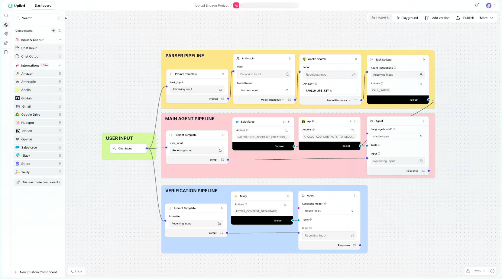

# AppVeyor Deployment Orchestrator (Uplizd) - Automated CI/CD Pipeline Management

## Summary
The AppVeyor Deployment Orchestrator is an intelligent AI workflow designed to streamline software delivery by automating environment management, build triggers, and deployment status tracking. By integrating with the AppVeyor API via the Composio Toolset, this solution provides engineering teams with a single source of truth for release cycles, reducing manual intervention and accelerating pipeline velocity through proactive deployment monitoring.

---

## Demo

**Alt text (SEO-ready):** AppVeyor Deployment Orchestrator workflow for automated CI/CD pipeline management, build status tracking, and deployment automation using Uplizd and Composio.

---

## 🚀 Run on Uplizd

---

## Category
**Primary category:** DevOps automation
**Secondary tags:** ci/cd, appveyor, deployment, pipeline, automation, devops, software delivery, composio
This solution bridges the gap between code commits and production environments by providing an intelligent orchestration layer for AppVeyor-based CI/CD pipelines.

---

## Who is this for?
This solution is designed for technical teams looking to minimize deployment friction and improve release reliability.

*   **DevOps Engineer**
    *   Automates repetitive environment provisioning and deployment verification tasks.
*   **Software Developer**
    *   Triggers builds and monitors deployment status directly through natural language commands.
*   **Release Manager**
    *   Maintains visibility into build health and deployment history across multiple environments.
*   **QA Lead**
    *   Ensures consistent deployment states for testing cycles by automating environment readiness checks.

---

## Features
- **Automated Build Triggering**
  Seamlessly initiate new build processes in AppVeyor based on specific branch commits or manual requests.
- **Real-time Deployment Monitoring**
  Receive instant updates on deployment status, success metrics, and failure logs directly within your chat interface.
- **Environment Management**
  Dynamically coordinate deployment targets and environment variables to ensure consistent release configurations.
- **Intelligent Error Triage**
  Automatically parse build failure logs to identify root causes and suggest remediation steps for the development team.
- **Composio-Powered Integration**
  Leverage secure, authenticated connections to the AppVeyor API to execute complex deployment workflows with high precision.

---

## Use Cases
**Pipeline Automation**
*   Trigger automated builds upon successful merge requests to the main branch.
*   Orchestrate sequential deployments across staging and production environments.

**Release Health Tracking**
*   Query the current status of active deployments to identify stalled or failed pipelines.
*   Summarize build performance metrics for weekly engineering sync meetings.

**Incident Response**
*   Quickly rollback deployments by triggering previous stable build versions via chat.
*   Fetch detailed error logs for failed builds to accelerate debugging and resolution.

---

## Quick Start
### 1) Import the Flow into Uplizd
1. Navigate to the Uplizd dashboard and select "Create New Flow."
2. Import the AppVeyor Deployment Orchestrator template file.
3. Authenticate your AppVeyor account within the Composio connection settings.
4. Ensure nodes are correctly mapped: **Chat Input → Agent → Composio Toolset → Chat Output**.

### 2) Setup the Nodes
*   **Chat Input**: Receives natural language deployment commands or status queries.
*   **Agent**: Processes intent and maps requests to specific AppVeyor API actions.
*   **Composio Toolset**: Executes authenticated calls to the AppVeyor platform.
*   **Chat Output**: Returns human-readable deployment status updates or confirmation messages.

### 3) Run the Flow
Use the Playground to test your deployment orchestration:
*   `"Trigger a new build for the main branch on the production project."`
*   `"What is the current deployment status of the latest build?"`
*   `"List the last 5 failed builds and provide a summary of the error logs."`

---

## Configuration
### 1) Language Model (Agent Node)
The agent acts as the orchestration brain, translating user intent into API-specific actions.
*   Maintain a professional, technical tone focused on deployment accuracy.
*   Prioritize safety by requiring confirmation for production-critical deployments.
*   Always provide clear, concise summaries of build status and error logs.

### 2) Composio Toolset Node
Requires a valid AppVeyor API Key with permissions scoped to your projects. Ensure the connection is authorized for both read (status) and write (trigger/deploy) operations.

### 3) Tool Availability
*   **Build Management**: Trigger, cancel, and restart build processes.
*   **Status Reporting**: Fetch build history, project status, and deployment logs.
*   **Environment Control**: Manage environment variables and deployment settings.

---

## Related Solutions
*   [Workflow Automation Agent](../workflow-automation-agent-by-jobnimbus/README.md) - General purpose automation for business processes.
*   [Admin User Access Auditor](../admin-user-access-auditor-by-storeganise/README.md) - Security-focused auditing for user permissions.
*   [Account Health Usage Monitor](../account-health-usage-monitor-by-jotform/README.md) - Monitoring tools for tracking system and account performance.
