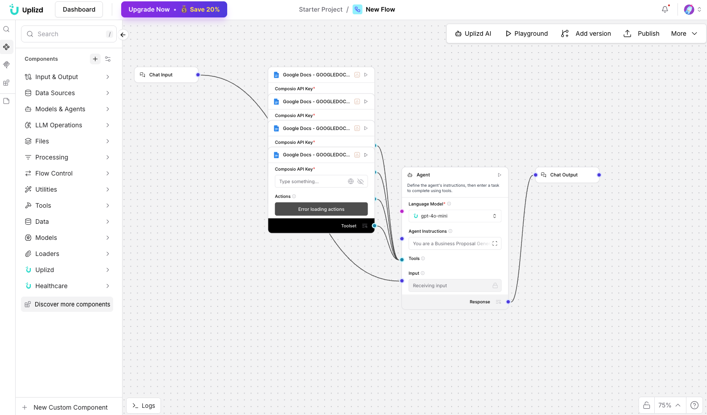

# Business Proposal Generator (Google Docs) - Professional Outreach Automation

## Summary
An Uplizd AI workflow designed to transform client briefs and raw project data into high-impact, professional business proposals. It leverages structured data to populate custom Google Docs templates, ensures brand consistency, and speeds up the sales cycle—moving from initial request to signed agreement in a fraction of the time.

---

## Demo

**Alt text:** Uplizd Business Proposal Generator integrating Google Docs toolsets to automate document creation and professional formatting.

---
## 🚀 Run on Uplizd

---
## Who is this for?
This workflow is built for sales teams and business owners looking to eliminate the friction of proposal drafting:

- **Sales & Business Development Teams**
    - Reduce the time spent drafting repetitive proposals and focus on closing deals.

- **Agencies & Consultants**
    - Scale your high-touch outreach without sacrificing the quality of your pitch documents.

- **Founders & Entrepreneurs**
    - Professionally present your vision and project scopes with minimal administrative overhead.

- **Operations Managers**
    - Standardize the formatting and legal language across all outgoing company agreements.

---

## Features

- **Brief-to-Doc Automation**  
  Automatically interprets client requirement payloads and maps them to professional proposal sections.

- **Dynamic Template Population**  
  Uses `GOOGLE_DOCS_CREATE_DOCUMENT` of Google Docs to generate personalized files based on your core master template.

- **Section-by-Section Customization**  
  Intelligently populates project timelines, pricing tables, and scope-of-work modules through `GOOGLE_DOCS_UPDATE_DOCUMENT`.

- **Standardized Formatting**  
  Ensures every proposal follows company-approved fonts, colors, and layout structures automatically.

- **Centralized Document Filing**  
  Automatically organizes generated proposals into specific client folders for improved team visibility and retrieval.

- **Smart Content Adaptation**  
  Adjusts the tone and complexity of the proposal content based on the industry and project type defined in the input brief.

---

## Use Cases

- **"Zero-Draft" Sales Proposals**
  - Connect your CRM or project intake form to automatically generate a first-draft proposal as soon as a lead is qualified.
  - Automatically include relevant case studies or service tiers based on the client's industry.

- **Rapid Scope Revisions**
  - Quickly update project costs, dates, or deliverables and generate a fresh, updated document in seconds.

- **Standardized Service Agreements**
  - Guarantee that every client receives the correct legal terms and conditions alongside their custom project scope without manual copy-pasting.

---
## Quick Start

### 1) Import the Flow into Uplizd
1. Click the **Run on Uplizd** CTA button above.
2. On Uplizd, click **Try out**.
3. Create a new workspace or open an existing workspace.
4. Ensure all nodes are connected correctly:
   - **Chat Input**
   - **Google Docs - GOOGLE_DOCS_CREATE_DOCUMENT**
   - **Google Docs - GOOGLE_DOCS_GET_DOCUMENT**
   - **Google Docs - GOOGLE_DOCS_UPDATE_DOCUMENT**
   - **Agent**
   - **Chat Output**

### 2) Setup the Nodes
Verify the workflow structure:

- **Chat Input** → receives the project brief or client requirements in plain text or structured format.
- **Agent** → coordinates the document generation process (Brief Analysis -> Template Selection -> Data Mapping -> Document Creation -> Content Updating).
- **Google Docs Toolset** → Provides the underlying engine for document manipulation and cloud storage.
- **Chat Output** → provides a link to the finalized Google Doc and a summary of the project scope.

### 3) Run the Flow
1. Click **Playground** to open Chat Interface.
2. Enter a request such as:
   - `"Generate a proposal for a $10k SEO project with a 3-month timeline using the standard template"`
   - `"Update the pricing table in the Smith & Co proposal to reflect a 15% discount"`
   - `"Draft a scope of work document based on the requirements discussed in our last meeting"`

---

## Configuration

### 1) Language Model (Agent Node)
The **Agent** node is pre-configured with a focus on professional, persuasive business writing and document structure.

Recommended instruction pattern:
- Use a tone that is professional, authoritative, and helpful.
- Ensure all project dates and financial figures are double-checked for consistency.
- Prioritize clear, easy-to-read formatting in the generated document.

### 2) Google Docs Toolset Nodes
Requires your **Composio API Key** and an active connection to your **Google Workspace** or individual **Google Drive** account.

### 3) Tool Availability
The agent can call tools for:
- Creating new documents from templates
- Reading existing document content
- Updating specific text or table sections within a document

---

## Related Solutions

* **[Invoice Processing Agent](../invoice-processing-agent/README.md)**  
  Automate the extraction and routing of invoice data from emails and PDFs.

* **[Compliance Document Processor](../compliance-document-processor/README.md)**  
  Automate multilingual compliance document processing and entity matching.

* **[CRM Data Sync Manager](../crm-data-sync-manager/README.md)**  
  Orchestrate and monitor data flows across your entire enterprise tech stack.

* **[Meeting Room Coordinator](../meeting-room-coordinator/README.md)**  
  Automate office scheduling and resolve meeting room conflicts directly through Slack.
