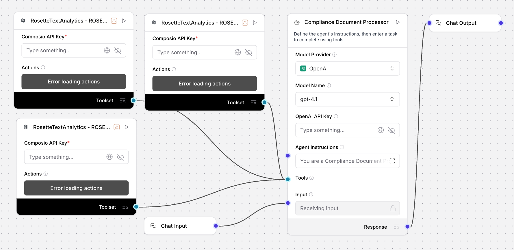

# Compliance Document Processor (Uplizd) - Multilingual RegTech Automation

## Summary
The Compliance Document Processor is an Uplizd AI workflow designed to automate the intake, extraction, and matching of complex regulatory documents. By leveraging advanced text analytics, the workflow identifies document languages, extracts key entities, and performs high-precision fuzzy matching against global sanctions lists, enabling financial and legal teams to meet regulatory standards with 5x the speed of manual review.

---

## Demo

**Alt text (SEO-ready):** Uplizd Compliance Document Processor integrating Rosette Text Analytics toolsets to automate KYC, sanctions screening, and multilingual entity matching.

---

## 🚀 Run on Uplizd

---

## Category

**Primary category**: RegTech automation

**Secondary tags**: compliance, kyc, aml, entity extraction, multilingual, fuzzy matching, risk management, composio

This solution streamlines high-stakes regulatory workflows by automating the ingestion and verification of global identity and corporate documentation.

---

## Who is this for?

This workflow is built for financial institutions, legal departments, and risk management teams handling global regulatory burdens:

- **Compliance Officers & AML Analysts**
    - Scale AML (Anti-Money Laundering) and KYC (Know Your Customer) reviews across thousands of documents and multiple jurisdictions.
- **Legal Operations Teams**
    - Standardize the transcribing and cataloging of regulatory filings and complex corporate documentation.
- **Risk Management Departments**
    - Proactively identify high-risk entities, sanctioned individuals, and exposure in real-time.
- **Multinational Financial Institutions**
    - Effortlessly process cross-border documentation in Mandarin, German, English, and more without local language review overhead.

---

## Features

- **Multilingual Language Identification**
  Automatically detects and processes documents in dozens of languages using integrated text analytics.

- **High-Precision Entity Extraction**
  Captures individual names, corporate entities, addresses, and beneficial ownership information with exceptional accuracy.

- **Fuzzy Name Matching & Alias Detection**
  Uses sophisticated similarity algorithms to identify variations, transliterations, and aliases on global watchlists.

- **Geospatial Address Intelligence**
  Standardizes and matches global addresses to identify geographical risk exposure through automated similarity scoring.

- **Automated Risk Threshold Flagging**
  Instantly isolates any entity match exceeding defined confidence thresholds for immediate investigation by compliance leads.

---

## Use Cases

**Sanctions & Watchlist Screening**
- Batch-process lists of international names and addresses against OFAC or EU sanctions lists with advanced fuzzy logic.
- Eliminate "false negatives" caused by slight spelling variations or phonetic translations.

**Automated Multilingual KYC**
- Process identity and corporate documents from global markets without needing a dedicated multilingual review team for the initial intake phase.
- Extract and verify beneficial ownership data from non-English corporate filings.

**Regulatory Cataloging**
- Automatically tag and archive large volumes of legal filings with extracted entity metadata for sub-second searchability.
- Generate audit-ready reports including match rationale and full processing timestamps.

---

## Quick Start

### 1) Import the Flow into Uplizd
1. Click the **Run on Uplizd** CTA button above.
2. On Uplizd, click **Try out**.
3. Create a new workspace or open an existing workspace.
4. Ensure all nodes are connected correctly: **Chat Input** → **Agent** → **Composio Toolset** → **Chat Output**.

### 2) Setup the Nodes
- **Chat Input** → Receives compliance documents (PDFs, text) or screening lists.
- **Agent** → Coordinates the RegTech workflow (Intake, Extraction, Matching, and Flagging).
- **Composio Toolset** → Provides the specialized analytics engine for multilingual NLP and entity matching.
- **Chat Output** → Provides high-level risk summaries and links to generated compliance reports.

### 3) Run the Flow
1. Click **Playground** to open the Chat Interface.
2. Enter a request such as:
   - `"Screen the attached PDF for any entities appearing on the 2024 Sanctions Watchlist"`
   - `"Identify the language and extract all corporate names from the following document payload"`
   - `"How similar is 'Jon Smith' at '123 Main St' to 'John Smyth' at '123 Main Street'?"`

---

## Configuration

### 1) Language Model (Agent Node)
The **Agent** node is pre-configured with specialized instructions for handling regulatory sensitivity and data accuracy.

Recommended instruction pattern:
- Maintain a strictly professional and thorough tone.
- Prioritize accuracy over speed—ensure all high-risk determinations are flagged for human oversight.
- Provide clear rationale for every similarity score above 70%.

### 2) Composio Toolset Node
Requires your **Composio API Key** and a synchronized connection to your **Rosette Text Analytics** instance.

### 3) Tool Availability
- Statistical language detection
- Named Entity Recognition (NER)
- Fuzzy name and address similarity scoring

---

## Related Solutions

- [CRM Data Sync Agent](../crm-data-sync-agent/README.md) — Synchronize and resolve data conflicts across your enterprise CRM platforms.
- [CRM Data Hygiene Manager](../crm-data-hygiene-manager/README.md) — Automate data decay cleanup and formatting for cleaner pipeline records.
- [Deal Pipeline Manager](../deal-pipeline-manager/README.md) — Manage deal stages and automate follow-ups for stalled sales opportunities.
