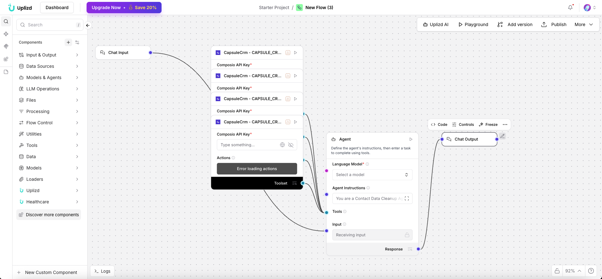

# Contact Data Cleanup Agent (Uplizd) - Human-Centric Contact Data Optimization

## Summary
A Uplizd AI workflow specifically engineered to clean, standardize, and enrich individual contact records within your CRM. It focuses on the "human" side of data, such as names, titles, social profiles, and interpersonal relationships.

---

## Demo

**Alt text (SEO-ready):** Uplizd Contact Data Cleanup Agent identifying and fixing errors in individual CRM contact profiles for better relationship management.

---
## 🚀 Run on Uplizd

---
## Who is this for?
This workflow is perfect for teams whose success depends on personal relationships and accurate contact intelligence:

- Sales Representatives (SDRs/BDRs)
    - Ensure you have the correct names, titles, and LinkedIn profiles before starting outreach.

- Account Managers
    - Keep your internal stakeholder lists accurate and up-to-date with proper job transitions.

- Executive Assistants
    - Automate the cleanup of contact records collected from business cards, events, and networking.

- Recruiting & Talent Teams
    - Standardize candidate contact info and social links for efficient communication.

---

## Features

- **Personal Information Standardization**  
  Fixes capitalization in names (e.g., "JOHN DOE" to "John Doe"), standardizes titles, and cleans up salutations.

- **Social Profile Enrichment**  
  Automatically finds and appends LinkedIn, Twitter, and other professional social profiles to the contact record.

- **Email & Phone Verification**  
  Performs real-time checks to ensure contact methods are valid and currently active.

- **Duplicate Contact Detection**  
  Identifies potential duplicate contacts based on name, email, and social profile similarity for manual or auto-merging.

- **Relationship Mapping**  
  Infers relationships between contacts (e.g., "Reporting to", "Team Member") based on company and title data.

---

## Use Cases

- **Post-Event Lead Scrubbing**
  - Quickly process a CSV of 500 contacts from a trade show and fix all formatting errors.
  - Automatically add LinkedIn profile URLs to every valid contact in the list.

- **Contact Database Audit**
  - Identify contacts with generic "info@" or "support@" emails that should be replaced with personal ones.
  - Standardize "Job Titles" (e.g., "VP Marketing" vs "Vice President of Marketing").

- **Relationship Intelligence**
  - Automatically link new contacts to their correct company (Account) record based on email domain.
  - Flag when a key contact's title suggests they may have been promoted or changed roles.

---
## Quick Start

### 1) Import the Flow into Uplizd
1. Click the **Run on Uplizd** CTA button above.
2. On Uplizd, click **Try out**.
3. Create a new workspace or open an existing workspace.
5. Ensure all nodes are connected correctly:
   - **Chat Input**
   - **Composio Toolset**
   - **Agent**
   - **Chat Output**

### 2) Setup the Nodes
Verify the workflow structure:

- **Chat Input** → receives contact data or a cleanup request.
- **Agent** → applies human-centric cleaning and enrichment rules.
- **Composio Toolset** → provides tools for contact management and social data enrichment.
- **Chat Output** → summary of contact records improved and enriched.

### 3) Run the Flow
1. Click **Playground** to open Chat Interface.
2. Enter a request such as:
   - `"Clean up this list of 50 contacts and find their LinkedIn profiles"`
   - `"Check if these phone numbers are still valid for these contacts"`
   - `"Standardize all titles in the 'Product' department"`

---

## Configuration

### 1) Language Model (Agent Node)
The **Agent** node is focused on personal data accuracy and social intelligence.

Recommended instruction pattern:
- Be empathetic to human naming and title variations
- Prioritize high-confidence social profile matches
- Always maintain privacy and data protection standards

### 2) Composio Toolset Node
Requires your **Composio API Key** and a connection to your CRM (e.g., Capsule CRM, Salesforce) and enrichment tools.

### 3) Tool Availability
The agent can call tools for:
- Contact record creation and update
- Social profile lookup
- Email and phone validation
- De-duplication logic

---

## Related Solutions

* **[CRM Data Hygiene Manager](../crm-data-hygiene-manager/README.md)**  
  Continuous maintenance to ensure your CRM stays clean, organized, and free of data rot.

* **[CRM Data Sync Manager](../crm-data-sync-manager/README.md)**  
  Orchestrate and monitor data flows across your entire enterprise tech stack.

* **[Deal Pipeline Manager](../deal-pipeline-manager/README.md)**  
  Automatically update deal progress and create follow-up tasks for your sales team.

* **[CRM Address Data Cleanup Agent](../crm-address-data-cleanup-agent/README.md)**  
  Specialized verification and standardization of physical address and location data.
