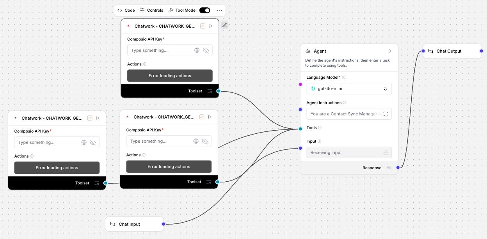

# Contact Sync Manager (Chatwork) - Synchronize Team Data & Membership

## Summary
An Uplizd AI workflow designed to maintain accurate team contact information across Chatwork platforms. It baseline team membership, monitors participation across all rooms, and identifies team composition changes to ensure your directory is always up-to-date.

---

## Demo

**Alt text:** Uplizd Contact Sync Manager integrating Chatwork toolsets to automate team contact synchronization and membership reporting.

---
## 🚀 Run on Uplizd

---
## Who is this for?
This workflow is built for organizations using Chatwork who need to maintain an accurate, real-time understanding of their team structure:

- **Team Administrators**
    - Maintain an accurate baseline of team membership without manual auditing.

- **Operations Managers**
    - Identify role changes and project associations based on room participation patterns.

- **HR & People Ops**
    - Track team growth, reductions, and internal moves across various project channels.

- **IT Administrators**
    - Quickly identify orphaned accounts or missing team members in critical project rooms.

---

## Features

- **Baseline Membership Sync**  
  Retrieves the current contact list from Chatwork to establish a foundation for team tracking.

- **Room Involvement Monitoring**  
  Identifies all active team spaces and project channels to ensure no communication silo is missed.

- **Membership Analysis**  
  Cross-references memberships across multiple rooms to provide a holistic view of each team member's involvement.

- **Automated Change Detection**  
  Intelligently identifies new joiners, departed members, and changes in room participation since the last sync.

- **Internal Database Updates**  
  Maintains an internal record of member info, inferred roles, and project associations based on room data.

- **Comprehensive Reporting**  
  Generates structured reports detailing additions, departures, and overall team composition statistics.

---

## Use Cases

- **Verify Team Directory Accuracy**
  - Compare your current directory against active room memberships to find discrepancies.
  - Automatically flag departed members for removal.

- **Monitor Project Onboarding**
  - Ensure new hires have been added to all relevant rooms for their assigned projects.
  - Identify members who may be over-extended across too many channels.

- **Team Evolution Tracking**
  - Generate weekly or monthly reports on team growth and role transitions.
  - Understand how team dynamics change as projects evolve.

---
## Quick Start

### 1) Import the Flow into Uplizd
1. Click the **Run on Uplizd** CTA button above.
2. On Uplizd, click **Try out**.
3. Create a new workspace or open an existing workspace.
4. Ensure all nodes are connected correctly:
   - **Chat Input**
   - **Chatwork - CHATWORK_GET_CHATWORK_CONTACTS**
   - **Chatwork - CHATWORK_GET_ROOMS**
   - **Chatwork - CHATWORK_GET_ROOM_MEMBERS**
   - **Agent**
   - **Chat Output**

### 2) Setup the Nodes
Verify the workflow structure:

- **Chat Input** → receives commands for synchronization or reporting.
- **Agent** → interprets room and membership data to identify changes and infer roles.
- **Chatwork Toolset** → provides the primary API calls for contact and room data retrieval.
- **Chat Output** → displays the final sync report and identified changes.

### 3) Run the Flow
1. Click **Playground** to open Chat Interface.
2. Enter a request such as:
   - `"Sync contacts and show me any new members"`
   - `"who has left the team since the last check?"`
   - `"Generate a report on team participation across all rooms"`

---

## Configuration

### 1) Language Model (Agent Node)
The **Agent** node is configured to act as an organizational directory assistant focusing on team structure and membership patterns.

Recommended instruction pattern:
- Prioritize accuracy by cross-referencing multiple data points.
- Focus on actionable changes (joiners/leavers).
- Maintain clear, professional reporting standards.

### 2) Chatwork Toolset Nodes
Requires your **Composio API Key** and an active connection to your **Chatwork** account.

### 3) Tool Availability
The agent can call tools for:
- Contact retrieval
- Room discovery
- Membership verification per room

---

## Related Solutions

* **[CRM Data Sync Manager](../crm-data-sync-manager/README.md)**  
  Orchestrate and monitor data flows across your entire enterprise tech stack.

* **[Deal Pipeline Manager](../deal-pipeline-manager/README.md)**  
  Automatically update deal progress and create follow-up tasks for your sales team.

* **[Contact Sync Manager](../contact-sync-manager/README.md)**  
  Maintain accurate team contact information and track membership changes across Chatwork.

* **[CRM Address Data Cleanup Agent](../crm-address-data-cleanup-agent/README.md)**  
  Specialized verification and standardization of physical address and location data.
