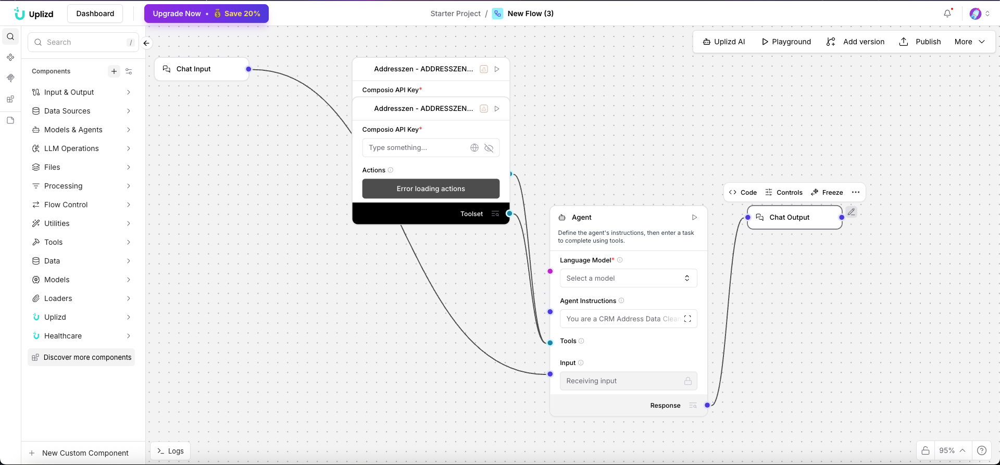

# CRM Address Data Cleanup Agent (Uplizd) - Precise Geolocation & Address Validation

## Summary
A Uplizd AI workflow specialized in the verification, standardization, and enrichment of physical address data within your CRM, ensuring accurate shipping, billing, and territory mapping.

---

## Demo

**Alt text (SEO-ready):** Uplizd CRM Address Data Cleanup Agent integrating geolocation tools to validate and standardize CRM address information.

---
## 🚀 Run on Uplizd

---
## Who is this for?
This workflow is essential for businesses where physical location data is critical for operations, logistics, or targeted marketing:

- Logistics & Operations Managers
    - Ensure delivery addresses are valid and formatted correctly to prevent shipping delays and returns.

- Sales & Marketing Operations (RevOps)
    - Map leads and accounts to the correct territories based on precise geographic data.

- E-commerce Managers
    - Automatically clean up customer addresses during the checkout or post-purchase sync process.

- Data Quality Specialists
    - Standardize global address formats across a multilingual and multi-regional database.

---

## Features

- **Global Address Standardization**  
  Converts inconsistent address strings into structured formats (Street, Suite, City, State, ZIP) according to local country standards.

- **Real-time Address Validation**  
  Pings address verification services (like Addresszen or Google Maps) to confirm if an address actually exists.

- **Geolocation Enrichment**  
  Adds Latitude/Longitude coordinates and standardized Placekeys to CRM records for advanced mapping.

- **Smart Formatting Correction**  
  Automatically fixes common issues like missing ZIP codes, abbreviated city names, or misspelled street types.

- **Territory Mapping Intelligence**  
  Assigns records to internal sales or service territories based on the cleaned geographic data.

---

## Use Cases

- **Verify Shipping Accuracy**
  - Scan all new orders and flag any with "Invalid Address" according to postal service records.
  - Automatically append missing "Apartment/Suite" numbers based on address patterns.

- **Clean Geograhic Sales Territories**
  - Standardize all "State" fields to 2-letter codes (e.g., "California" to "CA") for consistent territory reporting.
  - Fix misspelled city names (e.g., "New York City" vs "NYC" vs "New York").

- **Enhanced Customer Mapping**
  - Use enriched Lat/Long data to visualize customer density on a map.
  - Identify customers located within a specific radius of a physical store or event venue.

---
## Quick Start

### 1) Import the Flow into Uplizd
1. Click the **Run on Uplizd** CTA button above.
2. On Uplizd, click **Try out**.
3. Create a new workspace or open an existing workspace.
5. Ensure all nodes are connected correctly:
   - **Chat Input**
   - **Composio Toolset**
   - **Agent**
   - **Chat Output**

### 2) Setup the Nodes
Verify the workflow structure:

- **Chat Input** → receives address data or a request to audit a specific list.
- **Agent** → interprets the address strings and applies validation rules.
- **Composio Toolset** → provides tools for address verification and geolocation services.
- **Chat Output** → summary of validated, formatted, and enriched addresses.

### 3) Run the Flow
1. Click **Playground** to open Chat Interface.
2. Enter a request such as:
   - `"Clean and verify these 10 customer addresses"`
   - `"Standardize the 'State' field for all accounts in the US"`
   - `"Append Latitude and Longitude to all company records in [City]"`

---

## Configuration

### 1) Language Model (Agent Node)
The **Agent** node is specialized in geographical data parsing and verification.

Recommended instruction pattern:
- Adhere strictly to international postal standards
- Be precise with field mappings (Street vs City vs ZIP)
- Flag any addresses that are "Ambiguous" or require manual review

### 2) Composio Toolset Node
Requires your **Composio API Key** and a connection to address verification APIs (e.g., Addresszen, Google Maps).

### 3) Tool Availability
The agent can call tools for:
- Address verification (CASS processing)
- Geocoding and reverse geocoding
- ZIP code lookup and validation
- Territory assignment based on location

---

## Related Solutions

* **[CRM Data Hygiene Manager](../crm-data-hygiene-manager/README.md)**  
  Continuous maintenance to ensure your CRM stays clean, organized, and free of data rot.

* **[CRM Data Sync Manager](../crm-data-sync-manager/README.md)**  
  Orchestrate and monitor data flows across your entire enterprise tech stack.

* **[Deal Pipeline Manager](../deal-pipeline-manager/README.md)**  
  Automatically update deal progress and create follow-up tasks for your sales team.

* **[CRM Address Data Cleanup Agent](../crm-address-data-cleanup-agent/README.md)**  
  Specialized verification and standardization of physical address and location data.