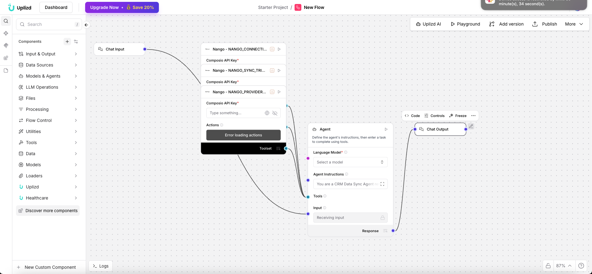

# CRM Data Sync Agent (Uplizd) - Seamless Cross-Platform Data Synchronization

## Summary
A Uplizd AI workflow that ensures your CRM data is perfectly synchronized across multiple platforms, preventing data silos and maintaining a single source of truth for your customer records.

---

## Demo

**Alt text (SEO-ready):** Uplizd CRM Data Sync Agent integrating multiple CRM and marketing tools to maintain real-time data synchronization.

---
## 🚀 Run on Uplizd

---
## Category

- **Primary:** CRM & cross-platform data integration
- **Tags:** `data sync`, `crm`, `integration`, `etl`, `revops`, `salesforce`, `hubspot`, `composio`, `nango`, `uplizd`, `single source of truth`, `data governance`
- Synchronizes customer records across tools so sales, marketing, and support share one consistent dataset.

---
## Who is this for?
This workflow is essential for organizations using a diverse tech stack that need their customer data to be consistent everywhere:

- RevOps & Sales Operations
    - Ensure your sales, marketing, and success tools are always looking at the same customer data.

- CRM Administrators
    - Eliminate manual data export/import tasks and reduce the risk of synchronization errors.

- IT & Data Managers
    - Governance of data flow between enterprise applications with AI-driven conflict resolution.

- Customer Success Managers
    - Have confidence that the customer info in your support tool matches what's in the CRM.

---

## Features

- **Multi-Platform Sync Synchronization**  
  Bidirectional or unidirectional sync between CRM, Marketing Automation, Support, and Billing tools.

- **AI Conflict Resolution**  
  Intelligent agent decides which record version is the "latest" or "most accurate" in case of mismatched data.

- **Automated Mapping & Transformation**  
  Automatically maps fields between different schemas (e.g., "Company Name" in Tool A to "Organization" in Tool B).

- **Real-time Event Triggers**  
  Sync is triggered instantly when a record is created or updated in any connected platform.

- **Sync Audit Logging**  
  Maintains a clear trail of what data was moved, when, and where, for compliance and troubleshooting.

---

## Use Cases

- **Sales & Marketing Alignment**
  - Sync new HubSpot leads to Salesforce contacts instantly.
  - Keep email subscription status consistent across Mailchimp and Pipedrive.

- **Billing & CRM Integration**
  - Automatically update "Customer Status" in the CRM when a Stripe payment is successful.
  - Sync billing addresses from QuickBooks to the CRM company record.

- **Cross-Regional Sync**
  - Merge data from multiple regional CRM instances into a single global reporting dashboard.
  - Standardize formats during sync (e.g., converting all currencies to USD).

---
## Quick Start

### 1) Import the Flow into Uplizd
1. Click the **Run on Uplizd** CTA button above.
2. On Uplizd, click **Try out**.
3. Create a new workspace or open an existing workspace.
4. Ensure all nodes are connected correctly:
   - **Chat Input**
   - **Composio Toolset**
   - **Agent**
   - **Chat Output**

### 2) Setup the Nodes
Verify the workflow structure:

- **Chat Input** → sends sync requests or configuration changes.
- **Agent** → manages the sync logic, mapping, and conflict resolution.
- **Composio Toolset** → provides the Nango-powered connectors to various APIs.
- **Chat Output** → displays sync status and summary of records processed.

### 3) Run the Flow
1. Click **Playground** to open Chat Interface.
2. Enter a request such as:
   - `"Sync all new contacts from [Tool A] to [Tool B]"`
   - `"Verify if the [Client Name] record is consistent across all platforms"`
   - `"Set up a sync trigger for new deals in Salesforce"`

---

## Configuration

### 1) Language Model (Agent Node)
The **Agent** node is the "brains" behind the data mapping and synchronization logic.

Recommended instruction pattern:
- Enforce data consistency rules
- Resolve conflicts in favor of the primary CRM
- Log all significant data transformations

### 2) Composio Toolset Node
Requires your **Composio API Key** and authorization for the specific apps you wish to sync via Nango.

### 3) Tool Availability
The agent can call tools for:
- Platform-to-platform data transfers
- Record lookup and comparison
- Field mapping configuration
- Sync triggering and scheduling

---

## Related Solutions

* **[CRM Data Hygiene Manager](../crm-data-hygiene-manager/README.md)**  
  Continuous maintenance to ensure your CRM stays clean, organized, and free of data rot.

* **[CRM Data Sync Manager](../crm-data-sync-manager/README.md)**  
  Orchestrate and monitor data flows across your entire enterprise tech stack.

* **[Deal Pipeline Manager](../deal-pipeline-manager/README.md)**  
  Automatically update deal progress and create follow-up tasks for your sales team.

* **[CRM Address Data Cleanup Agent](../crm-address-data-cleanup-agent/README.md)**  
  Specialized verification and standardization of physical address and location data.
