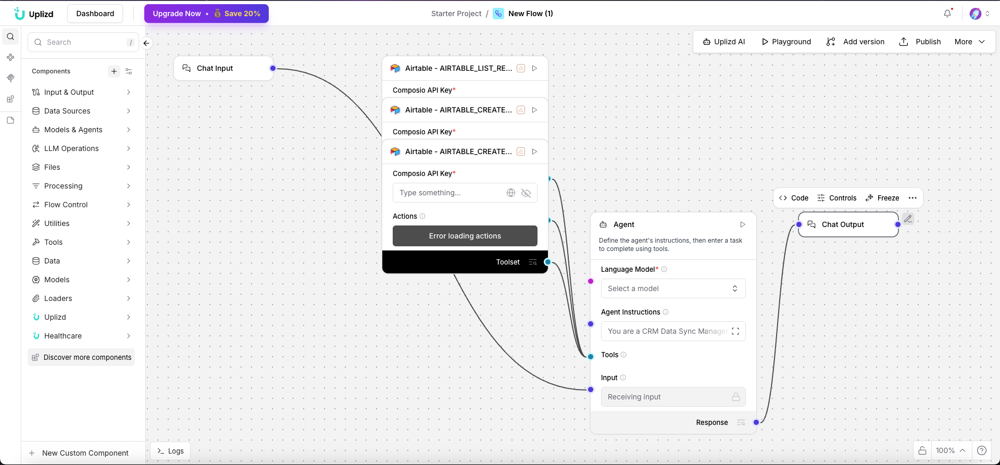

# CRM Data Sync Manager (Uplizd) - Orchestrate Your Data Ecosystem

## Summary
A Uplizd AI workflow designed for the high-level management and oversight of all data synchronization processes across your enterprise. It ensures that your CRM remains the central, accurate hub for all customer-related information flowing between your various business tools.

---

## Demo

**Alt text (SEO-ready):** Uplizd CRM Data Sync Manager coordinating real-time data flows between CRM, ERP, and marketing automation systems.

---
## 🚀 Run on Uplizd

---
## Who is this for?
This workflow is built for operations leaders and technical administrators who need to manage complex, multi-tool data ecosystems:

- RevOps & Sales Operations Leaders
    - Maintain a unified view of data flow and health across the entire revenue stack.

- IT Architects & Data Engineers
    - Orchestrate complex data mappings and transformations between diverse system schemas.

- CRM Administrators
    - Monitor and troubleshoot sync errors and data conflicts across all connected applications.

- Digital Transformation Leads
    - Ensure new tools are integrated seamlessly into the existing data ecosystem without creating silos.

---

## Features

- **Enterprise-Wide Sync Orchestration**  
  Manage and monitor data flows between CRM, Marketing (HubSpot/Marketo), Finance (QuickBooks/NetSuite), and Support (Zendesk) tools.

- **Centralized Data Mapping Governance**  
  Define and enforce global data mapping rules to ensure field consistency across all platforms.

- **Proactive Sync Conflict Resolution**  
  Intelligently resolves data mismatches between systems based on predefined "System of Record" hierarchies.

- **Real-time Sync Health Monitoring**  
  Tracks the volume and success rate of data transfers, with instant alerting for any sync failures or bottlenecks.

- **Audit & Compliance Management**  
  Maintains detailed logs of all data movements for security auditing and regulatory compliance (GDPR/CCPA).

---

## Use Cases

- **Global Lead Routing Synchronization**
  - Orchestrate the flow of leads from multiple web properties and marketing tools into the central CRM.
  - Automatically update the lead status in all connected tools when a sales rep takes action.

- **Unified Customer 360 Sync**
  - Sync customer purchase history from the ERP and support ticket status from Zendesk into the CRM contact record.
  - Ensure the "Customer Health Score" is updated across all CS tools based on real-time data sync.

- **Cross-Platform User Lifecycle Management**
  - Automatically provision or update user access in secondary tools when a record is changed in the primary CRM.
  - Sync "Opt-out" and "Privacy" preferences instantly across the entire marketing and sales stack.

---
## Quick Start

### 1) Import the Flow into Uplizd
1. Click the **Run on Uplizd** CTA button above.
2. On Uplizd, click **Try out**.
3. Create a new workspace or open an existing workspace.
5. Ensure all nodes are connected correctly:
   - **Chat Input**
   - **Composio Toolset**
   - **Agent**
   - **Chat Output**

### 2) Setup the Nodes
Verify the workflow structure:

- **Chat Input** → receives orchestration commands or sync status requests.
- **Agent** → manages the complex logic of multi-tool synchronization and conflict resolution.
- **Composio Toolset** → provides the connectors (powered by Nango/Airtable) to all integrated platforms.
- **Chat Output** → summary of sync orchestration activity and system health status.

### 3) Run the Flow
1. Click **Playground** to open Chat Interface.
2. Enter a request such as:
   - `"Verify if the [Segment] is correctly synced across Salesforce and HubSpot"`
   - `"Show me a summary of all sync conflicts resolved today"`
   - `"Pause the billing data sync until the system maintenance is complete"`

---

## Configuration

### 1) Language Model (Agent Node)
The **Agent** node is tuned for enterprise data management and system orchestration.

Recommended instruction pattern:
- Prioritize data integrity and the "System of Record" rules
- Maintain a focus on high-level system overview
- Provide clear, technical summaries of any sync-related issues

### 2) Composio Toolset Node
Requires your **Composio API Key** and authorization for all the enterprise tools you wish to orchestrate.

### 3) Tool Availability
The agent can call tools for:
- Multi-platform data synchronization
- Sync status and health checks
- Field mapping and rule configuration
- Conflict identification and resolution

---

## Related Solutions

* **[CRM Data Hygiene Manager](../crm-data-hygiene-manager/README.md)**  
  Continuous maintenance to ensure your CRM stays clean, organized, and free of data rot.

* **[CRM Data Sync Manager](../crm-data-sync-manager/README.md)**  
  Orchestrate and monitor data flows across your entire enterprise tech stack.

* **[Deal Pipeline Manager](../deal-pipeline-manager/README.md)**  
  Automatically update deal progress and create follow-up tasks for your sales team.

* **[CRM Address Data Cleanup Agent](../crm-address-data-cleanup-agent/README.md)**  
  Specialized verification and standardization of physical address and location data.
