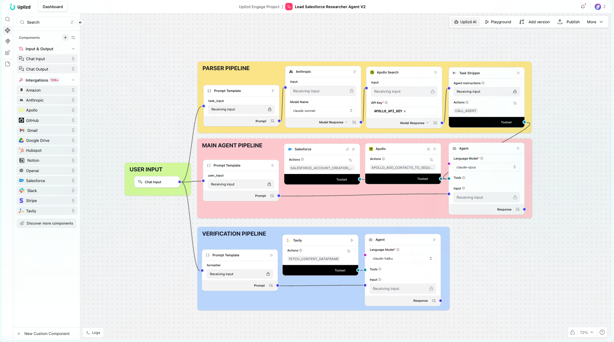

# CRM Email Data Quality Monitor (Uplizd) - Safeguard Your Email Deliverability

## Summary
A Uplizd AI workflow that continuously monitors the quality and validity of email addresses in your CRM, protecting your sender reputation and ensuring high engagement rates for your marketing and sales outreach.

---

## Demo

**Alt text (SEO-ready):** Uplizd CRM Email Data Quality Monitor verifying email addresses in real-time to maintain high deliverability and engagement.

---
## 🚀 Run on Uplizd

---
## Who is this for?
This workflow is a must-have for teams that rely on email communication as their primary channel for growth and customer success:

- Email Marketing Managers
    - Keep your bounce rates low and your deliverability high by cleaning lists before every major broadcast.

- Sales Operations (SalesOps)
    - Ensure your sales reps are never sending emails to invalid or "risky" addresses.

- Growth Engineers
    - Automate the validation of new emails collected via sign-ups, webinars, and lead magnets.

- Customer Success Managers
    - Maintain accurate contact methods for your critical account stakeholders to ensure proactive communication.

---

## Features

- **Real-time Email Verification**  
  Checks for syntax errors, domain validity, and MX record presence for every email address.

- **Non-Deliverable Detection**  
  Flags "Hard Bounce" candidates and disposable/temporary email addresses for removal.

- **Catch-all & Role-based Flagging**  
  Identifies "info@", "sales@", and catch-all domains that often lead to lower engagement and higher spam risk.

- **Automated Bounce Prevention**  
  Integrates with your CRM to automatically unsubscribe or flag invalid emails before they are picked up by your mailer.

- **Deliverability Health Dashboard**  
  Provides a high-level view of your CRM's email health, including percentages of valid, risky, and invalid addresses.

---

## Use Cases

- **Pre-Campaign Scrubbing**
  - Run a quick scan on a marketing segment of 10,000 leads and remove all invalid entries before sending.
  - Identify and fix minor typos in common domains (e.g., "@gnail.com" to "@gmail.com").

- **Inbound Lead Validation**
  - Instantly verify the email of every person who downloads a whitepaper or registers for a trial.
  - Block or flag temporary email services (e.g., Mailinator, Yopmail) at the point of ingestion.

- **Historical Database Cleanup**
  - Perform a monthly scan of the entire CRM to identify emails that have become invalid over time (e.g., person left the company).
  - Clean up legacy lists that haven't been emailed in over 6 months to prevent spam traps.

---
## Quick Start

### 1) Import the Flow into Uplizd
1. Click the **Run on Uplizd** CTA button above.
2. On Uplizd, click **Try out**.
3. Create a new workspace or open an existing workspace.
5. Ensure all nodes are connected correctly:
   - **Chat Input**
   - **Composio Toolset**
   - **Agent**
   - **Chat Output**

### 2) Setup the Nodes
Verify the workflow structure:

- **Chat Input** → receives email data or a scan request for a specific CRM list.
- **Agent** → manages the validation logic and interprets verification results.
- **Composio Toolset** → provides tools for email verification services and CRM updates.
- **Chat Output** → summary of email quality metrics and records flagged.

### 3) Run the Flow
1. Click **Playground** to open Chat Interface.
2. Enter a request such as:
   - `"Verify this list of 100 emails and flag any and all 'risky' addresses"`
   - `"How many invalid emails are currently in the 'Unqualified Leads' view?"`
   - `"Scrub the 'Monthly Newsletter' segment for potential bounces"`

---

## Configuration

### 1) Language Model (Agent Node)
The **Agent** node is tuned for deliverability standards and technical email validation.

Recommended instruction pattern:
- Prioritize sender reputation and deliverability
- Be aggressive in flagging known "risky" patterns (e.g., disposables, catch-alls)
- Provide clear explanations for why an email is flagged as "Invalid" or "Risky"

### 2) Composio Toolset Node
Requires your **Composio API Key** and a connection to email verification APIs and your CRM.

### 3) Tool Availability
The agent can call tools for:
- Real-time email SMTP verification
- Domain and MX record lookup
- Bulk CRM record updates (flagging/unsubscribing)
- Deliverability reporting and analytics

---

## Related Solutions

* **[CRM Data Hygiene Manager](../crm-data-hygiene-manager/README.md)**  
  Continuous maintenance to ensure your CRM stays clean, organized, and free of data rot.

* **[CRM Data Sync Manager](../crm-data-sync-manager/README.md)**  
  Orchestrate and monitor data flows across your entire enterprise tech stack.

* **[Deal Pipeline Manager](../deal-pipeline-manager/README.md)**  
  Automatically update deal progress and create follow-up tasks for your sales team.

* **[CRM Address Data Cleanup Agent](../crm-address-data-cleanup-agent/README.md)**  
  Specialized verification and standardization of physical address and location data.