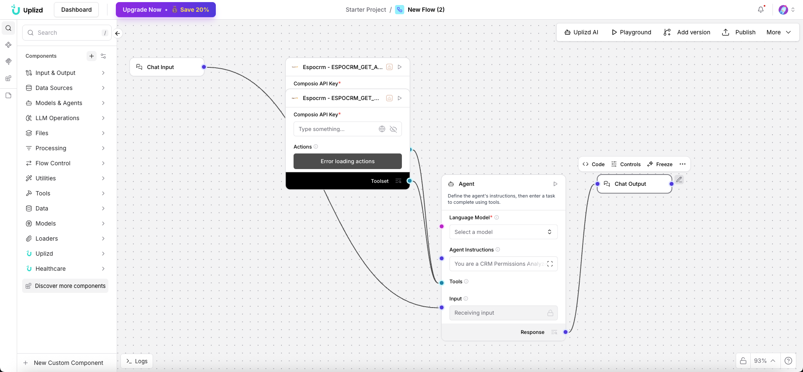

# CRM Permissions Analyzer (Uplizd) - Secure & Audit Your CRM Access

## Summary
A Uplizd AI workflow that systematically audits and analyzes user permissions within your CRM to identify security risks, over-privileged accounts, and compliance gaps.

---

## Demo

**Alt text (SEO-ready):** Uplizd CRM Permissions Analyzer scanning user roles and permissions to ensure secure access and compliance within the CRM system.

---
## 🚀 Run on Uplizd

---
## Who is this for?
This workflow is critical for IT administrators and security officers who need to maintain a secure and compliant CRM environment:

- CRM Administrators
    - Easily audit which users have access to sensitive data and critical system settings.

- Security & Compliance Officers
    - Ensure the "Principle of Least Privilege" is enforced across the entire organization.

- IT Auditors
    - Quickly generate permission reports for internal or external compliance audits (SOC2, GDPR).

- Operations Managers
    - Verify that team members have the correct level of access required for their specific roles.

---

## Features

- **Automated Permission Auditing**  
  Scans all user accounts, roles, and permission sets to identify potential security vulnerabilities.

- **Over-Privilege Detection**  
  Flags users with administrative rights or access to sensitive data that they don't regularly use.

- **Role Consistency Check**  
  Compares permissions across users in the same role to identify anomalies and missing restrictions.

- **Compliance Gap Analysis**  
  Maps current CRM permissions against industry standards and organizational security policies.

- **Interactive Permission Reports**  
  Generates detailed, easy-to-read summaries of access levels and recommended security hardening steps.

---

## Use Cases

- **Quarterly Security Review**
  - Run a full audit of all "Export" and "Delete" permissions to prevent data exfiltration.
  - Identify and deactivate accounts for former employees or idle contractors.

- **Enforce Least Privilege**
  - Identify non-admin users who have "Modify All Data" or "Manage Users" permissions.
  - Recommend more restrictive roles for team members with excessive access.

- **New Feature Rollout Audit**
  - Verify that permissions for a newly implemented CRM module are correctly configured before going live.
  - Audit access to new custom objects containing sensitive financial or PII data.

---

## Quick Start

### 1) Import the Flow into Uplizd
1. Click the **Run on Uplizd** CTA button above.
2. On Uplizd, click **Try out**.
3. Create a new workspace or open an existing workspace.
5. Ensure all nodes are connected correctly:
   - **Chat Input**
   - **Composio Toolset**
   - **Agent**
   - **Chat Output**

### 2) Setup the Nodes
Verify the workflow structure:

- **Chat Input** → receives audit requests or security policy definitions.
- **Agent** → analyzes the permission data and flags security violations.
- **Composio Toolset** → provides tools for user and role management within the CRM.
- **Chat Output** → displays the findings and recommended actions.

### 3) Run the Flow
1. Click **Playground** to open Chat Interface.
2. Enter a request such as:
   - `"Who has permission to export all CRM data?"`
   - `"Identify any users with admin rights who haven't logged in for 30 days"`
   - `"Audit the 'Sales Rep' role for any excessive permissions"`

---

## Configuration

### 1) Language Model (Agent Node)
The **Agent** node is specialized in security auditing and policy enforcement.

Recommended instruction pattern:
- Prioritize data security and privacy
- Identify risks based on the "Principle of Least Privilege"
- Provide clear, actionable remediation steps for every risk found

### 2) Composio Toolset Node
Requires your **Composio API Key** and administrative access to your CRM (e.g., Salesforce, EspoCRM).

### 3) Tool Availability
The agent can call tools for:
- User role and profile retrieval
- Permission set analysis
- Login history auditing
- Security policy comparison

---

## Related Solutions

* **[CRM Data Hygiene Manager](../crm-data-hygiene-manager/README.md)**  
  Continuous maintenance to ensure your CRM stays clean, organized, and free of data rot.

* **[CRM Data Sync Manager](../crm-data-sync-manager/README.md)**  
  Orchestrate and monitor data flows across your entire enterprise tech stack.

* **[Deal Pipeline Manager](../deal-pipeline-manager/README.md)**  
  Automatically update deal progress and create follow-up tasks for your sales team.

* **[CRM Address Data Cleanup Agent](../crm-address-data-cleanup-agent/README.md)**  
  Specialized verification and standardization of physical address and location data.
