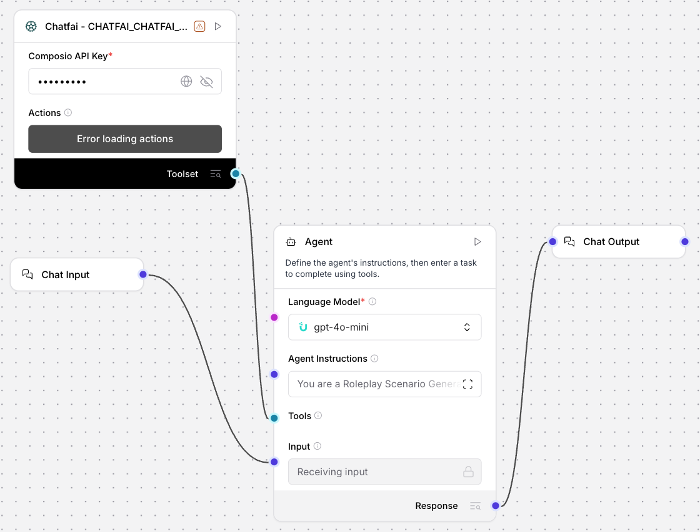

# Daily Standup Bot (ChatFAI) - Create Immersive AI Narratives

## Summary
An Uplizd AI workflow designed for game masters, facilitators, and writers to generate immersive, character-accurate roleplay scenarios. By leveraging ChatFAI character data, it creates narrative-consistent situations, plot hooks, and interaction guidelines that stay true to individual character personalities and motivations.

---

## Demo

**Alt text:** Uplizd Daily Standup Bot integrating ChatFAI toolsets to automate character research and scenario generation.

---
## 🚀 Run on Uplizd

---
## Who is this for?
This workflow is built for creative professionals and hobbyists looking to enhance their roleplay and storytelling sessions:

- **Game Masters & Facilitators**
    - Quickly bootstrap deep, character-driven sessions without hours of manual preparation.

- **Creative Writers & Narrative Designers**
    - Explore character dynamics, conflicts, and plot possibilities using Al-driven character research.

- **Roleplay Communities & Servers**
    - Standardize the quality of starter scenarios for new members and ongoing campaigns.

- **Content Creators**
    - Generate unique interactions and story prompts for audiences and interactive streaming.

---

## Features

- **Deep Character Research**  
  Uses the ChatFAI toolset to retrieve comprehensive personality profiles, backgrounds, and traits for any selected character.

- **Dynamic Interaction Analysis**  
  Analyzes character data to identify potential conflicts, shared interests, and shared motivations that drive interesting gameplay.

- **Immersive Setting Generation**  
  Creates detailed settings and initial conflicts tailored specifically to the characters involved in the session.

- **Structured Plot Hooks**  
  Generates multiple narrative directions and character-specific goals to ensure the story never stalls.

- **Dialogue & Mannerism Guidelines**  
  Provides sample opening dialogue and key behavioral patterns to help facilitators maintain character voice.

- **Comprehensive Facilitation Support**  
  Offers tips for resolving conflicts and maintaining consistency, ensuring an authentic experience for all participants.

---

## Use Cases

- **Campaign Kickstart**
  - Generate a complex starting situation for a group of established characters in a new setting.
  - Automatically provide GMs with character-specific motivations for the first encounter.

- **One-Shot Session Planning**
  - Quickly produce a self-contained roleplay scenario for temporary events or training exercises.
  - Ensure even obscure characters are played with narrative accuracy.

- **Narrative Conflict Resolution**
  - Use the agent to analyze why two characters might clash and generate plot-driven ways to resolve or escalate the tension.
  - Maintain historical consistency during long-running campaigns.

---
## Quick Start

### 1) Import the Flow into Uplizd
1. Click the **Run on Uplizd** CTA button above.
2. On Uplizd, click **Try out**.
3. Create a new workspace or open an existing workspace.
4. Ensure all nodes are connected correctly:
   - **Chat Input**
   - **ChatFAI - Toolset Nodes**
   - **Agent**
   - **Chat Output**

### 2) Setup the Nodes
Verify the workflow structure:

- **Chat Input** → receives character names and scenario requests.
- **Agent** → coordinates the 4-step generation workflow (Research -> Analysis -> Generation -> Facilitation).
- **ChatFAI Toolset** → provides the deep character data needed for narrative consistency.
- **Chat Output** → presents the completed scenario, hooks, and dialogue guidelines.

### 3) Run the Flow
1. Click **Playground** to open Chat Interface.
2. Enter a request such as:
   - `"Generate a roleplay scenario involving Character A and Character B in a rainy neon city"`
   - `"Research Character X and give me 3 plot hooks for their first meeting with a rival"`
   - `"Create an immersive opening dialogue for a fantasy tavern encounter"`

---

## Configuration

### 1) Language Model (Agent Node)
The **Agent** node is pre-configured with a specialized workflow for narrative design and character consistency.

Recommended instruction pattern:
- Focus on character motivations and internal conflicts.
- Ensure settings are descriptive and atmospheric.
- Maintain the authentic voice and personality traits of all involved characters.

### 2) ChatFAI Toolset Nodes
Requires your **Composio API Key** and a synchronized connection to your **ChatFAI** account to access character data.

### 3) Tool Availability
The agent can call tools for:
- Character profile retrieval
- Trait and motivation analysis
- Narrative context verification

---

## Related Solutions

* **[CRM Data Sync Manager](../crm-data-sync-manager/README.md)**  
  Orchestrate and monitor data flows across your entire enterprise tech stack.

* **[Deal Pipeline Manager](../deal-pipeline-manager/README.md)**  
  Automatically update deal progress and create follow-up tasks for your sales team.

* **[Contact Sync Manager](../contact-sync-manager/README.md)**  
  Maintain accurate team contact information and track membership changes across Chatwork.

* **[Daily Standup Bot](../daily-standup-bot/README.md)**  
  Create immersive, character-driven narratives and plot hooks using AI research.
