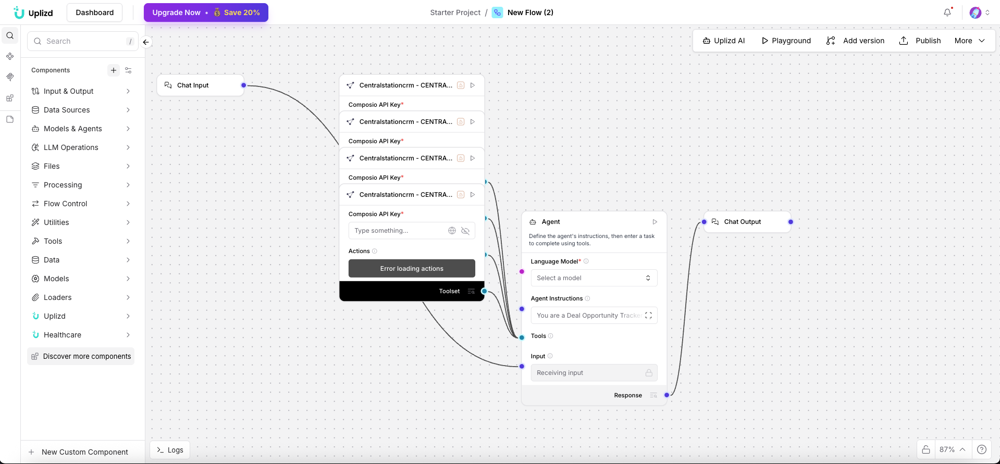

# Deal Opportunity Tracker (Uplizd) - Real-time Sales Opportunity Intelligence

## Summary
A Uplizd AI workflow that scans your incoming data streams to identify and track new sales opportunities, ensuring your team is first to act on potential leads.

---

## Demo

**Alt text (SEO-ready):** Uplizd Deal Opportunity Tracker scanning data to identify sales leads and track them through the opportunity lifecycle.

---
## 🚀 Run on Uplizd

---
## Who is this for?
This workflow is designed for high-growth sales teams and business developers tasked with finding and winning new business:

- Business Development Representatives (BDRs)
    - Quickly identify high-intent leads and transition them into trackable opportunities.

- Sales Leadership
    - Monitor the health and growth of the top-of-funnel pipeline.

- Growth Marketers
    - Align marketing signals with sales opportunity tracking to improve conversion rates.

- Strategic Account Managers
    - Track expansion opportunities within existing customer accounts automatically.

---

## Features

- **Real-time Opportunity Identification**  
  Scans emails, web forms, and social signals to flag new sales opportunities instantly.

- **Automated Opportunity Creation**  
  Automatically populates CRM opportunity records with relevant context and contact details.

- **Priority Scoring Engine**  
  Intelligently ranks opportunities based on deal size, intent signals, and historical success patterns.

- **Dynamic CRM Sync via Composio**  
  Keep your opportunity data perfectly synced with your CRM (Salesforce, HubSpot, etc.).

- **Collaborative Alerts**  
  Instantly notifies the relevant team members when a high-value opportunity is detected.

---

## Use Cases

- **Surface "Dark" Opportunities**
  - Identify potential deals from casual mentions in customer support tickets or social comments.
  - Scan historical records for Re-engagement opportunities.

- **Accelerate Lead Response**
  - Convert a "Contact Us" form submission into a qualified opportunity within seconds.
  - Automatically assign the opportunity to the best-fit sales rep based on territory or industry.

- **Account Expansion Tracking**
  - Detect interest in new product lines from existing customers.
  - Flag when key stakeholders at a target account change roles or companies.

---
## Quick Start

### 1) Import the Flow into Uplizd
1. Click the **Run on Uplizd** CTA button above.
2. On Uplizd, click **Try out**.
3. Create a new workspace or open an existing workspace.
5. Ensure all nodes are connected correctly:
   - **Chat Input**
   - **Composio Toolset**
   - **Agent**
   - **Chat Output**

### 2) Setup the Nodes
Verify the workflow structure:

- **Chat Input** → sends opportunity-related data or requests into the system.
- **Agent** → analyzes signals and manages the opportunity lifecycle.
- **Composio Toolset** → provides tools for opportunity creation and CRM tracking.
- **Chat Output** → confirmation of new opportunities tracked.

### 3) Run the Flow
1. Click **Playground** to open Chat Interface.
2. Enter a request such as:
   - `"Analyze this lead signal and create an opportunity if qualified"`
   - `"List all new opportunities discovered in the last 24 hours"`
   - `"What is the priority score for the [Opportunity Name]?"`

---

## Configuration

### 1) Language Model (Agent Node)
The **Agent** node is tuned for lead qualification and opportunity discovery.

Recommended instruction pattern:
- Focus on intent signals
- Automate data entry for new opportunities
- Maintain high accuracy in lead-to-opportunity conversion

### 2) Composio Toolset Node
Requires your **Composio API Key** and a connection to your sales intelligence tools and CRM.

### 3) Tool Availability
The agent can call tools for:
- Opportunity record management
- Lead enrichment and qualification
- Team notifications (Slack, Email)
- Salesforce/HubSpot/Pipedrive integration

---

## Related Solutions

* **[Deal Pipeline Manager](../DealPipelineManagerByAgiled/README.md)**  
  Manage and progress opportunities through your sales stages.

* **[Lead Enrichment Agent](../lead-enrichment-agent/README.md)**  
  Deeper lead intelligence to qualify opportunities more effectively.

* **[CRM Data Quality Agent](../crm-data-quality-agent/README.md)**  
  Keep your opportunity records clean and standardized.

* **[Sales Pipeline Cleanup Agent](../sales-pipeline-cleanup-agent/README.md)**  
  Standardize deal stages and fix inconsistencies in your opportunity tracking.
