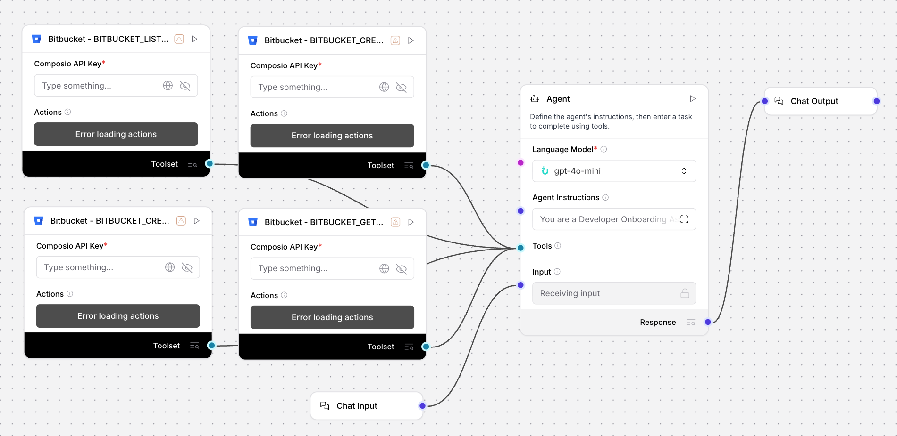

# Developer Onboarding Assistant (Bitbucket) - Automate Repos & Task Setup

## Summary
An Uplizd AI workflow that automates the technical onboarding process for new team members. It creates personal sandbox repositories, sets up project templates, and generates standardized onboarding issues on Bitbucket to ensure a seamless first-day experience.

---

## Demo

**Alt text:** Uplizd Developer Onboarding Assistant integrating Bitbucket toolsets to automate repository creation and onboarding task setup.

---
## 🚀 Run on Uplizd

---
## Who is this for?
This workflow is built for engineering teams who want to standardize and accelerate the developer onboarding experience:

- **Team Leads & Engineering Managers**
    - Automate the repetitive tasks of repository creation and issue tracking, allowing more time for mentorship.

- **DevOps & IT Professionals**
    - Standardize the way personal sandboxes are provisioned and ensure proper workspace permissions.

- **Human Resources & Onboarding Teams**
    - Partner with engineering to provide a professional, automated technical setup on day one.

- **Startup Founders**
    - Scale your team quickly by automating the infrastructure setup for every new hire.

---

## Features

- **Automated Repository Provisioning**  
  Instantly creates private sandbox repositories for new members with standard settings and `.gitignore`.

- **Standardized Project Templating**  
  Ensures every new repository starts with the necessary guidelines, coding standards, and project structures.

- **Onboarding Task Automation**  
  Automatically generates 5 critical onboarding issues (Setup, Review Standards, Practice Exercise, etc.) to guide the new hire.

- **Access & Permission Verification**  
  Continuously verifies that the new member has correctly synced with the workspace and has the required permissions.

- **Bitbucket Integration via Composio**  
  Seamlessly connects with your Bitbucket workspace to manage repositories, issues, and member data.

- **Modular Uplizd Architecture**  
  Easily customize the onboarding steps, repository naming conventions, and the list of generated tasks.

---

## Use Cases

- **Kickstart New Hire Onboarding**
  - Trigger a setup workflow as soon as a new developer joins the team.
  - Provison `{username}-sandbox` repositories automatically.

- **Standardize Practice Environments**
  - Create isolated environments for interns or junior developers to learn the team's stack.
  - Ensure everyone starts with the same project templates and issues.

- **Workspace Access Auditing**
  - Use the agent to verify if recent hires have the correct permissions across all repositories.
  - Generate setup confirmation summaries for management.

---
## Quick Start

### 1) Import the Flow into Uplizd
1. Click the **Run on Uplizd** CTA button above.
2. On Uplizd, click **Try out**.
3. Create a new workspace or open an existing workspace.
4. Ensure all nodes are connected correctly:
   - **Chat Input**
   - **Bitbucket - BITBUCKET_CREATE_REPOSITORY**
   - **Bitbucket - BITBUCKET_CREATE_ISSUE**
   - **Bitbucket - BITBUCKET_GET_CURRENT_USER**
   - **Bitbucket - BITBUCKET_LIST_WORKSPACE_MEMBERS**
   - **Agent**
   - **Chat Output**

### 2) Setup the Nodes
Verify the workflow structure:

- **Chat Input** → receives developer info or onboarding triggers.
- **Agent** → coordinates the 6-step onboarding workflow (Detect, Create, Template, Issue, Verify, Confirm).
- **Bitbucket Toolset** → provides the underlying API actions for repository and issue management.
- **Chat Output** → summarizes the completed onboarding setup.

### 3) Run the Flow
1. Click **Playground** to open Chat Interface.
2. Enter a request such as:
   - `"Set up onboarding for new developer John Doe (johndoe@example.com, username: jdoe)"`
   - `"Verify if the new member has been correctly added to the workspace"`
   - `"Create a sandbox repo and onboarding issues for our new intern"`

---

## Configuration

### 1) Language Model (Agent Node)
The **Agent** node is pre-configured with a detailed workflow designed to handle Bitbucket lifecycle events for team management.

Recommended instruction pattern:
- Maintain a professional and welcoming tone.
- Ensure repository naming follows team standards.
- Log and report failures for human follow-up.

### 2) Bitbucket Toolset Nodes
Requires your **Composio API Key** and a synchronized connection to your **Bitbucket** account.

### 3) Tool Availability
The agent can call tools for:
- Repository discovery and creation
- Issue creation and management
- Workspace member listing
- User profile verification

---

## Related Solutions

* **[CRM Data Hygiene Manager](../crm-data-hygiene-manager/README.md)**  
  Continuous maintenance to ensure your CRM stays clean, organized, and free of data rot.

* **[CRM Data Sync Manager](../crm-data-sync-manager/README.md)**  
  Orchestrate and monitor data flows across your entire enterprise tech stack.

* **[Deal Pipeline Manager](../deal-pipeline-manager/README.md)**  
  Automatically update deal progress and create follow-up tasks for your sales team.

* **[CRM Address Data Cleanup Agent](../crm-address-data-cleanup-agent/README.md)**  
  Specialized verification and standardization of physical address and location data.