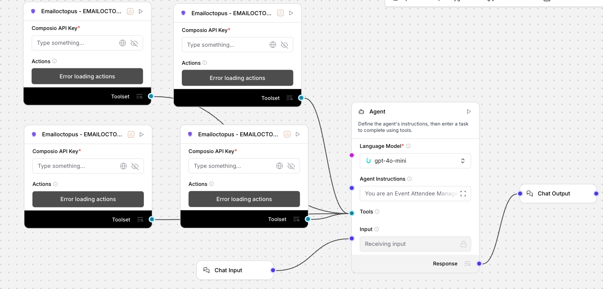

# Event Attendee Manager (Uplizd) - Automated Attendee List Management & Follow-ups

## Summary
A Uplizd AI workflow specialized in streamlining event marketing through automated attendee list management and targeted post-event follow-up sequences using EmailOctopus.

---

## Demo

**Alt text:** Uplizd Event Attendee Manager integrating multiple EmailOctopus tools via Composio to automate list management, attendee segmentation, and duplicate cleanup.

---
## 🚀 Run on Uplizd

---
## Who is this for?
This workflow is built for event organizers and marketing teams who want to automate the tedious aspects of attendee management:

- **Event Organizers & Marketers**
    - Focus on the event experience while AI handles the registration lists and segmentation.

- **Demand Generation Teams**
    - Accelerate post-event nurturing with pre-segmented "Attended" and "No-Show" lists ready for campaigns.

- **Sales Operations (SalesOps)**
    - Ensure clean, duplicate-free lead data across multiple events and maintain list hygiene.

- **Community Managers**
    - Track event participation trends and keep contact data updated without manual exports.

---

## Features

- **Automated List Creation**  
  Instantly creates dedicated email lists for each new event using descriptive naming conventions (e.g., `Webinar_[EventName]_[Date]`).

- **Dynamic Registrant Management**  
  Automatically syncs new registrants to their respective event-specific lists with full profile information.

- **Intelligent Post-Event Segmentation**  
  Automatically categorizes participants into `Attended` and `No-Show` lists for targeted post-event messaging.

- **Smart List Hygiene & Deduplication**  
  Scans for and removes duplicate contacts across lists, ensuring your database remains clean and within EmailOctopus limits.

- **Campaign-Ready Lists**  
  Prepares segmented lists optimized for immediate follow-up campaigns, reducing the time from event to outreach.

---

## Use Cases

- **Seamless Registration Flow**
  - Create a new list for a "Spring Product Demo" webinar.
  - Automatically add every attendee as they sign up via your registration form.

- **Targeted Post-Event Nurturing**
  - Trigger a "Thank you for joining" email sequence for those in the `Attended` segment.
  - Send a "Sorry we missed you" recording link to the `No-Show` segment.

- **Cross-Event Data Maintenance**
  - Identify participants who attend multiple sessions and update their engagement history.
  - Remove redundant entries from old event lists to optimize storage.

---
## Quick Start

### 1) Import the Flow into Uplizd
1. Click the **Run on Uplizd** CTA button above.
2. On Uplizd, click **Try out**.
3. Create a new workspace or open an existing workspace.
4. Ensure all **6 nodes** are connected correctly:
   - **Chat Input**
   - **Agent**
   - **Emailoctopus: CREATE_LIST**
   - **Emailoctopus: CREATE_CONTACT**
   - **Emailoctopus: GET_ALL_LISTS**
   - **Emailoctopus: DELETE_CONTACT**
   - **Chat Output**

### 2) Setup the Nodes
Verify the workflow logic:

- **Chat Input** → sends event management instructions (e.g., "Set up a list for the Product Launch").
- **Agent** → interprets the command and chooses the correct tool action (Create List, Add Contact, etc.).
- **Composio (EmailOctopus)** → Executes the specific marketing API actions:
    - `CREATE_LIST`: Generates a new home for your event registrants.
    - `CREATE_CONTACT`: Populates lists with attendee details.
    - `GET_ALL_LISTS`: Allows the agent to see current events and manage segmentation.
    - `DELETE_CONTACT`: Cleans up duplicate or irrelevant entries.
- **Chat Output** → summarizes what the AI agent has accomplished.

### 3) Run the Flow
1. Click **Playground** to open Chat Interface.
2. Enter a request such as:
   - `"Create a new list for the 'AI Strategy Summit' event on May 15th"`
   - `"Sync these 50 new registrants to the 'Product Demo' list"`
   - `"Remove duplicate emails across my last 3 event lists"`

---

## Configuration

### 1) Language Model (Agent Node)
The **Agent** node is the "brain" that knows how to use the 4 EmailOctopus tools.

Recommended settings:
- **System Prompt**: Already configured for Event Attendee Management.
- **Tools**: Ensure all 4 Composio nodes are connected to the `Tools` input.

### 2) EmailOctopus Connection
Requires your **Composio API Key**. Each of the 4 EmailOctopus nodes must have an active connection to your account to function.

### 3) Tool Availability (Composio Action Mapping)
The agent leverages the following specific actions via Composio:
- **EMAILOCTOPUS_CREATE_LIST**: For initializing event containers.
- **EMAILOCTOPUS_CREATE_CONTACT**: For lead capture.
- **EMAILOCTOPUS_GET_ALL_LISTS**: For auditing and cross-event data analysis.
- **EMAILOCTOPUS_DELETE_CONTACT**: For database hygiene and list maintenance.

---

## Related Solutions

* **[Event Registration Email Checker](../event-registration-email-checker/readme.md)**  
  Verify and clean registration emails before adding them to your attendee lists.

* **[Professional Email Clarity Assistant](../professional-email-clarity-assistant/README.md)**  
  Refine your follow-up templates and personal outreach for maximum clarity and impact.

* **[Contact Sync Manager](../contact-sync-manager/README.md)**  
  Keep your attendee lists in sync across all your marketing and CRM platforms.

* **[Invoice Processing Agent](../invoice-processing-agent/README.md)**  
  Automate the handling of event vendor invoices and attendee payments efficiently.
