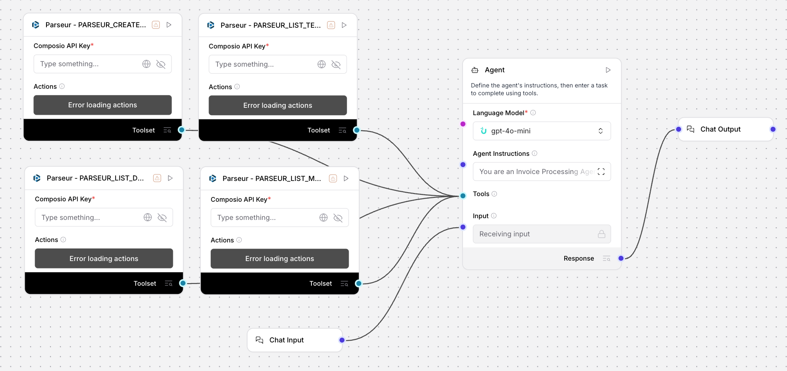

# Invoice Processing Agent (Uplizd) - Automate Accounts Payable & Data Extraction

## Summary
The Invoice Processing Agent is an Uplizd AI workflow designed to streamline accounts payable by automating the extraction and routing of critical invoice data from emails and PDFs. By leveraging the Composio Toolset to interface with document parsing services, it eliminates manual entry, ensures data integrity, and flags exceptions for human review, significantly increasing pipeline velocity for finance operations.

---

## Demo

**Alt text (SEO-ready):** Uplizd Invoice Processing Agent integrating Parseur toolsets to automate financial document extraction, data validation, and system synchronization for accounts payable workflows.

---

## 🚀 Run on Uplizd

---

## Category

**Primary category:** Finance automation  
**Secondary tags:** `accounts payable`, `data extraction`, `invoice processing`, `composio`, `ai workflow`, `data hygiene`, `automation`  
This solution bridges the gap between unstructured vendor documents and structured accounting databases to maintain a single source of truth for financial records.

---

## Who is this for?

This workflow is designed for finance and operations teams aiming to eliminate manual document handling:

- **Accounting & AP Specialists**
    - Reduce manual data entry time and eliminate transcription errors from vendor invoices.
- **Finance Operations Managers**
    - Accelerate approval cycles and ensure early-payment discounts are captured consistently.
- **Small Business Owners**
    - Manage high volumes of vendor paperwork without the need for additional administrative headcount.
- **Audit & Compliance Officers**
    - Maintain a transparent, digitally-logged audit trail for every financial document processed.

---

## Features

- **Continuous Mailbox Monitoring**  
  Automatically scans designated digital mailboxes for new invoice arrivals to trigger immediate processing.

- **Intelligent Template Matching**  
  Identifies the correct vendor template for each document to ensure maximum extraction accuracy and field mapping.

- **Deep Field Extraction**  
  Captures critical accounting data including vendor names, total amounts, tax, due dates, and specific line-item details.

- **Business Rule Validation**  
  Performs automated sanity checks for duplicate invoice numbers and verifies that payment terms align with company standards.

- **Smart Exception Escalation**  
  Flags invoices with low parsing confidence or missing fields for human review, ensuring only validated data reaches your books.

---

## Use Cases

**Automated Accounts Payable**
- Connect your "invoices@" email alias to automatically populate your accounting software with new bills as they arrive.
- Automatically isolate invoices from new or unknown vendors for manual verification before system entry.

**Batch PDF Processing**
- Upload bulk exports of invoices to have them standardized, validated, and synchronized across your accounting systems in seconds.
- Process historical invoice batches to update vendor records and reconcile outstanding balances.

**Compliance & Spend Auditing**
- Use extracted data to run real-time reports on spend distribution across vendors without manual spreadsheet consolidation.
- Maintain a searchable, digital archive of all processed invoices for tax and audit readiness.

---

## Quick Start

### 1) Import the Flow into Uplizd
1. Click the **Run on Uplizd** CTA button above.
2. On Uplizd, click **Try out** to initialize the workflow.
3. Create a new workspace or select an existing one to house the agent.
4. Ensure nodes are connected: **Chat Input → Agent → Composio Toolset → Chat Output**.

### 2) Setup the Nodes
- **Chat Input**: Receives natural language commands for processing runs or status queries.
- **Agent**: Coordinates the logic between document discovery, extraction, and validation.
- **Composio Toolset**: Executes the API calls to your parsing service to retrieve and structure document data.
- **Chat Output**: Delivers summaries of processed batches and alerts for items requiring human attention.

### 3) Run the Flow
1. Open the **Playground** in your Uplizd workspace.
2. Enter a request to begin:
   - `"Process all new invoices in the main mailbox for the last 24 hours"`
   - `"Parse the latest PDF from Vendor X and send the data to the accounting webhook"`
   - `"List any invoices from today that require manual review"`

---

## Configuration

### 1) Language Model (Agent Node)
The Agent node is pre-configured with financial logic to prioritize accuracy and compliance.
- Prioritize data precision over processing speed.
- Escalate any ambiguity or low-confidence parsing results to human review.
- Ensure all monetary figures are consistently formatted for downstream ERP entry.

### 2) Composio Toolset Node
Requires your **Composio API Key** and a configured connection to your document parsing provider (e.g., Parseur) with templates for your primary vendors.

### 3) Tool Availability
- **Mailbox/Document Discovery**: Tools for listing mailboxes and fetching documents.
- **Template Management**: Tools for identifying and applying vendor-specific extraction rules.
- **Data Routing**: Tools for webhook creation and structured JSON delivery.

---

## Related Solutions

* **[CRM Data Sync Manager](../crm-data-sync-manager/README.md)**  
  Orchestrate and monitor data flows across your entire enterprise tech stack.

* **[Workforce Onboarding Automator](../workforce-onboarding-automator/README.md)**  
  Streamline new hire setup and group assignments for organizational efficiency.

* **[Account Reconciliation Helper](../account-reconciliation-helper-by-quickbooks/README.md)**  
  Automate the matching of transactions and bank statements for accurate financial reporting.
