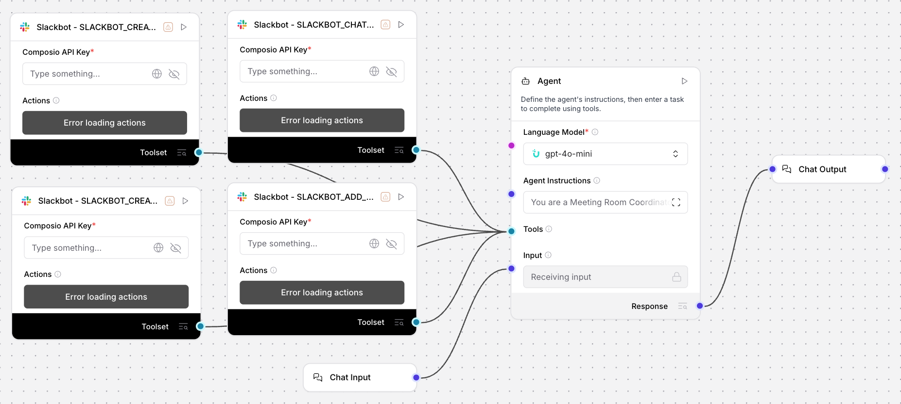

# Meeting Room Coordinator (Slack) - Automate Office Scheduling & Bookings

## Summary
An Uplizd AI workflow for automated office management that handles meeting room bookings and conflict resolution directly through Slack. It monitors booking requests, proactively suggests alternatives for overlaps, and manages the entire meeting lifecycle—from confirmation and attendee alerts to automated reminders.

---

## Demo

**Alt text:** Uplizd Meeting Room Coordinator integrating Slackbot toolsets to automate office scheduling and booking notifications.

---
## 🚀 Run on Uplizd

---
## Who is this for?
This workflow is built for workplace operations and administrative teams who want to eliminate the manual overhead of room management:

- **Office Managers & Facility Leads**
    - Scalably manage multiple meeting rooms across different floors or locations without constant manual oversight.

- **Administrative Assistants**
    - Free up time spent on the back-and-forth of coordinating room availability and handling last-minute cancellations.

- **Team Leads & Project Managers**
    - Ensure your team always has a space to collaborate without the frustration of double-bookings or "meeting room hopping."

- **Workplace Experience Teams**
    - Provide a modern, frictionless self-service booking experience for all employees within their existing Slack workflow.

---

## Features

- **Natural Language Booking Monitoring**  
  Continuously scans designated Slack channels for booking requests like "book the boardroom for 2pm," converting chat into confirmed events.

- **Proactive Conflict Detection**  
  Instantly identifies double-bookings and suggest the best available alternatives, including different rooms or nearby time slots (+/- 30 mins).

- **Automated Lifecycle Communication**  
  Handles all confirmations, attendee alerts, and cancellation notifications via `SLACKBOT_CHAT_POST_MESSAGE`.

- **Smart Reminders & Reducing "No-Shows"**  
  Automatically sets meeting reminders via `SLACKBOT_CREATE_A_REMINDER` to notify organizers 15 minutes before the start time.

- **Immediate Visual Feedback**  
  Uses `SLACKBOT_ADD_REACTION_TO_AN_ITEM` to acknowledge requests with status emojis (✅ Confirmed, ⚠️ Conflict, 📅 Rescheduled).

- **Dynamic Channel Management**  
  Automatically creates dedicated Slack channels for recurring meeting coordination or complex high-priority events via `SLACKBOT_CREATE_CHANNEL`.

---

## Use Cases

- **Self-Service Office Booking**
  - Employees can book rooms without leaving Slack, receiving instant confirmation and dial-in details.
  - Reduce the "shadow IT" problem of employees using rooms without formal booking.

- **Conflict-Free Rescheduling**
  - When a scheduling overlap is detected, the bot provides 3 actionable alternatives, allowing the user to resolve the issue with one click.

- **Efficient Room Reclamation**
  - When meeting cancellations are processed, the bot immediately notifies the channel that a room has opened up, maximizing office space utilization.

---
## Quick Start

### 1) Import the Flow into Uplizd
1. Click the **Run on Uplizd** CTA button above.
2. On Uplizd, click **Try out**.
3. Create a new workspace or open an existing workspace.
4. Ensure all nodes are connected correctly:
   - **Chat Input**
   - **Slack - SLACKBOT_CHAT_POST_MESSAGE**
   - **Slack - SLACKBOT_CREATE_A_REMINDER**
   - **Slack - SLACKBOT_ADD_REACTION_TO_AN_ITEM**
   - **Slack - SLACKBOT_CREATE_CHANNEL**
   - **Agent**
   - **Chat Output**

### 2) Setup the Nodes
Verify the workflow structure:

- **Chat Input** → receives human booking requests or cancellation alerts.
- **Agent** → coordinates the 7-step management workflow (Monitoring -> Detection -> Confirmation -> Reminders -> Cancellations -> Engagement -> Channel Management).
- **Slack Toolset** → provides the primary interface for messaging, reminders, and channel operations.
- **Chat Output** → summarizes the coordination actions and provides final booking details.

### 3) Run the Flow
1. Click **Playground** to open Chat Interface.
2. Enter a request such as:
   - `"Book the Quiet Room at 3pm today for a 1-hour brainstorming session"`
   - `"Is the Boardroom free tomorrow morning?"`
   - `"Cancel my 4pm booking in the Gallery"`

---

## Configuration

### 1) Language Model (Agent Node)
The **Agent** node is pre-configured with a specialized workflow for facility management and professional communication.

Recommended instruction pattern:
- Maintain a helpful, polite, and efficient tone.
- Prioritize conflict resolution to save time for administration teams.
- Ensure all confirmation messages include clear location and time details.

### 2) Slack Toolset Nodes
Requires your **Composio API Key** and a synchronized connection to your **Slackbot** instance with appropriate permissions for messaging and channel creation.

### 3) Tool Availability
The agent can call tools for:
- Message posting and reactions
- Reminder management
- Private and public channel creation

---

## Related Solutions

* **[CRM Data Sync Manager](../crm-data-sync-manager/README.md)**  
  Orchestrate and monitor data flows across your entire enterprise tech stack.

* **[Workforce Onboarding Automator](../workforce-onboarding-automator/README.md)**  
  Streamline new hire setup and group assignments for deskless workers on Connecteam.

* **[Team Productivity Monitor](../team-productivity-monitor/README.md)**  
  Analyze team performance and identify productivity patterns across Clockify workspaces.

* **[Meeting Room Coordinator](../meeting-room-coordinator/README.md)**  
  Automate office scheduling and resolve meeting room conflicts directly through Slack.
