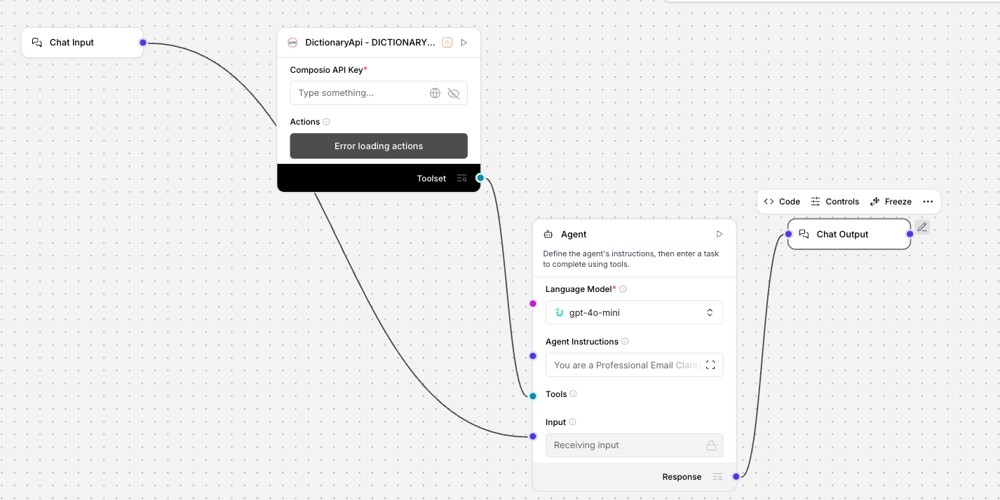

# Professional Email Clarity Assistant (Uplizd) - Refine Business Communication

## Summary
The Professional Email Clarity Assistant is an intelligent Uplizd AI workflow designed to help professionals elevate their business communication. By analyzing email drafts for ambiguity, validating word choices against real-time dictionary data, and providing polished, high-clarity alternatives, this solution ensures your messaging remains precise, professional, and impactful.

---

## Demo

**Alt text (SEO-ready):** Uplizd Professional Email Clarity Assistant workflow featuring a structured agent that analyzes, validates, and polishes email drafts using a real-time dictionary tool for improved business communication.

---

## 🚀 Run on Uplizd

---

## Category

**Primary category**: Communication automation

**Secondary tags**: email, professional writing, clarity, dictionary, business communication, ai workflow, composio, text analysis

This solution bridges the gap between raw intent and professional delivery by integrating real-time linguistic validation into your daily email workflow.

---

## Who is this for?

This workflow is essential for professionals who need to ensure their written communication is consistently accurate and effective:

- **Executives & Managers**
    - Ensure your directives and strategic announcements are precise, authoritative, and professional.
- **Client-Facing Teams**
    - Avoid miscommunication with high-value clients by using contextually appropriate and polished terminology.
- **Non-Native English Speakers**
    - Gain confidence in choosing the most accurate words for professional business settings and formal correspondence.
- **HR & Internal Communications**
    - Craft sensitive internal messages that are clear, empathetic, and maintain corporate standards.

---

## Features

- **Semantic Ambiguity Analysis**
  Identifies words or phrases that might be interpreted differently or cause confusion in a professional context.

- **Dictionary-Backed Validation**
  Integrates directly with the Dictionary API to verify the precise meaning and context of flagged words in real-time.

- **Contextual Professional Suggestions**
  Recommends high-clarity alternatives that match your intended professional tone and specific industry audience.

- **Clarity Scoring (1-10)**
  Provides a metrics-driven comparison between your original draft and the improved version to track writing quality.

- **Automated Polishing & Final Versioning**
  Generates a complete, ready-to-send email that incorporates all improvements while preserving your original intent.

---

## Use Cases

**Clarifying Technical Reports**
- Simplify complex industry jargon for non-technical stakeholders without losing critical meaning.
- Translate dense project updates into clear, actionable summaries for executive review.

**Softening Sensitive Requests**
- Adjust word choices to turn a potentially blunt request into a collaborative, professional prompt.
- Refine feedback emails to ensure the tone remains constructive and supportive rather than critical.

**Standardizing Corporate Tone**
- Ensure all team communication adheres to a consistent level of professional clarity and brand voice.
- Audit outgoing templates to remove regional colloquialisms that may not resonate with a global audience.

---

## Quick Start

### 1) Import the Flow into Uplizd
1. Click the **Run on Uplizd** CTA button above.
2. On the Uplizd platform, click **Try out**.
3. Create a new workspace or select an existing one to host the workflow.
4. Ensure all **4 nodes** are connected correctly: **Chat Input** → **Agent** → **Composio Toolset** → **Chat Output**.

### 2) Setup the Nodes
- **Chat Input**: Receives your draft email text for processing.
- **Agent**: Executes the 5-step analysis (Analyze, Validate, Suggest, Score, Polish).
- **Composio Toolset**: Provides the dictionary lookup capability for semantic verification.
- **Chat Output**: Delivers the final polished email and the clarity report.

### 3) Run the Flow
1. Click **Playground** to open the Chat Interface.
2. Paste your email draft and use one of these prompts:
   - `Please review this email for a new project proposal and suggest improvements.`
   - `Is this word choice too aggressive for a manager? Provide a softer alternative.`
   - `Make this draft more concise and professional while keeping the original meaning.`

---

## Configuration

### 1) Language Model (Agent Node)
The **Agent** node is pre-configured with a system prompt optimized for business communication.
- **Model**: GPT-4o-mini or Claude-3.5-Sonnet for superior semantic analysis.
- **Instruction Pattern**: 
    - Analyze the draft for tone and clarity.
    - Use the dictionary tool to validate ambiguous terminology.
    - Output the final version with a clarity score.

### 2) Composio Toolset Node
Requires your **Composio API Key** to enable the Dictionary API connection. Ensure the connection scope is set to allow read-access for word definitions.

### 3) Tool Availability
- **DICTIONARY_API_GET_WORD_DEFINITION_V2**: Used by the agent to verify semantics and provide accurate synonyms.

---

## Related Solutions

* **[Academic Writing Precision Assistant](../academic-writing-precision-assistant-by-dictionary-api/README.md)**  
  Refine academic papers and research documentation with high-precision vocabulary tools.
* **[Workflow Automation Agent](../workflow-automation-agent-by-jobnimbus/README.md)**  
  Automate the administrative tasks that follow your professional email correspondence.
* **[Account Research Assistant](../account-research-assistant-by-zoominfo/README.md)**  
  Gather the necessary account intelligence to personalize your professional emails before sending.
