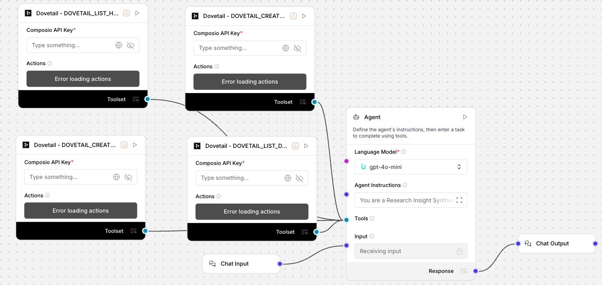

# Research Insight Synthesizer (Uplizd) - Accelerate UX & Product Discovery

## Summary
The Research Insight Synthesizer is a high-performance Uplizd AI workflow engineered to automate the tedious process of research synthesis. By integrating directly with research repositories like Dovetail, it transforms raw interview transcripts and survey data into thematic topics, quantified insights, and prioritized recommendations—saving research teams 8-12 hours per cycle.

---

## Demo

**Alt text (SEO-ready):** Uplizd Research Insight Synthesizer workflow showing a central AI agent connected to multiple Dovetail actions to extract patterns and generate actionable product insights.

---

## 🚀 Run on Uplizd

---

## Category

**Primary category:** Data integration

**Secondary tags:** research, ux, product discovery, dovetail, synthesis, ai workflow, insights, composio

This solution bridges the gap between raw qualitative data and strategic product decisions by automating the synthesis pipeline.

---

## Who is this for?

Designed for data-driven teams who need to turn "raw noise" into "strategic signal":

- **UX Researchers**
    - Automate the coding and highlighting of dozens of user interviews.
- **Product Managers**
    - Rapidly synthesize customer feedback into prioritized feature requests.
- **Market Researchers**
    - Extract recurring themes and consumer sentiment from large-scale survey responses.
- **Designers**
    - Quickly access supporting quotes and evidence to justify design decisions.

---

## Features

- **Automated Data Retrieval**
  Systematically pulls research artifacts, including transcripts and survey responses, from your active research channels via Dovetail.

- **Intelligent Pattern Analysis**
  Detects recurring themes, pain points, and contradictory viewpoints across multiple data sources using frequency and sentiment analysis.

- **Evidence-Based Thematic Organization**
  Groups observations into coherent topics (e.g., "Onboarding Friction", "Value Proposition Feedback") with direct supporting evidence.

- **Quantified Insight Generation**
  Creates detailed insights with clear problem statements, quantified impact, and confidence levels based on sample size.

- **Actionable Strategic Recommendations**
  Translates insights into specific, prioritized next steps with success metrics and potential risk assessments.

---

## Use Cases

**Post-Launch Research Synthesis**
- Analyze initial user feedback to identify critical "Day 1" bugs or UX hurdles.
- Map user sentiment shifts following a major feature release.

**Quarterly Goal Alignment**
- Use synthesized customer data to inform and justify roadmap prioritization for upcoming sprints.
- Align cross-functional stakeholders on top-priority user pain points.

**Continuous Discovery Feed**
- Maintain a live feed of latest user insights by periodically running the synthesizer on new feedback channels.
- Automate the generation of monthly "Voice of the Customer" reports for leadership.

---

## Quick Start

### 1) Import the Flow into Uplizd
1. Click the **Run on Uplizd** CTA button above.
2. On Uplizd, click **Try out**.
3. Create a new workspace or open an existing workspace.
4. Ensure nodes are connected: **Chat Input → Agent → Composio Toolset → Chat Output**.

### 2) Setup the Nodes
- **Chat Input**: Accepts the research project ID or query parameters.
- **Agent**: Processes raw data and applies synthesis logic.
- **Composio Toolset**: Connects to Dovetail to fetch and push research data.
- **Chat Output**: Returns the final synthesized report.

### 3) Run the Flow
1. Click **Playground**.
2. Trigger the synthesis by specifying the project or data set:
   - `Synthesize all highlights from Project X.`
   - `Generate 3 actionable insights from recent interview transcripts.`
   - `Summarize the biggest pain points mentioned in the latest survey highlights.`

---

## Configuration

### 1) Language Model (Agent Node)
Optimized for high-context analysis and pattern recognition.
- **Model**: GPT-4o or GPT-4o-mini for structured thematic analysis.
- **System Prompt**: Pre-configured to handle the Retrieval-Analysis-Organization-Generation-Recommendation loop.
- **Temperature**: Set to 0.2 for consistent, evidence-based output.

### 2) Composio Toolset Node
- Requires a **Composio API Key** and a linked Dovetail account.
- Ensure your Dovetail user has permissions to list data, highlights, and create topics/insights in the target projects.

### 3) Tool Availability
- **DOVETAIL_LIST_DATA**: Fetches raw data artifacts.
- **DOVETAIL_LIST_HIGHLIGHTS**: Extracts highlight quotes.
- **DOVETAIL_CREATE_TOPIC**: Categorizes themes.
- **DOVETAIL_CREATE_INSIGHT**: Finalizes synthesized findings.

---

## Related Solutions

* [Market Research Assistant](../market-research-assistant/README.md) — Automate quantitative company profiling, funding data, and market firmographics.
* [Content Research Assistant](../content-research-assistant/README.md) — Monitor trending topics, competitor content strategy, and platform sentiment in real-time.
* [Professional Email Clarity Assistant](../professional-email-clarity-assistant/README.md) — Communicate your synthesized insights clearly and professionally to stakeholders.
* [Contact Sync Manager](../contact-sync-manager/README.md) — Sync your research findings and identified contacts directly into your CRM or database.
