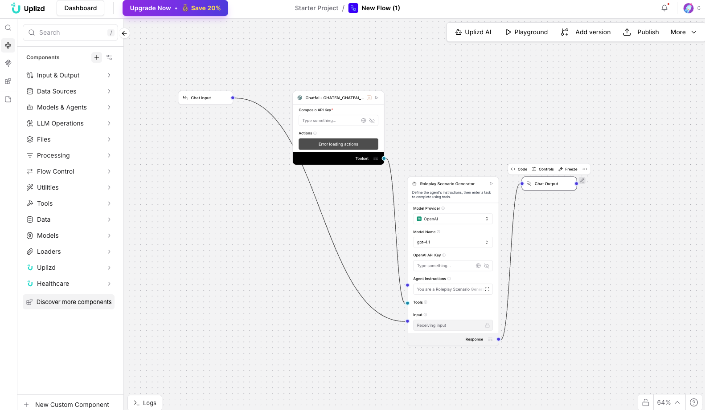

# Roleplay Scenario Generator (Uplizd) - Immersive Character Interaction and Training

## Summary
The Roleplay Scenario Generator is an Uplizd AI workflow designed for creative writers, educators, and trainers to generate complex, dynamic roleplay scenarios. By integrating with character-based AI systems, it creates immersive environments where users can interact with personas that maintain consistent personalities, memories, and emotional depth—perfect for narrative prototyping, soft-skills training, and realistic simulation-based learning.

---

## Demo

**Alt text:** Uplizd Roleplay Scenario Generator integrating Composio toolsets to automate character creation and immersive scenario branching for AI-driven roleplay.

---

## 🚀 Run on Uplizd

---

## Category

**Primary category:** Sales automation

**Secondary tags:** `roleplay`, `training`, `ai workflow`, `composio`, `character-ai`, `simulation`, `soft-skills`, `narrative-design`

This solution bridges the gap between static AI responses and dynamic, persona-driven interactions for professional and creative applications.

---

## Who is this for?

This workflow is built for narrative designers and trainers looking to scale realistic human-AI interactions:

- **Creative Writers & Narrative Designers**
    - Quickly prototype character dialogue and story branches for novels, scripts, or games.
- **Sales & Customer Support Trainers**
    - Generate realistic "difficult customer" simulations for staff to practice de-escalation and negotiation.
- **Game Developers**
    - Create dynamic quest-giving and world-building dialogue that adapts to player choice.
- **Community Managers**
    - Build engaging, personality-driven bots for community platforms that provide more than just static responses.

---

## Features

- **Personality-Driven Scenarios**
  Uses Composio-connected tools to build scenarios around specific behaviors, traits, and backstories.

- **Dynamic Memory Management**
  Maintains context and past interactions via persistent memory nodes to ensure continuity across long-form sessions.

- **Multi-Persona Orchestration**
  Engineered to coordinate interactions between multiple AI characters within a single narrative scene.

- **Scenario Branching Logic**
  Automatically generates multiple path options and outcomes based on user inputs or character motivations.

- **Emotional Tone Adaptation**
  Intelligently adjusts character responses based on the perceived sentiment and urgency of the user's interaction.

---

## Use Cases

**Soft-Skills & Corporate Training**
- "Roleplay as a skeptical enterprise lead who is concerned about data privacy during a sales pitch."
- "Simulate a performance review between a manager and an underperforming employee to practice feedback delivery."

**Narrative Prototyping**
- "Generate an interactive scene between a wise mentor and a reckless apprentice in a high-fantasy setting."
- "Prototype a detective noir investigation where characters hide clues based on their trustworthiness."

**Conflict Resolution Practice**
- "Simulate a tenant-landlord dispute to help local mediators practice de-escalation techniques in a controlled environment."
- "Roleplay a high-pressure negotiation between a supplier and a buyer to test pricing objection handling."

---

## Quick Start

### 1) Import the Flow into Uplizd
1. Click the **Run on Uplizd** CTA button above.
2. On Uplizd, click **Try out** to clone the template.
3. Configure your environment variables for the required AI and integration providers.
4. Ensure nodes are connected in the sequence: **Chat Input** → **Agent** → **Composio Toolset** → **Chat Output**.

### 2) Setup the Nodes
- **Chat Input** → Receives the scenario prompt, character names, or training objective.
- **Agent** → Coordinates the narrative flow, including setup, selection, and dialogue generation.
- **Composio Toolset** → Provides the specialized infrastructure for persona management and conversation memory.
- **Chat Output** → Presents the character's response and any system-generated narrative cues.

### 3) Run the Flow
1. Click **Playground** to open the Chat Interface.
2. Enter a request such as:
   - `"Start a roleplay session with a landlord. I am a tenant complaining about a broken heater."`
   - `"Generate a dialogue scene where a merchant tries to sell a cursed item to a wary traveler."`
   - `"Setup a training scenario for a Junior Sales rep dealing with a price-sensitive prospect."`

---

## Configuration

### 1) Language Model (Agent Node)
The **Agent** node is pre-configured to prioritize narrative consistency and character depth.

Recommended instruction pattern:
- Never break character unless explicitly asked for a meta-commentary.
- Maintain a consistent tone and vocabulary appropriate for the character's background.
- Focus on emotional intelligence and realistic human reactions.

### 2) Composio Toolset Node
Requires your **Composio API Key** and a connection to your preferred toolset where your character presets or memory databases are stored.

### 3) Tool Availability
The agent can call tools for:
- Discovering existing character personas
- Creating new characters on the fly
- Retrieving and updating conversation history

---

## Related Solutions

* **[Account Research Agent](../account-research-agent-by-onepage/README.md)**  
  Automate deep-dive research into prospect accounts to inform better sales conversations.

* **[Action Item Prioritizer](../action-item-prioritizer-by-rootly/README.md)**  
  Automatically categorize and prioritize tasks derived from meeting transcripts.

* **[WhatsApp Lead Qualifier](../whats-app-lead-qualifier-by-wati/README.md)**  
  Engage and qualify leads directly through automated conversational flows.
