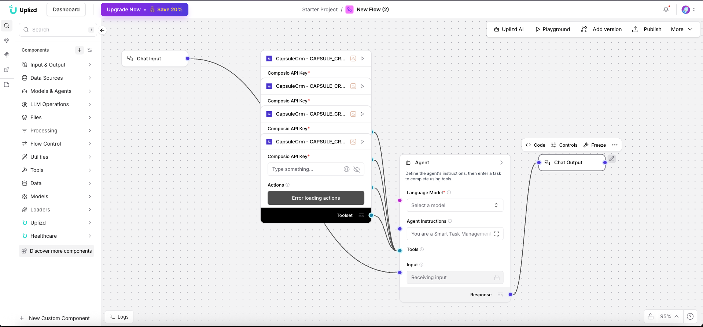

# Smart Task Management Agent (Uplizd) - Intelligent Prioritization & Assignment

## Summary
A Uplizd AI workflow that acts as a personal productivity assistant, intelligently prioritizing and assigning tasks based on deal value, urgency, and team capacity to ensure your team is always focused on the highest-impact activities.

---

## Demo

**Alt text (SEO-ready):** Uplizd Smart Task Management Agent using AI to rank and distribute CRM tasks for maximum sales efficiency.

---

## 🚀 Run on Uplizd

---

## Category

**Primary category**: Sales automation

**Secondary tags**: crm, task management, productivity, sales operations, ai workflow, composio, automation, pipeline

This solution bridges the gap between CRM data and actionable daily workflows, ensuring team productivity is aligned with business revenue goals.

---

## Who is this for?

This workflow is designed for high-performance sales and operations teams who need to cut through the noise and focus on what matters:

- **Account Executives (AEs)**
    - Automatically surface the most important follow-ups and deal-related tasks every morning.
- **Sales Managers (SalesOps)**
    - Ensure tasks are distributed fairly and prioritized based on overall business value.
- **Customer Success Managers**
    - Manage post-sale tasks and renewals with intelligent urgency-based reminders.
- **Project Managers**
    - Prioritize project milestones and dependencies within a CRM or task management framework.

---

## Features

- **Value-Based Prioritization**
  Intelligent agent ranks tasks based on associated deal size, customer tier, and strategic importance.

- **Automated Task Assignment**
  Assigns tasks to the most relevant team member based on ownership, expertise, and current workload.

- **Dynamic Due Date Management**
  Automatically calculates and updates due dates based on task type and deal velocity requirements.

- **Context-Aware Task Summaries**
  The agent provides a brief "why" for each task's priority, giving the owner immediate context.

- **Cross-Platform Task Sync**
  Keeps tasks perfectly synchronized between your CRM and your primary project or task tool (e.g., Jira, Asana, Notion).

---

## Use Cases

**Daily Sales Huddle**
- Generate a "Top 5 Actions" list for every sales rep based on their open deals.
- Flag any high-value deals that are missing a scheduled next step.

**Urgent Lead Follow-up**
- Automatically create and assign an "Immediate Call" task when a "Hot" lead enters the system.
- Set a 1-hour completion window for high-intent demo requests.

**Post-Sale Onboarding**
- Trigger a sequence of onboarding tasks once a deal is marked "Closed-Won".
- Assign specific technical setup tasks to the implementation team.

---

## Quick Start

### 1) Import the Flow into Uplizd
1. Click the **Run on Uplizd** CTA button above.
2. On Uplizd, click **Try out**.
3. Create a new workspace or open an existing workspace.
4. Ensure all nodes are connected correctly: **Chat Input** → **Agent** → **Composio Toolset** → **Chat Output**.

### 2) Setup the Nodes
- **Chat Input** — receives task management requests or priority updates.
- **Agent** — manages the task list, prioritization engine, and assignment logic.
- **Composio Toolset** — provides the connectors to your task management and CRM tools.
- **Chat Output** — summary of task priorities and new assignments made.

### 3) Run the Flow
1. Click **Playground** to open the Chat Interface.
2. Enter a request such as:
   - `"What are my highest priority tasks for today?"`
   - `"Assign all pending 'Follow-up' tasks for high-value deals to the sales team."`
   - `"Set up a task sequence for the new enterprise client project."`

---

## Configuration

### 1) Language Model (Agent Node)
The **Agent** node is tuned for productivity optimization and task orchestration.
- Focus on business impact and urgency.
- Provide concise, actionable task descriptions.
- Maintain a balance between automated assignment and human oversight.

### 2) Composio Toolset Node
Requires your **Composio API Key** and a connection to your CRM (e.g., Salesforce, HubSpot) and task tools.

### 3) Tool Availability
- Task creation, update, and deletion.
- User/Team member capacity lookup.
- Deal and Contact context retrieval.
- Cross-platform task synchronization.

---

## Related Solutions

* **[CRM Data Hygiene Manager](../crm-data-hygiene-manager/README.md)**  
  Continuous maintenance to ensure your CRM stays clean, organized, and free of data rot.

* **[CRM Data Sync Manager](../crm-data-sync-manager/README.md)**  
  Orchestrate and monitor data flows across your entire enterprise tech stack.

* **[Deal Pipeline Manager](../deal-pipeline-manager/README.md)**  
  Automatically update deal progress and create follow-up tasks for your sales team.

* **[CRM Address Data Cleanup Agent](../crm-address-data-cleanup-agent/README.md)**  
  Specialized verification and standardization of physical address and location data.
