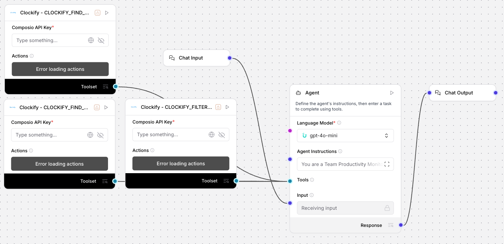

# Team Productivity Monitor (Uplizd) - Analyze Performance & Workload Balance

## Summary
An Uplizd AI workflow designed to analyze team performance and identify productivity patterns across Clockify workspaces. It intelligently monitors hours logged, project assignments, and activity consistency to provide managers with actionable insights for optimizing resource allocation and preventing team burnout.

---

## Demo

**Alt text (SEO-ready):** Uplizd Team Productivity Monitor integrating Clockify toolsets to automate team performance analysis, resource optimization, and workforce productivity reporting.

---

## 🚀 Run on Uplizd

---

## Category

**Primary category:** Workforce management

**Secondary tags:** clockify, productivity, resource allocation, team management, burnout prevention, workforce analytics, composio, ai workflow

This solution bridges the gap between raw time-tracking data and strategic team management by automating the analysis of employee workload and project distribution.

---

## Who is this for?

This workflow is built for leadership and operations teams who need to maintain a high-performing, balanced workforce:

- **Project & Operations Managers**
    - Identify team members who are overloaded or underutilized to ensure project deadlines stay on track.
- **Department Heads**
    - Get executive-level summaries of productivity trends and departmental resource allocation.
- **HR & People Partners**
    - Proactively support employee wellbeing by flagging excessive overtime and burnout risks.
- **Resource Coordinators**
    - Optimize the distribution of tasks by mapping organizational hierarchies against actual activity levels.

---

## Features

- **Holistic Workspace Retrieval**
  Pulls comprehensive data on all users, including activity levels, project assignments, and time tracking patterns from your Clockify workspace.

- **Automated Overload Flagging**
  Intelligently identifies and flags team members working over 45 hours per week as potential burnout risks.

- **Resource Utilization Analysis**
  Highlights team members with low project involvement to reveal hidden capacity for new initiatives.

- **Bottleneck Detection**
  Flags individuals juggling too many concurrent projects, helping to prevent task-switching overhead and delivery delays.

- **Actionable Optimization Reports**
  Generates structured reports with specific recommendations for resource reallocation, workload balancing, and team optimization.

---

## Use Cases

**Weekly Productivity Audits**
- Quickly scan your entire workspace to find workload imbalances before they become systemic issues.
- Identify seasonal productivity trends to help with future headcount planning.

**Burnout Prevention & Wellbeing**
- Automatically generate reports for HR on team members who are consistently over-extending, allowing for early intervention.
- Monitor long-term trends in overtime to adjust project timelines for better sustainability.

**New Project Resource Mapping**
- Before starting a new project, identify which team members have the most available bandwidth based on historical logging patterns.
- Match project requirements against current team capacity to ensure optimal staffing.

---

## Quick Start

### 1) Import the Flow into Uplizd
1. Click the **Run on Uplizd** CTA button above.
2. On Uplizd, click **Try out**.
3. Create a new workspace or open an existing workspace.
4. Ensure all nodes are connected correctly: **Chat Input** → **Agent** → **Composio Toolset** → **Chat Output**.

### 2) Setup the Nodes
- **Chat Input** → Receives natural language queries regarding team performance.
- **Agent** → Orchestrates the analysis logic and interprets Clockify data.
- **Composio Toolset** → Connects to Clockify to fetch real-time time-tracking and user data.
- **Chat Output** → Delivers the final productivity report and management recommendations.

### 3) Run the Flow
1. Click **Playground** to open the Chat Interface.
2. Enter a request such as:
   - `"Analyze team productivity for the current workspace and find overloaded members"`
   - `"Who is currently working on more than 5 projects at once?"`
   - `"Generate a resource reallocation report for the Marketing department"`

---

## Configuration

### 1) Language Model (Agent Node)
The **Agent** node is configured to act as a high-level productivity analyst focusing on team balance and efficiency.

Recommended instruction pattern:
- Maintain an objective, data-driven tone in all reports.
- Clearly distinguish between "observations" and "actionable recommendations."
- Include confidence levels for insights that rely on inferred patterns.

### 2) Composio Toolset Node
Requires your **Composio API Key** and a synchronized connection to your **Clockify** workspace to enable data retrieval.

### 3) Tool Availability
- **Workspace User Discovery:** Fetching all active users and their roles.
- **Metric-based Filtering:** Accessing time logs and project assignments.
- **Management Structure Verification:** Mapping reporting lines for accurate departmental reporting.

---

## Related Solutions

* **[CRM Data Sync Manager](../crm-data-sync-manager/README.md)**  
  Orchestrate and monitor data flows across your entire enterprise tech stack.

* **[Deal Pipeline Manager](../deal-pipeline-manager/README.md)**  
  Automatically update deal progress and create follow-up tasks for your sales team.

* **[Workforce Onboarding Automator](../workforce-onboarding-automator/README.md)**  
  Streamline new hire setup and group assignments for deskless workers.
