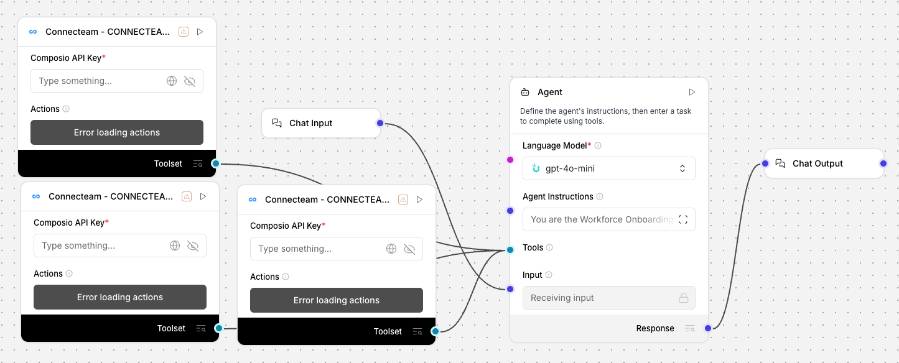

# Workforce Onboarding Automator (Connecteam) - Streamline Deskless Worker Integration

## Summary
An Uplizd AI workflow specialized in automating the new hire setup for deskless workers in industries like retail, hospitality, and construction. It streamlines profile creation, dynamic group assignments, and personalized onboarding communication on Connecteam to ensure every worker is ready for their first shift.

---

## Demo

**Alt text:** Uplizd Workforce Onboarding Automator integrating Connecteam toolsets to automate employee profile creation and smart group assignment.

---
## 🚀 Run on Uplizd

---
## Who is this for?
This workflow is built for organizations managing deskless workforces who need to move quickly from hiring to active scheduling:

- **HR Managers & Recruiters**
    - Eliminate manual data entry into Connecteam and reduce the administrative burden of high-volume hiring.

- **Operations & Area Managers**
    - Ensure new employees are instantly added to the correct locations, shifts, and communication groups.

- **Training & Compliance Coordinators**
    - Automate the assignment of role-specific safety training and certification tracking from day one.

- **Franchise Owners**
    - Standardize the onboarding experience across multiple locations to ensure brand consistency and professional communication.

---

## Features

- **Automated Profile Provisioning**  
  Instantly establishes complete Connecteam user profiles upon hiring, reducing the wait time for active scheduling.

- **Smart Dynamic Field Mapping**  
  Automatically retrieves and populates industry-specific custom fields like uniform sizes, certifications, and emergency contacts.

- **Dynamic Smart Group Assignment**  
  Intelligently assigns new hires to appropriate Smart Groups based on their role, department, location, and shift requirements.

- **Personalized Welcome Content Generation**  
  Creates customized welcome messages that include company values, onboarding checklists, and first-day logistics.

- **Automated Lifecycle Task Scheduling**  
  Sets up manager check-ins and training deadlines at critical intervals (1 day, 1 week, 1 month) to ensure long-term integration.

- **Compliance & Safety Focus**  
  Ensures all location-specific protocols and safety training requirements are assigned and tracked immediately.

---

## Use Cases

- **High-Volume Retail & Hospitality Hiring**
  - Quickly onboard dozens of seasonal workers in seconds, ensuring everyone has the correct group access for scheduling.
  - Automate the delivery of location-specific welcome materials.

- **Construction & Field Service Deployment**
  - Ensure every field worker is assigned to their correct project group and has all safety certificates documented before starting.
  - Schedule automated follow-ups for equipment and uniform assignments.

- **Cross-Location Talent Mobility**
  - Use the automator to quickly update profiles and group assignments as workers move between different branches or departments.

---
## Quick Start

### 1) Import the Flow into Uplizd
1. Click the **Run on Uplizd** CTA button above.
2. On Uplizd, click **Try out**.
3. Create a new workspace or open an existing workspace.
4. Ensure all nodes are connected correctly:
   - **Chat Input**
   - **Connecteam - CONNECTEAM_CREATE_USERS**
   - **Connecteam - CONNECTEAM_GET_CUSTOM_FIELDS**
   - **Connecteam - CONNECTEAM_GET_SMART_GROUPS**
   - **Agent**
   - **Chat Output**

### 2) Setup the Nodes
Verify the workflow structure:

- **Chat Input** → receives hire data or webhook triggers.
- **Agent** → coordinates the 5-step onboarding workflow (Process Data -> Create Profile -> Assign Groups -> Generate Welcome -> Schedule Tasks).
- **Connecteam Toolset** → provides the underlying API integration for user and group management.
- **Chat Output** → confirms the successful integration and onboarding setup.

### 3) Run the Flow
1. Click **Playground** to open Chat Interface.
2. Enter a request such as:
   - `"Onboard new hire Sarah Smith for the Downtown Hospitality branch"`
   - `"Assign the new ground team member to the Safety and Project A smart groups"`
   - `"Generate a welcome kit and 30-day check-in schedule for our new retail lead"`

---

## Configuration

### 1) Language Model (Agent Node)
The **Agent** node is pre-configured with a detailed workflow designed for workforce management and high-volume data processing.

Recommended instruction pattern:
- Prioritize data accuracy for compliance-heavy roles.
- Maintain a welcoming and professional tone for all employee-facing content.
- Log failures for immediate HR follow-up if required information is missing.

### 2) Connecteam Toolset Nodes
Requires your **Composio API Key** and a synchronized connection to your **Connecteam** account.

### 3) Tool Availability
The agent can call tools for:
- User creation and profile management
- Custom field retrieval and definition
- Smart Group discovery and assignment

---

## Related Solutions

* **[CRM Data Sync Manager](../crm-data-sync-manager/README.md)**  
  Orchestrate and monitor data flows across your entire enterprise tech stack.

* **[Deal Pipeline Manager](../deal-pipeline-manager/README.md)**  
  Automatically update deal progress and create follow-up tasks for your sales team.

* **[Workforce Onboarding Automator](../workforce-onboarding-automator/README.md)**  
  Streamline new hire setup and group assignments for deskless workers on Connecteam.

* **[Daily Standup Bot](../daily-standup-bot/README.md)**  
  Automate team status updates and maintain narrative consistency across your project communication.
